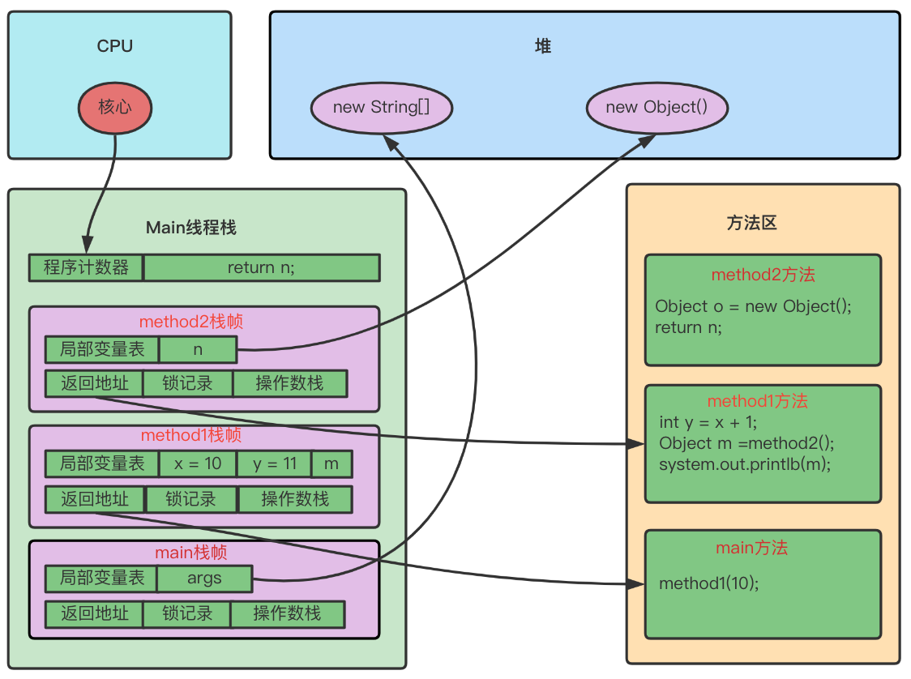
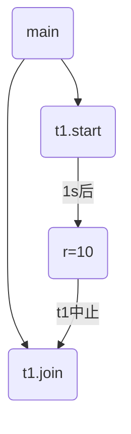
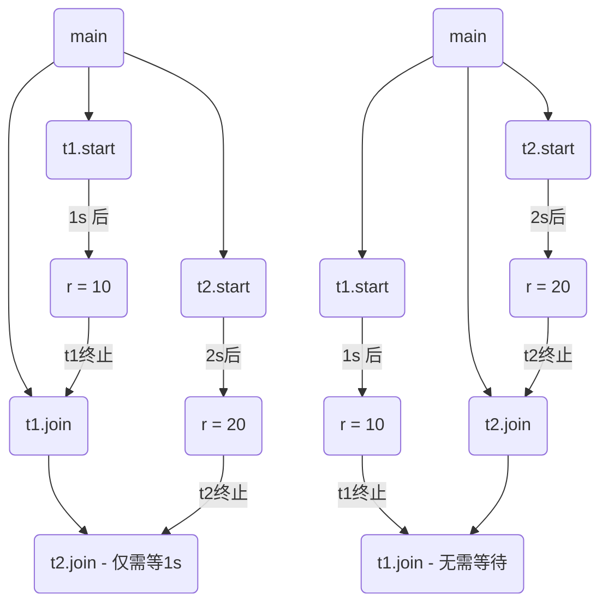
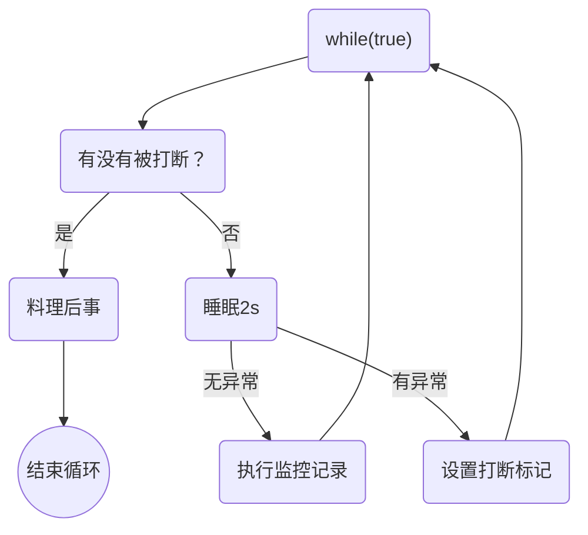
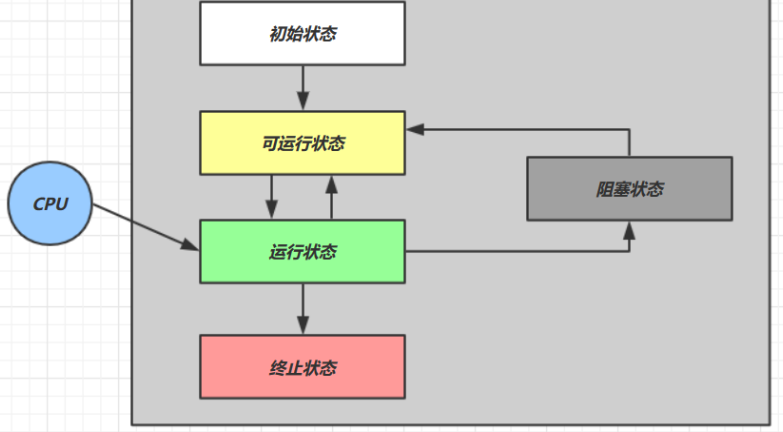
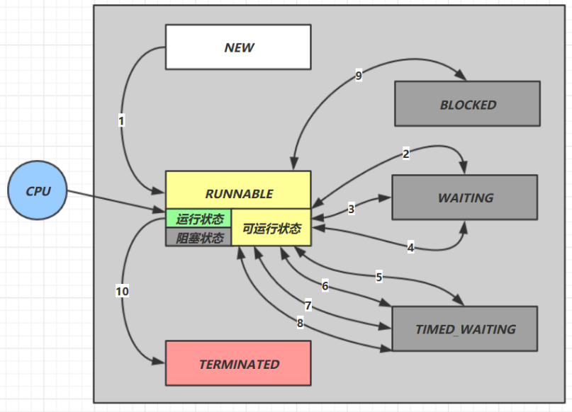

# Java线程

## 创建和运行线程

### 方式一之直接使用Thread类

```java
// 创建线程对象
Thread t = new Thread() {
	public void run() { 
    // 要执行的任务
  } 
};
// 启动线程 
t.start();
```

### 方式二之使用Runnable接口配合Thread类

把【线程】和【任务】(要执行的代码)分开

- Thread 代表线程
- Runnable 可运行的任务(线程要执行的代码)

```java
Runnable runnable = new Runnable() { 
 	public void run(){
		// 要执行的任务 
  }
};
// 创建线程对象
Thread t = new Thread( runnable ); 
// 启动线程
t.start();
```

Java 8 以后可以使用 lambda 精简代码（前提是对象只有一个方法）：

```java
 // 创建任务对象
Runnable task2 = () -> log.debug("hello");
// 参数1 是任务对象; 参数2 是线程名字，推荐 
Thread t2 = new Thread(task2, "t2");
t2.start();
```

#### 原理之Thread和Runnable的关系

查看Thread源码类得知Thread类实现了Runnable接口。

查看Thread类中的run方法:

```java
@Override
public void run() {
  if (target != null) {
    target.run();
  }
}
```

所以：

- 如果方法一直接使用Thread类则会重写Thread类的run方法，即执行的是Thread对象的run方法
- 使用方法二向Thread类中传入Runable实现类对象则会执行Runable实现类对象的run方法。

#### 实现Runable接口的优势

- 适合多个相同的程序代码的线程去处理同一个资源

- 可以避免java中的单继承的限制

- 增加程序的健壮性，代码可以被多个线程共享，代码和数据独立

- 线程池只能放入实现Runable或callable类线程，不能直接放入继承Thread的类

### 方式三之使用FutureTask类配合Thread类

FutureTask 能够接收 Callable 接口类型的参数，用来处理有返回结果的情况

```java
// 创建任务对象
FutureTask<Integer> task3 = new FutureTask<>(new Callable<Integer>() {
  @Override
  public Integer call() throws Exception {}
		log.debug("hello");
		return 100; 
	}
});

// 参数1 是任务对象; 参数2 是线程名字，推荐 
new Thread(task3, "t3").start();

// 当前线程阻塞，同步等待 task 执行完毕的结果 
Integer result = task3.get(); 
log.debug("结果是:{}", result);
```

> 注：FutureTask原理后面再讲

## 多个线程同时运行时的顺序问题

- 多个线程交替执行

- 谁先谁后由底层任务调度器决定，不由我们控制

## 查看进程与线程的方法

### windows

- 任务管理器可以查看进程和线程数，也可以用来杀死进程

- `tasklist` 查看进程

- `taskkill` 杀死进程

### linux

- `ps -ef` 查看所有进程

- `ps -fT -p <PID>` 查看某个进程(PID)的所有线程 kill 杀死进程

- `top` 按大写 H 切换是否显示线程

- `top -H -p <PID>` 查看某个进程(PID)的所有线程

### Java

- `jps` 命令查看所有 Java 进程

- `jstack <PID>` 查看某个 Java 进程(PID)的所有线程状态 

- `jconsole` 来查看某个 Java 进程中线程的运行情况(图形界面)

#### jconsole 远程监控配置

需要以如下方式运行你的 java 类才能允许连接

```shell
java -Djava.rmi.server.hostname=`ip地址` -Dcom.sun.management.jmxremote - Dcom.sun.management.jmxremote.port=`连接端口` -Dcom.sun.management.jmxremote.ssl=是否安全连接 - Dcom.sun.management.jmxremote.authenticate=是否认证 java类
```

修改 /etc/hosts 文件将 127.0.0.1 映射至主机名

如果要认证访问，还需要做如下步骤

- 复制 jmxremote.password 文件
- 修改 jmxremote.password 和 jmxremote.access 文件的权限为 600 即文件所有者可读写
- 连接时填入 controlRole(用户名)，R&D(密码)

## 原理之线程运行

### 栈与栈帧

 Java Virtual Machine Stacks (Java 虚拟机栈)

我们都知道 JVM 中由堆、栈、方法区所组成，其中栈内存是给谁用的呢？其实就是线程，每个线程启动后，虚拟机就会为其分配一块栈内存。

- 每个栈由多个栈帧(Frame)组成，对应着每次方法调用时所占用的内存 
- 每个线程只能有一个活动栈帧，对应着当前正在执行的那个方法

### 线程运行原理图解

```java
public class TestFrames {
    public static void main(String[] args) {
        method1(10);
    }

    private static void method1(int x) {
        int y = x + 1;
        Object m = method2();
        System.out.println(m);
    }

    private static Object method2() {
        Object n = new Object();
        return n;
    }
}
```



### 线程上下文切换(Thread Context Switch)

因为以下一些原因导致 cpu 不再执行当前的线程，转而执行另一个线程的代码

- 线程的 cpu 时间片用完
- 垃圾回收
- 有更高优先级的线程需要运行
- 线程自己调用了 sleep、yield、wait、join、park、synchronized、lock 等方法

当 Context Switch 发生时，需要由操作系统保存当前线程的状态，并恢复另一个线程的状态，Java 中对应的概念 就是程序计数器(Program Counter Register)，它的作用是记住下一条 jvm 指令的执行地址，是线程私有的

- 状态包括程序计数器、虚拟机栈中每个栈帧的信息，如局部变量、操作数栈、返回地址等
- Context Switch 频繁发生会影响性能

## 线程相关常用方法

| 方法名           | statis | 功能说明                                                     | 注意                                                         |
| ---------------- | ------ | ------------------------------------------------------------ | ------------------------------------------------------------ |
| start()          |        | 启动一个新线程，在新的线程运行run方法中的代码                | start 方法只是让线程进入就绪，里面代码不一定立刻 运行(CPU 的时间片还没分给它)。每个线程对象的 start方法只能调用一次，如果调用了多次会出现 IllegalThreadStateException |
| run()            |        | 新线程启动后会调用的方法                                     | 如果在构造 Thread 对象时传递了 Runnable 参数，则线程启动后会调用 Runnable 中的 run 方法，否则默认不执行任何操作。但可以创建 Thread 的子类对象，来覆盖默认行为 |
| join()           |        | 等待线程运行结束                                             |                                                              |
| join(long n)     |        | 等待线程运行结束，最多等待n毫秒                              |                                                              |
| getId()          |        | 获取线程长整型的id                                           | id唯一                                                       |
| getName()        |        | 获取线程名                                                   |                                                              |
| setName(String)  |        | 修改线程名                                                   |                                                              |
| getPriority()    |        | 获取线程优先级                                               |                                                              |
| setPriority(int) |        | 修改线程优先级                                               | java中规定线程优先级是1~10 的整数，较大的优先级 能提高该线程被 CPU 调度的机率 |
| getState()       |        | 获取线程状态                                                 | Java 中线程状态是用 6 个 enum 表示，分别为:NEW, RUNNABLE, BLOCKED, WAITING,TIMED_WAITING, TERMINATED |
| isInterrupted()  |        | 判断是否被打断                                               | 不会清除 `打断标记`                                          |
| isAlive()        |        | 线程是否存活 (还没有运行完 毕)                               |                                                              |
| interrupt()      |        | 打断线程                                                     | 如果被打断线程正在 sleep，wait，join 会导致被打断的线程抛出 InterruptedException，并清除`打断标记` ;如果打断的正在运行的线程，则会设置 `打断标记` ;park 的线程被打断，也会设置 `打断标记` |
| interrupted()    | static | 判断当前线程是否被打断                                       | 会清除`打断标记`                                             |
| currentThread()  | static | 获取当前正在执行的线程                                       |                                                              |
| sleep(long n)    | static | 让当前执行的线程休眠n毫秒， 休眠时让出 cpu 的时间片给其它线程 |                                                              |
| yield()          | static | 提示线程调度器，让出当前线程对CPU的使用                      | 主要是为了调试                                               |

### start和run

直接在当前线程中调用新创建线程对象的run方法，新创建线程对象的run方法内容在当前线程运行，方法调用还是同步的。在当前线程中调用新创建线程对象的start方法，新创建线程对象的run方法内容才会在新开线程中运行，方法调用是异步的。

即：

- 直接调用 run 是在当前线程中执行了 run，没有启动新的线程
- 使用 start 是启动新的线程，通过新的线程间接执行 run 中的代码

### sleep和yield

#### sleep

- 调用 sleep 会让当前线程从 Running 进入 Timed Waiting 状态(阻塞)
- 其它线程可以使用 interrupt 方法打断正在睡眠的线程，这时 sleep 方法会抛出 InterruptedException 
- 睡眠结束后的线程未必会立刻得到执行
- 建议用 TimeUnit 的 sleep 代替 Thread 的 sleep 来获得更好的可读性

#### yield

- 调用 yield 会让当前线程从 Running 进入 Runnable 就绪状态，然后调度执行其它线程

- 具体的实现依赖于操作系统的任务调度器

### 线程优先级priority

线程优先级会提示(hint)调度器优先调度该线程，但它仅仅是一个提示，调度器可以忽略它

如果 cpu 比较忙，那么优先级高的线程会获得更多的时间片，但 cpu 闲时，优先级几乎没作用

### join

为什么需要join？下面的代码执行，打印 r 是什么?

```java
static int r = 0;

public static void main(String[] args) throws InterruptedException {
	test1(); 
}

private static void test1() throws InterruptedException { 
  log.debug("开始");
	Thread t1 = new Thread(() -> {
		log.debug("开始"); 
    sleep(1); 
    log.debug("结束"); 
    r = 10;
	});
	t1.start(); 
  log.debug("结果为:{}", r); 
  log.debug("结束");
}
```

分析：

- 因为主线程和线程 t1 是并行执行的，t1 线程需要 1 秒之后才能算出 r=10
- 而主线程一开始就要打印 r 的结果，所以只能打印出 r=0

解决方法：

- 用 sleep 行不行?为什么?  => 不行，不能把握主线程sleep的时间以保证主线程获取值在t1线程赋值后。
- 用 join，加在 t1.start() 之后即可

### 有时效的join

#### 等够时间

```java
static int r1 = 0;
static int r2 = 0;

public static void main(String[] args) throws InterruptedException {
	test3(); 
}

public static void test3() throws InterruptedException { 
  Thread t1 = new Thread(() -> {
		sleep(1);
		r1 = 10; 
  });
	long start = System.currentTimeMillis(); 
  t1.start();
	// 线程执行结束会导致 join 结束
	t1.join(1500);
	long end = System.currentTimeMillis();
	log.debug("r1: {} r2: {} cost: {}", r1, r2, end - start);
}
```

输出：

```shell
 20:48:01.320 [main] c.TestJoin - r1: 10 r2: 0 cost: 1010
```

#### 没等够时间

```java
static int r1 = 0;
static int r2 = 0;

public static void main(String[] args) throws InterruptedException {
	test3(); 
}

public static void test3() throws InterruptedException { 
  Thread t1 = new Thread(() -> {
		sleep(2);
		r1 = 10; 
 	});
	long start = System.currentTimeMillis(); t1.start();
	// 线程执行结束会导致 join 结束
	t1.join(1500);
	long end = System.currentTimeMillis();
	log.debug("r1: {} r2: {} cost: {}", r1, r2, end - start);
}
```

输出：

```shell
 20:52:15.623 [main] c.TestJoin - r1: 0 r2: 0 cost: 1502
```

### interrupt

#### 打断处于阻塞状态的线程

interrupt方法可以用于打断sleep、wait、join的线程。这几个方法都会让线程进入阻塞状态，打断 sleep 的线程, 会清空打断状态，以 sleep 为例：

```java
private static void test1() throws InterruptedException { 
  Thread t1 = new Thread(()->{
		sleep(1); 
  }, "t1");
	t1.start();
	sleep(0.5);
	t1.interrupt();
	log.debug(" 打断状态: {}", t1.isInterrupted());
}
```

输出：

```shell
java.lang.InterruptedException: sleep interrupted
 	at java.lang.Thread.sleep(Native Method)
	at java.lang.Thread.sleep(Thread.java:340)
	at java.util.concurrent.TimeUnit.sleep(TimeUnit.java:386) 
	at cn.itcast.n2.util.Sleeper.sleep(Sleeper.java:8)
  at cn.itcast.n4.TestInterrupt.lambda$test1$3(TestInterrupt.java:59)
  at java.lang.Thread.run(Thread.java:745) 
21:18:10.374 [main] c.TestInterrupt - 打断状态: false
```

#### 打断正常运行的线程

打断正常运行的线程, 不会清空打断状态

> 注意：打断状态只是为了通知目标线程，是否真正结束目标线程需要靠我们手动的根据打断状态编写代码来结束目标线程的运行。

```java
private static void test2() throws InterruptedException { 
  Thread t2 = new Thread(()->{
    while(true) {
      Thread current = Thread.currentThread(); 
      boolean interrupted = current.isInterrupted(); 
      if(interrupted) {
        log.debug(" 打断状态: {}", interrupted);
        break; 
      }
    }
  }, "t2");
  t2.start();
  sleep(0.5);
  t2.interrupt(); 
}
```

输出：

```shell
20:57:37.964 [t2] c.TestInterrupt - 打断状态: true
```

#### 打断park线程

打断 park 线程, 不会清空打断状态

```java
private static void test3() throws InterruptedException { 
  Thread t1 = new Thread(() -> {
		log.debug("park...");
		LockSupport.park(); // 该线程执行到此处就会停下，只有被打断后才会继续执行
		log.debug("unpark...");
		log.debug("打断状态:{}", Thread.currentThread().isInterrupted());
    
    //打断状态为ture时，这里的park就会失效继续执行下去。
    //要想这里的park继续生效，则将Thread.currentThread().isInterrupted()改为Thread.currentThread().interrupted()即可
    //LockSupport.park(); 
    //log.debug("unpark...");
	}, "t1"); t1.start();
  
	sleep(0.5);
	t1.interrupt(); 
}
```

输出：

```shell
21:11:52.795 [t1] c.TestInterrupt - park... 
21:11:53.295 [t1] c.TestInterrupt - unpark... 
21:11:53.295 [t1] c.TestInterrupt - 打断状态:true
```

### 不推荐使用的方法

还有一些不推荐使用的方法，这些方法已过时，容易破坏同步代码块，造成线程死锁

| 方法名    | static | 功能               |
| --------- | ------ | ------------------ |
| stop()    |        | 停止线程运行       |
| suspend() |        | 挂起(暂停)线程运行 |
| resume()  |        | 恢复线程运行       |

### setDaemon (主线程与守护线程)

默认情况下，Java 进程需要等待所有线程都运行结束，才会结束。有一种特殊的线程叫做守护线程，只要其它非守护线程运行结束了，即使守护线程的代码没有执行完，也会强制结束。

```java
log.debug("开始运行..."); 
Thread t1 = new Thread(() -> {
	log.debug("开始运行..."); 
  sleep(2); 
  log.debug("运行结束...");
}, "daemon");
// 设置该线程为守护线程 
t1.setDaemon(true); 
t1.start();
sleep(1); 
log.debug("运行结束...");
```

输出：

```shell
08:26:38.123 [main] c.TestDaemon - 开始运行... 
08:26:38.213 [daemon] c.TestDaemon - 开始运行... 
08:26:39.215 [main] c.TestDaemon - 运行结束...
```

> 注意：
>
> - 垃圾回收器线程就是一种守护线程
> - Tomcat 中的 Acceptor 和 Poller 线程都是守护线程，所以 Tomcat 接收到 shutdown 命令后，不会等待它们处理完当前请求

## 应用

### 应用之sleep防止CPU占用100%

**sleep实现**

在没有利用 cpu 来计算时，不要让 while(true) 空转浪费 cpu，这时可以使用 yield 或 sleep 来让出 cpu 的使用权给其他程序

```java
while(true) { 
  try {
		Thread.sleep(50);
	} catch (InterruptedException e) {
		e.printStackTrace(); 
  }
}
```

- 可以用 wait 或 条件变量达到类似的效果(后面再讲如何实现)
- 不同的是，后两种都需要加锁，并且需要相应的唤醒操作，一般适用于要进行同步的场景 
- sleep 适用于无需锁同步的场景

### 应用之join实现线程同步

以调用方角度来讲，如果

- 需要等待结果返回，才能继续运行就是同步
- 不需要等待结果返回，就能继续运行就是异步



如下代码 cost 大约多少秒？

```java
static int r1 = 0;
static int r2 = 0;

public static void main(String[] args) throws InterruptedException {
	test2(); 
}

private static void test2() throws InterruptedException { 
  Thread t1 = new Thread(() -> {
		sleep(1);
		r1 = 10; 
  });
	Thread t2 = new Thread(() -> { 
    sleep(2);
		r2 = 20;
	});
	long start = System.currentTimeMillis();
	t1.start();
	t2.start();
	t1.join();
	t2.join();
	long end = System.currentTimeMillis();
	log.debug("r1: {} r2: {} cost: {}", r1, r2, end - start);
}
```

分析如下：

- 第一个 join: 等待 t1 时, t2 并没有停止, 而在运行

- 第二个 join:1s 后, 执行到此, t2 也运行了 1s, 因此也只需再等待 1s 如果颠倒两个 join 呢?

最终都是输出：

```shell
 20:45:43.239 [main] c.TestJoin - r1: 10 r2: 20 cost: 2005
```




## 中止模式之两阶段中止模式(interrupt实现)

两阶段中止（Two Phase Termination）指在一个线程 T1 中如何“优雅”终止线程 T2? 这里的”优雅“指的是给 T2 一个料理后事的机会。

#### 错误思路

- 使用线程对象的 stop() 方法停止线程
  - stop 方法会真正杀死线程，如果这时线程锁住了共享资源，那么当它被杀死后就再也没有机会释放锁， 其它线程将永远无法获取锁。

- 使用 System.exit(int) 方法停止线程 
  - 目的仅是停止一个线程，但这种做法会让整个程序都停止

#### interrupt实现两阶段中止模式



```java
public class TwoPhaseTerminationTest {
    private static Logger log = LoggerFactory.getLogger(TwoPhaseTerminationTest.class);
    private static Thread monitor;

    public static void main(String[] args) throws InterruptedException {
        start();
        Thread.sleep(3500);
        stop();
    }

    /**
     * 启动监控线程
     */
    public static void start() {
        monitor = new Thread(() -> {
           while (true) {
               Thread currThread = Thread.currentThread();
               if(currThread.isInterrupted()) {
                   log.debug("料理后事...");
                   break;
               }
               try {
                   Thread.sleep(1000); // 情况二被打断，则报异常
                   log.debug("执行监控记录"); //情况一被打断
               } catch (InterruptedException e) {
                   e.printStackTrace();
                   // 重新设置打断标记
                   currThread.interrupt();
               }
           }
        });

        monitor.start();
    }

    /**
     * 停止监控线程
     */
    public static void stop() {
        monitor.interrupt();
    }
}
```

输出：

```shell
2021-11-29 18:54:48.991 DEBUG [Thread-0] 执行监控记录
2021-11-29 18:54:49.995 DEBUG [Thread-0] 执行监控记录
2021-11-29 18:54:50.999 DEBUG [Thread-0] 执行监控记录
java.lang.InterruptedException: sleep interrupted
	at java.lang.Thread.sleep(Native Method)
	at com.polaris.TwoPhaseTerminationTest.lambda$start$0(TwoPhaseTerminationTest.java:28)
	at java.lang.Thread.run(Thread.java:748)
2021-11-29 18:54:51.487 DEBUG [Thread-0] 料理后事...
```

## 线程的状态

### 操作系统层面的五种线程状态



- **初始状态**：仅是在语言层面创建了线程对象，还未与操作系统线程关联

- **可运行状态(就绪状态)**：指该线程已经被创建(与操作系统线程关联)，可以由 CPU 调度执行 

- **运行状态**：指获取了 CPU 时间片运行中的状态。当 CPU 时间片用完，会从 `运行状态` 转换至 `可运行状态`，会导致线程的上下文切换

- **阻塞状态**：

  - 如果调用了阻塞 API，如 BIO 读写文件，这时该线程实际不会用到 CPU，会导致线程上下文切换，进入 `阻塞状态`

  - 等 BIO 操作完毕，会由操作系统唤醒阻塞的线程，转换至 `可运行状态`

  - 与 `可运行状态`的区别是，对 `阻塞状态` 的线程来说只要它们一直不唤醒，调度器就一直不会考虑调度它们


- **终止状态**：表示线程已经执行完毕，生命周期已经结束，不会再转换为其它状态

### Java API层面的六种线程状态

> 第三章将详细梳理Java API六种线程状态之间的转换

根据 Thread.State 枚举，分为六种状态



- **NEW**： 线程刚被创建，但是还没有调用 start() 方法
- **RUNNABLE**： 当调用了 start() 方法之后，注意，Java API 层面的 RUNNABLE 状态涵盖了操作系统层面的 `可运行状态`、`运行状态` 和 `阻塞状态`(由于 BIO 导致的线程阻塞，在 Java 里无法区分，仍然认为是可运行)
- **BLOCKED ** 、**WAITING**、**TIMED_WAITING** 都是 Java API 层面对 `阻塞状态` 的细分，后面会在状态转换一节 详述
- **TERMINATED**： 当线程代码运行结束

进入各个状态的方法

- sleep， 进入TIMED_WAITING状态，不出让锁

- wait, 进入TIMED_WAITING状态，出让锁，并进入对象的等待队列

- park, 进入WAITING状态，对比wait不需要获得锁就可以让线程WAITING，通过unpark唤醒

- interrupt, 只是给线程发个信号，如果在wait, sleep会收到exception

- yeild, 在操作系统层面让线程从running变成ready状态，等待继续被调度。在jvm的线程状态还是RUNNABLE

## 总结

- 线程创建
- 线程重要 api，如 start，run，sleep，join，interrupt 等 线程状态
- 应用方面：
  - 异步调用:主线程执行期间，其它线程异步执行耗时操作
  - 提高效率:并行计算，缩短运算时间
  - 同步等待:join 
  - 统筹规划:合理使用线程，得到最优效果

- 原理方面：
  - 线程运行流程:栈、栈帧、上下文切换、程序计数器
  - Thread 两种创建方式 的源码

- 模式方面：
  - 终止模式之两阶段终止