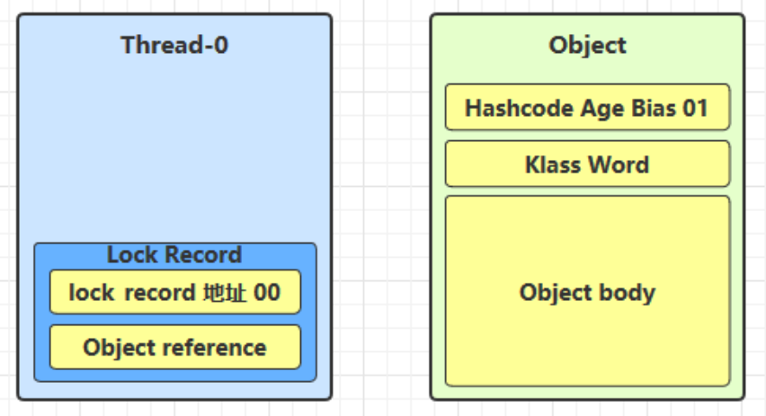
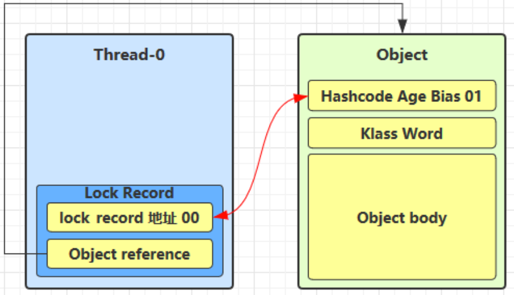
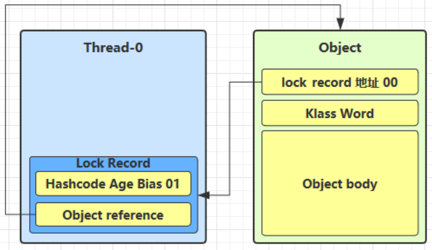
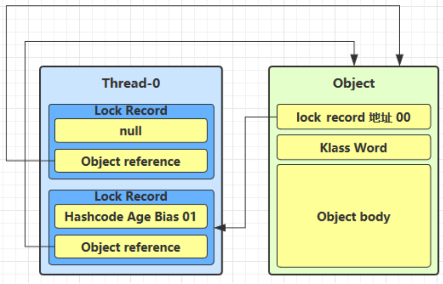
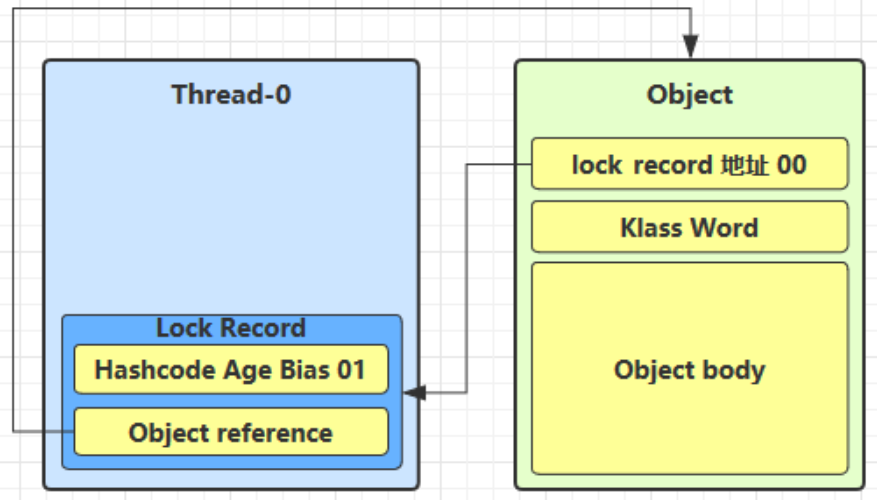
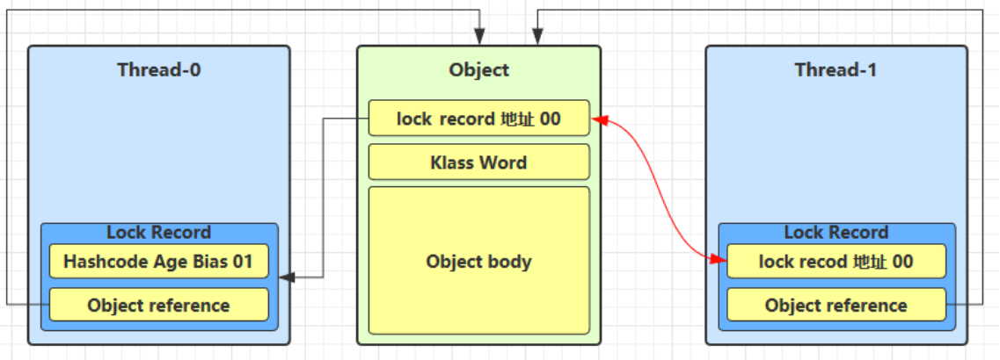
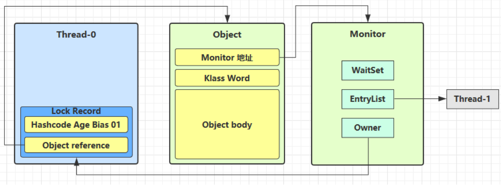
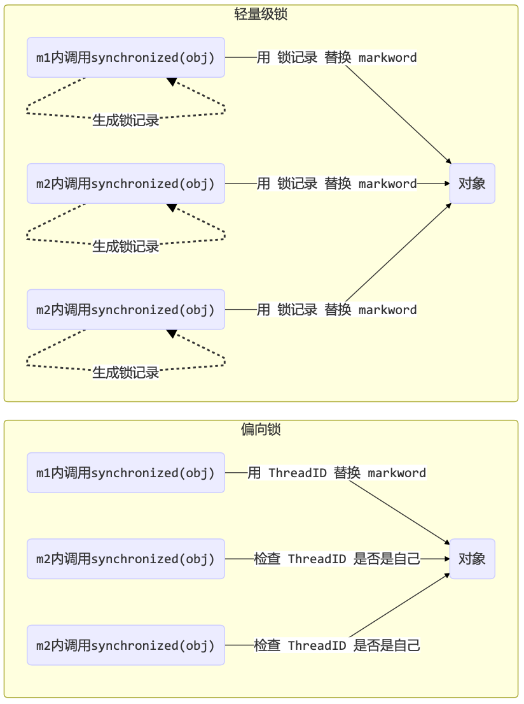
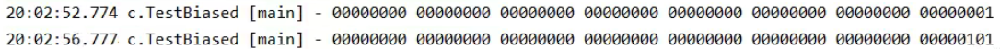

# Synchronized之轻量级锁与偏向锁

## 引入

### 理解

monitor这种锁是由操作系统提供的，要使用它成本是很高的。如果每次进入synchronized的使用都要获取monitor锁的话，对程序运行的性能是有影响的。

从Java6开始，对synchronized获取锁的方式进行了一些改进，从直接使用monitor锁改成了还可以使用轻量级锁、偏向锁。

### 类比故事

故事角色：

- 老王 - JVM
- 小南 - 线程
- 小女 - 线程
- 房间 - 对象
- 房间门上 - 防盗锁 - Monitor
- 房间门上 - 小南书包 - 轻量级锁
- 房间门上 - 刻上小南大名 - 偏向锁
- 批量重刻名 - 一个类的偏向锁撤销到达 20 阈值
- 不能刻名字 - 批量撤销该类对象的偏向锁，设置该类不可偏向

小南要使用房间保证计算不被其它人干扰(原子性)，最初，他用的是防盗锁，当上下文切换时，锁住门。这样即使他离开了别人也进不了门，他的工作就是安全的。

但是，很多情况下没人跟他来竞争房间的使用权。小女是要用房间，但使用的时间上是错开的，小南白天用，小女晚上用。每次上锁太麻烦了，有没有更简单的办法呢?

小南和小女商量了一下约定不锁门了，而是谁用房间谁把自己的书包挂在门口，但他们的书包样式都一样，因此每次进门前得翻翻书包看课本是谁的，如果是自己的那么就可以进门，这样省的上锁解锁了。万一书包不是自己的，那么就在门外等，并通知对方下次用锁门的方式。

后来，小女回老家了，很长一段时间都不会用这个房间。小南每次还是挂书包，翻书包，虽然比锁门省事了，但仍然觉得麻烦。于是，小南干脆在门上刻上了自己的名字:【小南专属房间，其它人勿用】，下次来用房间时，只要名字还在，那么说明没人打扰，还是可以安全地使用房间。如果这期间有其它人要用这个房间，那么由使用者将小南刻的名字擦掉，升级为挂书包的方式。

同学们都放假回老家了小南就膨胀了，在 20 个房间刻上了自己的名字，想进哪个进哪个。后来他自己放假回老家了，这时小女回来了(她也要用这些房间)，结果就是得一个个地擦掉小南刻的名字，升级为挂书包的方式。老王觉得这成本有点高，提出了一种批量重刻名的方法，他让小女不用挂书包了，可以直接在门上刻上自己的名字

后来，刻名的现象越来越频繁，老王受不了了：算了，这些房间都不能刻名了，只能挂书包

## 原理之轻量级锁

### 原理

轻量级锁的使用场景：如果一个对象虽然有多线程要加锁，但加锁的时间是错开的(也就是没有竞争)，那么可以使用轻量级锁来优化。

轻量级锁对使用者是透明的，即语法仍然是 synchronized 

假设有两个方法同步块，利用同一个对象加锁

```java
static final Object obj = new Object(); 

public static void method1() {
	synchronized( obj ) { 
    // 同步块 A
		method2(); 
  }
}

public static void method2() {
	synchronized( obj ) { 
    // 同步块 B
	} 
}
```

创建锁记录(Lock Record)对象(这个对象是操作系统层面的)，每个线程的栈帧都会包含一个锁记录的结构，内部可以存储锁定对象的 Mark Word



让锁记录中 Object reference 指向锁对象，并尝试用 cas 替换 Object 的 Mark Word，将 Mark Word 的值存入锁记录

> cas：compare and sweep，一种将比较和交换融合为具有原子性的操作
>
> - 独占锁是一种悲观锁，synchronized就是一种独占锁，会导致其它所有需要锁的线程挂起，等待持有锁的线程释放锁。而另一个更加有效的锁就是乐观锁。所谓乐观锁就是，每次不加锁而是假设没有冲突而去完成某项操作，如果因为冲突失败就重试，直到成功为止。乐观锁用到的机制就是CAS



如果 cas 替换成功（锁对象状态为00），对象头中存储了锁记录地址和状态 00 ，表示由该线程给对象加锁，这时图示如下



如果 cas 失败，有两种情况

- 如果是其它线程已经持有了该 Object 的轻量级锁，这时表明有竞争，进入锁膨胀过程
- 如果是自己执行了 synchronized 锁重入（当前线程再一次给锁对象加锁），那么再添加一条 Lock Record 作为重入的计数



当退出 synchronized 代码块(解锁时)如果有取值为 null 的锁记录，表示有重入，这时重置锁记录，表示重入计数减一



当退出 synchronized 代码块(解锁时)锁记录的值不为 null，这时使用 cas 将 Mark Word 的值恢复给对象头

- 成功，则解锁成功
- 失败，说明轻量级锁进行了锁膨胀或已经升级为重量级锁，进入重量级锁解锁流程

### 锁膨胀

如果在尝试加轻量级锁的过程中，CAS 操作无法成功，这时一种情况就是有其它线程为此对象加上了轻量级锁(有竞争)，这时需要进行锁膨胀，将轻量级锁变为重量级锁。

```java
static Object obj = new Object();

public static void method1() {
	synchronized( obj ) { 
    // 同步块
	} 
}
```

当 Thread-1 进行轻量级加锁时，Thread-0 已经对该对象加了轻量级锁



这时 Thread-1 加轻量级锁失败，进入锁膨胀流程

- 即为 Object 对象申请 Monitor 锁，让 Object 指向重量级锁地址
- 然后自己进入 Monitor 的 EntryList BLOCKED



当 Thread-0 退出同步块解锁时，使用 cas 将 Mark Word 的值恢复给对象头，失败。这时会进入重量级解锁流程，即按照 Monitor 地址找到 Monitor 对象，设置 Owner 为 null，唤醒 EntryList 中 BLOCKED 线程

### 自旋优化

重量级锁竞争的时候，还可以使用自旋来进行优化，如果当前线程自旋成功(即这时候持锁线程已经退出了同步块，释放了锁)，这时当前线程就可以避免阻塞。

自旋重试成功的情况

| 线程1 (core1 上)        | 对象Mark               | 线程2（core2 上）       |
| ----------------------- | ---------------------- | ----------------------- |
| -                       | 10（重量锁）           | -                       |
| 访问同步块，获取monitor | 10（重量锁）重量锁指针 | -                       |
| 成功（加锁）            | 10（重量锁）重量锁指针 | -                       |
| 执行同步块              | 10（重量锁）重量锁指针 | -                       |
| 执行同步块              | 10（重量锁）重量锁指针 | 访问同步块，获取monitor |
| 执行同步块              | 10（重量锁）重量锁指针 | 自旋重试                |
| 执行完毕                | 10（重量锁）重量锁指针 | 自旋重试                |
| 成功(解锁)              | 01（无锁）             | 自旋重试                |
| -                       | 10（重量锁）重量锁指针 | 成功（加锁）            |
| -                       | 10（重量锁）重量锁指针 | 执行代码块              |
| -                       | ...                    | ...                     |

自旋重试失败的情况

| 线程1（core1 上） | 对象Mark               | 线程2（core2 上）       |
| ----------------- | ---------------------- | ----------------------- |
| -                 | 10（重量锁）           | -                       |
| 成功（加锁）      | 10（重量锁）重量锁指针 | -                       |
| 执行同步块        | 10（重量锁）重量锁指针 | -                       |
| 执行同步块        | 10（重量锁）重量锁指针 | -                       |
| 执行同步块        | 10（重量锁）重量锁指针 | 访问同步块，获取monitor |
| 执行同步块        | 10（重量锁）重量锁指针 | 自旋重试                |
| 执行同步块        | 10（重量锁）重量锁指针 | 自旋重试                |
| 执行同步块        | 10（重量锁）重量锁指针 | 自旋重试                |
| 执行同步块        | 10（重量锁）重量锁指针 | 阻塞                    |
| -                 | ...                    | ...                     |

自旋会占用 CPU 时间，单核 CPU 自旋就是浪费，多核 CPU 自旋才能发挥优势。

在 Java 6 之后自旋锁是自适应的，比如对象刚刚的一次自旋操作成功过，那么认为这次自旋成功的可能性会高，就多自旋几次；反之，就少自旋甚至不自旋，总之，比较智能。

Java 7 之后不能控制是否开启自旋功能

## 原理之偏向锁

### 原理

轻量级锁在没有竞争时(就自己这个线程)，每次重入仍然需要执行 CAS 操作。

Java 6 中引入了偏向锁来做进一步优化：只有第一次使用 CAS 将线程 ID 设置到对象的 Mark Word 头，之后发现 这个线程 ID 是自己的就表示没有竞争，不用重新 CAS。以后只要不发生竞争，这个对象就归该线程所有

例如:

```java
static final Object obj = new Object(); 

public static void m1() {
	synchronized( obj ) { 
    // 同步块 A
		m2(); 
  }
}

public static void m2() {
	synchronized( obj ) { 
    // 同步块 B
		m3(); 
  }
}

public static void m3() {
	synchronized( obj ) {
  	// 同步块 C 
  }
}
```



### 偏向状态

引入jdk官方提供的jar包jol

> Jol可以查看普通java对象的内部布局工具JOL(JAVA OBJECT LAYOUT),使用此工具可以查看new出来的一个java对象的内部布局,以及一个普通的java对象占用多少字节.

```xml
<dependency>
  <groupId>org.openjdk.jol</groupId>
  <artifactId>jol-core</artifactId>
  <version>0.9</version>
</dependency>
```

#### 测试偏向锁延迟特性

代码：

```java
public class TestBiased {
    public static void main(String[] args) throws InterruptedException {
        System.out.println(ClassLayout.parseInstance(new Dog()).toPrintable());
        Thread.sleep(4000);//查看偏向锁延时加载后的情况
        System.out.println(ClassLayout.parseInstance(new Dog()).toPrintable());
    }
}

class Dog {}
```

结果：



一个对象创建时：

- 如果开启了偏向锁(默认开启)，那么对象创建后，markword 值为 0x05 即最后 3 位为 101，这时它的 thread、epoch、age 都为 0 
- 偏向锁是默认是延迟的，不会在程序启动时立即生效，如果想避免延迟，可以加VM参数 `- XX:BiasedLockingStartupDelay=0` 来禁用延迟

- 如果没有开启偏向锁，那么对象创建后，markword 值为 0x01 即最后 3 位为 001，这时它的 hashcode、 age 都为 0，第一次用到 hashcode 时才会赋值

**测试加锁后的偏向锁**

代码：

```java
public class TestBiased {
    private static Logger log = LoggerFactory.getLogger(TestBiased.class);

    // 添加虚拟机参数 -XX:BiasedLockingStartupDelay=0
    public static void main(String[] args)  {
        Dog d = new Dog();
        ClassLayout classLayout = ClassLayout.parseInstance(d);
      
        log.debug("synchronized 前");
        System.out.println(classLayout.toPrintable());
        synchronized (d) {
          log.debug("synchronized 中");
          System.out.println(classLayout.toPrintable());
        }
        log.debug("synchronized 后");
        System.out.println(classLayout.toPrintable());
    }
}

class Dog {}
```

结果：

```shell
11:08:58.117 c.TestBiased [main] - synchronized 前
00000000 00000000 00000000 00000000 00000000 00000000 00000000 00000101 
11:08:58.121 c.TestBiased [main] - synchronized 中
00000000 00000000 00000000 00000000 00011111 11101011 11010000 00000101 
11:08:58.121 c.TestBiased [main] - synchronized 后
00000000 00000000 00000000 00000000 00011111 11101011 11010000 00000101
```

> 注意：处于偏向锁的对象解锁后，线程 id 仍存储于对象头中

#### 测试禁用

代码：在上面测试代码运行时在添加 VM 参数 -XX:-UseBiasedLocking 禁用偏向锁

结果：

```shell
11:13:10.018 c.TestBiased [main] - synchronized 前
00000000 00000000 00000000 00000000 00000000 00000000 00000000 00000001 
11:13:10.021 c.TestBiased [main] - synchronized 中
00000000 00000000 00000000 00000000 00100000 00010100 11110011 10001000 
11:13:10.021 c.TestBiased [main] - synchronized 后
00000000 00000000 00000000 00000000 00000000 00000000 00000000 00000001
```

> 默认锁优先级：偏向锁 > 轻量级锁 > 重量级锁 

### 偏向锁的撤销

**添加hashcode会出现偏向锁的撤销**

正常状态对象一开始是没有 hashCode 的，第一次调用才生成

调用了对象的 hashCode，但偏向锁的对象 MarkWord 中存储的是线程 id，如果调用 hashCode 会导致偏向锁被撤销

- 轻量级锁会在锁记录中记录 hashCode

- 重量级锁会在 Monitor 中记录 hashCode 在调用hashCode后使用偏向锁
- 偏向锁没有位置去存储hashcode，所以偏向锁会被撤销

代码：

```java
public class TestBiased {
    private static Logger log = LoggerFactory.getLogger(TestBiased.class);

    // 添加虚拟机参数 -XX:BiasedLockingStartupDelay=0
    public static void main(String[] args)  {
        Dog d = new Dog();
        d.hashcode(); //会禁用该对象的偏向锁
        ClassLayout classLayout = ClassLayout.parseInstance(d);
      
        log.debug("synchronized 前");
        System.out.println(classLayout.toPrintable());
        synchronized (d) {
          log.debug("synchronized 中");
          System.out.println(classLayout.toPrintable());
        }
        log.debug("synchronized 后");
        System.out.println(classLayout.toPrintable());
    }
}

class Dog {}
```

结果：

```shell
11:22:10.391 c.TestBiased [main] - synchronized 前
00000000 00000000 00000000 01101010 00000010 01001010 01100111 00000001 
11:22:10.393 c.TestBiased [main] - synchronized 中
00000000 00000000 00000000 00000000 00100000 11000011 11110011 01101000 
11:22:10.393 c.TestBiased [main] - synchronized 后
00000000 00000000 00000000 01101010 00000010 01001010 01100111 00000001
```

**其他线程使用对象会出现偏向锁的撤销**

当有其它线程使用偏向锁对象时，会将偏向锁升级为轻量级锁

```java
public class TestBiased {
    private static Logger log = LoggerFactory.getLogger(TestBiased.class);

    public static void main(String[] args) throws Exception {
        Dog d = new Dog();
        Thread t1 = new Thread(() -> {
            synchronized (d) {
                log.debug(ClassLayout.parseInstance(d).toPrintable());
            }
            synchronized (TestBiased.class) {
                TestBiased.class.notify();
            }
            // 如果不用 wait/notify 使用 join 必须打开下面的注释
            // 因为:t1 线程不能结束，否则底层线程可能被 jvm 重用作为 t2 线程，底层线程 id 是一样的
            /*
            try {
                System.in.read();
            } catch (IOException e) {
                e.printStackTrace();
            }
            */
        }, "t1");
        t1.start();
        Thread t2 = new Thread(() -> {
            synchronized (TestBiased.class) {
                try {
                    TestBiased.class.wait();
                } catch (InterruptedException e) {
                    e.printStackTrace();
                }
            }
            log.debug(ClassLayout.parseInstance(d).toPrintable());
            synchronized (d) {
                log.debug(ClassLayout.parseInstance(d).toPrintable());
            }
            log.debug(ClassLayout.parseInstance(d).toPrintable());
        }, "t2");
        t2.start();
    }
}

class Dog {}
```

> 注意：这里加notify和wait是为了将两个线程的执行时间错开，防止偏向锁升级为重量级锁

输出：

```java
[t1] - 00000000 00000000 00000000 00000000 00011111 01000001 00010000 00000101 
[t2] - 00000000 00000000 00000000 00000000 00011111 01000001 00010000 00000101 
[t2] - 00000000 00000000 00000000 00000000 00011111 10110101 11110000 01000000 
[t2] - 00000000 00000000 00000000 00000000 00000000 00000000 00000000 00000001
```

**调用notify和wait时会出现偏向锁的撤销**

notify和wait只有重量级锁才有，所以调用notify和wait时会出现偏向锁的撤销

```java
public class TestBiased {
    private static Logger log = LoggerFactory.getLogger(TestBiased.class);

    public static void main(String[] args) throws InterruptedException {
        Dog d = new Dog();
        Thread t1 = new Thread(() -> {
            log.debug(ClassLayout.parseInstance(d).toPrintable());
            synchronized (d) {
                log.debug(ClassLayout.parseInstance(d).toPrintable());
                try {
                    d.wait();
                } catch (InterruptedException e) {
                    e.printStackTrace();
                }
                log.debug(ClassLayout.parseInstance(d).toPrintable());
            }
        }, "t1");
        t1.start();
        new Thread(() -> {
            try {
                Thread.sleep(6000);
            } catch (InterruptedException e) {
                e.printStackTrace();
            }
            synchronized (d) {
                log.debug("notify");
                d.notify();
            }
        }, "t2").start();
    }
}

class Dog {}
```

输出：

```shell
[t1] - 00000000 00000000 00000000 00000000 00000000 00000000 00000000 00000101 
[t1] - 00000000 00000000 00000000 00000000 00011111 10110011 11111000 00000101
[t2] - notify
[t1] - 00000000 00000000 00000000 00000000 00011100 11010100 00001101 11001010
```

### 批量重偏向

如果对象虽然被多个线程访问，但没有竞争，这时偏向了线程 T1 的对象仍有机会重新偏向 T2，重偏向会重置对象的 Thread ID

当撤销偏向锁阈值超过 20 次后，jvm 会这样觉得，我是不是偏向错了呢，于是会在给这些对象加锁时重新偏向至加锁线程

```java
public class TestBiased {
    private static Logger log = LoggerFactory.getLogger(TestBiased.class);

    public static void main(String[] args) throws InterruptedException {
        Vector<Dog> list = new Vector<>();
        Thread t1 = new Thread(() -> {
            for (int i = 0; i < 30; i++) {
                Dog d = new Dog();
                list.add(d);
                synchronized (d) {
                    log.debug(i + "\t" + ClassLayout.parseInstance(d).toPrintable());
                }
            }
            synchronized (list) {
                list.notify();
            }
        }, "t1");
        t1.start();
        Thread t2 = new Thread(() -> {
            synchronized (list) {
                try {
                    list.wait();
                } catch (InterruptedException e) {
                    e.printStackTrace();
                }
            }
            log.debug("===============> ");
            for (int i = 0; i < 30; i++) {
                Dog d = list.get(i);
                log.debug(i + "\t" + ClassLayout.parseInstance(d).toPrintable());
                synchronized (d) {
                    log.debug(i + "\t" + ClassLayout.parseInstance(d).toPrintable());
                }
                log.debug(i + "\t" + ClassLayout.parseInstance(d).toPrintable());
            }
        }, "t2");
        t2.start();
    }
}

class Dog {}
```

### 批量撤销

当撤销偏向锁阈值超过 40 次后，jvm 会这样觉得，自己确实偏向错了，根本就不该偏向。于是整个类的所有对象都会变为不可偏向的，新建的对象也是不可偏向的

```java
public class TestBiased {
    private static Logger log = LoggerFactory.getLogger(TestBiased.class);
    private static Thread t1, t2, t3;

    public static void main(String[] args) throws InterruptedException {
        Vector<Dog> list = new Vector<>();
        int loopNumber = 39;
        t1 = new Thread(() -> {
            for (int i = 0; i < loopNumber; i++) {
                Dog d = new Dog();
                list.add(d);
                synchronized (d) {
                    log.debug(i + "\t" + ClassLayout.parseInstance(d).toPrintable(true));
                }
            }
            LockSupport.unpark(t2);
        }, "t1");
        t1.start();
        t2 = new Thread(() -> {
            LockSupport.park();
            log.debug("===============> ");
            for (int i = 0; i < loopNumber; i++) {
                Dog d = list.get(i);
                log.debug(i + "\t" + ClassLayout.parseInstance(d).toPrintable());
                synchronized (d) {
                    log.debug(i + "\t" + ClassLayout.parseInstance(d).toPrintable());
                }
                log.debug(i + "\t" + ClassLayout.parseInstance(d).toPrintable());
            }
            LockSupport.unpark(t3);
        }, "t2");
        t2.start();
        t3 = new Thread(() -> {
            LockSupport.park();
            log.debug("===============> ");
            for (int i = 0; i < loopNumber; i++) {
                Dog d = list.get(i);
                log.debug(i + "\t" + ClassLayout.parseInstance(d).toPrintable());
                synchronized (d) {
                    log.debug(i + "\t" + ClassLayout.parseInstance(d).toPrintable());
                }
                log.debug(i + "\t" + ClassLayout.parseInstance(d).toPrintable());
            }
        }, "t3");
        t3.start();
        t3.join();
        log.debug(ClassLayout.parseInstance(new Dog()).toPrintable());
    }
}

class Dog {}
```

> 参考资料： 偏向锁论文
> - https://github.com/farmerjohngit/myblog/issues/12
> - https://www.cnblogs.com/LemonFive/p/11246086.html
> - https://www.cnblogs.com/LemonFive/p/11248248.html