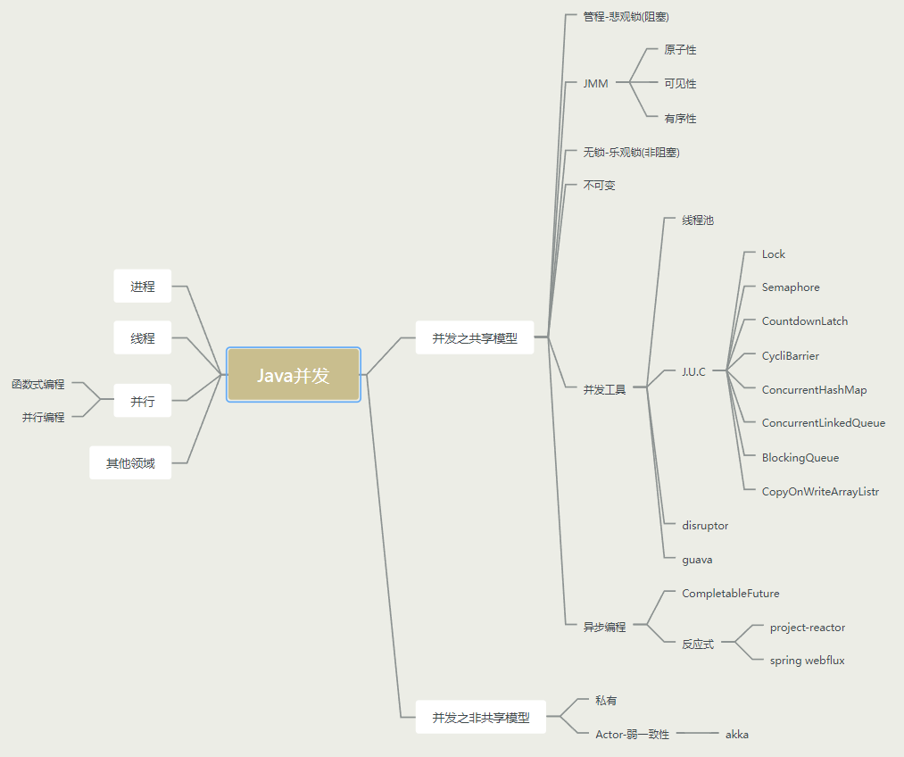

# 概述

## 总览

### 总体框架



### 并发应用场景

- 效率

- 限流

- 同步

- 异步

- 缓存

- 队列

- 分治

- 统筹

### 并发设计模式

- Balking

- Guarded Suspension

- 控制顺序

- 两阶段退出

- WorkThead

- Thread per Message

- 生产者/消费者

## 进程与线程

### 进程

程序由指令和数据组成，但这些指令要运行，数据要读写，就必须将指令加载至 CPU，数据加载至内存。在 指令运行过程中还需要用到磁盘、网络等设备。进程就是用来加载指令、管理内存、管理 IO 的 

当一个程序被运行，从磁盘加载这个程序的代码至内存，这时就开启了一个进程。 

进程就可以视为程序的一个实例。大部分程序可以同时运行多个实例进程(例如记事本、画图、浏览器 等)，也有的程序只能启动一个实例进程(例如网易云音乐、360 安全卫士等)

### 线程

一个进程之内可以分为一到多个线程。 

一个线程就是一个指令流，将指令流中的一条条指令以一定的顺序交给 CPU 执行

 Java 中，线程作为最小调度单位，进程作为资源分配的最小单位。 在 windows 中进程是不活动的，只是作 为线程的容器

### 进程与线程对比

进程基本上相互独立的，而线程存在于进程内，是进程的一个子集。

进程拥有共享的资源，如内存空间等，供其内部的线程共享。

进程间通信较为复杂。

- 同一台计算机的进程通信称为 IPC(Inter-process communication) 
- 不同计算机之间的进程通信，需要通过网络，并遵守共同的协议，例如 HTTP

线程通信相对简单，因为它们共享进程内的内存，一个例子是多个线程可以访问同一个共享变量。

线程更轻量，线程上下文切换成本一般上要比进程上下文切换低。

## 并行与并发

单核 cpu 下，线程实际还是 `串行执行` 的。操作系统中有一个组件叫做任务调度器，将 cpu 的时间片(windows 下时间片最小约为 15 毫秒)分给不同的程序使用，只是由于 cpu 在线程间(时间片很短)的切换非常快，人类感觉是 `同时运行的` 。总结为一句话就是: `微观串行，宏观并行` ，

一般会将这种 `线程轮流使用 CPU` 的做法称为并发， `concurrent`

| CPU  | 时间片1 | 时间片2 | 时间片3 | 时间片4 |
| ---- | ------- | ------- | ------- | ------- |
| core | 线程1   | 线程2   | 线程3   | 线程4   |

多核 cpu下，每个 `核(core)` 都可以调度运行线程，这时候线程可以是并行的。

| CPU   | 时间片1 | 时间片2 | 时间片3 | 时间片4 |
| ----- | ------- | ------- | ------- | ------- |
| core1 | 线程1   | 线程1   | 线程3   | 线程3   |
| Core2 | 线程2   | 线程4   | 线程2   | 线程4   |

> 引用 Rob Pike 的一段描述: 
>
> 1. 并发(concurrent)是同一时间应对(dealing with)多件事情的能力
>
> 2. 并行(parallel)是同一时间动手做(doing)多件事情的能力

## 应用

### 应用之异步调用

以调用方角度来讲：如果需要等待结果返回，才能继续运行就是同步。不需要等待结果返回，就能继续运行就是异步。

#### 设计

多线程可以让方法执行变为异步的(即不要巴巴干等着)比如说读取文件时，假设读取操作花费了 5 秒钟，如果没有线程调度机制，这 5 秒 cpu 什么都做不了，其它代码都得暂停...

测试代码：

```java
public class AsyncAndSync {
    private static Logger log = LoggerFactory.getLogger(AsyncAndSync.class);

    public static void main(String[] args) {
        // asyncTest();
        syncTest();
    }

    private static void asyncTest() {
        new Thread(() -> read("test.txt")).start();
        log.debug("do other things...");
    }

    private static void syncTest() {
        read("test.txt");
        log.debug("do other things...");
    }

    public static void read(String filename) {
        int idx = filename.lastIndexOf(File.separator);
        String shortName = filename.substring(idx + 1);
        try (FileInputStream in = new FileInputStream(filename)) {
            long start = System.currentTimeMillis();
            log.debug("read [{}] start ...", shortName);
            byte[] buf = new byte[1024];
            int n = -1;
            do {
                n = in.read(buf);
            } while (n != -1);
            long end = System.currentTimeMillis();
            log.debug("read [{}] end ... cost: {} ms", shortName, end - start);
        } catch (IOException e) {
            e.printStackTrace();
        }
    }
}
```

运行结果：

```shell
# async异步方法
2021-11-29 01:22:40.486 DEBUG [main] do other things...
2021-11-29 01:22:40.486 DEBUG [Thread-0] read [test.txt] start ...
2021-11-29 01:22:40.489 DEBUG [Thread-0] read [test.txt] end ... cost: 5 ms

# sync同步方法
2021-11-29 01:23:30.873 DEBUG [main] read [test.txt] start ...
2021-11-29 01:23:30.877 DEBUG [main] read [test.txt] end ... cost: 5 ms
2021-11-29 01:23:30.878 DEBUG [main] do other things...
```

#### 结论

- 比如在项目中，视频文件需要转换格式等操作比较费时，这时开一个新线程处理视频转换，避免阻塞主线程 

- tomcat 的异步 servlet 也是类似的目的，让用户线程处理耗时较长的操作，避免阻塞 tomcat 的工作线程

- ui 程序中，开线程进行其他操作，避免阻塞 ui 线程

### 应用之提高效率

充分利用多核 cpu 的优势，提高运行效率。想象下面的场景，执行 3 个计算，最后将计算结果汇总。

```shell
 计算 1 花费 10 ms 
 计算 2 花费 11 ms 
 计算 3 花费 9 ms 
 汇总需要 1 ms
```

- 如果是串行执行，那么总共花费的时间是 10 + 11 + 9 + 1 = 31ms
- 但如果是四核 cpu，各个核心分别使用线程 1 执行计算 1，线程 2 执行计算 2，线程 3 执行计算 3，那么 3 个 线程是并行的，花费时间只取决于最长的那个线程运行的时间，即 11ms 最后加上汇总时间只会花费 12ms

> 注意：需要在多核 cpu 才能提高效率，单核仍然时是轮流执行

#### 设计

基准测试工具选择，使用了比较靠谱的 JMH，它会执行程序预热，执行多次测试并平均 

cpu 核数限制，有两种思路

- 使用虚拟机，分配合适的核

- 使用 msconfig，分配合适的核，需要重启比较麻烦

并行计算方式的选择

- 最初想直接使用 parallel stream，后来发现它有自己的问题

- 改为了自己手动控制 thread，实现简单的并行计算 测试代码如下

引入JMH依赖和插件依赖：

```xml
<properties>
  <java.version>1.8</java.version>
  <uberjar.name>benchmarks</uberjar.name>
</properties>

<dependencies>
  <dependency>
    <groupId>org.openjdk.jmh</groupId>
    <artifactId>jmh-core</artifactId>
    <version>1.26</version>
  </dependency>
  <dependency>
    <groupId>org.openjdk.jmh</groupId>
    <artifactId>jmh-generator-annprocess</artifactId>
    <version>1.26</version>
  </dependency>
</dependencies>

<build>
  <plugins>
    <plugin>
      <groupId>org.apache.maven.plugins</groupId>
      <artifactId>maven-compiler-plugin</artifactId>
      <version>2.5.1</version>
      <configuration>
        <source>1.8</source>
        <target>1.8</target>
        <encoding>UTF-8</encoding>
      </configuration>
    </plugin>


    <plugin>
      <groupId>org.apache.maven.plugins</groupId>
      <artifactId>maven-surefire-plugin</artifactId>
      <version>2.16</version>
      <configuration>
        <forkMode>always</forkMode>
        <redirectTestOutputToFile>true</redirectTestOutputToFile>
      </configuration>
    </plugin>
    <plugin>
      <groupId>org.apache.maven.plugins</groupId>
      <artifactId>maven-shade-plugin</artifactId>
      <version>3.2.1</version>
      <executions>
        <execution>
          <phase>package</phase>
          <goals>
            <goal>shade</goal>
          </goals>
          <configuration>
            <finalName>${uberjar.name}</finalName>
            <transformers>
              <transformer
                           implementation="org.apache.maven.plugins.shade.resource.ManifestResourceTransformer">
                <mainClass>org.openjdk.jmh.Main</mainClass>
              </transformer>
              <transformer
                           implementation="org.apache.maven.plugins.shade.resource.ServicesResourceTransformer"/>
            </transformers>
          </configuration>
        </execution>
      </executions>
    </plugin>

  </plugins>
</build>
```

编写测试代码：

```java
/**
 * 测试代码为：对1亿个数进行求和
 */
@Fork(1)
//测试模式为统计平均时间
@BenchmarkMode(Mode.AverageTime)
//热身次数
@Warmup(iterations = 3)
//进行五轮测试
@Measurement(iterations = 5)
public class MyBenchmark {
    static int[] ARRAY = new int[1000_000_00];

    static {
        Arrays.fill(ARRAY, 1);
    }

    public static void main(String[] args) throws RunnerException {
        Options opt = new OptionsBuilder()
                .include(MyBenchmark.class.getSimpleName())
                .build();
        new Runner(opt).run();
    }

    /**
     * 开启四个线程，每个线程计算2500万个数字
     *
     * @return
     * @throws Exception
     */
    @Benchmark
    public int c() throws Exception {
        int[] array = ARRAY;
        FutureTask<Integer> t1 = new FutureTask<>(() -> {
            int sum = 0;
            for (int i = 0; i < 250_000_00; i++) {
                sum += array[0 + i];
            }
            return sum;
        });
        FutureTask<Integer> t2 = new FutureTask<>(() -> {
            int sum = 0;
            for (int i = 0; i < 250_000_00; i++) {
                sum += array[250_000_00 + i];
            }
            return sum;
        });
        FutureTask<Integer> t3 = new FutureTask<>(() -> {
            int sum = 0;
            for (int i = 0; i < 250_000_00; i++) {
                sum += array[500_000_00 + i];
            }
            return sum;
        });
        FutureTask<Integer> t4 = new FutureTask<>(() -> {
            int sum = 0;
            for (int i = 0; i < 250_000_00; i++) {
                sum += array[750_000_00 + i];
            }
            return sum;
        });
        new Thread(t1).start();
        new Thread(t2).start();
        new Thread(t3).start();
        new Thread(t4).start();
        return t1.get() + t2.get() + t3.get() + t4.get();
    }

    /**
     * 开启一个线程，计算1亿个数
     * @return
     * @throws Exception
     */
    @Benchmark
    public int d() throws Exception {
        int[] array = ARRAY;
        FutureTask<Integer> t1 = new FutureTask<>(() -> {
            int sum = 0;
            for (int i = 0; i < 1000_000_00; i++) {
                sum += array[0 + i];
            }
            return sum;
        });
        new Thread(t1).start();
        return t1.get();
    }
}
```

运行测试并查看执行结果如下：

在多核CPU下，c方法相对于d方法大约有一倍的性能提升！

```shell
Benchmark      Mode  Cnt  Score   Error  Units
MyBenchmark.c  avgt    5  0.022 ± 0.002   s/op
MyBenchmark.d  avgt    5  0.045 ± 0.004   s/op
```

在单核CPU下，c方法相对于d方法反而性能稍微低一点，这是因为多线程有上下文切换

```shell
Benchmark      Mode  Cnt  Score   Error  Units
MyBenchmark.c  avgt    5  0.051 ± 0.003   s/op
MyBenchmark.d  avgt    5  0.047 ± 0.004   s/op
```

#### 结论

- 单核 cpu 下，多线程不能实际提高程序运行效率，只是为了能够在不同的任务之间切换，不同线程轮流使用 cpu ，不至于一个线程总占用 cpu，别的线程没法干活
- 多核 cpu 可以并行跑多个线程，但能否提高程序运行效率还是要分情况的
  - 有些任务，经过精心设计，将任务拆分，并行执行，当然可以提高程序的运行效率。但不是所有计算任
    务都能拆分(参考后文的【阿姆达尔定律】)
  - 也不是所有任务都需要拆分，任务的目的如果不同，谈拆分和效率没啥意义
- IO 操作不占用 cpu，只是我们一般拷贝文件使用的是【阻塞 IO】，这时相当于线程虽然不用 cpu，但需要一 直等待 IO 结束，没能充分利用线程。所以才有后面的【非阻塞 IO】和【异步 IO】优化

