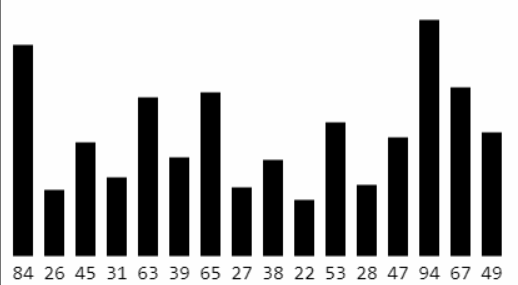

# 十大排序算法

## 概述

其中 冒泡，选择，归并，快速，希尔，堆排序属于`比较排序`


**稳定性理解**

如果相等的两个元素，在排序前后的相对位置保持不变，那么这是稳定的排序算法。

- 排序前：5，1，3(a)，4，7，3(b)

- 稳定的排序：1，3(a)，3(b)，4，5，7

- 不稳定的排序：1，3(b)，3(a)，4，5，7

**原地算法（In-place Algorithm）理解**

定义：不依赖额外的资源或依赖少数的额外资源（空间复杂度较低），仅依靠输出覆盖输入（例如直接对输入的数组进行操作）

## 工具类

> 用于提供测试数据与测试代码正确性

### 断言工具类

```java
public class Asserts {
   public static void test(boolean value) {
      try {
         if (!value) throw new Exception("测试未通过");
      } catch (Exception e) {
         e.printStackTrace();
      }
   }
}
```

### Integers工具类

```java
public class Integers {
	/** 生成随机数 */
	public static Integer[] random(int count, int min, int max) {
		if (count <= 0 || min > max) return null;
		Integer[] array = new Integer[count];
		int delta = max - min + 1;
		for (int i = 0; i < count; i++) {
			array[i] = min + (int)(Math.random() * delta);
		}
		return array;
	}

	/** 合并两个数组 */
	public static Integer[] combine(Integer[] array1, Integer[] array2) {
		if (array1 == null || array2 == null) return null;
		Integer[] array = new Integer[array1.length + array2.length];
		for (int i = 0; i < array1.length; i++) {
			array[i] = array1[i];
		}
		for (int i = 0; i < array2.length; i++) {
			array[i + array1.length] = array2[i];
		}
		return array;
		
	}

	public static Integer[] same(int count, int unsameCount) {
		if (count <= 0 || unsameCount > count) return null;
		Integer[] array = new Integer[count];
		for (int i = 0; i < unsameCount; i++) {
			array[i] = unsameCount - i;
		}
		for (int i = unsameCount; i < count; i++) {
			array[i] = unsameCount + 1;
		}
		return array;
	}

	/**
	 * 生成头部和尾部是升序的数组
	 * disorderCount：希望多少个数据是无序的
	 */
	public static Integer[] headTailAscOrder(int min, int max, int disorderCount) {
		Integer[] array = ascOrder(min, max);
		if (disorderCount > array.length) return array;
		
		int begin = (array.length - disorderCount) >> 1;
		reverse(array, begin, begin + disorderCount);
		return array;
	}

	/**
	 * 生成中间是升序的数组
	 * disorderCount：希望多少个数据是无序的
	 */
	public static Integer[] centerAscOrder(int min, int max, int disorderCount) {
		Integer[] array = ascOrder(min, max);
		if (disorderCount > array.length) return array;
		int left = disorderCount >> 1;
		reverse(array, 0, left);
		
		int right = disorderCount - left;
		reverse(array, array.length - right, array.length);
		return array;
	}

	/**
	 * 生成头部是升序的数组
	 * disorderCount：希望多少个数据是无序的
	 */
	public static Integer[] headAscOrder(int min, int max, int disorderCount) {
		Integer[] array = ascOrder(min, max);
		if (disorderCount > array.length) return array;
		reverse(array, array.length - disorderCount, array.length);
		return array;
	}

	/**
	 * 生成尾部是升序的数组
	 * disorderCount：希望多少个数据是无序的
	 */
	public static Integer[] tailAscOrder(int min, int max, int disorderCount) {
		Integer[] array = ascOrder(min, max);
		if (disorderCount > array.length) return array;
		reverse(array, 0, disorderCount);
		return array;
	}

	/** 升序生成数组 */
	public static Integer[] ascOrder(int min, int max) {
		if (min > max) return null;
		Integer[] array = new Integer[max - min + 1];
		for (int i = 0; i < array.length; i++) {
			array[i] = min++;
		}
		return array;
	}

	/** 降序生成数组 */
	public static Integer[] descOrder(int min, int max) {
		if (min > max) return null;
		Integer[] array = new Integer[max - min + 1];
		for (int i = 0; i < array.length; i++) {
			array[i] = max--;
		}
		return array;
	}
	
	/** 反转数组 */
	private static void reverse(Integer[] array, int begin, int end) {
		int count = (end - begin) >> 1;
		int sum = begin + end - 1;
		for (int i = begin; i < begin + count; i++) {
			int j = sum - i;
			int tmp = array[i];
			array[i] = array[j];
			array[j] = tmp;
		}
	}

	/** 复制数组 */
	public static Integer[] copy(Integer[] array) {
		return Arrays.copyOf(array, array.length);
	}

	/** 判断数组是否升序 */
	public static boolean isAscOrder(Integer[] array) {
		if (array == null || array.length == 0) return false;
		for (int i = 1; i < array.length; i++) {
			if (array[i - 1] > array[i]) return false;
		}
		return true;
	}

	/** 打印数组 */
	public static void println(Integer[] array) {
		if (array == null) return;
		StringBuilder string = new StringBuilder();
		for (int i = 0; i < array.length; i++) {
			if (i != 0) string.append("_");
			string.append(array[i]);
		}
		System.out.println(string);
	}
}
```

### 时间测试工具类

```java
public class Times {
	private static final SimpleDateFormat fmt = new SimpleDateFormat("HH:mm:ss.SSS");
	
	public interface Task {
		void execute();
	}
	
	public static void test(String title, Task task) {
		if (task == null) return;
		title = (title == null) ? "" : ("【" + title + "】");
		System.out.println(title);
		System.out.println("开始：" + fmt.format(new Date()));
		long begin = System.currentTimeMillis();
		task.execute();
		long end = System.currentTimeMillis();
		System.out.println("结束：" + fmt.format(new Date()));
		double delta = (end - begin) / 1000.0;
		System.out.println("耗时：" + delta + "秒");
		System.out.println("-------------------------------------");
	}
}
```

### Sort抽象父类

```java
public abstract class Sort<T extends Comparable<T>> implements Comparable<Sort<T>> {
    /** 目标数组 */
    protected T[] array;
    /** 比较次数 */
    private int cmpCount;
    /** 交换次数 */
    private int swapCount;
    /** 执行时间 */
    private long time;
    /** 小数格式化 */
    private DecimalFormat fmt = new DecimalFormat("#.00");

    /**
     * 预处理
     */
    public T[] sort(T[] array) {
        if (array == null || array.length < 2) return null;
        this.array = array;
        long begin = System.currentTimeMillis();
        sort();
        time = System.currentTimeMillis() - begin;
        return array;
    }

    /** 目标方法 */
    protected abstract void sort();

    /**
     * 比较数组下标对应的值
     *
     * 返回值等于0，代表 array[index1] == array[index2]
     * 返回值小于0，代表 array[index1] < array[index2]
     * 返回值大于0，代表 array[index1] > array[index2]
     */
    protected int cmp(int index1, int index2) {
        cmpCount++;
        return array[index1].compareTo(array[index2]);
    }

    /** 比较值 */
    protected int cmp(T value1, T value2) {
        cmpCount++;
        return value1.compareTo(value2);
    }

    /** 交换值 */
    protected void swap(int index1, int index2) {
        swapCount++;
        T tmp = array[index1];
        array[index1] = array[index2];
        array[index2] = tmp;
    }

    /** 稳定性测试 */
    @SuppressWarnings("unchecked")
    private boolean isStable() {
        if (this instanceof ShellSort) return false;
        Student[] students = new Sort.Student[20];
        for (int i = 0; i < students.length; i++) {
            //（0，10） （10，10） （20，10） （30，10）
            students[i] = new Student(i * 10, 10);
        }
        sort((T[]) students);//只会对年龄进行排序
        for (int i = 1; i < students.length; i++) {
            int score = students[i].score;
            int prevScore = students[i - 1].score;
            if (score != prevScore + 10) return false;
        }
        return true;
    }

    private static class Student implements Comparable<Student>{
        Integer score;
        Integer age;
        public Student(Integer score, Integer age) {
            this.score = score;
            this.age = age;
        }

        @Override
        public int compareTo(Student o) {
            return age - o.age;
        }
    }

    /** 排序方式 */
    @Override
    public int compareTo(Sort o) {
        int result = (int)(time - o.time);
        if(result != 0) return result;
        result = cmpCount - o.cmpCount;
        if(result != 0) return result;
        return swapCount - o.swapCount;
    }

    @Override
    public String toString() {
        return "【" + getClass().getSimpleName() + "】\n"
                + "交换次数 ==> " + numberString(swapCount) + "\n"
                + "比较次数 ==> " + numberString(cmpCount) + "\n"
                + "执行时间 ==> " + time * 0.001 + "s" + "\n"
                + "稳定性 ==> " + isStable() + "\n"
                + "=================================";
    }

    /** 数字格式化 */
    private String numberString(int number) {
        if (number < 10000) return "" + number;

        if (number < 100000000) {
            return fmt.format(number / 10000.0) + "万";
        }
        return fmt.format(number / 100000000.0) + "亿";
    }

}
```

## 冒泡排序（Bubble Sort）

### 执行流程

- 从头开始比较每一对相邻元素，如果第一个比第二个大就交换它们的位置。执行完一轮后最末尾哪个元素就是最大的元素
- 忽略第一步找到的最大元素，重复执行第一步，直到全部元素有序


### 基本实现

```java
public void sort() {
    for (int eIndex = array.length - 1; eIndex > 0; eIndex--) {
        for (int i = 1; i <= eIndex; i++) {
            if (cmp(i, i - 1) < 0) {
                swap(i, i - 1);
            }
        }
    }
}
```

### 优化一

优化方案：如果序列已经完全有序，可以提前终止冒泡排序

缺点：只有当完全有序时才会提前终止冒泡排序，概率很低

```java
public void sort() {
    boolean sorted;
    for (int eIndex = array.length - 1; eIndex > 0; eIndex--) {
        sorted = true;
        for (int i = 1; i <= eIndex; i++) {
            if (cmp(i,i - 1) < 0) {
                swap(i, i - 1);
                sorted = false;
            }
        }
        if (sorted) break;
    }
}
```

### 优化二

优化方案：如果序列尾部已经局部有序，可以记录最后一次交换的位置，减少比较次数


```java
public class BubbleSort<T extends Comparable<T>> extends Sort<T> {
    /**
     *  优化方式二：如果序列尾部已经局部有序，可以记录最后依次交换的位置，减少比较次数
     *  为什么这里sortedIndex为1（只要保证 eIndex-- > 0 即可）？
     *     => 如果sortedIndex为eIndex，当数组第一次就完全有序时，就退回到最初的版本了
     *     => 如果sortedIndex为1，当数组第一次就完全有序时，一轮扫描就结束了！
     * 
     */
    @Override
    public void sort() {
        int sortedIndex;
        for (int eIndex = array.length - 1; eIndex > 0; eIndex--) {
            sortedIndex = 1; //记录最后一次交换的下标位置
            for (int i = 1; i <= eIndex; i++) {
                if (cmp(i, i - 1) < 0) {
                    swap(i, i - 1);
                    sortedIndex = i;
                }
            }
            eIndex = sortedIndex;
        }
    }
}
```

### 算法优劣

- 最坏，平均时间复杂度：O(n^2），最好时间复杂度：O(n)


- 空间复杂度：O(1)
- 属于稳定排序

> 注意：稍有不慎，稳定的排序算法也能被写成不稳定的排序算法，如下冒泡排序是不稳定的

```java
public void sort() {
    for (int eIndex = array.length - 1; eIndex > 0; eIndex--) {
        for (int i = 1; i <= eIndex; i++) {
            if (cmp(i, i - 1) <= 0) {
                swap(i, i - 1);
            }
        }
    }
}
```

- 属于原地算法

## 选择排序（Selection Sort）

### 执行流程

- 从序列中找出最大的哪个元素，然后与最末尾的元素交换位置。执行完一轮后最末尾那个元素就是最大的元素
- 忽略第一步找到的最大元素，重复执行第一步

> 这里以选最小元素为例


### 基本实现

```java
public class SelectionSort<T extends Comparable<T>> extends Sort<T> {
    @Override
    public void sort() {
        for (int eIndex = array.length - 1; eIndex > 0; eIndex--) {
            int maxIndex = 0;
            for (int i = 1; i <= eIndex; i++) {
                //注意：为了稳定性，这里要写 <=
                if (cmp(maxIndex, i) <= 0) {
                    maxIndex = i;
                }
            }
            if(maxIndex != eIndex) swap(maxIndex, eIndex);
        }
    }

}
```

### 算法优劣

- 选择排序的交换次数要远少于冒泡排序，平均性能优于冒泡排序
- 最好，最坏，平均时间复杂度均为O(n^2)，空间复杂度为O(1)，属于不稳定排序

> 选择排序是否还有优化的空间？ => 使用堆来选择最大值

## 堆排序（Heap Sort）

堆排序可以认为是对选择排序的一种优化

### 执行流程

- 对序列进行原地建堆（heapify）
- 重复执行以下操作，直到堆的元素数量为1
  - 交换堆顶元素与尾元素
  - 堆的元素数量减1
  - 对0位置进行一次siftDown操作


### 基本实现

```java
public class HeapSort<T extends Comparable<T>> extends Sort<T> {
    /** 记录堆数据 */
    private int heapSize;

    @Override
    protected void sort() {
        // 原地建堆（直接使用数组建堆）
        heapSize = array.length;
        for (int i = (heapSize >> 1) - 1; i >= 0; i--) {
            siftDown(i);
        }
        while (heapSize > 1) {
            // 交换堆顶元素和尾部元素
            swap(0, --heapSize);

            // 对0位置进行siftDown（恢复堆的性质）
            siftDown(0);
        }
    }

    /** 堆化 */
    private void siftDown(int index) {
        T element = array[index];

        int half = heapSize >> 1;
        while (index < half) { // index必须是非叶子节点
            // 默认是左边跟父节点比
            int childIndex = (index << 1) + 1;
            T child = array[childIndex];

            int rightIndex = childIndex + 1;
            // 右子节点比左子节点大
            if (rightIndex < heapSize &&
                    cmp(array[rightIndex], child) > 0) {
                child = array[childIndex = rightIndex];
            }

            // 大于等于子节点
            if (cmp(element, child) >= 0) break;

            array[index] = child;
            index = childIndex;
        }
        array[index] = element;
    }
}
```

### 算法优劣

- 最好，最坏，平均时间复杂度：O(nlog^n)


- 空间复杂度：O(1)
- 属于不稳定排序

### 冒泡，选择，堆排序比较

```java
@SuppressWarnings({"rawtypes","unchecked"})
public class SortTest {
    public static void main(String[] args) {
        Integer[] arr1 = Integers.random(10000, 1, 20000);
        testSort(arr1,
                new SelectionSort(),
                new HeapSort(),
                new BubbleSort());

    }

    static void testSort(Integer[] arr,Sort... sorts) {
        for (Sort sort: sorts) {
            Integer[] newArr = Integers.copy(arr);
            sort.sort(newArr);
            //检查排序正确性
            Asserts.test(Integers.isAscOrder(newArr));
        }
        Arrays.sort(sorts);
        for (Sort sort: sorts) {
            System.out.println(sort);
        }
    }
}
```


## 插入排序（Insertion Sort）

### 执行流程

- 在执行过程中，插入排序会将序列分为两部分（头部是已经排好序的，尾部是待排序的）

- 从头开始扫描每一个元素，每当扫描到一个元素，就将它插入到头部适合的位置，使得头部数据依然保持有序



### 基本实现

```java
public class InsertionSort<T extends Comparable<T>> extends Sort<T> {
    @Override
    protected void sort() {
        for (int i = 1; i < array.length; i++) {
            int cur = i;
            while(cur > 0 && cmp(cur,cur - 1) < 0) {
                swap(cur,cur - 1);
                cur--;
            }
        }
    }
}
```

### 逆序对（Inversion）

**什么是逆序对？** => 数组 [2,3,8,6,1] 的逆序对为：<2,1> < 3,1> <8,1> <8,6> <6,1>

**插入排序的时间复杂度与逆序对的数量成正比关系**

> 时间复杂度最高如下：O(n^2)


### 优化一

**优化思路 => 将交换改为挪动**

- 先将待插入元素备份

- 头部有序数据中比待插入元素大的，都朝尾部方向挪动1个位置

- 将待插入元素放到最终合适位置

> 注意：逆序对越多，该优化越明显


```java
public class InsertionSort<T extends Comparable<T>> extends Sort<T> {
    @Override
    protected void sort() {
        for (int i = 1; i < array.length; i++) {
            int cur = i;
            T val = array[cur];
            while(cur > 0 && cmp(val,array[cur - 1]) < 0) {
                array[cur] = array[cur - 1];//优化重点在这里
                cur--;
            }
            array[cur] = val;
        }
    }
}
```

### 优化二

**优化思路 => 将交换改为二分搜索**（较少比较次数）

**二分搜索理解**

如何确定一个元素在数组中的位置？（假设数组里全是整数）

- 如果是无序数组，从第 0 个位置开始遍历搜索，平均时间复杂度：O(n)

- 如果是有序数组，可以使用二分搜索，最坏时间复杂度：O(log^n)

思路

- 如下，假设在 [begin, end) 范围内搜索某个元素 v，mid == (begin + end) / 2
- 如果 v < mid，去 [begin,mid) 范围内二分搜索
- 如果 v > mid，去 [mid + 1,end) 范围内二分搜索
- 如果 v == mid，直接返回 mid


实例


```java
/** 二分搜索-基本实现
 *      查找val在有序数组arr中的位置，找不到就返回-1
 */
private static int indexOf(Integer[] arr,int val) {
    if(arr == null || arr.length == 0) return -1;
    int begin = 0;
    //注意这里end设计为arr.length便于求数量（end - begin）
    int end = arr.length;
    while (begin < end) {
        int mid = (begin + end) >> 1;
        if(val < arr[mid]) {
            end = mid;
        } else if(val > arr[mid]) {
            begin = mid  + 1;
        } else {
            return mid;
        }
    }
    return -1;
}
```

**二分搜索(Binary Search)优化实现**

- 之前的插入排序代码，在元素 val 的插入过程中，可以先二分搜索出合适的插入位置，然后将元素 val 插入
- 适合于插入排序的二分搜索必须满足：<span style="color:red">要求二分搜索返回的插入位置是第1个大于 val 的元素位置</span>
  - 如果 val 是 5 ，返回 2
  - 如果 val 是 1，返回 0
  - 如果 val 是15，返回 7
  - 如果 val 是 8，返回 5


- 实现思路
  - 假设在 [begin,end) 范围内搜索某个元素 val，mid == (begin + end) / 2
  - 如果val < mid，去 [begin,mid) 范围内二分搜索
  - 如果val >= mid，去 [mid + 1,end) 范围内二分搜索
  - 当 begin == end == x，x 就是待插入位置
- 实例


```java
/**
 * 二分搜索-适用于插入排序
 *    查找val在有序数组arr中可以插入的位置
 *    规定：要求二分搜索返回的插入位置是第1个大于 val 的元素位置
 */
private static int search(Integer[] arr,int val) {
    if(arr == null || arr.length == 0) return -1;
    int begin = 0;
    int end = arr.length;
    while (begin < end) {
        int mid = (begin + end) >> 1;
        if(val < arr[mid]) {
            end = mid;
        } else {
            begin = mid  + 1;
        }
    }
    return begin;
}
```

**插入排序最终实现**

> 注意：使用了二分搜索后，只是减少了比较次数，但插入排序的平均时间复杂度依然是O(n^2)

```java
public class InsertionSort<T extends Comparable<T>> extends Sort<T> {
 
    /** 优化 => 二分搜索 */
    @Override
    protected void sort() {
        for (int begin = 1; begin < array.length; begin++) {
            //这里为什么传索引而不是传值？
            // => 传索引还可以知道前面已经排好序的数组区间：[0,i)
            insert(begin,search(begin));
        }
     }

    /** 将source位置的元素插入到dest位置 */
    private void insert(int source,int dest) {
         //将[dest,source)范围内的元素往右边挪动一位
         T val = array[source];
         for (int i = source; i > dest; i--) {
             array[i] = array[i - 1];
         }
         //插入
         array[dest] = val;
    }

    private int search(int index) {
        T val = array[index];
        int begin = 0;
        int end = index;
        while (begin < end) {
            int mid = (begin + end) >> 1;
            if(cmp(val,array[mid]) < 0) {
                end = mid;
            } else {
                begin = mid  + 1;
            }
        }
        return begin;
    }
}
```

### 算法优劣


- 最坏，平均时间复杂度为 O(n^2)，最好时间复杂度为 O(n)
- 空间复杂度为 O(1)
- 属于稳定排序

## 归并排序（Merge Sort）

### 执行流程

- 不断的将当前序列平均分割成 2 个子序列，直到不能再分割（序列中只剩一个元素）
- 不断的将 2 个子序列合并成一个有序序列，直到最终只剩下 1 个有序序列


### 思路

**merge**

大致想法


细节

- 需要 merge 的 2 组序列存在于同一个数组中，并且是挨在一起的


- 为了更好的完成 merge 操作，最好将其中 1 组序列备份出来，比如 [begin,mid)


- 基本实现


- 情况一：左边先结束 => 左边一结束整个归并就结束


- 情况二：右边先结束 => 右边一结束就直接将左边按顺序挪到右边去


### 基本实现

```java
/**
 * @Description 归并排序
 * @Author monap
 * @Date 2022/1/11 23:07
 */
@SuppressWarnings("unchecked")
public class MergeSort<T extends Comparable<T>> extends Sort<T> {
    private T[] leftArr;

    @Override
    protected void sort() {
        leftArr = (T[]) new Comparable[array.length >> 1];
        sort(0, array.length);
    }

    /**
     * 对 [begin,end)范围的序列进行归并排序
     */
    private void sort(int begin, int end) {
        // 元素数量只有一个或则没有则返回
        if (end - begin < 2) return;
        int mid = (end + begin) >> 1;
        sort(begin, mid);
        sort(mid, end);
        merge(begin, mid, end);
    }

    /**
     * 将 [begin,mid) 和 [mid,end) 范围的序列合并成一个有序序列
     */
    private void merge(int begin, int mid, int end) {
        int li = 0, le = mid - begin;
        int ri = mid, re = end;
        int ai = begin;
        // 备份左边数组
        for (int i = li; i < le; i++) {
            leftArr[i] = array[begin + i];
        }
        //如果左边还没有结束（情况一）
        while (li < le) {
            //当 ri < re 不成立，就会一直leftArr挪动（情况二）
            if (ri < re && cmp(array[ri], leftArr[li]) < 0) {
                array[ai++] = array[ri++];
            } else {
                array[ai++] = leftArr[li++];
            }
        }
    }
}
```

### 算法优劣


复杂度分析

```java
T(n) = sort() + sort() + merge()
=> T(n) = T(n/2) + T(n/2) + O(n)
=> T(n) = 2T(n/2) + O(n)
    
//由于sort()是递归调用，用T表示，由于T(n/2)不好估算，现在要理清T(n)与O(n)之间的关系
T(1) = O(1)
T(n)/n = T(n/2) / (n/2) + O(1)
    
//令S(n) = T(n)/n     
S(1) = O(1) 
S(n) = S(n/2) + O(1) 
     = S(n/4) + O(2)
     = S(n/8) + O(3)
     = S( n/(2^k) ) + O(k)
     = S(1) + O(log^n)
     = O(lon^n)
T(n) = n*S(n) = O(nlog^n)
    

=> 归并排序时间复杂度：O(nlog^n)
```

常见递推式


总结

- 由于归并排序总是平均分割子序列，所以最好，最坏，平均时间复杂度都是：O(nlog^n)


- 空间复杂度：O(n/2 + log^n) = O(n)，n/2用于临时存放左侧数组，log^n用于递归调用
- 属于稳定排序

## 快速排序（Quick Sort）

### 执行流程

从序列中选择一个轴点元素（pivot）

- 假设每次选择 0 位置的元素为轴点元素 

利用 pivot 将序列分割成 2 个子序列

- 将小于 pivot 的元素放在pivot前面（左侧）
- 将大于 pivot 的元素放在pivot后面（右侧）
- 等于pivot的元素放哪边都可以

对子序列进行 ① ② 操作，直到不能再分割（子序列中只剩下1个元素）


快速排序的本质：<span style="color:red">逐渐将每一个元素都转换成轴点元素</span>

### 轴点构造


### 时间复杂度

在轴点左右元素数量比较均匀的情况下，同时也是最好的情况

```shell
T(n) = 2 ∗ T(n/2) + O(n) = O(nlogn) 
```

如果轴点左右元素数量极度不均匀，最坏情况

```shell
T(n) = T(n−1) + O(n) = O(n^2)
```


为了降低最坏情况的出现概率，一般采取的做法是：随机选择轴点元素

### 基本实现

```java
/**
 * @Description 快速排序
 * @Author monap
 * @Date 2022/1/12 0:57
 */
public class QuickSort<T extends Comparable<T>> extends Sort<T> {
    @Override
    protected void sort() {
        sort(0, array.length);
    }

    /**
     * 对[begin,end)范围的序列进行快速排序
     */
    private void sort(int begin, int end) {
        if (end - begin < 2) return;
        // 确定轴点位置
        int mid = pivotIndex(begin, end);
        // 对子序列进行快速排序
        sort(begin, mid);
        sort(mid + 1, end);
    }

    /**
     * 构造出[begin,end)范围的轴点位置
     */
    private int pivotIndex(int begin, int end) {
        // 在[begin,end)中随机选择一个元素跟begin位置进行交换
        swap(begin, begin + (int) (Math.random() * (end - begin)));
        
        // 备份begin位置的元素
        T pivotValue = array[begin];
        // end指向最后一个元素
        end--;
        while (begin < end) {
            while (begin < end) {
                if (cmp(pivotValue, array[end]) < 0) { // 右边元素 > 轴点元素
                    end--;
                } else { // 右边元素 <= 轴点元素
                    array[begin++] = array[end];
                    break;
                }
            }
            while (begin < end) {
                if (cmp(pivotValue, array[begin]) > 0) { // 右边元素 < 轴点元素
                    begin++;
                } else {
                    array[end--] = array[begin]; // 右边元素 >= 轴点元素
                    break;
                }
            }
        }
        // 将轴点元素放入最终的位置
        array[begin] = pivotValue;
        // 返回轴点元素的位置
        return begin;
    }
}
```

总结：

- 最好、平均时间复杂度：O(nlogn) 
- 最坏时间复杂度：O(n^2 )
- 由于递归调用的缘故，空间复杂度：O(logn) 
- 属于不稳定排序

### 与轴点相等的元素

如果序列中的所有元素都与轴点元素相等，利用目前的算法实现，轴点元素可以将序列分割成 2 个均匀的子序列


思考：cmp 位置的判断分别改为 ≤、≥ 会起到什么效果？

=> 轴点元素分割出来的子序列极度不均匀，导致出现最坏时间复杂度 O(n^2 )


## 希尔排序（Shell Sort）

### 理解

希尔排序把序列看作是一个矩阵，分成 𝑚 列，逐列进行排序

- 𝑚 从某个整数逐渐减为1
- 当 𝑚 为1时，整个序列将完全有序

因此，希尔排序也被称为递减增量排序（Diminishing Increment Sort）

矩阵的列数取决于步长序列（step sequence）

- 比如，如果步长序列为 `{1,5,19,41,109,...}`，就代表依次分成109列、41列、19列、5列、1列进行排序
- 不同的步长序列，执行效率也不同

### 实例

希尔本人给出的步长序列是 𝑛/2 𝑘，比如 𝑛 为16时，步长序列是 `{1, 2, 4, 8}`


分成8列进行排序


分成4列进行排序


分成2列进行排序


分成1列进行排序


不难看出来，从8列 变为 1列的过程中，逆序对的数量在逐渐减少，因此希尔排序底层一般使用插入排序对每一列进行排序，也有人认为希尔排序是插入排序的改进版

### 举例

 假设有11个元素，步长序列是 `{1, 2, 5}`


假设元素在第 col 列、第 row 行，步长（总列数）是 step

- 那么这个元素在数组中的索引是 col + row * step
- 比如 9 在排序前是第 2 列、第 0 行，那么它排序前的索引是 2 + 0 * 5 = 2
- 比如 4 在排序前是第 2 列、第 1 行，那么它排序前的索引是 2 + 1 * 5 = 7

### 实现

最好情况是步长序列只有1，且序列几乎有序，时间复杂度为 O(n)

空间复杂度为O(1)，属于不稳定排序

```java
/**
 * @Description 希尔排序
 * @Author monap
 * @Date 2022/1/13 0:35
 */
public class ShellSort<T extends Comparable<T>> extends Sort<T> {

    @Override
    protected void sort() {
        List<Integer> stepSequence = shellStepSequence();
        for (Integer step : stepSequence) {
            sort(step);
        }
    }

    /**
     * 分成step列进行排序
     */
    private void sort(int step) {
        for (int col = 0; col < step; col++) { // 对col列进行排序
            // 对col、col+step、col+2step、col+3step、... 进行插入排序
            for (int i = col + step; i < array.length; i += step) {
                int curIndex = i;
                while (curIndex > col && cmp(curIndex, curIndex - step) < 0) {
                    swap(curIndex, curIndex - step);
                    curIndex -= step;
                }
            }
        }
    }

    /**
     * 希尔本人给出的步长序列
     */
    private List<Integer> shellStepSequence() {
        List<Integer> stepSequence = new ArrayList<>();
        int step = array.length;
        while ((step >>= 1) > 0) {
            stepSequence.add(step);
        }
        return stepSequence;
    }
}
```

### 最优步长序列

希尔本人给出的步长序列，最坏情况时间复杂度是 O(n^2 )

目前已知的最好的步长序列，最坏情况时间复杂度是 O(n^4/3 ) ，1986年由Robert Sedgewick提出


```java
/**
 * sedgewick给出的步长序列
 */
private List<Integer> sedgewickSequence() {
    List<Integer> stepSequence = new LinkedList<>();
    int k = 0, step = 0;
    while (true) {
        if (k % 2 == 0) {
            int pow = (int) Math.pow(2, k >> 1);
            step = 1 + 9 * (pow * pow - pow);
        } else {
            int pow1 = (int) Math.pow(2, (k - 1) >> 1);
            int pow2 = (int) Math.pow(2, (k + 1) >> 1);
            step = 1 + 8 * pow1 * pow2 - 6 * pow2;
        }
        if (step >= array.length) break;
        stepSequence.add(0, step);
        k++;
    }
    return stepSequence;
}
```

## 计数排序（Counting Sort）

### 理解

之前的冒泡、选择、插入、归并、快速、希尔、堆排序，都是基于比较的排序，平均时间复杂度目前最低是 O(nlogn)

计数排序、桶排序、基数排序，都不是基于比较的排序，它们是典型的用空间换时间，在某些时候，平均时间复杂度可以比 O(nlogn) 更低

计数排序于1954年由Harold H. Seward提出，适合对一定范围内的整数进行排序

计数排序的核心思想：<span style="color:red">统计每个整数在序列中出现的次数，进而推导出每个整数在有序序列中的索引</span>

### 最简单的实现


这个版本的实现存在以下问题

- 无法对负整数进行排序
- 极其浪费内存空间
- 是个不稳定的排序

```java
/**
 * @Description 计数排序,只能对非负整数进行排序
 * @Author monap
 * @Date 2022/1/13 1:32
 */
public class CountingSort extends Sort<Integer> {
    @Override
    protected void sort() {
        // 找出最大值
        int max = array[0];
        for (int i = 1; i < array.length; i++) {
            if (array[i] > max) {
                max = array[i];
            }
        }
        // 开辟内存空间，存储每个整数出现的次数
        int[] counts = new int[1 + max];
        // 统计每个整数出现的次数
        for (int i = 0; i < array.length; i++) {
            counts[array[i]]++;
        }
        // 根据整数出现次数，对整数进行排序
        int index = 0;
        for (int i = 0; i < counts.length; i++) {
            while (counts[i]-- > 0) {
                array[index++] = i;
            }
        }
    }
}
```

### 改进思路


假设array中的最小值是 min

- array中的元素 k 对应的 counts 索引是 k – min

- array中的元素 k 在有序序列中的索引为 counts[k – min] – p（p 代表着是倒数第几个 k）

  - 比如元素 8 在有序序列中的索引为 counts[8 – 3] – 1，结果为 7

  - 倒数第 1 个元素 7 在有序序列中的索引为 counts[7 – 3] – 1，结果为 6

  - 倒数第 2 个元素 7 在有序序列中的索引为 counts[7 – 3] – 2，结果为 5

图示：从右向左开始遍历原数组

> 为什么从右向左遍历？=> 从右向左遍历可以保证稳定性！


### 改进实现

- 最好、最坏、平均时间复杂度：O(n + k)，k为整数的取值范围
- 空间复杂度：O(n + k)
- k 是整数的取值范围
- 属于稳定排序

```java
/**
 * @Description 计数排序优化
 * @Author monap
 * @Date 2022/1/20 22:23
 */
public class CountingSort1 extends Sort<Integer> {
    @Override
    protected void sort() {
        // 找出最值
        int max = array[0];
        int min = array[0];
        for (int i = 1; i < array.length; i++) {
            if (array[i] > max) {
                max = array[i];
            }
            if (array[i] < min) {
                min = array[i];
            }
        }
        // 开辟内存空间，存储次数(当前值的次数加上前面值的累加次数)
        int[] counts = new int[max - min + 1];
        // 统计每个整数出现的次数
        for (Integer a : array) {
            counts[a - min]++;
        }
        // 累加次数
        for (int i = 1; i < counts.length; i++) {
            counts[i] += counts[i - 1];
        }
        // 从左向右遍历原数组，将它放入有序数组中的合适位置
        int[] newArray = new int[array.length];
        for (int i = array.length - 1; i >= 0; i--) {
            newArray[--counts[array[i] - min]] = array[i];
        }
        // 将有序数组复制到array
        for (int i = 0; i < newArray.length; i++) {
            array[i] = newArray[i];
        }
    }
}
```

### 对自定义对象进行排序

如果自定义对象可以提供用以排序的整数类型，依然可以使用计数排序

## 基数排序（Radix Sort）

### 理解

基数排序非常适合用于整数排序（尤其是非负整数），因此这里只演示对非负整数进行基数排序

执行流程：依次对个位数、十位数、百位数、千位数、万位数...进行排序（从低位到高位）


个位数、十位数、百位数的取值范围都是固定的0~9，可以使用计数排序对它们进行排序

> 思考：如果先对高位排序，再对低位排序，是否可行？
>
> => 不行，高位数权重更高！

### 实现

- 最好、最坏、平均时间复杂度：O(d ∗ (n + k)) ，d 是最大值的位数，k 是进制。
- 属于稳定排序
- 空间复杂度：O(n + k)，k 是进制

```java
/**
 * @Description 基数排序
 * @Author monap
 * @Date 2022/1/20 22:54
 */
public class RadixSort extends Sort<Integer> {
    @Override
    protected void sort() {
        // 找出最大值
        int max = array[0];
        for (int i = 1; i < array.length; i++) {
            if (array[i] > max) {
                max = array[i];
            }
        }
        /*
         * 百位数： array[i] / 100 % 10 = 5
         * 十位数： array[i] / 10 % 10 = 9
         * 个位数： array[i] / 1 % 10 = 3
         */
        for (int divider = 1; divider <= max; divider *= 10) {
            countingSort(divider);
        }
    }

    /**
     * 对取值范围为 0~9 的序列进行计数排序
     */
    private void countingSort(int divider) {
        // 开辟内存空间，存储次数(当前值的次数加上前面值的累加次数)
        int[] counts = new int[10]; // 9 - 0 + 1
        // 统计每个整数出现的次数
        for (Integer a : array) {
            counts[a / divider % 10]++;
        }
        // 累加次数
        for (int i = 1; i < counts.length; i++) {
            counts[i] += counts[i - 1];
        }
        // 从左向右遍历原数组，将它放入有序数组中的合适位置
        int[] newArray = new int[array.length];
        for (int i = array.length - 1; i >= 0; i--) {
            newArray[--counts[array[i] / divider % 10]] = array[i];
        }
        // 将有序数组复制到array
        for (int i = 0; i < newArray.length; i++) {
            array[i] = newArray[i];
        }
    }
}
```

### 另一种思路

- 开辟十个数组并编号为0~9，如下图竖着放的十个数组。

- 遍历原数组的n进制位的数（如个位数，十位数，百位数...）依次放入对应数组编号的数组中去。
- 每按进制位遍历完一次后，将新数组按编号将值依次放回原数组中
- 重复最大二进制次，则序列有序！


### 另一种思路的实现

- 空间复杂度是 O(kn + k) ，时间复杂度是 O(dn)
- d 是最大值的位数，k 是进制

```java
/**
 * @Description 基数排序的另一种实现
 * @Author monap
 * @Date 2022/1/20 23:35
 */
public class RadixSort1 extends Sort<Integer> {
    @Override
    protected void sort() {
        // 找出最大值
        int max = array[0];
        for (int i = 1; i < array.length; i++) {
            if (array[i] > max) {
                max = array[i];
            }
        }
        // 创建桶数组
        int[][] buckets = new int[10][array.length];
        // 记录每个桶的元素数量
        int[] bucketSizes = new int[buckets.length];
        for (int divider = 1; divider <= max; divider *= 10) {
            // 将原数组元素放入对应桶中
            for (int i = 0; i < array.length; i++) {
                int no = array[i] / divider % 10;
                buckets[no][bucketSizes[no]++] = array[i];
            }
            // 桶中取出数据依次放入原数组
            int index = 0;
            for (int i = 0; i < buckets.length; i++) {
                for (int j = 0; j < bucketSizes[i]; j++) {
                    array[index++] = buckets[i][j];
                }
                bucketSizes[i] = 0;
            }
        }
    }
}
```

## 桶排序（Bucket Sort）

### 理解

执行流程

- 创建一定数量的桶（比如用数组、链表作为桶）
- 按照一定的规则（不同类型的数据，规则不同），将序列中的元素均匀分配到对应的桶 
- 分别对每个桶进行单独排序
- 将所有非空桶的元素合并成有序序列 

针对 0~1 的小数进行排序，定义一个规则：元素在桶中的索引  => 元素值 * 元素数量


### 实现

- 空间复杂度：O(n + m)，m 是桶的数量
- 时间复杂度：由下列公式得 O(n + k) ，k 为 n ∗ logn − n ∗ logm

$$
O(n) + m ∗ O(\frac{n}{m} * log \frac{n}{m}) = O(n + n ∗log\frac{n}{m})= O(n + n ∗ logn − n ∗ logm)
$$

- 属于稳定排序

```java
/**
 * @Description 桶排序，针对值为 0~1 的小数
 * @Author monap
 * @Date 2022/1/20 23:44
 */
public class BucketSort extends Sort<Double> {
    @Override
    protected void sort() {
        // 桶数组
        List<Double>[] buckets = new List[array.length];
        for (int i = 0; i < array.length; i++) {
            int bucketIndex = (int) (array[i] * array.length);
            List<Double> bucket = buckets[bucketIndex];
            if (bucket == null) {
                bucket = new LinkedList<>();
                buckets[bucketIndex] = bucket;
            }
            bucket.add(array[i]);
        }
        // 对每个桶进行排序
        int index = 0;
        for (int i = 0; i < buckets.length; i++) {
            if (buckets[i] == null) continue;
            // 调用java官方的排序，可能是快排
            buckets[i].sort(null);
            for (Double d : buckets[i]) {
                array[index++] = d;
            }
        }
    }
}
```

