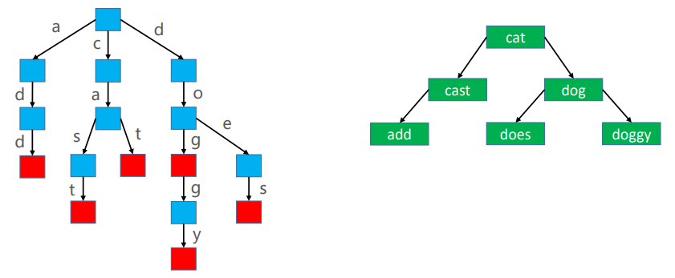
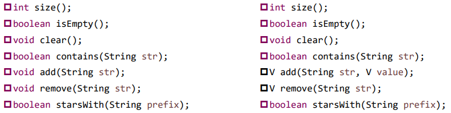

# Trie 字典树

## 引入

**需求**

如何判断一堆不重复的字符串是否以某个前缀开头？我们可以用Set或Map存储字符串，遍历所有字符串进行判断。时间复杂度为O(n)

有没有更优的数据结构实现前缀搜索？有！那就是Trie

**Trie理解**

Trie 也叫做字典树、前缀树（Prefix Tree）、单词查找树

Trie 搜索字符串的效率主要跟字符串的长度有关

假设使用 Trie 存储 cat、dog、doggy、does、cast、add 六个单词



## 接口设计

有两种接口形式，可以分别用Set和Map实现。Map可以做到在存储字符串的同时储存其对应的value（如人的姓名和其对应的电话号码）



## 实现

```java
/**
 * @Description 字典树
 * @Author monap
 * @Date 2022/1/6 21:19
 */
public class Trie<V> {
    private int size;
    private Node<V> root;

    private static class Node<V> {
        Node<V> parent;
        HashMap<Character, Node<V>> children;
        Character character;
        V value;
        boolean word; // 是否为单词

        public Node(Node<V> parent) {
            this.parent = parent;
        }
    }

    public int size() {
        return size;
    }

    public boolean isEmpty() {
        return size == 0;
    }

    public void clear() {
        size = 0;
        root = null;
    }

    public V get(String key) {
        Node<V> node = node(key);
        return node != null && node.word ? node.value : null;
    }

    public boolean contains(String key) {
        Node<V> node = node(key);
        return node != null && node.word;
    }

    public V add(String key, V value) {
        keyCheck(key);
        if (root == null) {
            root = new Node<>(null);
        }
        Node<V> node = root;
        int len = key.length();
        for (int i = 0; i < len; i++) {
            char c = key.charAt(i);
            boolean emptyChildren = node.children == null;
            Node<V> childNode = emptyChildren ? null : node.children.get(c);
            if (childNode == null) {
                childNode = new Node<>(node);
                childNode.character = c;
                node.children = emptyChildren ? new HashMap<>() : node.children;
                node.children.put(c, childNode);
            }
            node = childNode;
        }
        if (node.word) {
            V oldValue = node.value;
            node.value = value;
            return oldValue;
        }
        node.word = true;
        node.value = value;
        size++;
        return null;
    }

    public V remove(String key) {
        // 找到最后一个节点
        Node<V> node = node(key);
        // 如果不是单词结尾，不做任何处理
        if (node == null || !node.word) return null;
        size--;
        V oldValue = node.value;
        // 如果还有子节点
        if (node.children != null && !node.children.isEmpty()) {
            node.word = false;
            node.value = null;
            return oldValue;
        }
        // 如果没有子节点
        Node<V> parent;
        while ((parent = node.parent) != null) {
            parent.children.remove(node.character);
            if (parent.word || !parent.children.isEmpty()) break;
            node = parent;
        }
        return oldValue;
    }

    public boolean startWith(String prefix) {
        return node(prefix) != null;
    }

    private Node<V> node(String key) {
        keyCheck(key);
        Node<V> node = root;
        int len = key.length();
        for (int i = 0; i < len; i++) {
            if (node == null || node.children == null || node.children.isEmpty()) return null;
            char c = key.charAt(i);
            node = node.children.get(c);
        }
        return node;
    }

    private void keyCheck(String key) {
        if (key == null || key.length() == 0) {
            throw new IllegalArgumentException("key must not empty");
        }
    }
}
```

## 总结

Trie 的优点：搜索前缀的效率主要跟前缀的长度有关

Trie 的缺点：需要耗费大量的内存，因此还有待改进

更多Trie 相关的数据结构和算法

- Double-array Trie
- Suffix Tree
- Patricia Tree
- Crit-bit Tree
- AC自动机
