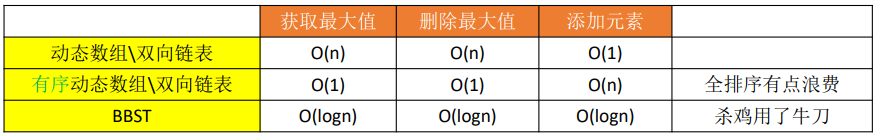
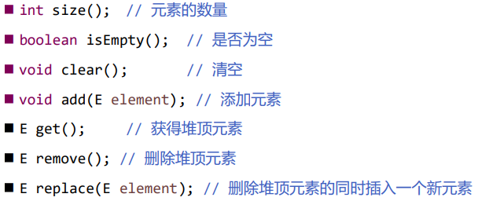
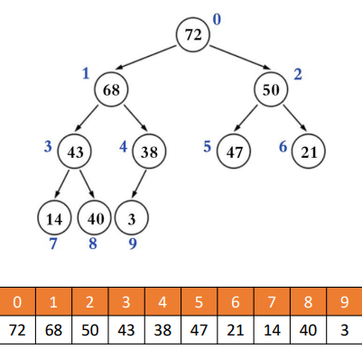
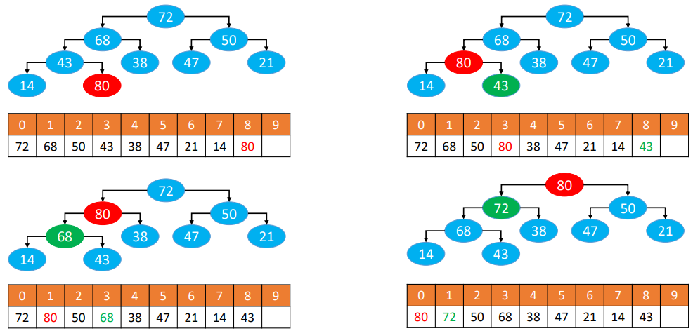
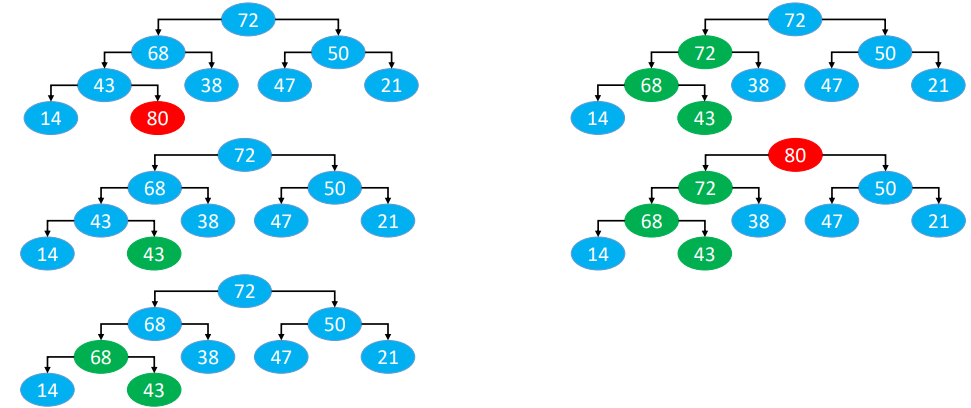
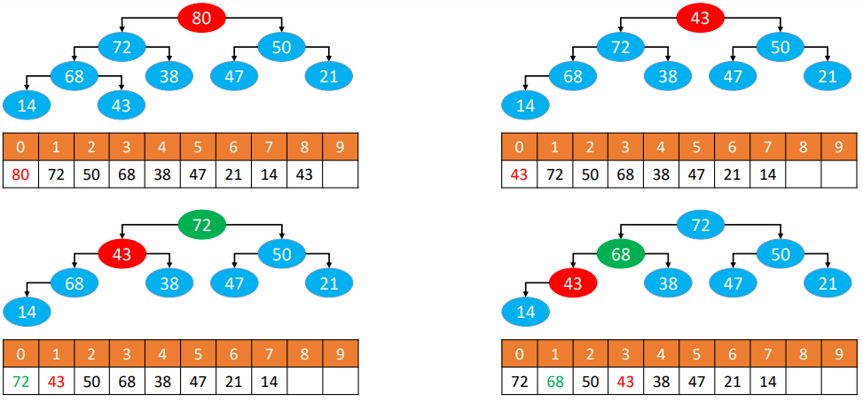
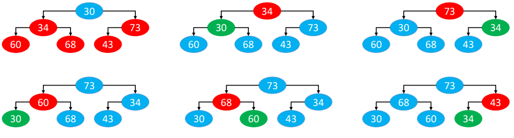
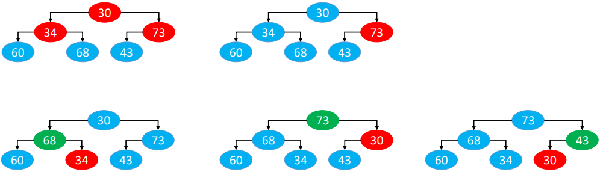
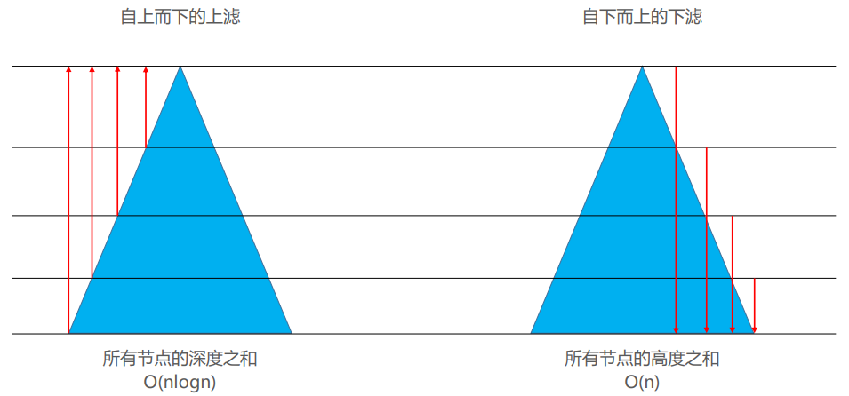

# 二叉堆

## 引入

设计一种数据结构，用来存放整数，要求提供 3 个接口

- 添加元素
- 获取最大值
- 删除最大值



有没有更优的数据结构？=> 堆 

- 获取最大值：O(1)
- 删除最大值：O(logn)
- 添加元素：O(logn)

**解决 Top K 问题**

什么是 Top K 问题? => 从海量数据中找出前 K 个数据，比如从 100 万个整数中找出最大的 100 个整数 

Top K 问题的解法之一：可以用数据结构“堆”来解决

## 堆理解

堆（Heap）也是一种树状的数据结构（不要跟内存模型中的“堆空间”混淆），常见的堆实现有

- 二叉堆（Binary Heap，完全二叉堆）
- 多叉堆（D-heap、D-ary Heap）
- 索引堆（Index Heap）
- 二项堆（Binomial Heap）
- 斐波那契堆（Fibonacci Heap）
- 左倾堆（Leftist Heap，左式堆）
- 斜堆（Skew Heap）

堆的一个重要性质：任意节点的值总是 <span style="color:red"> ≥（ ≤ ）子节点的值</span>

- 如果任意节点的值总是 <span style="color:red">≥ 子节点的值</span>，称为：<span style="color:skyblue">最大堆、大根堆、大顶堆</span>

- 如果任意节点的值总是 <span style="color:red">≤ 子节点的值</span>，称为：<span style="color:skyblue">最小堆、小根堆、小顶堆</span>

由此可见，堆中的元素必须具备可比较性（跟二叉搜索树一样）

## 堆基本接口设计



## 二叉堆理解

<span style="color:skyblue">二叉堆</span> 的逻辑结构就是一棵完全二叉树，所以也叫 <span style="color:skyblue">完全二叉堆</span>

鉴于完全二叉树的一些特性，二叉堆的底层（物理结构）一般用数组实现即可

索引 i 的规律（ n 是元素数量）

- 如果 i = 0 ，它是 <span style="color:red">根</span> 节点
- 如果 i > 0 ，它的 <span style="color:red">父</span> 节点的索引为 floor( (i – 1) / 2 ) 
- 如果 2i + 1 ≤ n – 1，它的 <span style="color:red">左</span>子节点的索引为 2i + 1
- 如果 2i + 1 > n – 1 ，它 <span style="color:red">无左</span>子节点
- 如果 2i + 2 ≤ n – 1 ，它的 <span style="color:red">右</span>子节点的索引为 2i + 2
- 如果 2i + 2 > n – 1 ，它 <span style="color:red">无右</span>子节点



## 最大堆-添加



循环执行以下操作（图中的 80 简称为 node）

- 如果 node ＞ 父节点    ==> 与父节点交换位置
- 如果 node ≤ 父节点，或者 node 没有父节点  ==> 退出循环

这个过程，叫做上滤（Sift Up）,时间复杂度为 O(logn)

**交换位置的优化**

一般交换位置需要3行代码，可以进一步优化 ==> 将新添加节点备份，确定最终位置才摆放上去

仅从交换位置的代码角度看，可以由大概的 3 * O(logn) 优化到 1 * O(logn) + 1



## 最大堆-删除



- 用最后一个节点覆盖根节点 

- 删除最后一个节点

- 循环执行以下操作（图中的 43 简称为 node） == 这个过程，叫做下滤（Sift Down），时间复杂度：O(logn) 
  - 如果 node < 最大的子节点 ==> 与最大的子节点交换位置
  - 如果 node ≥ 最大的子节点， 或者 node 没有子节点 ==> 退出循环

同样的，交换位置的操作可以像添加那样进行优化

## 最大堆–批量建堆 (Heapify)

批量建堆，有 2 种做法

- 自上而下的上滤
- 自下而上的下滤

**自上而下的上滤**



**自下而上的下滤**



**效率对比**



所有节点的深度之和

- 仅仅是叶子节点，就有近 n/2 个，而且每一个叶子节点的深度都是 O(logn) 级别的 
- 因此，在叶子节点这一块，就达到了 O(nlogn) 级别
- O(nlogn) 的时间复杂度足以利用排序算法对所有节点进行全排序

所有节点的高度之和 

- 假设是满树，节点总个数为 n，树高为 h，那么 n = 2^h − 1
- 所有节点的树高之和 

```shell
H(n) = 2^0 ∗ (h − 0) + 2^1 ∗ (h − 1) + 2^2 ∗ (h − 2) + ⋯ + 2^(h −1) ∗ [h − (h −1)]
     = h ∗ (2^0 + 2^1 + 2^2 + ⋯ + 2^(h −1) − [1 ∗ 2^1 + 2 ∗ 2^2 + 3 ∗ 2^3 + ⋯ + (h − 1) ∗ 2^(h−1)
     = h ∗ (2^h − 1) − [(h − 2) ∗ 2^h + 2]
     = h ∗ 2^h − h − h ∗ 2^h + 2 ^(h+1) − 2
     = 2^(h+1) − h − 2
     = 2 ∗ (2^h − 1) − h
     = 2n − h
     = 2n − log2(n + 1)
     = O(n)
```

**公式推导**

```shell
S(h) = 1 ∗ 2^1 + 2 ∗ 2^2 + 3 ∗ 2^3 + ⋯ + (h − 2) ∗ 2^(h−2) + (h − 1) ∗ 2^(h−1)

2S(h) = 1 ∗ 2^2 + 2 ∗ 2^3 + 3 ∗ 2^4 + ⋯ + (h − 2) ∗ 2^(h−1) + (h − 1)  ∗ 2^h

S(h) – 2S(h) = [2^1 + 2^2 + 2^3 + ⋯ + 2^(h−1)] − (h − 1)  ∗ 2^h 
             = (2^h − 2) −  (h − 1) ∗ 2^h

S(h) = (h − 1) ∗ 2^h − (2^h − 2) 
     = (h − 2) ∗ 2^h + 2
```

**疑惑**

以下方法可以批量建堆么

- 自上而下的下滤 
- 自下而上的上滤

上述方法不可行，为什么？ 

认真思考【自上而下的上滤】、【自下而上的下滤】的本质。自上而下的上滤的本质是添加，自下而上的下滤的本质是删除

## 构建小顶堆

只需要改变一下比较策略即可，比如值比较小的节点更大

```java
@Test
public void testMinHeap() {
    Integer[] data = {88, 44, 53, 41, 16, 6, 70, 18, 85, 98, 81, 23};
    BinaryHeap<Integer> heap = new BinaryHeap<>(data, new Comparator<Integer>() {
        @Override
        public int compare(Integer o1, Integer o2) {
            return o2 - o1;
        }
    });
    BinaryTrees.println(heap);
}
```

## 大顶堆实现

抽象父类

```java
/**
 * @Description 二叉堆
 * @Author monap
 * @Date 2022/1/5 23:17
 */
@SuppressWarnings("unchecked")
public abstract  class AbstractHeap<E> implements Heap<E> {
    protected int size;
    protected Comparator<E> comparator;

    public AbstractHeap(Comparator<E> comparator) {
        this.comparator = comparator;
    }

    public AbstractHeap() {
        this(null);
    }

    @Override
    public int size() {
        return size;
    }

    @Override
    public boolean isEmpty() {
        return size == 0;
    }

    protected int compare(E e1, E e2) {
        return comparator != null ? comparator.compare(e1, e2) : ((Comparable<E>) e1).compareTo(e2);
    }
}
```

具体类

```java
/**
 * @Description 二叉堆
 * @Author monap
 * @Date 2022/1/5 22:30
 */
@SuppressWarnings("unchecked")
public class BinaryHeap<E> extends AbstractHeap<E> implements BinaryTreeInfo {
    private E[] elements;
    private static final int DEFAULT_CAPACITY = 10;

    public BinaryHeap(E[] elements, Comparator<E> comparator) {
        super(comparator);
        if (elements == null || elements.length == 0) {
            this.elements = (E[]) new Object[DEFAULT_CAPACITY];
        } else {
            size = elements.length;
            int capacity = Math.max(elements.length, DEFAULT_CAPACITY);
            this.elements = (E[]) new Object[capacity];
            System.arraycopy(elements, 0, this.elements, 0, capacity);
            heapify();
        }
    }

    public BinaryHeap(E[] elements) {
        this(elements, null);
    }

    public BinaryHeap(Comparator<E> comparator) {
        this(null, comparator);
    }

    public BinaryHeap() {
        this(null, null);
    }

    /**
     * 批量建堆
     */
    private void heapify() {
        // 1.自上而下的上滤
//        for (int i = 0; i < size; i++) {
//            siftUp(i);
//        }

        // 2. 自下而上的下滤
        for (int i = (size >> 1) - 1; i >= 0; i--) {
            siftDown(i);
        }
    }

    @Override
    public void clear() {
        for (int i = 0; i < size; i++) {
            elements[i] = null;
        }
    }

    @Override
    public void add(E element) {
        elementNotNullCheck(element);
        ensureCapacity(size + 1);
        elements[size++] = element;
        siftUp(size - 1);
    }

    /**
     * 让index位置的元素上滤
     *
     * @param index index
     */
    private void siftUp(int index) {
        E e = elements[index];
        while (index > 0) {
            int pIndex = (index - 1) >> 1;
            E p = elements[pIndex];
            if (compare(e, p) <= 0) break;
            elements[index] = p;
            index = pIndex;
        }
        elements[index] = e;
    }

    @Override
    public E get() {
        emptyCheck();
        return elements[0];
    }

    /**
     * 删除堆顶元素
     **/
    @Override
    public E remove() {
        emptyCheck();
        int lastIndex = --size;
        E root = elements[0];
        elements[0] = elements[lastIndex];
        elements[lastIndex] = null;
        siftDown(0);
        return root;
    }

    private void siftDown(int index) {
        E element = elements[index];
        // 第一个叶子节点的索引即为非叶子节点的数量
        int half = size >> 1;
        // 必须保证index位置为非叶子节点
        while (index < half) {
            //index的节点有两种情况
            // 1.只有左子节点
            // 2.同时拥有左右节点
            // 默认为左子节点的索引跟它比较
            int childIndex = (index << 1) + 1;
            E child = elements[childIndex];
            // 右子节点
            int rightIndex = childIndex + 1;
            // 选出左右子节点中最大的那个
            if (rightIndex < size && compare(elements[rightIndex], child) > 0) {
                child = elements[childIndex = rightIndex];
            }
            if (compare(element, child) >= 0) break;
            //将子节点存放到index位置
            elements[index] = child;
            //重新设置index
            index = childIndex;
        }
        elements[index] = element;
    }

    /**
     * 删除堆顶元素的同时插入一个新元素
     *
     * @param element element
     * @return E
     */
    @Override
    public E replace(E element) {
        elementNotNullCheck(element);
        E root = null;
        if (size == 0) {
            elements[0] = element;
            size++;
        } else {
            root = elements[0];
            elements[0] = element;
            siftDown(0);
        }
        return root;
    }


    private void emptyCheck() {
        if (size == 0) {
            throw new IndexOutOfBoundsException("Heap is empty");
        }
    }

    private void ensureCapacity(int capacity) {
        int oldCapacity = elements.length;
        if (capacity < oldCapacity) return;
        int newCapacity = oldCapacity + (oldCapacity >> 1);//1.5倍
        E[] newElements = (E[]) new Object[newCapacity];
        System.arraycopy(elements, 0, newElements, 0, elements.length);
        elements = newElements;
        System.out.println("扩容：" + oldCapacity + "=>" + newCapacity);
    }

    private void elementNotNullCheck(E element) {
        if (element == null) {
            throw new IllegalArgumentException("element mush not be empty");
        }
    }

    @Override
    public Object root() {
        return 0;
    }

    @Override
    public Object left(Object node) {
        int index = ((int) node << 1) + 1;
        return index >= size ? null : index;
    }

    @Override
    public Object right(Object node) {
        int index = ((int) node << 1) + 2;
        return index >= size ? null : index;
    }

    @Override
    public Object string(Object node) {
        return elements[(int) node];
    }
}
```

## Top K 问题

从 n 个整数中，找出最大的前 k 个数（ k 远远小于 n ） 

如果使用排序算法进行全排序，需要 O(nlogn) 的时间复杂度

如果使用二叉堆来解决，可以使用 O(nlogk) 的时间复杂度来解决

- 新建一个小顶堆
- 扫描 n 个整数
  - 先将遍历到的前 k 个数放入堆中
  - 从第 k + 1 个数开始，如果大于堆顶元素，就使用 replace 操作（删除堆顶元素，将第 k + 1 个数添加到堆中）
- 扫描完毕后，堆中剩下的就是最大的前 k 个数

如果是找出最小的前 k 个数呢？

- 用大顶堆
- 如果小于堆顶元素，就使用 replace 操作

```java
/**
 * 找出下面数组中最大的5个数
 */
@Test
public void testTopK() {
    int k = 5;
    Integer[] data = {51, 30, 39, 92, 74, 25, 16, 93,
                      91, 19, 54, 47, 73, 62, 76, 63, 35, 18,
                      90, 6, 65, 49, 3, 26, 61, 48};
    BinaryHeap<Integer> heap = new BinaryHeap<>((o1, o2) -> o2 - o1);
    for (Integer datum : data) {
        if (heap.size() < k) {
            heap.add(datum);
        } else if (datum > heap.get()) {
            heap.replace(datum);
        }
    }
    BinaryTrees.println(heap);
}
//     ┌─76─┐
//     │    │
//  ┌─90─┐  93
//  │    │
// 92    91
```