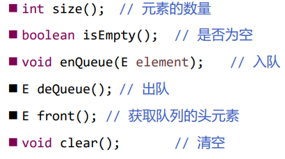

# 优先级队列

## 接口设计

优先级队列也是个队列，因此也是提供以下接口



普通的队列是 FIFO 原则，也就是先进先出

优先级队列则是按照优先级高低进行出队，比如将优先级最高的元素作为队头优先出队

## 应用场景

医院的夜间门诊

- 队列元素是病人
- 优先级是病情的严重情况、挂号时间

操作系统的多任务调度

- 队列元素是任务

- 优先级是任务类型

## 实现

根据优先队列的特点，很容易想到：可以直接利用二叉堆作为优先队列的底层实现

可以通过 Comparator 或 Comparable 去自定义优先级高低

```java
/**
 * @Description 优先级队列
 * @Author monap
 * @Date 2022/1/6 1:26
 */
public class PriorityQueue<E> {
    private BinaryHeap<E> heap;

    public PriorityQueue(Comparator<E> comparator) {
        heap = new BinaryHeap<>(comparator);
    }

    public PriorityQueue() {
        this(null);
    }

    //元素的数量
    public int size() {
        return heap.size();
    }

    // 判断队列是否为空
    public boolean isEmpty() {
        return heap.isEmpty();
    }

    // 入队
    public void enQueue(E element) {
        heap.add(element);
    }

    // 出队
    public E deQueue() {
        return heap.remove();
    }

    // 清空队列元素
    public void clear() {
        heap.clear();
    }

    // 获取优先级最高的元素
    public E front() {
        return heap.get();
    }
}
```
