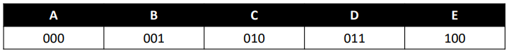
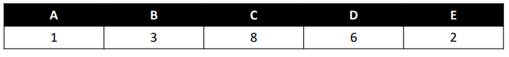
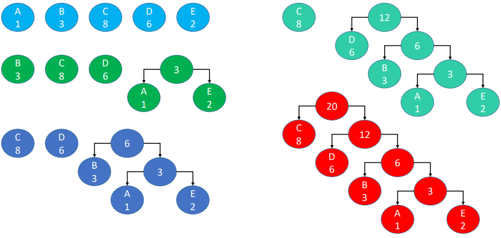
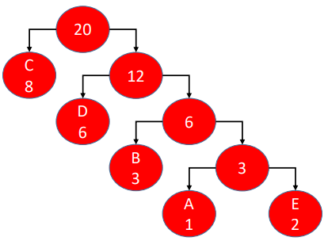
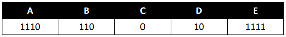

# 哈夫曼树

## 哈夫曼编码

哈夫曼编码，又称为霍夫曼编码（Huffman Coding），它是现代压缩算法的基础

假设要把字符串【ABBBCCCCCCCCDDDDDDEE】转成二进制编码进行传输

- 可以转成ASCII编码（65~69，1000001~1000101），但是有点冗长，如果希望编码更短呢？

- 可以先约定5个字母对应的二进制。对应的二进制编码：000001001001010010010010010010010010011011011011011011100100 ，一共20个字母，转成了60个二进制位

- 如果使用哈夫曼编码，可以压缩至41个二进制位，约为原来长度的68.3%

## 哈夫曼树

先计算出每个字母的出现频率（权值，这里直接用出现次数），【ABBBCCCCCCCCDDDDDDEE】

利用这些权值，构建一棵哈夫曼树（又称为霍夫曼树、最优二叉树）

如何构建一棵哈夫曼树？（假设有 n 个权值）

- 以权值作为根节点构建 n 棵二叉树，组成森林
- 在森林中选出 2 个根节点最小的树合并，作为一棵新树的左右子树，且新树的根节点为其左右子树根节点之和
- 从森林中删除刚才选取的 2 棵树，并将新树加入森
- 重复 2、3 步骤，直到森林只剩一棵树为止，该树即为哈夫曼树

## 构建哈夫曼树

## 构建哈夫曼编码

left为0，right为1，可以得出5个字母对应的哈夫曼编码

【ABBBCCCCCCCCDDDDDDEE】的哈夫曼编码是 1110110110110000000001010101010101111

总结

- n 个权值构建出来的哈夫曼树拥有 n 个叶子节点
- 每个哈夫曼编码都不是另一个哈夫曼编码的前缀
- 哈夫曼树是带权路径长度最短的树，权值较大的节点离根节点较近
- 带权路径长度：树中所有的叶子节点的权值乘上其到根节点的路径长度。与最终的哈夫曼编码总长度成正比关系。
