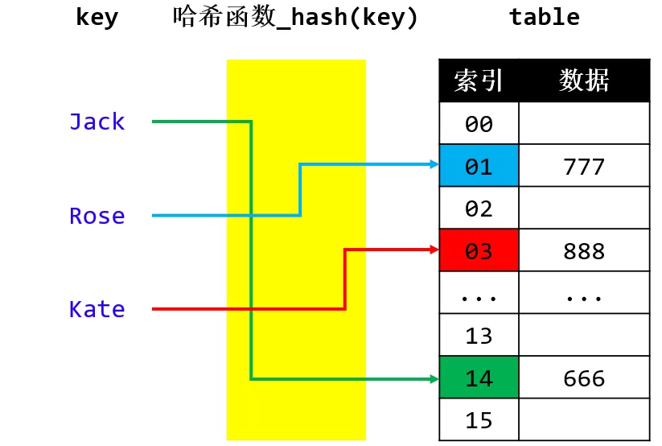
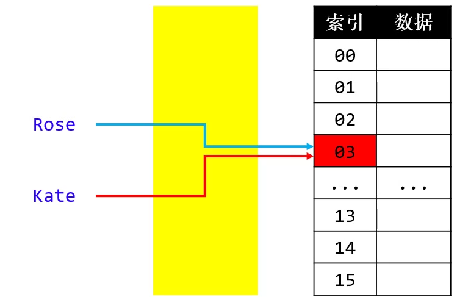
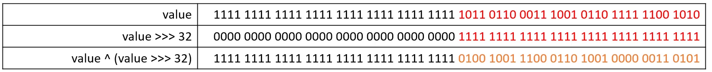
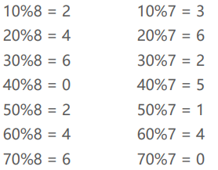
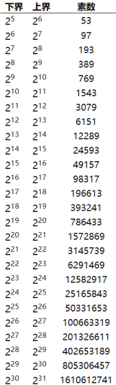
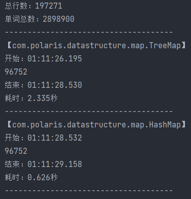
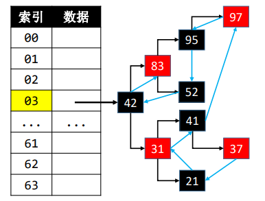
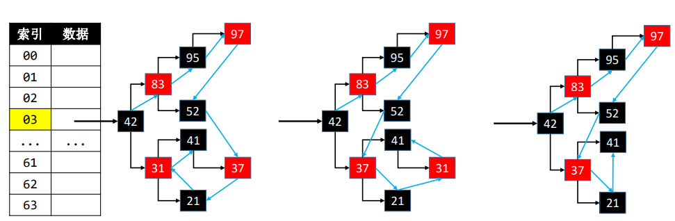

# 哈希表

## 理解

哈希表也叫做 `散列表`（ hash 有“剁碎”的意思）

它是如何实现高效处理数据的？

- put("Jack", 666); 

- put("Rose", 777); 

- put("Kate", 888);

添加、搜索、删除的流程都是类似的

- 利用哈希函数生成 key 对应的 index【O(1)】

- 根据 index 操作定位数组元素【O(1)】

哈希表是【空间换时间】的典型应用 

哈希函数，也叫做 `散列函数 `

哈希表内部的数组元素，很多地方也叫 Bucket（桶），整个数组叫 Buckets 或者 Bucket Array



> 注意：在实际应用中很多时候的需求：Map 中存储的元素不需要讲究顺序，Map 中的 Key 不需要具备可比较性。其实不考虑顺序、不考虑 Key 的可比较性，Map 有更好的实现方案，平均时间复杂度可以达到 O(1) ，那就是采取 `哈希表来实现 Map`

## 哈希冲突(Hash Collision)

哈希冲突也叫做 `哈希碰撞`

- 2 个不同的 key，经过哈希函数计算出相同的结果
- key1 ≠ key2 ，hash(key1) = hash(key2)



解决哈希冲突的常见方法

- `开放定址法（Open Addressing）`即按照一定规则向其他地址探测，直到遇到空桶 。

- `再哈希法（Re-Hashing）`即设计多个哈希函数

- `链地址法（Separate Chaining）` 即比如通过链表将同一index的元素串起来

JDK1.8的哈希冲突解决方案

- 默认使用 `单向链表` 将元素串起来（`链地址法`）
- 在添加元素时，可能会由 `单向链表` 转为 `红黑树` 来存储元素。比如当哈希表容量 ≥ 64 且 单向链表的节点数量大于 8 时
- 当 `红黑树` 节点数量少到一定程度时，又会转为 `单向链表 `
- JDK1.8中的哈希表是使用 `链表+红黑树解决哈希冲突`
- 思考一下这里为什么使用单链表？=> 每次都是从头节点开始遍历，单向链表比双向链表少一个指针，可以节省内存空间


## 哈希函数

哈希表中哈希函数的实现步骤大概如下：

- 先生成 `key 的哈希值`（必须是`整数`）

- 再让 `key 的哈希值` 跟 `数组的大小` 进行相关运算，生成一个 `索引值`

```java
public int hash(Object key) { 
    return hash_code(key) % table.length;
}
```

为了提高效率，可以使用 `&` 位运算取代 `%` 运算【前提：将数组的长度设计为 `2 的幂（2^n）`】

```java
public int hash(Object key) { 
    return hash_code(key) & (table.length - 1);
}
//     1 = 2^0 
//    10 = 2^1 
//   100 = 2^2 
//  1000 = 2^3 
// 10000 = 2^4 
// 01111 = 2^4 - 1 = 1111

// ==> table.length - 1 表示 & 一个全为1的二进制数。结果必然小与这个全为1的二进制数

// 假设哈希值为1001010 => 
//   1001010
// & 0001111
// ----------
//   0001010   => 生成的值的范围是 0000 ~ 1111
```

良好的哈希函数 能让哈希值更加均匀分布 → 减少哈希冲突次数 → 提升哈希表的性能

此外，hashCode相等，生成的索引不一定相等。

```shell
11000
 &111
------
  000
  
10000
 &111
------
  000 
```

## 如何生成key的哈希值

**key 的常见种类可能有**

- 整数、浮点数、字符串、自定义对象


- 不同种类的 key，哈希值的生成方式不一样，但目标是一致的


  - 尽量让每个 key 的哈希值是唯一的

  - 尽量让 key 的所有信息参与运算

在Java中，HashMap 的 key 必须实现 `hashCode`、`equals` 方法，也允许 key 为 null 

**整数**

整数值当做哈希值

比如 10 的哈希值就是 10

```java
public static int hashCode(int value) {
    return value;
}
```

**浮点数**

将存储的二进制格式转为整数值

```java
public static int hashCode(float value) {
    return Float.floatToIntBits(value);
}
```

**long** 

> 注意：Java的哈希值必须是 `int` 类型(32位)

```java
public static int hashCode(long value) {
    //如果强制转换为int会直接砍掉前面32位，不推荐
    return (int)(value ^ (value >>> 32));
}
// 注意：>>> 和 ^ 的作用是？（>>>是无符号右移，^是异或运算）
//  ① 高32bit 和 低32bit 混合计算出 32bit 的哈希值
//  ② 充分利用所有信息计算出哈希值
// 另外：为什么不用 & 或者 |而是用 ^ ？
//  ① 如果value前32位全为1，使用 & 运算后32位就相当于没算了。
// ② 如果value前32位全为1，使用 | 运算后32位就全为1了。
```



**double**

```java
public static int hashCode(double value) {
    long bits = doubleToLongBits(value);
    return (int)bits ^ (bits >>> 32);
}
```

**字符串**

先看一个问题：整数 5489 是如何计算出来的？

```shell
5 ∗ 10^3 + 4 ∗ 10^2 + 8 ∗ 10^1 + 9 ∗ 10^0 
```

字符串是由若干个字符组成的 

- 比如字符串 jack，由 j、a、c、k 四个字符组成（字符的本质就是一个整数，ASCII码）
- 因此，jack 的哈希值可以表示为 j ∗ n^3 + a ∗ n^2 + c ∗ n^1 + k ∗ n^0，等价于 [ ( j ∗ n + a ) ∗ n + c ] ∗ n + k    （等价后可以避免n的重复计算）
- 在JDK中，乘数 n 为 31，为什么使用 31？ => 31 是一个奇素数，JVM会将 **31 \* i** 自动优化转化为 **(i << 5) – i**

> 注意：
>
> ① 31 * i = （2^5 - 1) * i = i * 2^5 - i = (i << 5) - i
>
> ② 31不仅仅是符合2^n - 1,它也是一个奇素数(既是奇数，也是质数。即质数)
>
> =>素数和其他数相乘的结果比其他方式更容易产生唯一性，减少哈希冲突。

```java
@Test
public void StrHashTest() {
	String str = "jack";
	int len = str.length();
	int hashCode = 0;
	for(int i = 0;i < len;i++) {
		char c = str.charAt(i);
		//hashCode = (hashCode << 5) - hashCode + c;
		hashCode = hashCode * 31 + c;
		// [ ( j ∗ n + a ) ∗ n + c ] ∗ n + k
	}
	System.out.println(hashCode);//3254239
	System.out.println(str.hashCode());//3254239
}
```

**总结**

```java
@Test
public void hashTest() {
    int a = 110;
	float b = 10.6f;
	long c = 156l;
	double d = 10.9;
	String e = "rose";
		
	System.out.println(Integer.hashCode(a));
	System.out.println(Float.hashCode(b));
 	//System.out.println(Float.floatToIntBits(b)); //内部实现
	System.out.println(Long.hashCode(c));
	System.out.println(Double.hashCode(d));
	System.out.println(e.hashCode());
}
```

**自定义对象的哈希值**

自定义对象的hash值默认与该对象的内存地址有关。

> 注意：
>
> ① 哈希值太大，整型溢出怎么办？ => 不用作任何处理，溢出了还是一个整 数。
>
> ② 不重写hashCode方法有什么后果? => 会以对象内存地址相关的值作为hash值。

> 重点：
>
> ① hashCode方法在在计算索引时调用
>
> ② equals方法在hash冲突时比较两个key是否相等时调用
>
> ④ 如果要求两个对象的哪些成员变量相等就代表这两个对象相等的话，hashCode方法和equals方法就只包含这些成员变量的计算就可以了。(hashCode方法必须要保证 equals 为 true 的 2 个key的哈希值一样，反过来hashCode相等的key，不一定equals为true)

```java
public class HashTest {
	@Test
	public void PersonHashTest() {
		Person p1 = new Person(15,"rose",58.5f);
		Person p2 = new Person(15,"rose",58.5f);
		//System.out.println(p1.hashCode());//1834188994
		//System.out.println(p2.hashCode());//1174361318
		//=>自定义对象hash值默认与对象的地址值有关
		//√ 重写hashCode方法后：hash值相等意味着生成的索引相同
		System.out.println(p1.hashCode());//185317790
		System.out.println(p2.hashCode());//185317790
		
		Map<Object,Object> map = new HashMap<>();
		map.put(p1,"abc");
		map.put(p2,"bcd");//如果p1与p2"相等"，就会覆盖，此时size为1才合理。
		//=>此时需要重写equals方法比较两个key是否"相等"
		//√ 注意：不能通过hash值的比较来判断两个key"相等"，因为可能两个
		//       完全不同类型的key的hash值是相等的。
		System.out.println(map.size());//1
	}
}

class Person {
	private int age;
	private String name;
	private float height;

	public Person(int age, String name, float height) {
		super();
		this.age = age;
		this.name = name;
		this.height = height;
	}

	public Person() {
		super();
	}

	public int getAge() {
		return age;
	}

	public void setAge(int age) {
		this.age = age;
	}

	public String getName() {
		return name;
	}

	public void setName(String name) {
		this.name = name;
	}

	public float getHeight() {
		return height;
	}

	public void setHeight(float height) {
		this.height = height;
	}

	@Override
	public String toString() {
		return "Person [age=" + age + ", name=" 
				+ name + ", height=" + height + "]";
	}
	
	/**
	 * 用来计算当前对象的hash值
	 */
	@Override
	public int hashCode() {
		//Integer.hashCode(age);
		//Float.hashCode(height);
		//name != null ? name.hashCode() : 0;
		int hashCode = Integer.hashCode(age);
		hashCode = hashCode * 31 + Float.hashCode(height);
		hashCode = hashCode * 31 + 
				(name != null ? name.hashCode() : 0);
		return hashCode;
	}

	/**
	 * 	用来比较两个对象是否相等
	 */
	@Override
	public boolean equals(Object obj) {
		if(this == obj) return true;
		//if(obj == null || obj instanceof Person) return false;
		if(obj == null || obj.getClass() != getClass()) return false;
		Person p = (Person)obj;
		return p.age == age 
			&& p.height == height
			&& p.name == null ? name == null : p.name.equals(name);
	}
}
```

## HashMap实现

这里有如下设计

- 直接使用红黑树解决hash冲突
- 数组元素存储红黑树根节点，而不是存储红黑树对象。这样做的好处是就不用额外存储红黑树的size，comparator属性了（用不上）。

```java
/**
 * @Description hashMap, hash冲突直接使用红黑树解决
 * @Author monap
 * @Date 2022/1/2 15:53
 */
@SuppressWarnings("unchecked")
public class HashMap<K, V> implements Map<K, V> {
    // 所有节点的数量
    private int size;
    private static final boolean RED = false;
    private static final boolean BLACK = true;
    private Node<K, V>[] table;
    private static final int DEFAULT_CAPACTIY = 1 << 4; // 默认容量
    private static final float DEFAULT_LOAD_FACTOR = 0.75f; // 装填因子

    protected static class Node<K, V> {
        int keyHash;
        K key;
        V value;
        boolean color = RED;
        Node<K, V> left; // 左子节点
        Node<K, V> right; // 右子节点
        Node<K, V> parent; // 父节点

        public Node(K key, V value, Node<K, V> parent) {
            this.key = key;
            int hash = key == null ? 0 : key.hashCode();
            this.keyHash = hash ^ (hash >>> 16); // 扰动计算一次，使hash值排布更均匀
            this.value = value;
            this.parent = parent;
        }

        public boolean isLeaf() {
            return left == null && right == null;
        }

        public boolean hasTwoChildren() {
            return left != null && right != null;
        }

        public boolean isLeftChild() {
            return parent != null && this == parent.left;
        }

        public boolean isRightChild() {
            return parent != null && this == parent.right;
        }

        public Node<K, V> getSibling() {
            if (isLeftChild()) {
                return parent.right;
            }
            if (isRightChild()) {
                return parent.left;
            }
            return null;
        }

        @Override
        public String toString() {
            return "Node_" + key + "_" + value;
        }
    }

    protected Node<K, V> createNode(K key, V value, Node<K, V> parent) {
        return new Node<>(key, value, parent);
    }

    /**
     * 获取key的hash值，并做一次扰动计算
     *
     * @param key
     * @return
     */
    private int hash(K key) {
        if (key == null) return 0;
        int hash = key.hashCode();
        return hash ^ (hash >>> 16);
    }

    /**
     * 根据key生成索引(在桶数组中的位置)
     *
     * @param key
     * @return
     */
    private int index(K key) {
        return hash(key) & (table.length - 1);
    }

    /**
     * 根据node获取索引(在桶数组中的位置)
     *
     * @param node
     * @return
     */
    private int index(Node<K, V> node) {
        return node.keyHash & (table.length - 1);
    }

    public HashMap() {
        table = new Node[DEFAULT_CAPACTIY];
    }

    @Override
    public int size() {
        return size;
    }

    @Override
    public boolean isEmpty() {
        return size == 0;
    }

    @Override
    public void clear() {
        if (size == 0) return;
        size = 0;
        Arrays.fill(table, null);
    }

    @Override
    public V put(K key, V value) {
        // 检查是否需要扩容
        resize();
        int index = index(key);
        // 取出index位置的红黑树根节点
        Node<K, V> root = table[index];
        if (root == null) {
            root = createNode(key, value, null);
            table[index] = root;
            size++;
            afterPut(root);
            return null;
        }
        // hash冲突，添加新节点到红黑树
        // 1.找到待添加位置的父节点
        Node<K, V> parent = root;
        Node<K, V> node = root;
        int cmp = 0;
        K k1 = key;
        int h1 = hash(k1);
        Node<K, V> result = null;
        boolean searched = false;//是否已经搜索过这个key
        do {
            parent = node;
            K k2 = node.key;
            int h2 = node.keyHash;
            // 增加规则，先比较hash值,提高效率
            if (h1 > h2) {
                cmp = 1;
            } else if (h1 < h2) {
                cmp = -1;
            } else if (Objects.equals(k1, k2)) {
                cmp = 0;
            } else if (k1 != null && k2 != null
                    && k1.getClass() == k2.getClass()
                    && k1 instanceof Comparable
                    && (cmp = ((Comparable) k1).compareTo(k2)) != 0) { // 再次增加一条规则，提高效率
            } else if (searched) { // 已经扫描过了
                cmp = System.identityHashCode(k1) - System.identityHashCode(k2); // 最后增加一条规则，方便调试，但是不会增加效率
            } else { //未扫描，根据内存地址大小决定左右
                if ((node.left != null && (result = node(node.left, k1)) != null)
                        || (node.right != null && (result = node(node.right, k1)) != null)) {
                    //已经存在这个key
                    node = result;
                    cmp = 0;
                } else { // 不存在这个key
                    searched = true;
                    cmp = System.identityHashCode(k1) - System.identityHashCode(k2);
                }
            }
            if (cmp > 0) {
                node = node.right;
            } else if (cmp < 0) {
                node = node.left;
            } else {
                V oldValue = node.value;
                node.key = key;//一般覆盖（不同对象可能有相同的比较参数）
                node.value = value;
                return oldValue;
            }
        } while (node != null);
        // 2.判断插入父节点的左子节点还是右子节点
        Node<K, V> newNode = createNode(key, value, parent);
        if (cmp > 0) {
            parent.right = newNode;
        } else {
            parent.left = newNode;
        }
        size++;
        afterPut(newNode);//新添加节点之后的处理
        return null;
    }

    /**
     * 桶数组扩容
     */
    private void resize() {
        if (size / table.length <= DEFAULT_LOAD_FACTOR) return;
        // 扩容
        Node<K, V>[] oldTable = table;
        table = new Node[table.length << 1];
        // 分析：
        //   当扩容为原来的两倍时，节点的索引有2种情况
        //   1. 保持不变
        //   2. index = index + 旧容量
        // 层序遍历每个节点开始挪动
        Queue<Node<K, V>> queue = new LinkedList<>();
        for (Node<K, V> kvNode : oldTable) {
            if (kvNode == null) continue;
            queue.offer(kvNode);
            while (!queue.isEmpty()) {
                Node<K, V> node = queue.poll();
                if (node.left != null) {
                    queue.offer(node.left);
                }
                if (node.right != null) {
                    queue.offer(node.right);
                }
                moveNode(node);
            }
        }
    }

    private void moveNode(Node<K, V> newNode) {
        // 重置node
        newNode.parent = null;
        newNode.left = null;
        newNode.right = null;
        newNode.color = RED;
        int index = index(newNode);
        // 取出index位置的红黑树根节点
        Node<K, V> root = table[index];
        if (root == null) {
            root = newNode;
            table[index] = root;
            afterPut(root);
            return;
        }

        // hash冲突，添加新节点到红黑树
        // 1.找到待添加位置的父节点
        Node<K, V> parent = root;
        Node<K, V> node = root;
        int cmp = 0;
        K k1 = newNode.key;
        int h1 = newNode.keyHash;
        do {
            parent = node;
            K k2 = node.key;
            int h2 = node.keyHash;
            // 增加规则，先比较hash值,提高效率
            if (h1 > h2) {
                cmp = 1;
            } else if (h1 < h2) {
                cmp = -1;
            } else if (k1 != null && k2 != null
                    && k1.getClass() == k2.getClass()
                    && k1 instanceof Comparable
                    && (cmp = ((Comparable) k1).compareTo(k2)) != 0) { // 再次增加一条规则，提高效率
            } else {
                cmp = System.identityHashCode(k1) - System.identityHashCode(k2);
            }
            if (cmp > 0) {
                node = node.right;
            } else if (cmp < 0) {
                node = node.left;
            }
        } while (node != null);
        // 2.判断插入父节点的左子节点还是右子节点
        newNode.parent = parent;
        if (cmp > 0) {
            parent.right = newNode;
        } else {
            parent.left = newNode;
        }
        afterPut(newNode);//新添加节点之后的处理
    }

    private void afterPut(Node<K, V> node) {
        Node<K, V> parent = node.parent;
        //添加的是根节点 或 上溢到根节点
        if (parent == null) {
            black(node);
            return;
        }
        //类型一：parent是黑色（不用处理四种情况）
        if (isBlack(parent)) return;
        //类型二：parent是红色且uncle是红色（会上溢的四种情况）
        Node<K, V> uncle = parent.getSibling();
        Node<K, V> grand = red(parent.parent);//以下情况都需要将grand染成红色，可以统一处理
        if (isRed(uncle)) {
            black(parent);
            black(uncle);
            //把祖父节点当作是新添加的节点
            afterPut(grand);//上溢递归调用
            return;
        }
        //类型三：parent是红色且uncle不是红色（需要旋转的四种情况）
        if (parent.isLeftChild()) {//L
            if (node.isLeftChild()) { //LL
                black(parent);
            } else { //LR
                black(node);
                rotateLeft(parent);
            }
            rotateRight(grand);
        } else { //R
            if (node.isLeftChild()) { //RL
                black(node);
                rotateRight(parent);
            } else { //RR
                black(parent);
            }
            rotateLeft(grand);
        }
    }

    /**
     * 给节点上色
     */
    private Node<K, V> color(Node<K, V> node, boolean color) {
        if (node == null) return node;
        node.color = color;
        return node;
    }

    /**
     * 将节点染成红色
     */
    private Node<K, V> red(Node<K, V> node) {
        return color(node, RED);
    }

    /**
     * 将节点染成黑色
     */
    private Node<K, V> black(Node<K, V> node) {
        return color(node, BLACK);
    }

    /**
     * 获取当前节点的颜色
     */
    private boolean colorOf(Node<K, V> node) {
        return node == null ? BLACK : node.color;
    }

    /**
     * 判断当前颜色是否为黑色
     */
    private boolean isBlack(Node<K, V> node) {
        return colorOf(node) == BLACK;
    }

    /**
     * 判断当前颜色是否为红色
     */
    private boolean isRed(Node<K, V> node) {
        return colorOf(node) == RED;
    }

    /**
     * 左旋转，以RR为例
     */
    private void rotateLeft(Node<K, V> grand) {
        Node<K, V> parent = grand.right;
        Node<K, V> child = parent.left;//child就是T1子树
        grand.right = child;
        parent.left = grand;

        afterRotate(grand, parent, child);
    }

    /**
     * 右旋转，以LL为例
     */
    private void rotateRight(Node<K, V> grand) {
        Node<K, V> parent = grand.left;
        Node<K, V> child = parent.right;
        grand.left = child;
        parent.right = grand;

        afterRotate(grand, parent, child);
    }

    /**
     * 抽取左旋转和右旋转中的重复代码
     */
    private void afterRotate(Node<K, V> grand, Node<K, V> parent, Node<K, V> child) {
        //更新parent的parent（让parent成为子树的根节点）
        parent.parent = grand.parent;
        if (grand.isLeftChild()) {
            grand.parent.left = parent;
        } else if (grand.isRightChild()) {
            grand.parent.right = parent;
        } else { //grand是root节点
            table[index(grand)] = parent;
        }
        //更新child的parent
        if (child != null) {
            child.parent = grand;
        }
        //更新grand的parent
        grand.parent = parent;
    }

    @Override
    public V get(K key) {
        Node<K, V> node = node(key);
        return node != null ? node.value : null;
    }

    private Node<K, V> node(K key) {
        Node<K, V> root = table[index(key)];
        return root == null ? null : node(root, key);
    }

    private Node<K, V> node(Node<K, V> node, K k1) {
        int h1 = hash(k1);
        // 储存查找结果
        Node<K, V> result = null;
        int cmp = 0;
        while (node != null) {
            K k2 = node.key;
            int h2 = node.keyHash;
            // 增加规则，先比较hash值,提高效率
            if (h1 > h2) {
                node = node.right;
            } else if (h1 < h2) {
                node = node.left;
            } else if (Objects.equals(k1, k2)) {
                return node;
            } else if (k1 != null && k2 != null
                    && k1.getClass() == k2.getClass()
                    && k1 instanceof Comparable
                    && (cmp = ((Comparable) k1).compareTo(k2)) != 0) { // 再次增加一条规则，提高效率
                node = cmp > 0 ? node.right : node.left;
            } else if (node.right != null && (result = node(node.right, k1)) != null) { // 哈希值相等，不具备可比较性,也不equals
                return result;
            } else { //只能往左边扫
                node = node.left;
            }
        }
        return null;
    }

    @Override
    public V remove(K key) {
        return remove(node(key));
    }

    protected V remove(Node<K, V> node) {
        if (node == null) return null;
        Node<K, V> willNode = node;
        size--;
        V oldValue = node.value;
        //考虑度为2的节点，转化为度为1
        if (node.hasTwoChildren()) {
            Node<K, V> s = successor(node);//后继节点
            //用后继节点的值覆盖度为2的节点的值
            node.key = s.key;
            node.value = s.value;
            node.keyHash = s.keyHash;
            //删除后继节点
            node = s;
        }
        //删除node节点（能到这则说明node的度必为0或1）
        Node<K, V> replacement = node.left != null ? node.left : node.right;
        int index = index(node);
        if (replacement != null) { //node是度为1的节点
            //更改parent
            replacement.parent = node.parent;
            //更改parent的left，right指向
            if (node.parent == null) { //node是度为1的节点也是根节点
                table[index] = replacement;
            } else if (node == node.parent.left) {
                node.parent.left = replacement;
            } else { //在右边
                node.parent.right = replacement;
            }
            //此时开始恢复平衡(AVL树 或 RB树需要实现此方法)
            afterRemove(node, replacement);
        } else if (node.parent == null) { //node是叶子节点也是根节点
            table[index] = null;
            afterRemove(node, null);
        } else { //node是叶子节点但不是根节点
            if (node == node.parent.left) {
                node.parent.left = null;
            } else {
                node.parent.right = null;
            }
            //此时开始恢复平衡(AVL树 或RB树 需要实现此方法)
            afterRemove(node, null);
        }
        // 交给子类去处理
        subclassAfterRemove(willNode, node);
        return oldValue;
    }

    protected void subclassAfterRemove(Node<K, V> willNode, Node<K, V> removedNode) {}

    /**
     * 实现删除节点后的处理操作
     */
    private void afterRemove(Node<K, V> node, Node<K, V> replacement) {
        //情况一：如果删除的节点是红色，不用处理
        if (isRed(node)) return;
        //情况二：用于取代node子节点的是红色节点
        if (isRed(replacement)) {
            black(replacement);
            return;
        }
        //情况三：删除的是黑色叶子节点（下溢）
        Node<K, V> parent = node.parent;
        //删除的是根节点
        if (parent == null) return;
        //判断被删除的node的节点是左还是右
        boolean left = parent.left == null || node.isLeftChild();
        Node<K, V> sibling = left ? parent.right : parent.left;
        if (left) { //被删除的节点在左边，兄弟节点在右边(镜像对称处理)
            if (isRed(sibling)) { //兄弟节点是红色，就要转成黑色
                black(sibling);
                red(parent);
                rotateLeft(parent);
                //更换兄弟
                sibling = parent.right;
            }
            //兄弟节点必然是黑色
            if (isBlack(sibling.left) && isBlack(sibling.right)) {
                //兄弟节点没有一个红色子节点，父节点要向下向子节点合并
                boolean parentBlack = isBlack(parent);
                black(parent);
                red(sibling);
                if (parentBlack) {
                    afterRemove(parent, null);
                }
            } else { //兄弟节点至少有 1 个红色节点,就要向兄弟节点借元素
                if (isBlack(sibling.right)) {
                    //兄弟节点的右边不是红色，则兄弟要先旋转
                    rotateRight(sibling);
                    sibling = parent.right;
                }
                color(sibling, colorOf(parent));
                black(sibling.right);
                black(parent);
                rotateLeft(parent);
            }
        } else { //被删除的节点在右边，兄弟节点在左边（图示的是这种）
            if (isRed(sibling)) { //兄弟节点是红色，就要转成黑色
                black(sibling);
                red(parent);
                rotateRight(parent);
                //更换兄弟
                sibling = parent.left;
            }
            //兄弟节点必然是黑色
            if (isBlack(sibling.left) && isBlack(sibling.right)) {
                //兄弟节点没有一个红色子节点，父节点要向下向子节点合并
                boolean parentBlack = isBlack(parent);
                black(parent);
                red(sibling);
                if (parentBlack) {
                    afterRemove(parent, null);
                }
            } else { //兄弟节点至少有 1 个红色节点,就要向兄弟节点借元素
                if (isBlack(sibling.left)) {
                    //兄弟节点的左边不是红色，则兄弟要先旋转
                    rotateLeft(sibling);
                    sibling = parent.left;
                }
                color(sibling, colorOf(parent));
                black(sibling.left);
                black(parent);
                rotateRight(parent);
            }
        }
    }

    /**
     * 利用中序遍历求某个节点的后继节点
     */
    private Node<K, V> successor(Node<K, V> node) {
        if (node == null) return null;
        //前驱节点在右子树中：node.right.left.left...
        Node<K, V> p = node.right;
        if (p != null) {
            while (p.left != null) {
                p = p.left;
            }
            return p;
        }
        //从祖父节点中寻找前驱节点
        while (node.parent != null && node == node.parent.right) {
            node = node.parent;
        }
        //情况一：node.parent == null ↓
        //情况二：node == node.parent.left ↓
        return node.parent;
    }


    @Override
    public boolean containsKey(K key) {
        return node(key) != null;
    }

    /**
     * 遍历每一个节点的value，红黑树使用层序遍历
     *
     * @param value 每一个节点的value
     * @return bool
     */
    @Override
    public boolean containsValue(V value) {
        if (size == 0) return false;
        Queue<Node<K, V>> queue = new LinkedList<>();
        for (Node<K, V> kvNode : table) {
            if (kvNode == null) continue;
            queue.offer(kvNode);
            while (!queue.isEmpty()) {
                Node<K, V> node = queue.poll();
                if (Objects.equals(value, node.value)) return true;
                if (node.left != null) {
                    queue.offer(node.left);
                }
                if (node.right != null) {
                    queue.offer(node.right);
                }
            }
        }
        return false;
    }

    @Override
    public void traversal(Visitor<K, V> visitor) {
        if (size == 0 || visitor == null) return;
        Queue<Node<K, V>> queue = new LinkedList<>();
        for (Node<K, V> kvNode : table) {
            if (kvNode == null) continue;
            queue.offer(kvNode);
            while (!queue.isEmpty()) {
                Node<K, V> node = queue.poll();
                if (visitor.visit(node.key, node.value)) return;
                if (node.left != null) {
                    queue.offer(node.left);
                }
                if (node.right != null) {
                    queue.offer(node.right);
                }
            }
        }
    }

    public void print() {
        if (size == 0) return;
        for (final Node<K, V> root : table) {
            BinaryTrees.println(new BinaryTreeInfo() {
                @Override
                public Object root() {
                    return root;
                }

                @Override
                public Object left(Object node) {
                    return ((Node<K, V>) node).left;
                }

                @Override
                public Object right(Object node) {
                    return ((Node<K, V>) node).right;
                }

                @Override
                public Object string(Object node) {
                    return node;
                }
            });
        }
    }
}
```

## 哈希值的进一步处理：扰动计算

在上面的hashmap实现中，生成hash值时为什么还要再次高低16位做与运算？

==> 扰动计算，能使hash排布更加均匀！

```java
private int hash(K key) {
    if (key == null) return 0;
    int h = key.hashCode();
    return (h ^ (h >>> 16)) & (table.length - 1);
}
```

## 装填因子

在上面的hashmap实现中，在扩容时用到了 装填因子 ！

 装填因子（Load Factor）：节点总数量 / 哈希表桶数组长度，也叫做负载因子 

在JDK1.8的HashMap中，如果装填因子超过0.75，就扩容为原来的2倍

## 关于使用%来计算索引

如果使用%来计算索引

- 建议把哈希表的长度设计为素数（质数）,可以大大减小哈希冲突



下边表格列出了不同数据规模对应的最佳素数，特点如下

- 每个素数略小于前一个素数的2倍
- 每个素数尽可能接近2的幂（2^n）



## TreeMap VS HashMap

###1 性能对比



###2 选择时机

何时选择 TreeMap？ => 元素具备可比较性且要求升序遍历（按照元素从小到大） 

何时选择 HashMap？=> 无序遍历

## LinkedHashMap

### 理解

在HashMap的基础上维护元素的添加顺序，使得遍历的结果是遵从添加顺序的

假设添加顺序是：37、21、31、41、97、95、52、42、83



### LinkedHashMap实现

```java
/**
 * @Description LinkedHashMap, 采取双向链表，提高效率
 * @Author monap
 * @Date 2022/1/2 15:53
 */
@SuppressWarnings("unchecked")
public class LinkedHashMap<K, V> extends HashMap<K, V> {
    private LinkedHashNode<K, V> first;
    private LinkedHashNode<K, V> last;

    private static class LinkedHashNode<K, V> extends Node<K, V> {
        LinkedHashNode<K, V> prev;
        LinkedHashNode<K, V> next;

        public LinkedHashNode(K key, V value, Node<K, V> parent) {
            super(key, value, parent);
        }
    }

    @Override
    protected Node<K, V> createNode(K key, V value, Node<K, V> parent) {
        LinkedHashNode<K, V> node = new LinkedHashNode<>(key, value, parent);
        if (first == null) {
            first = last = node;
        } else {
            last.next = node;
            node.prev = last;
            last = node;
        }
        return node;
    }

    @Override
    public void clear() {
        super.clear();
        first = null;
        last = null;
    }

    @Override
    protected void subclassAfterRemove(Node<K, V> willNode,Node<K, V> removedNode) {
        LinkedHashNode<K, V> node1 = (LinkedHashNode<K, V>) willNode;
        LinkedHashNode<K, V> node2 = (LinkedHashNode<K, V>) removedNode;
        if(node1 != node2) {
            // 交换linkedHashWillNode和linkedHashRemovedNode在链表中的位置
            // 交换prev
            LinkedHashNode<K,V> tmp = node1.prev;
            node1.prev = node2.prev;
            node2.prev = tmp;
            if(node1.prev == null) {
                first = node1;
            } else {
                node1.prev.next = node1;
            }
            if(node2.prev == null) {
                first = node2;
            } else {
                node2.prev.next = node2;
            }
            //交换last
            tmp = node1.next;
            node1.next = node2.next;
            node2.next = tmp;
            if(node1.next == null) {
                last = node1;
            } else {
                node1.next.prev = node1;
            }
            if(node2.next == null) {
                last = node2;
            } else {
                node2.next.prev = node2;
            }
        }

        LinkedHashNode<K, V> prev = node2.prev;
        LinkedHashNode<K, V> next = node2.next;
        if (prev == null) {
            first = next;
        } else {
            prev.next = next;
        }
        if (next == null) {
            last = prev;
        } else {
            next.prev = prev;
        }
    }

    @Override
    public boolean containsValue(V value) {
        LinkedHashNode<K, V> node = first;
        while (node != null) {
            if (Objects.equals(value,node.value)) return true;
            node = node.next;
        }
        return false;
    }

    @Override
    public void traversal(Visitor<K, V> visitor) {
        if (visitor == null) return;
        LinkedHashNode<K, V> node = first;
        while (node != null) {
            if (visitor.visit(node.key, node.value)) return;
            node = node.next;
        }
    }
}
```

> 注意：链表是跨红黑树的！

### 删除的注意点

删除度为2的节点node时（比如删除31)，需要注意更换 node 与 前驱\后继节点 的连接位置



### 更换节点的连接位置


交换prev

```java
LinkedNode<K,V> tmp = node1.prev;
node1.prev = node2.prev;
node2.prev = tmp;
if (node1.prev != null) {
    node1.prev.next = node1;
} else {
    first = node1;
}

if (node2.prev != null) {
	node2.prev.next = node2;
} else {
    first = node2;
}
```

交换next

```java
tmp = node.next;
node1.next = node2.next;
node2.next = tmp;
if (node1.next != null) {
    node1.next.prev = node1;
} else {
    last = node1;
}

if (node2.next != null) {
	node2.next.prev = node2;
} else {
    last = node2;
}
```

## HashSet

```java
/**
 * @Description TODO
 * @Author monap
 * @Date 2022/1/3 2:25
 */
public class HashSet<E> implements Set<E> {
    private HashMap<E,Object> map = new HashMap<>();

    @Override
    public int size() {
        return map.size();
    }

    @Override
    public boolean isEmpty() {
        return map.isEmpty();
    }

    @Override
    public void clear() {
        map.clear();
    }

    @Override
    public boolean contains(E element) {
        return map.containsKey(element);
    }

    @Override
    public void add(E element) {
        map.put(element,null);
    }

    @Override
    public void remove(E element) {
        map.remove(element);
    }

    @Override
    public void traversal(Visitor<E> visitor) {
        map.traversal(new Map.Visitor<E,Object>() {
            @Override
            public boolean visit(E key, Object value) {
                return visitor.visit(key);
            }
        });
    }
}
```

## LinkedHashSet

```java
/**
 * @Description TODO
 * @Author monap
 * @Date 2022/1/3 2:25
 */
public class LinkedHashSet<E> implements Set<E> {
    private LinkedHashMap<E,Object> map = new LinkedHashMap<>();

    @Override
    public int size() {
        return map.size();
    }

    @Override
    public boolean isEmpty() {
        return map.isEmpty();
    }

    @Override
    public void clear() {
        map.clear();
    }

    @Override
    public boolean contains(E element) {
        return map.containsKey(element);
    }

    @Override
    public void add(E element) {
        map.put(element,null);
    }

    @Override
    public void remove(E element) {
        map.remove(element);
    }

    @Override
    public void traversal(Visitor<E> visitor) {
        map.traversal(new Map.Visitor<E,Object>() {
            @Override
            public boolean visit(E key, Object value) {
                return visitor.visit(key);
            }
        });
    }
}
```