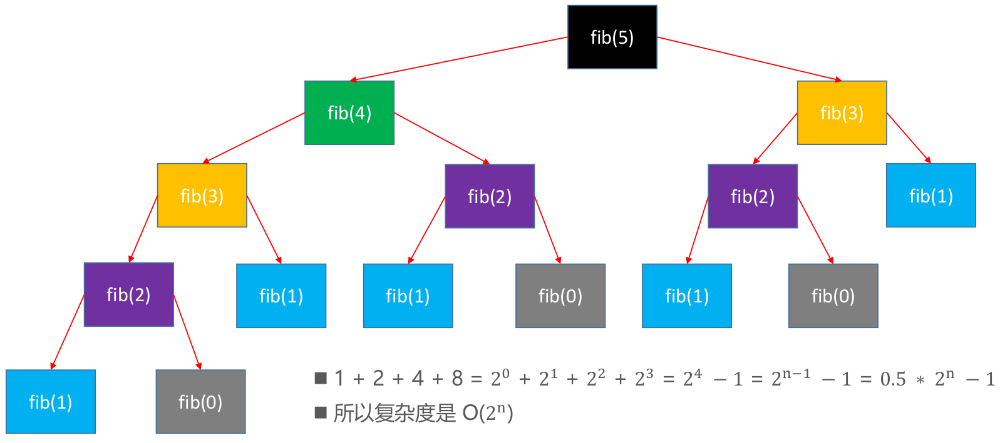
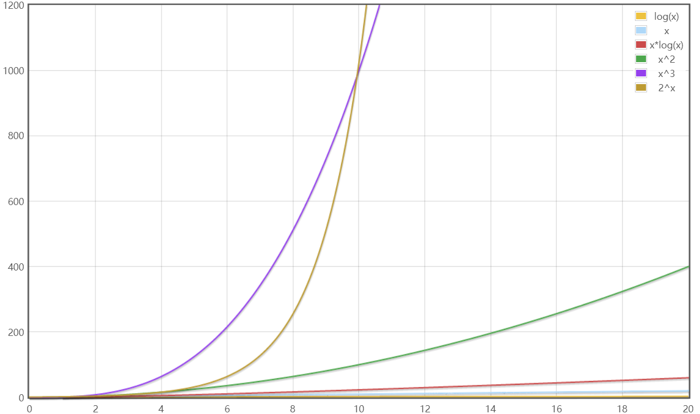

# 复杂度

## 算法的效率问题

使用不同算法，解决同一个问题，效率可能相差非常大

### 求第n个斐波拉契数

- 斐波那契数列的排列是：0，1，1，2，3，5，8，13，21，34，55，89，144...

- 它后一个数等于前面两个数的和



```java
public class FibonacciNumber {
    public static void main(String[] args) {
        //耗时：4.674秒
        TimeUtils.test("求第n个斐波那契数:fib1", new TimeUtils.Task() {
            @Override
            public void execute() {
                System.out.println(fib1(45));
            }
        });

        //耗时：0.0秒
        TimeUtils.test("求第n个斐波那契数:fib2", new TimeUtils.Task() {
            @Override
            public void execute() {
                System.out.println(fib2(45));
            }
        });
    }

    /**
     * 实现一：递归
     * 时间复杂度：O(2^n)
     */
    public static int fib1(int n) {
        if (n <= 1) return n;
        return fib1(n - 1) + fib1(n - 2);
    }

    /**
     * 实现二：循环
     * 时间复杂度：O(n)
     * <p>
     * 0，1，2，3，4，5，6
     * 0，1，1，2，3，5，8，13
     */
    public static int fib2(int n) {
        if (n <= 1) return n;
        int first = 0, second = 1;
//            int sum = first + second;
//            first = second;
//            second = sum;
              second += first;
              first = second - first;
        }
        return second;
    }

    /**
     * 实现三：线性代数解法 – 特征方程
     * 时间复杂度：可视为O(1)
     */
    public static int fib3(int n) {
        double c = Math.sqrt(5);
        return (int) ((Math.pow((1 + c) / 2, n) - Math.pow((1 - c) / 2, n)) / c);
    }
}
```

### 度量算法优劣的方法

**事后统计**

这种方法可行但是有两个问题：

- 一是要想对设计的算法的运行性能进行评测，需要实际运行该程序。
- 二是所得时间的统计量依赖于计算机的硬件、软件等环境因素, 这种方式，要在同一台计算机的相同状态下运行，才能比较那个算法速度更快。

**事前估计**

通过分析某个算法的**时间复杂度，空间复杂度**来判断哪个算法更优。

## 时间复杂度

### 理解

一般情况下，算法中的基本操作语句的重复执行次数是问题规模n的某个函数，用T(n)表示，若有某个辅助函数f(n)，使得当n趋近于无穷大时，T(n) / f(n) 的极限值为不等于零的常数，则称f(n)是T(n)的同数量级函数。记作 T(n)=Ｏ( f(n) )，称Ｏ( f(n) ) 为算法的渐进时间复杂度，简称时间复杂度

T(n) 不同，但时间复杂度可能相同。 如：T(n)=n²+7n+6 与 T(n)=3n²+2n+2 它们的T(n) 不同，但时间复杂度相同，都为O(n²)。

### 大O表示法

一般用大O表示法来描述复杂度，它表示的是数据规模 n 对应的复杂度。如上述Ｏ( f(n) )

忽略常数、系数、低阶

- 9 =>  O(1)

- 2n + 3 =>  O(n)

- n^2 + 2n + 6 =>  O(n^2 )

- 4n^3 + 3n^2 + 22n + 100 =>  O(n^3 )


> 注意：大O表示法仅仅是一种粗略的分析模型，是一种估算，能帮助我们短时间内了解一个算法的执行效率

### 对数阶的细节

对数阶一般省略底数：log2(n) = log2(9) * log9(n)

所以 log2(n)、log9(n)统称为logn

### 计算时间复杂度的方法

- 用常数1代替运行时间中的所有加法常数 T(n)=2n²+7n+6 => T(n)=2n²+7n+1

- 修改后的运行次数函数中，只保留最高阶项 T(n)=2n²+7n+1 => T(n) = 2n²
- 去除最高阶项的系数 T(n) = 2n² => T(n) = n² => O(n²)

### 常见的时间复杂度

- 常数阶O(1)
- 对数阶O(logn)   //注意：底数不一定是2 
- 线性阶O(n)
- 线性对数阶O(nlogn)
- 平方阶O(n^2) 
- 立方阶O(n^3)
- k次方阶O(n^k)
- 指数阶O(2^n)              



> **说明**：
>
> ① 常见的算法时间复杂度由小到大依次为：Ο(1)＜Ο(logn)＜Ο(n)＜Ο(nlogn)  ＜Ο(n^2)＜Ο(n^3)＜ Ο(n^k) ＜Ο(2^n) ＜Ο(n^n)，随着问题规模n的不断增大，上述时间复杂度不断增大，算法的执行效率越低
>
> ② 从图中可见，我们应该尽可能避免使用指数阶的算法
>
> ③ 对数阶一般忽略底数，所以log2n,log9n统称logn

### 时间复杂度练习

```java
public class TimeComplexityTest {
    public static void test1(int n) {
        // 1
        if (n > 10) {
            System.out.println("n > 10");
        } else if (n > 5) { // 2
            System.out.println("n > 5");
        } else {
            System.out.println("n <= 5");
        }

        // 1 + 4 + 4 + 4
        for (int i = 0; i < 4; i++) {
            System.out.println("test");
        }

        // 14 => O(1)
    }

    public static void test2(int n) {
        // 1 + 3n => O(n)
        for (int i = 0; i < n; i++) {
            System.out.println("test");
        }
    }

    public static void test3(int n) {
        // 1 + 2n + n * (1 + 45)
        // => 48n + 1 => O(n)
        for (int i = 0; i < n; i++) {
            for (int j = 0; j < 15; j++) {
                System.out.println("test");
            }
        }
    }

    public static void test4(int n) {
        // n = 8 = 2^3 ,可以执行3次
        // n = 16 = 2^4，可以执行4次
        // => n =  2^k,可以执行log2(n)次

        // log2(n) => O(logn)
        while ((n = n / 2) > 0) {
            System.out.println("test");
        }
    }

    public static void test5(int n) {
        // log5(n) => O(logn)
        while ((n = n / 5) > 0) {
            System.out.println("test");
        }
    }

    public static void test6(int n) {
        // i * 2^k = n
        // => k = log2(n/i) = log2(n)

        // 1 + log2(n) + log2(n)
        for (int i = 1; i < n; i = i * 2) {
            // 1 + 3n
            for (int j = 0; j < n; j++) {
                System.out.println("test");
            }
        }

        // 1 + 2*log2(n) + log2(n) * (1 + 3n)
        // => 1 + 3*log2(n) + 2 * nlog2(n)
        // => O(nlogn)
    }

    public static void test7(int n) {
        // 1 + 2n + n * (1 + 3n)
        // => 3n^2 + 3n + 1 => O(n^2)
        for (int i = 0; i < n; i++) {
            for (int j = 0; j < n; j++) {
                System.out.println("test");
            }
        }
    }
    public static void test8(int n,int k) {
        //n
        for(int i = 0;i < n;i++) {
            System.out.println("test");
        }
        //k
        for(int i = 0;i < k;i++) {
            System.out.println("test");
        }
        //复杂度：O(n+k)
    }
}
```

### 平均时间复杂度和最坏时间复杂度

平均时间复杂度是指所有可能的输入实例均以等概率出现的情况下，该算法的运行时间。

最坏情况下的时间复杂度称最坏时间复杂度。一般讨论的时间复杂度均是最坏情况下的时间复杂度。 这样做的原因是：最坏情况下的时间复杂度是算法在任何输入实例上运行时间的界限，这就保证了算法的运行时间不会比最坏情况更长

平均时间复杂度和最坏时间复杂度是否一致，和算法本身有关

### 均摊复杂度

什么情况下使用均摊复杂度：经过连续的多次复杂度比较低的情况后，出现个别复杂度比较高的情况。

案例：动态数组的扩容

###0 复杂度震荡

什么是复杂度震荡：在一些特殊的情况下，某个级别的复杂度猛地蹿到了另一个级别，并且持续这一级别不恢复，则说明产生了复杂度震荡。

案例：动态数组扩容倍数、缩容时机设计不得当(扩容倍数*缩容倍数=1)，有可能会导致复杂度震荡。

## 空间复杂度

类似于时间复杂度的讨论，一个算法的空间复杂度(Space Complexity)定义为该算法所耗费的存储间，它也是问题规模n的函数。

空间复杂度(Space Complexity)是对一个算法在运行过程中临时占用存储空间大小的量度。有的算法需要占用的临时工作单元数与解决问题的规模n有关，它随着n的增大而增大，当n较大时，将占用较多的存储单元，例如快速排序和归并排序算法就属于这种情况.

在做算法分析时，主要讨论的是时间复杂度。从用户使用体验上看，更看重的程序执行的速度。一些缓存产品(redis, memcache)和算法(基数排序)本质就是用空间换时间。

## 算法的优化方向

- 用尽量少的存储空间

- 用尽量少的执行步骤（执行时间）

- 根据情况，可以选择空间换时间，也可以时间换空间