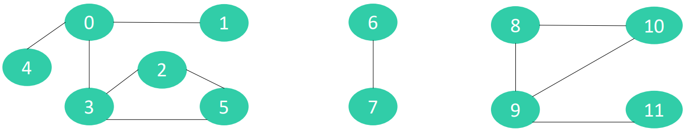
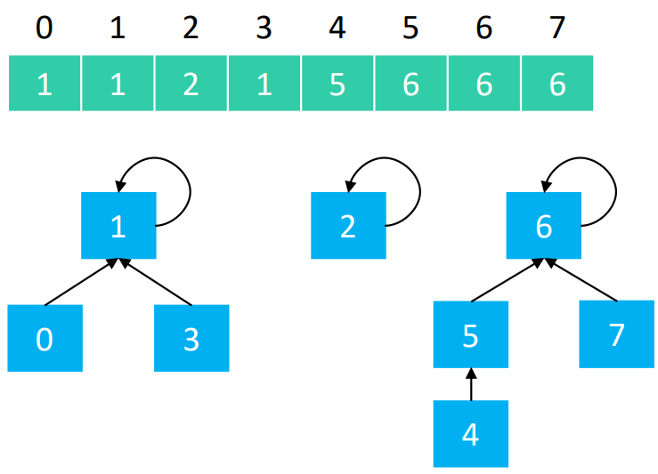

# 并查集

## 需求分析

 假设有n个村庄，有些村庄之间有连接的路，有些村庄之间并没有连接的路



设计一个数据结构，能够快速执行2个操作

- 查询2个村庄之间是否有连接的路
- 连接2个村庄

数组、链表、平衡二叉树、集合（Set）？ => 查询、连接的时间复杂度都是：O(n)

并查集能够办到查询、连接的均摊时间复杂度都是 O(α (n)) ，α(n) < 5 

并查集非常适合解决这类“连接”相关的问题

## 理解并查集

并查集也叫作不相交集合（Disjoint Set）

并查集有2个核心操作

- 查找（Find）：查找元素所在的集合（这里的集合并不是特指Set这种数据结构，是指广义的数据集合）
- 合并（Union）：将两个元素所在的集合合并为一个集合

有2种常见的实现思路

- Quick Find 
  -  查找（Find）的时间复杂度：O(1) 
  -  合并（Union）的时间复杂度：O(n) 
- Quick Union
  - 查找（Find）的时间复杂度：O(logn)，可以优化至 O(𝛼(𝑛)) ，α(𝑛) < 5 
  - 合并（Union）的时间复杂度：O(logn)，可以优化至 O(𝛼(𝑛)) ，α(𝑛) < 5

## 如何储存数据

假设并查集处理的数据都是整型，那么可以用整型数组来存储数据



不难看出

- 0、1、3 属于同一集合
- 2 单独属于一个集合
- 4、5、6、7 属于同一集合

因此并查集是可以用数组实现的树形结构（二叉堆、优先级队列也是可以用数组实现的树形结构）

## 接口定义

```java
/**
 * 查找v所属的集合（根节点）
 */
int find(int v);

/**
 * 合并v1、v2所属的集合
 */
void union(int v1, int v2);

/**
 * 检查v1、v2是否属于同一集合
 */
void isSame(int v1, int v2);
```
