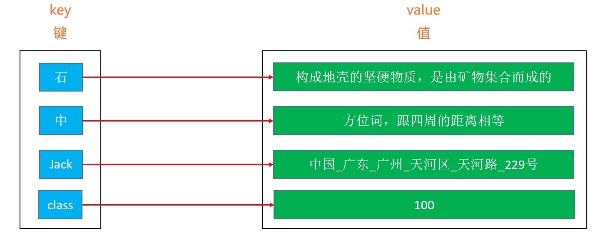

# 映射(Map)实现

## 理解

Map 在有些编程语言中也叫做字典（dictionary，比如 Python、Objective-C、Swift 等）



Map 的每一个 key 是唯一的

类似Set，Map可以直接利用`链表`，`二叉搜索树 (AVL树，红黑树)`等数据结构来实现

## Map 与 Set 的关系

Map 的所有 key 组合在一起，其实就是一个 Set。因此，Set 可以间接利用 Map 来作内部实现

## 接口设计

```java
public interface Map<K, V> {
	int size();
	boolean isEmpty();
	void clear();
	V put(K key,V value);
	V get(K key);
	V remove(K key);
	boolean containsKey(K key);
	boolean containsValue(V value);
	void traversal(Visitor<K,V> visitor);
	
	public static abstract class Visitor<K,V> {
		boolean stop;
		public abstract boolean visit(K key,V value);
	}
}
```

## 红黑树实现TreeMap

### TreeMap分析

时间复杂度（平均）

- 添加、删除、搜索：O(logn)

特点 

- Key 必须具备可比较性

- 元素的分布是有顺序的

在实际应用中，很多时候的需求

- Map 中存储的元素不需要讲究顺序

- Map 中的 Key 不需要具备可比较性

不考虑顺序、不考虑 Key 的可比较性，Map 有更好的实现方案，平均时间复杂度可以达到 O(1)，`那就是采取哈希表来实现 Map`

### 实现

```java
/**
 * @Description 红黑树实现映射（把TreeMap本身当成一棵红黑树,
 * 			用key和value代替element,即从头开始用红黑树实现一个Map）
 * @author Polaris
 * @version
 * @date 2020年3月12日下午6:25:57
 */
@SuppressWarnings({"unchecked","unused"})
public class TreeMap<K,V> implements Map<K,V>{
	private static final boolean RED = false;
	private static final boolean BLACK = true;
	
	protected int size;
	protected Node<K,V> root;// 根节点
	
	protected Comparator<K> comparator;// 比较器定制排序

	public TreeMap() {
		this(null);
	}

	public TreeMap(Comparator<K> comparator) {
		this.comparator = comparator;
	}
		
	private static class Node<K,V> {
		K key;
		V value;
		boolean color = RED;
		Node<K,V> left; // 左子节点
		Node<K,V> right; // 右子节点
		Node<K,V> parent; // 父节点
		
		public Node(K key,V value, Node<K,V> parent) {
			this.key = key;
			this.value = value;
			this.parent = parent;
		}
		
		public boolean isLeaf() {
			return left == null && right == null;
		}
		
		public boolean hasTwoChildren() {
			return left != null && right != null;
		}
		
		public boolean isLeftChild() {
			return parent != null && this == parent.left;
		}
		
		public boolean isRightChild() {
			return parent != null && this == parent.right;
		}
		
		public Node<K,V> getSibling(){
			if(isLeftChild()) {
				return parent.right;
			}
			if(isRightChild()) {
				return parent.left;
			}
			return null;
		}
	}
	
	/**
	 * 	检查key是否为空
	 */
	protected void keyNoNullCheck(K key) {
		if (key == null) {
			throw new IllegalArgumentException("key must no be null!");
		}
	}
	
	@Override
	public int size() {
		return size;
	}

	@Override
	public boolean isEmpty() {
		return size == 0;
	}

	@Override
	public void clear() {
		root = null;
		size = 0;
	}

	@Override
	public V put(K key, V value) { //一般只要求key具有可比较性就
		keyNoNullCheck(key);
		//添加第一个节点（根节点）
		if (root == null) {
			root = new Node<>(key, value, null);
			size++;
			afterPut(root);//新添加节点之后的处理
			return null;
		}
		// 如果添加的不是第一个节点：
		// 1.找到待添加位置的父节点
		Node<K,V> parent = root;
		Node<K,V> node = root;
		int cmp = 0;
		while(node != null) {
			cmp = compare(key, node.key);
			parent = node;
			if (cmp > 0) {
				node = node.right;
			} else if (cmp < 0) {
				node = node.left;
			} else {
				node.key = key;//一般覆盖（不同对象可能有相同的比较参数）
				V oldValue = node.value;
				node.value = value;
				return oldValue;
			}
		}
		// 2.判断插入父节点的左子节点还是右子节点
		Node<K,V> newNode = new Node<>(key, value, parent);
		if (cmp > 0) {
			parent.right = newNode;
		} else {
			parent.left = newNode;
		}
		size++;
		afterPut(newNode);//新添加节点之后的处理
		return null;
	}
	
	private void afterPut(Node<K,V> node) {
		Node<K,V> parent = node.parent;
		//添加的是根节点 或 上溢到根节点
		if(parent == null) {
			black(node);
			return;
		}
		//类型一：parent是黑色（不用处理四种情况）
		if(isBlack(parent)) return;
		//类型二：parent是红色且uncle是红色（会上溢的四种情况）
		Node<K,V> uncle = parent.getSibling();
		Node<K,V> grand = red(parent.parent);//以下情况都需要将grand染成红色，可以统一处理
		if(isRed(uncle)) {
			black(parent);
			black(uncle);
			//把祖父节点当作是新添加的节点
			afterPut(grand);//上溢递归调用
			return;
		}
		//类型三：parent是红色且uncle不是红色（需要旋转的四种情况）
		if(parent.isLeftChild()) {//L
			if(node.isLeftChild()) { //LL
				black(parent);
			} else { //LR
				black(node);
				rotateLeft(parent);
			}
			rotateRight(grand);
		} else { //R
			if(node.isLeftChild()) { //RL
				black(node);
				rotateRight(parent);
			} else { //RR
				black(parent);
			}
			rotateLeft(grand);
		}
	}
	
	private int compare(K k1, K k2) {
		if (comparator != null) {
			return comparator.compare(k1, k2);
		}
		return ((Comparable<K>)k1).compareTo(k2);
	}
	
	/**
	 * 给节点上色
	 */
	private Node<K,V> color(Node<K,V> node,boolean color) {
		if(node == null) return node;
		node.color = color;
		return node;
	}
	
	/**
	 * 将节点染成红色
	 */
	private Node<K,V> red(Node<K,V> node){
		return color(node,RED);
	}
	
	/**
	 * 将节点染成黑色
	 */
	private Node<K,V> black(Node<K,V> node){
		return color(node,BLACK);
	}
	
	/**
	 * 获取当前节点的颜色
	 */
	private boolean colorOf(Node<K,V> node) {
		return node == null ? BLACK : node.color;
	}
	
	/**
	 * 判断当前颜色是否为黑色
	 */
	private boolean isBlack(Node<K,V> node) {
		return colorOf(node) == BLACK;
	}
	
	/**
	 * 判断当前颜色是否为红色
	 */
	private boolean isRed(Node<K,V> node) {
		return colorOf(node) == RED;
	}
	
	/**
	 *	左旋转，以RR为例
	 */
	private void rotateLeft(Node<K,V> grand) {
		Node<K,V> parent = grand.right;
		Node<K,V> child = parent.left;//child就是T1子树
		grand.right = child;
		parent.left = grand;
		
		afterRotate(grand, parent, child);
	}
	
	/**
	 *	右旋转，以LL为例
	 */
	private void rotateRight(Node<K,V> grand) {
		Node<K,V> parent = grand.left;
		Node<K,V> child = parent.right;
		grand.left = child;
		parent.right = grand;
		
		afterRotate(grand, parent, child);
	}
	
	/**
	 * 	抽取左旋转和右旋转中的重复代码
	 */
	private void afterRotate(Node<K,V> grand,Node<K,V> parent,Node<K,V> child) {
		//更新parent的parent（让parent成为子树的根节点）
		parent.parent = grand.parent;
		if(grand.isLeftChild()) {
			grand.parent.left = parent;
		} else if(grand.isRightChild()) {
			grand.parent.right = parent;
		} else { //grand是root节点
			root = parent;
		}
		//更新child的parent
		if(child != null) {
			child.parent = grand;		
		}
		//更新grand的parent
		grand.parent = parent;
	}

	@Override
	public V get(K key) {
		Node<K,V> node = node(key);
		return node != null ? node.value : null;
	}
	
	/**
	 * 根据key找到对应节点
	 */
	private Node<K,V> node(K key){
		Node<K,V> node = root;
		while(node != null) {
			int cmp = compare(key,node.key);
			if(cmp == 0) return node;
			if(cmp > 0) {
				node = node.right;
			} else {
				node = node.left;
			}
		}
		return null;
	}

	@Override
	public V remove(K key) {
		return remove(node(key));
	}
	
	/**
	 * 根据key删除节点元素
	 */
	private V remove(Node<K,V> node) {
		if(node == null) return null;
		size--;
		V oldValue = node.value;
		//考虑度为2的节点，转化为度为1
		if(node.hasTwoChildren()) {
			Node<K,V> s = successor(node);//后继节点
			//用后继节点的值覆盖度为2的节点的值
			node.key = s.key;
			node.value = s.value;
			//删除后继节点
			node = s;
		}
		//删除node节点（能到这则说明node的度必为0或1）
		Node<K,V> replacement = node.left != null ? node.left : node.right;
		if(replacement != null) { //node是度为1的节点
			//更改parent
			replacement.parent = node.parent;
			//更改parent的left，right指向
			if(node.parent == null) { //node是度为1的节点也是根节点
				root = replacement;
			} else if(node == node.parent.left) {
				node.parent.left = replacement;
			} else { //在右边
				node.parent.right = replacement;
			}
			//此时开始恢复平衡(AVL树 或 RB树需要实现此方法)
			afterRemove(node,replacement);
		} else if(node.parent == null){ //node是叶子节点也是根节点
			root = null;
			afterRemove(node,null);
		} else { //node是叶子节点但不是根节点
			if(node == node.parent.left) {
				node.parent.left = null;
			} else {
				node.parent.right = null;
			}
			//此时开始恢复平衡(AVL树 或RB树 需要实现此方法)
			afterRemove(node,null);
		}
		return oldValue;
	}
	
	/**
	 * 	实现删除节点后的处理操作
	 */
	private void afterRemove(Node<K,V> node,Node<K,V> replacement) {
		//情况一：如果删除的节点是红色，不用处理
		if(isRed(node)) return;
		//情况二：用于取代node子节点的是红色节点
		if(isRed(replacement)) {
			black(replacement);
			return;
		}
		//情况三：删除的是黑色叶子节点（下溢）
		Node<K,V> parent = node.parent;
		//删除的是根节点
		if(parent == null) return;
		//判断被删除的node的节点是左还是右
		boolean left = parent.left == null || node.isLeftChild();
		Node<K,V> sibling = left ? parent.right : parent.left;
		if(left) { //被删除的节点在左边，兄弟节点在右边(镜像对称处理)
			if(isRed(sibling)) { //兄弟节点是红色，就要转成黑色
				black(sibling);
				red(parent);
				rotateLeft(parent);
				//更换兄弟
				sibling = parent.right;
			}
			//兄弟节点必然是黑色
			if(isBlack(sibling.left) && isBlack(sibling.right)) {
				//兄弟节点没有一个红色子节点，父节点要向下向子节点合并
				boolean parentBlack = isBlack(parent);
				black(parent);
				red(sibling);
				if(parentBlack) {
					afterRemove(parent, null);
				}
			} else { //兄弟节点至少有 1 个红色节点,就要向兄弟节点借元素
				if(isBlack(sibling.right)) {
					//兄弟节点的右边不是红色，则兄弟要先旋转
					rotateRight(sibling);
					sibling = parent.right;
				}
				color(sibling,colorOf(parent));
				black(sibling.right);
				black(parent);
				rotateLeft(parent);
			}
		} else { //被删除的节点在右边，兄弟节点在左边（图示的是这种）
			if(isRed(sibling)) { //兄弟节点是红色，就要转成黑色
				black(sibling);
				red(parent);
				rotateRight(parent);
				//更换兄弟
				sibling = parent.left;
			}
			//兄弟节点必然是黑色
			if(isBlack(sibling.left) && isBlack(sibling.right)) {
				//兄弟节点没有一个红色子节点，父节点要向下向子节点合并
				boolean parentBlack = isBlack(parent);
				black(parent);
				red(sibling);
				if(parentBlack) {
					afterRemove(parent, null);
				}
			} else { //兄弟节点至少有 1 个红色节点,就要向兄弟节点借元素
				if(isBlack(sibling.left)) {
					//兄弟节点的左边不是红色，则兄弟要先旋转
					rotateLeft(sibling);
					sibling = parent.left;
				}
				color(sibling,colorOf(parent));
				black(sibling.left);
				black(parent);
				rotateRight(parent);
			}
		}
	}
	
	/**
	 * 	利用中序遍历求某个节点的前驱节点
	 */
	private Node<K,V> predecessor(Node<K,V> node) {
		if(node == null) return null;
		//前驱节点在左子树中：node.left.right.right...
		Node<K,V> p = node.left;
		if(p != null) {
			while(p.right != null) {
				p = p.right;
			}
			return p;
		}
		//从祖父节点中寻找前驱节点
		while(node.parent != null && node == node.parent.left) {
			node = node.parent;
		}
		//情况一：node.parent == null ↓
		//情况二：node == node.parent.right ↓
		return node.parent;
	}
	
	/**
	 * 	利用中序遍历求某个节点的后继节点
	 */
	private Node<K,V> successor(Node<K,V> node) {
		if(node == null) return null;
		//前驱节点在右子树中：node.right.left.left...
		Node<K,V> p = node.right;
		if(p != null) {
			while(p.left != null) {
				p = p.left;
			}
			return p;
		}
		//从祖父节点中寻找前驱节点
		while(node.parent != null && node == node.parent.right) {
			node = node.parent;
		}
		//情况一：node.parent == null ↓
		//情况二：node == node.parent.left ↓
		return node.parent;
	}

	@Override
	public boolean containsKey(K key) {
		return node(key) != null;
	}

	@Override
	public boolean containsValue(V value) {
		if(root == null) return false;
		Queue<Node<K,V>> queue = new LinkedList<>();
		queue.offer(root);
		while(!queue.isEmpty()) {
			Node<K,V> node = queue.poll();
			if(valEquals(value, node.value)) return true;
			if(node.left != null) {
				queue.offer(node.left);
			}
			if(node.right != null) {
				queue.offer(node.right);
			}
		}
		return false;
	}
	
	private boolean valEquals(V v1,V v2) {
		return v1 == null ? v2 == null : v1.equals(v2);
	}

	@Override
	public void traversal(Visitor<K, V> visitor) {
		if(visitor == null) return;
		traversal(root,visitor);
	}
	
	private void traversal(Node<K,V> node,Visitor<K, V> visitor) {
		if(node == null || visitor.stop) return;
		traversal(node.left,visitor);
		if(visitor.stop) return;
		visitor.visit(node.key, node.value);
		traversal(node.right,visitor);
	}
	
}
```

### 测试

```java
public class TreeMapTest {
	@Test
	public void test() {
		Map<String,Integer> map = new TreeMap<>(); 
		map.put("c", 2);
		map.put("a", 5);
		map.put("b", 6);
		map.put("a", 8);
		map.traversal(new Visitor<String, Integer>() {
			@Override
			public boolean visit(String key, Integer value) {
				System.out.println(key + "_" + value);
				return false;
			}
		});
	}
	
	@Test
	public void test2() {
		FileInfo fileInfo = Files.read("D:\\Learning\\Java"
				+ "\\workspace_eclipse\\workspace001_2019-3"
				+ "\\DataStructures\\src\\com\\polaris4"
				+ "\\map", 
				new String[]{"java"});
		
		System.out.println("文件数量：" + fileInfo.getFiles());
		System.out.println("代码行数：" + fileInfo.getLines());
		String[] words = fileInfo.words();
		System.out.println("单词数量：" + words.length);
		
		Map<String, Integer> map = new TreeMap<>();
		for (int i = 0; i < words.length; i++) {
			Integer count = map.get(words[i]);
			count = (count == null) ? 1 : (count + 1);
			map.put(words[i], count);
		}
		
		map.traversal(new Visitor<String, Integer>() {
			public boolean visit(String key, Integer value) {
				System.out.println(key + "_" + value);
				return false;
			}
		});
	}
}
```

```java
public class Files {
	
	/**
	 * 读取文件内容
	 * @param file
	 * @return
	 */
	public static FileInfo read(String file) {
		if (file == null) return null;
		FileInfo info = new FileInfo();
		StringBuilder sb = new StringBuilder();
		try (FileReader reader = new FileReader(file);
				BufferedReader br = new BufferedReader(reader)) {
            String line;
            while ((line = br.readLine()) != null) {
            	sb.append(line).append("\n");
            	info.setLines(info.getLines() + 1);
            }
            int len = sb.length();
            if (len > 0) {
                sb.deleteCharAt(len - 1);
            }
        } catch (IOException e) {
            e.printStackTrace();
        }
		info.setFiles(info.getFiles() + 1);
		info.setContent(sb.toString());
		return info;
	}
	
	/**
	 * 读取文件夹下面的文件内容
	 * @param dir
	 * @param extensions
	 * @return
	 */
	public static FileInfo read(String dir, String[] extensions) {
		if (dir == null) return null;
		
		File dirFile = new File(dir);
		if (!dirFile.exists()) return null;

		FileInfo info = new FileInfo();
		dirFile.listFiles(new FileFilter() {
			public boolean accept(File subFile) {
				String subFilepath = subFile.getAbsolutePath();
				if (subFile.isDirectory()) {
					info.append(read(subFilepath, extensions));
				} else if (extensions != null && extensions.length > 0) {
					for (String extension : extensions) {
						if (subFilepath.endsWith("." + extension)) {
							info.append(read(subFilepath));
							break;
						}
					}
				} else {
					info.append(read(subFilepath));
				}
				return false;
			}
		});
		return info;
	}
}
```

```java
public class FileInfo {
	private int lines;
	private int files;
	private String content = "";
	
	public String[] words() {
		return content.split("[^a-zA-Z]+");
	}
	
	public int getFiles() {
		return files;
	}

	public void setFiles(int files) {
		this.files = files;
	}

	public int getLines() {
		return lines;
	}
	
	public void setLines(int lines) {
		this.lines = lines;
	}
	
	public String getContent() {
		return content;
	}

	public void setContent(String content) {
		this.content = content;
	}

	public FileInfo append(FileInfo info) {
		if (info != null && info.lines > 0) {
			this.files += info.files;
			this.lines += info.lines;
			this.content = new StringBuilder(this.content)
					.append("\n")
					.append(info.content)
					.toString();
		}
		return this;
	}
}
```