# 树形结构

## 概述

**基本概念**

- `节点`、`根节点`、`父节点`、`子节点`、`兄弟节点`(有相同的父节点)
- 一棵树可以没有任何节点，称为 `空树`
- 一棵树可以只有 1 个节点，也就是 `只有根节点`
- `子树`、`左子树`、`右子树`
- `节点的度（degree）`：子树的个数
- `树的度`：所有节点度中的最大值 
- `叶子节点（leaf）`：度为 0 的节点
- `非叶子节点`：度不为 0 的节点
- `层数（level）`：根节点在第 1 层，根节点的子节点在第 2 层，以此类推（有些说法也从第 0 层开始计算）
- `节点的深度（depth）`：从根节点到当前节点的唯一路径上的节点总数
- `节点的高度（height）`：从当前节点到最远叶子节点的路径上的节点总数
- `树的深度`：所有节点深度中的最大值
- `树的高度`：所有节点高度中的最大值
- `树的深度` 等于 `树的高度`
- `树支路总数` = `树节点总数` - 1 (树中每个节点头上都有一个支路，但唯独根节点没有)

**有序树，无序树，森林**

- `有序树`：树中任意节点的子节点之间有顺序关系
- `无序树`：树中任意节点的子节点之间没有顺序关系，也称为“自由树”
- `森林`：由 m（m ≥ 0）棵互不相交的树组成的集合

## 二叉树

### 特点

- 每个节点的`度最大为 2`（最多拥有 2 棵子树）
- 左子树和右子树是`有顺序的`
- 即使某节点`只有一棵子树，也要区分左右子树`
- `二叉树是度不大于2的有序树`。但是度不大于2的有序树不是二叉树(因为有序树的节点次序是相对于另一节点而言的，当有序树的子树中只有一个孩子时，这个孩子节点无需区分左右次序，而二叉树无论孩子树是否为2，均需要确定左右次序）。

###  性质

- 非空二叉树的第 i 层，最多有 `2^( i − 1)` 个节点（ i ≥ 1 ）
- 在高度为 h 的二叉树上最多有 `2^h − 1` 个结点（ h ≥ 1 ）

```java
// S=2^0 + 2^1 + 2^2 + 2^3 +..+ 2^(n-1)
// 2S=2^1 + 2^2 + 2^3 +..+ 2^(n-1) + 2^n
// 两式相减
// 2S-S=2^n - 2^0
// S=2^n - 1
```

- 对于任何一棵非空二叉树，如果叶子节点个数为 n0，度为 2 的节点个数为 n2，则有: n0 = n2 + 1

```java
//推导步骤：
// ① 假设度为 1 的节点个数为 n1，那么二叉树的节点总数 n = n0 + n1 + n2 
// ② 二叉树的支路数 T = n1 + 2 * n2 = n – 1 = n0 + n1 + n2 – 1 
// ③ 因此 n0 = n2 + 1
```

### 真二叉树

理解：所有节点的度都要么为 0，要么为 2。

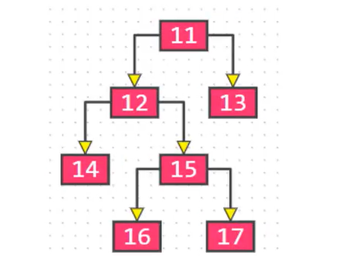

### 满二叉树

理解：最后一层节点的度都为 0，其他节点的度都为 2。

> 注意：
>
> ① 在同样高度的二叉树中，满二叉树的叶子节点数量最多、总节点数量最多。
>
> ② 满二叉树一定是真二叉树，真二叉树不一定是满二叉树。

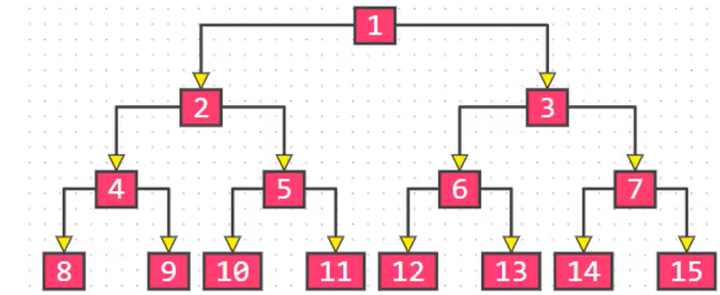

### 完全二叉树

理解：对节点从上至下、左至右开始编号，其所有编号都能与相同高度的满二叉树中的编号对应。

> 注意：
>
> ① 叶子节点只会出现最后 2 层，最后 1 层的叶子结点都靠左对齐。
>
> ② 完全二叉树从根结点至倒数第 2 层是一棵满二叉树。
>
> ③ 满二叉树一定是完全二叉树，完全二叉树不一定是满二叉树。

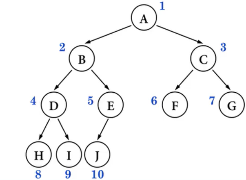

性质：

```java
// 1. 度为 1 的节点只有左子树。
// 2. 度为 1 的节点要么是 1 个，要么是 0 个
// 3. 同样节点数量的二叉树，完全二叉树的高度最小
// 4. 假设完全二叉树的高度为 h（h ≥ 1），那么：
//    ① 至少有 2^(h−1) 个节点 （2^0 + 2^1 + 2^2 + ⋯ + 2^(h−2) + 1 ）
//    ② 最多有 2^h − 1 个节点（2^0 + 2^1 + 2^2 + ⋯ + 2^(h−1)，满二叉树）
//    ③ 当总节点数量为 n，
//      可得：2^(h-1) <= n < 2^h
//     =》   h - 1 <= logn < h
//     =》   h = floor(logn) + 1  ※  //floor:向下取整 ceiling：向上取整
// 5. 一棵有 n 个节点的完全二叉树（n > 0），从上到下、从左到右对节点从 1 开始
//    进行编号，对任意第 i 个节点：
//    ① 如果 i = 1 ，它是根节点
//    ② 如果 i > 1 ，它的父节点编号为 floor( i / 2 )
//    ③ 如果 2i ≤ n ，它的左子节点编号为 2i
//    ④ 如果 2i > n ，它无左子节点
//    ⑤ 如果 2i + 1 ≤ n ，它的右子节点编号为 2i + 1
//    ⑥ 如果 2i + 1 > n ，它无右子节点
// 6. 一棵有 n 个节点的完全二叉树（n > 0），从上到下、从左到右对节点从 0 
//   开始进行编号，对任意第 i 个节点：
//   ① 如果 i = 0 ，它是根节点
//   ② 如果 i > 0 ，它的父节点编号为 floor( (i – 1) / 2 )
//   ③ 如果 2i + 1 ≤ n – 1 ，它的左子节点编号为 2i + 1
//   ④ 如果 2i + 1 > n – 1 ，它无左子节点
//   ⑤ 如果 2i + 2 ≤ n – 1 ，它的右子节点编号为 2i + 2
//   ⑥ 如果 2i + 2 > n – 1 ，它无右子节点
```

面试题：如果一棵完全二叉树有 768 个节点，求叶子节点的个数

```java
// 解： 设叶子节点为 n0，度为2的节点为 n2，度为1的节点为 n1
//     n = n0 + n1 + n2
//     n0 = n2 + 1
//     => n = 2n0 + n1 - 1
// 又因 完全二叉树度为1的节点要么是 1 个，要么是 0 个
//     ① n1为1 时，n = 2n0，n必然为偶数。
//     ② n1为0时，n = 2n0 - 1,n必然为奇数。
//     => n0 = 768 / 2 = 384
```

由以上题总结公式：

- 当总节点为偶数，n0 = n / 2。

- 当总节点数为奇数，n0 = (n + 1) / 2

- => `n0 = floor( (n + 1) / 2 )  = ceiling( n / 2)`   注意：java除法默认向下取整

判断一棵树是否为完全二叉树：

- 思路一：

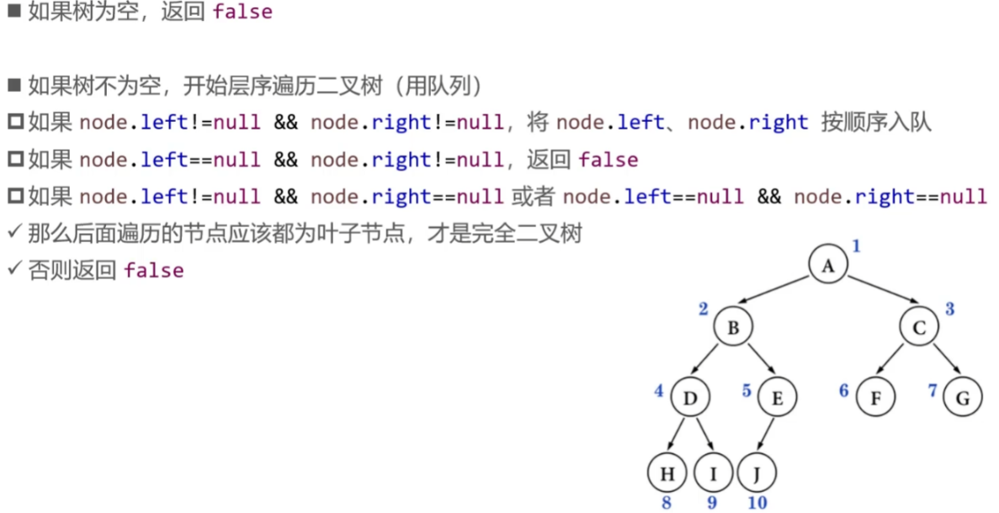

- 思路二：

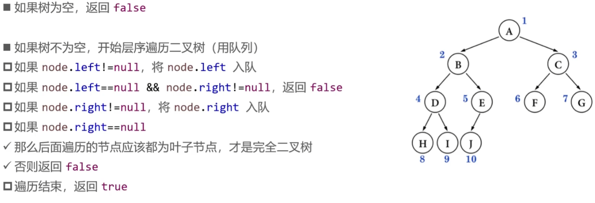

### 二叉树的遍历

遍历是数据结构中的常见操作：把所有元素都访问一遍

线性数据结构的遍历比较简单

- 正序遍历 
- 逆序遍历

根据节点访问顺序的不同，二叉树的常见遍历方式有4种

- 前序遍历（Preorder Traversal）
- 中序遍历（Inorder Traversal）
- 后序遍历（Postorder Traversal）
- 层序遍历（Level Order Traversal）

**前序遍历（递归/迭代）**

访问顺序 ：`根节点`、前序遍历左子树、前序遍历右子树

应用：树状结构展示（注意左右子树的顺序）

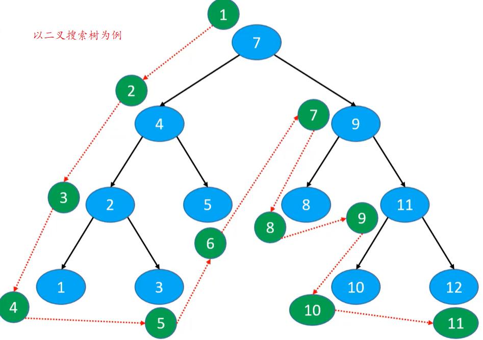

**中序遍历（递归/迭代）**

访问顺序 ：中序遍历左子树、`根节点`、中序遍历右子树

应用：二叉搜索树的中序遍历按升序或降序处理节点


**后序遍历（递归 / 迭代）** 

访问顺序 ：后序遍历左子树、后序遍历右子树、`根节点`

应用：适用于一些先子后父的操作

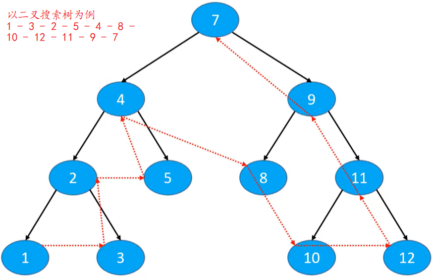

**层序遍历** (迭代实现：队列)

```java
//实现思路
// 1. 将根节点入队
// 2. 循环执行以下操作，直到队列为空
//    ① 将队头节点 A 出队，进行访问
//    ② 将 A 的左子节点入队
//    ③ 将 A 的右子节点入队
```

访问顺序 ：从上到下、从左到右依次访问每一个节点

应用：① 计算二叉树的高度 ② 判断一棵树是否为完全二叉树

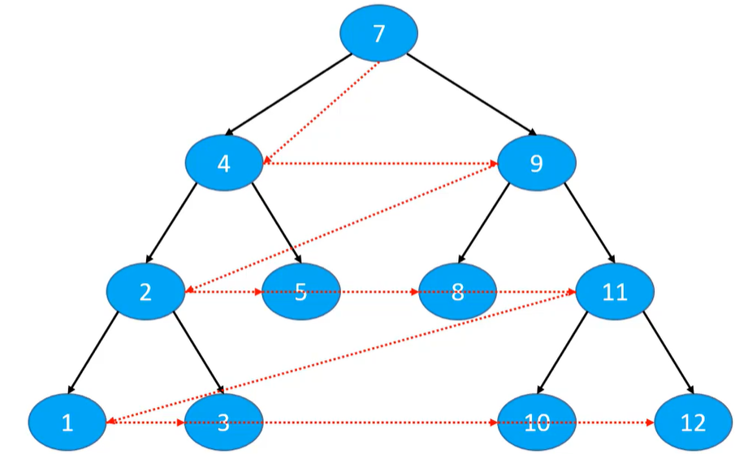

### 表达式树

四则运算的表达式可以分为3种

- 前缀表达式（prefix expression），又称为波兰表达式 
- 中缀表达式（infix expression）
- 后缀表达式（postfix expression），又称为逆波兰表达式

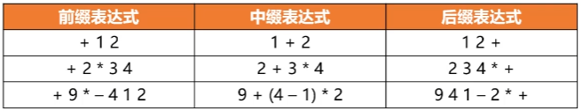

如果将表达式的操作数作为叶子节点，运算符作为父节点（假设只是四则运算）

- 这些节点刚好可以组成一棵二叉树
- 比如表达式：A / B + C * D – E

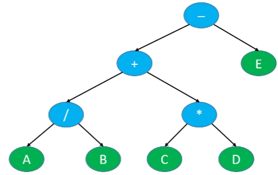

如果对这棵二叉树进行遍历

前序遍历

- \- + / A B * C D E
- 刚好就是前缀表达式（波兰表达式）

中序遍历

- A / B + C * D – E
- 刚好就是中缀表达式（波兰表达式）

后序遍历

- A B / C D * + E –
- 刚好就是后缀表达式（逆波兰表达式）

### 二叉树遍历的应用

- 前序遍历：树状结构展示(注意左右子树的顺序)
- 中序遍历：二叉搜索树的中序遍历按升序或者降序处理节点
- 后序遍历：适用于一些先子后父的操作
- 层序遍历：①计算二叉树的高度。②判断一棵树是否为完全二叉树

### 根据遍历结果重构二叉树

- 前序遍历 + 中序遍历 =>  唯一的一颗二叉树
- 后序遍历 + 中序遍历 =>  唯一的一颗二叉树
- 前序遍历 + 后序遍历 => 如果它是一棵真二叉树，结果是唯一的 。否则不然结果不唯一 。

###0 前驱节点**(predecessor)**

理解：中序遍历时的前一个节点      “删除节点要使用该知识”

如果是二叉搜索树，前驱节点就是前一个比它小的节点

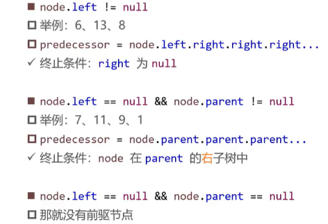

###1 后继节点**(**successor**)**

理解：中序遍历时的后一个节点     “删除节点要使用该知识”	

如果是二叉搜索树，后继节点就是后一个比它大的节点

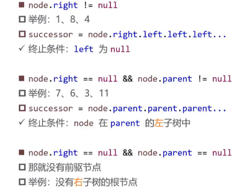

###2 **打印二叉树的工具**

**https://github.com/CoderMJLee/BinaryTrees**

使用步骤：

- 实现 BinaryTreeInfo 接口
- 调用打印API ：BinaryTrees.println(bst);

###3 二叉树遍历非递归实现思路

**前序遍历-非递归**

利用栈实现(法一)

- 设置 node = root
- 循环执行以下操作
  - 如果 node != null 
    - 对 node 进行访问
    - 将 node.right 入栈
    - 设置 node = node.left
  - 如果 node == null 
    - 如果栈为空，结束遍历
    - 如果栈不为空，弹出栈顶元素并赋值给 node

利用栈实现(法二)

- 将 root 入栈

- 循环执行以下操作，直到栈为空
  - 弹出栈顶节点 top，进行访问
  - 将 top.right 入栈
  - 将 top.left 入栈

**中序遍历-非递归**

利用栈实现 ：

- 设置 node = root

- 循环执行以下操作
  - 如果 node != null 
    - 将 node 入栈
    - 设置 node = node.left
  - 如果 node == null 
    - 如果栈为空，结束遍历
    - 如果栈不为空，弹出栈顶元素并赋值给 node
      - 对 node 进行访问 
      - 设置 node = node.right

**后序遍历 – 非递归**

利用栈实现

- 将 root 入栈
- 循环执行以下操作，直到栈为空
  - 如果栈顶节点是叶子节点 或者 上一次访问的节点是栈顶节点的子节点 => 弹出栈顶节点，进行访问
  - 否则 => 将栈顶节点的right、left按顺序入栈

###4 二叉树代码实现

```java
/**
 * @Description 二叉树
 * @Author monap
 * @Date 2021/10/10 20:10
 */
@SuppressWarnings("unchecked")
public class BinaryTree<E> implements BinaryTreeInfo {
    protected int size;
    /**
     * 根节点
     */
    protected Node<E> root;

    /**
     * 节点内部类
     */
    protected static class Node<E> {
        E element;
        Node<E> left; // 左子节点
        Node<E> right; // 右子节点
        Node<E> parent; // 父节点

        /**
         * 左右节点可能没有，不必须
         */
        public Node(E element, Node<E> parent) {
            this.element = element;
            this.parent = parent;
        }

        public boolean isLeaf() {
            return left == null && right == null;
        }

        public boolean hasTwoChildren() {
            return left != null && right != null;
        }

        public boolean isLeftChild() {
            return parent != null && this == parent.left;
        }

        public boolean isRightChild() {
            return parent != null && this == parent.right;
        }

        public Node<E> getSibling() {
            if (isLeftChild()) {
                return parent.right;
            }
            if (isRightChild()) {
                return parent.left;
            }
            return null;
        }

        @Override
        public String toString() {
            String parentStr = "null";
            if (parent != null) {
                parentStr = parent.element.toString();
            }
            return element + "_P(" + parentStr + ")";
        }
    }

    protected Node<E> createNode(E element, Node<E> parent) {
        return new Node<>(element, parent);
    }

    /**
     * 元素的数量
     */
    public int size() {
        return size;
    }

    /**
     * 是否为空
     */
    public boolean isEmpty() {
        return size == 0;
    }

    /**
     * 对外接口，用于传出去遍历到的元素(类似于Comparator定制排序)
     */
    public static abstract class Visitor<E> {
        boolean stop;

        // 如果返回true就停止遍历
        public abstract boolean visit(E element);
    }

    /**
     * 前序遍历（非递归方式）、使用栈实现
     */
    public void preorderTraversal(Visitor<E> visitor) {
        if (visitor == null || root == null) return;
        Node<E> node = root;
        Stack<Node<E>> stack = new Stack<>();
        while (true) {
            if (node != null) {
                // 访问node节点
                if (visitor.visit(node.element)) return;
                // 将右子节点入栈
                if (node.right != null) {
                    stack.push(node.right);
                }
                // 向左左
                node = node.left;
            } else if (stack.isEmpty()) {
                return;
            } else {
                // 处理右边
                node = stack.pop();
            }
        }
    }

    /**
     * 前序遍历（递归方式）
     */
    public void preorderTraversal2(Visitor<E> visitor) {
        if (visitor == null) return;
        preorderTraversal(root, visitor);
    }

    protected void preorderTraversal(Node<E> node, Visitor<E> visitor) {
        if (node == null || visitor.stop) {
            return;
        }
        // System.out.println(node.element);
        // visitor.visit(node.element);//定制
        // if(visitor.stop) return;
        visitor.stop = visitor.visit(node.element);
        preorderTraversal(node.left, visitor);
        preorderTraversal(node.right, visitor);
    }

    /**
     * 中序遍历（非递归方式）、利用栈实现
     */
    public void inorderTraversal(Visitor<E> visitor) {
        if (visitor == null || root == null) return;
        Node<E> node = root;
        Stack<Node<E>> stack = new Stack<>();
        while (true) {
            if (node != null) {
                stack.push(node);
                node = node.left;
            } else if (stack.isEmpty()) {
                return;
            } else {
                node = stack.pop();
                // 访问node节点
                if (visitor.visit(node.element)) return;
                // 让右节点进行中序遍历
                node = node.right;
            }
        }
    }

    /**
     * 中序遍历（递归方式）
     */
    public void inorderTraversal2(Visitor<E> visitor) {
        if (visitor == null) {
            return;
        }
        inorderTraversal(root, visitor);
    }

    protected void inorderTraversal(Node<E> node, Visitor<E> visitor) {
        if (node == null || visitor.stop) {
            return;
        }
        inorderTraversal(node.left, visitor);
        // visitor.visit(node.element);
        if (visitor.stop) {
            return;
        }
        visitor.stop = visitor.visit(node.element);
        inorderTraversal(node.right, visitor);
    }

    /**
     * 后序遍历（非递归方式）、利用栈实现
     */
    public void postorderTraversal(Visitor<E> visitor) {
        if (visitor == null || root == null) return;
        // 记录上一次弹出访问的节点
        Node<E> prev = null;
        Stack<Node<E>> stack = new Stack<>();
        stack.push(root);
        while (!stack.isEmpty()) {
            Node<E> top = stack.peek();
            if (top.isLeaf() || (prev != null && prev.parent == top)) {
                prev = stack.pop();
                // 访问node节点
                if (visitor.visit(prev.element)) return;
            } else {
                if (top.right != null) {
                    stack.push(top.right);
                }
                if (top.left != null) {
                    stack.push(top.left);
                }
            }
        }
    }

    /**
     * 后序遍历（递归方式）
     */
    public void postorderTraversal2(Visitor<E> visitor) {
        if (visitor == null) {
            return;
        }
        postorderTraversal(root, visitor);
    }

    protected void postorderTraversal(Node<E> node, Visitor<E> visitor) {
        if (node == null || visitor.stop) {
            // visitor.stop中止递归
            return;
        }
        postorderTraversal(node.left, visitor);
        postorderTraversal(node.right, visitor);
        // visitor.visit(node.element);
        if (visitor.stop) {
            return; // 中止当前打印 ↓
        }
        visitor.stop = visitor.visit(node.element);
    }

    /**
     * 层序遍历（迭代：队列）
     */
    public void levelOrderTraversal(Visitor<E> visitor) {
        if (root == null || visitor == null) {
            return;
        }
        Queue<Node<E>> queue = new LinkedList<>();
        // 将根节点入队
        queue.offer(root);
        while (!queue.isEmpty()) {
            // 将头节点出队
            Node<E> node = queue.poll();
            // System.out.println(node.element);
            // visitor.visit(node.element);
            if (visitor.visit(node.element)) {
                return;
            }
            if (node.left != null) {
                queue.offer(node.left);
            }
            if (node.right != null) {
                queue.offer(node.right);
            }
        }
    }

    /**
     * 清空所有元素
     */
    public void clear() {
        root = null;
        size = 0;
    }

    //---------------------------

    /**
     * 利用前序遍历进行简单的树状结构展示
     */
    @Override
    public String toString() {
        StringBuilder str = new StringBuilder();
        toString(root, str, "");
        return str.toString();
    }

    protected void toString(Node<E> node, StringBuilder str, String prefix) {
        if (node == null) {
            return;
        }
        str.append(prefix).append(node.element).append("\n");
        toString(node.left, str, prefix + "L-");
        toString(node.right, str, prefix + "R-");
    }

    //---------------------------

    /**
     * 利用中序遍历求某个节点的前驱节点
     */
    protected Node<E> predecessor(Node<E> node) {
        if (node == null) {
            return null;
        }
        // 前驱节点在左子树中：node.left.right.right...
        Node<E> p = node.left;
        if (p != null) {
            while (p.right != null) {
                p = p.right;
            }
            return p;
        }
        // 从祖父节点中寻找前驱节点
        while (node.parent != null && node == node.parent.left) {
            node = node.parent;
        }
        // 情况一：node.parent == null ↓
        // 情况二：node == node.parent.right ↓
        return node.parent;
    }

    /**
     * 利用中序遍历求某个节点的后继节点
     */
    protected Node<E> successor(Node<E> node) {
        if (node == null) {
            return null;
        }
        // 前驱节点在右子树中：node.right.left.left...
        Node<E> p = node.right;
        if (p != null) {
            while (p.left != null) {
                p = p.left;
            }
            return p;
        }
        // 从祖父节点中寻找前驱节点
        while (node.parent != null && node == node.parent.right) {
            node = node.parent;
        }
        // 情况一：node.parent == null ↓
        // 情况二：node == node.parent.left ↓
        return node.parent;
    }

    //---------------------------

    /**
     * 计算二叉树的高度（递归）
     */
    public int heightByRecursion() {
        return height(root);
    }

    /**
     * 获取某一个节点的高度
     */
    protected int height(Node<E> node) {
        if (node == null) {
            return 0;
        }
        return 1 + Math.max(height(node.left), height(node.right));
    }

    /**
     * 利用层序遍历计算二叉树的高度（迭代）
     */
    public int heightByLevelOrderTraversal() {
        if (root == null) {
            return 0;
        }
        int height = 0;
        // 存储着每一层的元素数量
        int levelSize = 0;
        Queue<Node<E>> queue = new LinkedList<>();
        // 将根节点入队
        queue.offer(root);
        while (!queue.isEmpty()) {
            levelSize = queue.size();
            for (int i = 0; i < levelSize; i++) {
                Node<E> node = queue.poll();
                assert node != null;
                if (node.left != null) {
                    queue.offer(node.left);
                }
                if (node.right != null) {
                    queue.offer(node.right);
                }
            }
            height++;
        }
        return height;
    }

    /**
     * 利用层序遍历判断一颗树是否为完全二叉树
     */
    public boolean isComplete() {
        if (root == null) {
            return false;
        }
        Queue<Node<E>> queue = new LinkedList<>();
        // 将根节点入队
        queue.offer(root);
        boolean leaf = false;
        while (!queue.isEmpty()) {
            // 将头节点出队
            Node<E> node = queue.poll();
            if (leaf && !node.isLeaf()) {
                return false;
            }

            if (node.left != null) {
                queue.offer(node.left);
            } else if (node.right != null) {
                //node.left == null && node.right != null
                return false;
            }

            if (node.right != null) {
                queue.offer(node.right);
            } else {
                //node.right == null
                leaf = true;
            }
        }
        return true;
    }

    /**
     * 使用前序遍历翻转二叉树（所有遍历方式都可实现）
     *
     * @param root
     * @return
     */
    public Node<E> invertTree(Node<E> root) {
        if (root == null) {
            return null;
        }
        Node<E> tmp = root.left;
        root.left = root.right;
        root.right = tmp;
        invertTree(root.left);
        invertTree(root.right);
        return root;
    }

    //---------------------------

    /**
     * 实现BinaryTreeInfo接口，进行高级的树状结构展示
     */
    @Override
    public Object root() {
        return root;
    }

    @Override
    public Object left(Object node) {
        return ((Node<E>) node).left;
    }

    @Override
    public Object right(Object node) {
        return ((Node<E>) node).right;
    }

    @Override
    public Object string(Object node) {
        return node;
    }
}
```

## 二叉搜索树

### 引入

在 n 个动态的整数中搜索某个整数？（查看其是否存在）。

- 假设使用动态数组存放元素，从第 0 个位置开始遍历搜索，平均时间复杂度：O(n)。

- - 如果维护一个有序的动态数组，使用二分搜索，最坏时间复杂度：O(logn)。但是添加、删除的平均时间复杂度是 O(n)。

针对这个需求，有没有更好的方案？=> 使用二叉搜索树，添加、删除、搜索的最坏时间复杂度均可优化至：O(logn)级别  <==> O(h) 复杂度只与h有关

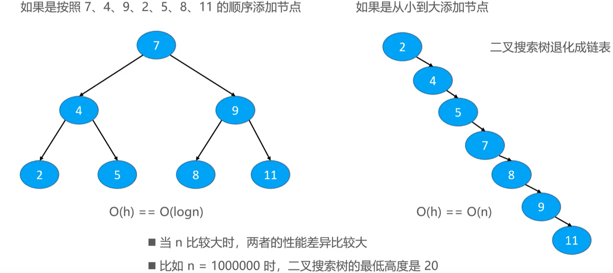

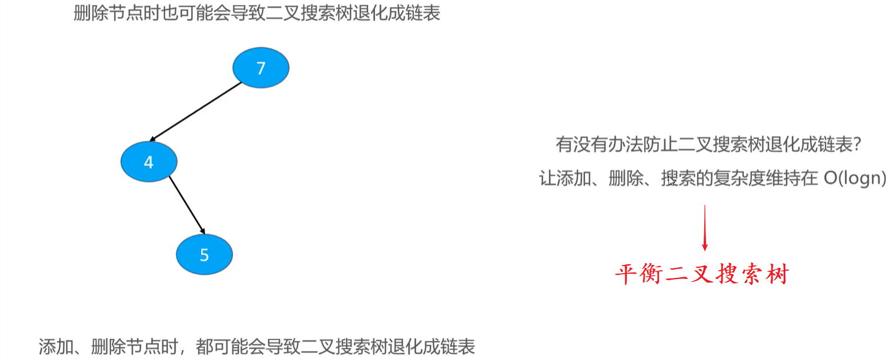

### 理解

二叉搜索树是二叉树的一种，是应用非常广泛的一种二叉树，英文简称为 BST。

- 又被称为：二叉查找树、二叉排序树

- 任意一个节点的值都大于其左子树所有节点的值

- 任意一个节点的值都小于其右子树所有节点的值

- 它的左右子树也是一棵二叉搜索树

二叉搜索树可以大大提高搜索数据的效率

二叉搜索树存储的元素必须具备可比较性

- 比如 int、double 等
- 如果是自定义类型，需要指定比较方式 
- 不允许为 null

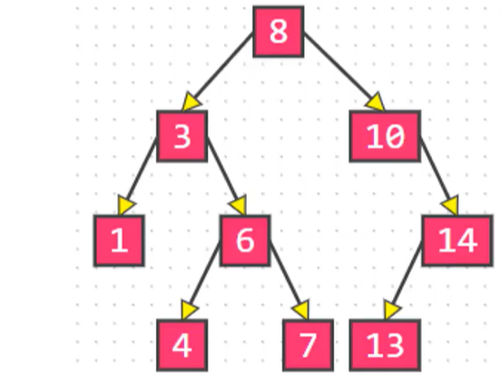

### 接口设计

由于二叉搜索树继承于二叉树，只需要实现添加，删除，包含的接口

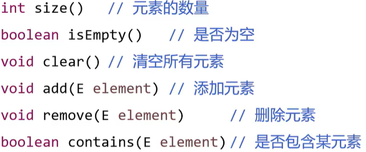

> 注意：对于当前使用的二叉树来说，它的元素没有索引的概念。

### 图解

添加节点

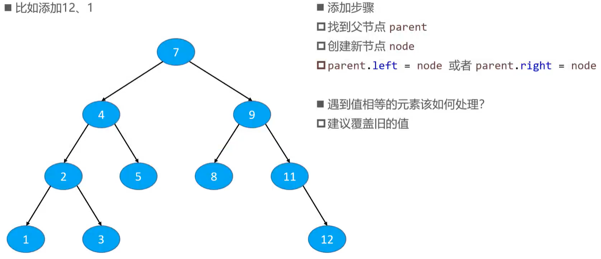

删除节点

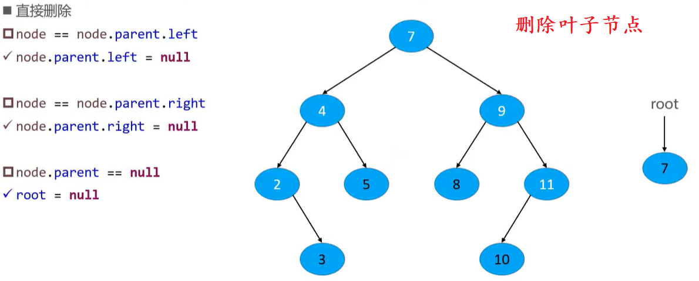

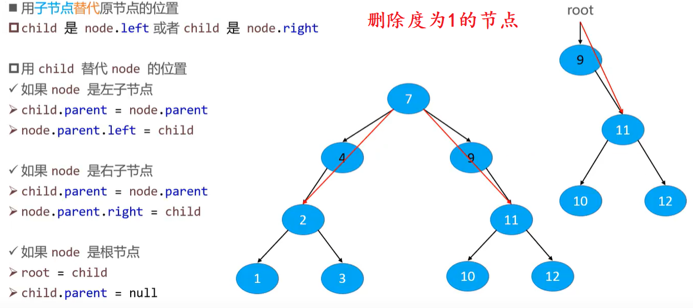

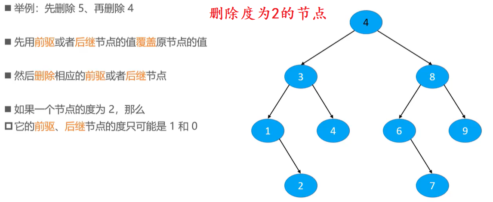

### 代码实现

```java
/**
 * @Description 二叉搜索树
 * @Author monap
 * @Date 2021/10/10 20:17
 */
@SuppressWarnings("unchecked")
public class BSTree<E> extends BinaryTree<E> {
    /**
     * 比较器定制排序
     */
    protected Comparator<E> comparator;

    public BSTree() {
        this(null);
    }

    public BSTree(Comparator<E> comparator) {
        this.comparator = comparator;
    }

    /**
     * 检查添加元素是否为空
     */
    protected void elementNoNullCheck(E element) {
        if (element == null) {
            throw new IllegalArgumentException("element must no be null!");
        }
    }

    /**
     * 比较元素大小，返回值为0代表e1等于e2，大于0代表e1大于e2，小于0代表e1小于e2
     */
    protected int compare(E e1, E e2) {
        if (comparator != null) {
            return comparator.compare(e1, e2);
        }
        // 注意：不在上面写死（BinarySearchTree<E extends Comparable>），
        // 而是在这里进行强制转换,如果E没有实现此接口就会报错提醒。否则
        // 如果E没有实现此接口在编译时就会报错，我们希望两种比较方式都可以使用。
        return ((Comparable<E>) e1).compareTo(e2);
    }

    /**
     * 添加元素
     */
    public void add(E element) {
        elementNoNullCheck(element);
        // 添加第一个节点（根节点）
        if (root == null) {
            root = createNode(element, null);
            size++;
            // 新添加节点之后的处理
            afterAdd(root);
            return;
        }
        // 如果添加的不是第一个节点：
        // 1.找到待添加位置的父节点
        Node<E> parent = root;
        Node<E> node = root;
        int cmp = 0;
        while (node != null) {
            cmp = compare(element, node.element);
            parent = node;
            if (cmp > 0) {
                node = node.right;
            } else if (cmp < 0) {
                node = node.left;
            } else {
                // 一般覆盖（不同对象可能有相同的比较参数）
                node.element = element;
                return;
            }
        }
        // 2.判断插入父节点的左子节点还是右子节点
        Node<E> newNode = createNode(element, parent);
        if (cmp > 0) {
            parent.right = newNode;
        } else {
            parent.left = newNode;
        }
        size++;
        // 新添加节点之后的处理
        afterAdd(newNode);
    }

    /**
     * 添加node节点后所需要做的调整（二叉搜索树不需要调整）
     */
    protected void afterAdd(Node<E> node) {
    }

    /**
     * 删除元素
     */
    public void remove(E element) {
        remove(node(element));
    }

    /**
     * 根据元素找到对应节点
     */
    protected Node<E> node(E element) {
        Node<E> node = root;
        while (node != null) {
            int cmp = compare(element, node.element);
            if (cmp == 0) {
                return node;
            }
            if (cmp > 0) {
                node = node.right;
            } else {
                node = node.left;
            }
        }
        return null;
    }

    /**
     * 删除对应节点
     */
    protected void remove(Node<E> node) {
        if (node == null) {
            return;
        }
        size--;
        // 考虑度为2的节点，转化为度为1
        if (node.hasTwoChildren()) {
            // 后继节点
            Node<E> s = successor(node);
            // 用后继节点的值覆盖度为2的节点的值
            node.element = s.element;
            // 删除后继节点
            node = s;
        }
        // 删除node节点（能到这则说明node的度必为0或1）
        Node<E> replacement = node.left != null ? node.left : node.right;
        // node是度为1的节点
        if (replacement != null) {
            //更改parent
            replacement.parent = node.parent;
            // 更改parent的left，right指向
            // node是度为1的节点也是根节点
            if (node.parent == null) {
                root = replacement;
            } else if (node == node.parent.left) {
                node.parent.left = replacement;
            } else {
                // 在右边
                node.parent.right = replacement;
            }
            // 此时开始恢复平衡(AVL树 或 RB树需要实现此方法)
            afterRemove(node, replacement);
        } else if (node.parent == null) {
            // node是叶子节点也是根节点
            root = null;
            afterRemove(node, null);
        } else {
            // node是叶子节点但不是根节点
            if (node == node.parent.left) {
                node.parent.left = null;
            } else {
                node.parent.right = null;
            }
            // 此时开始恢复平衡(AVL树 或RB树 需要实现此方法)
            afterRemove(node, null);
        }
    }

    /**
     * 删除node节点后所需要做的调整（二叉搜索树不需要调整）
     */
    protected void afterRemove(Node<E> node, Node<E> replacement) {
    }

    /**
     * 是否包含某元素
     */
    public boolean contains(E element) {
        return node(element) != null;
    }
}
```

### 测试

```java
public class BSTreeTest {
	@Test
	public void test() {
		//测试二叉树打印工具
		//  ┌─_A_─┐
		//  │     │
		// _B_   _C_
		BinaryTrees.println(new BinaryTreeInfo() {
			@Override
			public Object string(Object node) {
				return "_" + node.toString() + "_";
			}
			
			@Override
			public Object root() {
				return "A";
			}
			
			@Override
			public Object right(Object node) {
				if(node.equals("A")) return "C";
				return null;
			}
			
			@Override
			public Object left(Object node) {
				if(node.equals("A")) return "B";
				return null;
			}
		});
	}
	
	@Test
	public void test1() {
		// 自然排序
		Integer[] data = new Integer[] { 7, 4, 9, 2, 5, 8, 11, 3, 12, 1 };
		BSTree<Integer> bst = new BSTree<>();
		for (int i = 0; i < data.length; i++) {
			bst.add(data[i]);
		}
		BinaryTrees.println(bst, PrintStyle.INORDER);
		String str = BinaryTrees.printString(bst);
		Files.writeToFile("D:/1.txt", str);
	}

	@Test
	public void test2() {
		// 定制排序
		Integer[] data = new Integer[] { 7, 4, 9, 2, 5, 8, 11, 3, 12, 1 };
		BSTree<Person> bst = new BSTree<>(new Comparator<Person>() {
			@Override
			public int compare(Person e1, Person e2) {
				return e2.getAge() - e1.getAge();
			}
		});
		for (int i = 0; i < data.length; i++) {
			bst.add(new Person(data[i]));
		}
		BinaryTrees.println(bst);
	}
	
	@Test
	public void test3() {
		//遍历测试
		Integer[] data = new Integer[] { 7, 4, 2, 1, 3, 5, 9, 8, 11, 10, 12};
		BSTree<Integer> bst = new BSTree<>();
		for (int i = 0; i < data.length; i++) {
			bst.add(data[i]);
		}
		BinaryTrees.println(bst);
		BinaryTrees.println(bst);
		//测试前序遍历（递归）
		System.out.println("前序遍历：");
		bst.preorderTraversal(new Visitor<Integer>() {
			public boolean visit(Integer element) {
				System.out.print(element + " ");
				return element == 2 ? true : false;//遍历到值为2停止
			}
		});
		System.out.println();
		//测试中序遍历（递归）
		System.out.println("中序遍历：");
		bst.inorderTraversal(new Visitor<Integer>() {
			public boolean visit(Integer element) {
				System.out.print(element + " ");
				return element == 4 ? true : false;//遍历到值为4停止
			}
		});
		System.out.println();
		//测试后序遍历（递归）
		System.out.println("后序遍历：");
		bst.postorderTraversal(new Visitor<Integer>() {
			public boolean visit(Integer element) {
				System.out.print(element + " ");
				return element == 4 ? true : false;//遍历到值为4停止
			}
		});
		System.out.println();
		//测试层序序遍历（队列）
		System.out.println("层序遍历：");
		bst.levelOrderTraversal(new Visitor<Integer>() {
			public boolean visit(Integer element) {
				System.out.print(element + "_ ");
				return false;//遍历所有
			}
		});
	}
	
	@Test
	public void test4() {
		//遍历的应用测试
		Integer[] data = new Integer[] { 7, 4, 9, 5, 2};
		BSTree<Integer> bst = new BSTree<>();
		for (int i = 0; i < data.length; i++) {
			bst.add(data[i]);
		}
		BinaryTrees.println(bst);
		//1.前序遍历的应用：展示树状结构(其他遍历方式也可以展示树状结构)
		System.out.println(bst);
		//2.层序遍历的应用：计算二叉树的高度
		System.out.println("二叉树高度为：" + bst.height1());//递归方式
		System.out.println("二叉树高度为：" + bst.height2());//层序递归方式
		//3.层序遍历的应用：判断一颗树是否是完全二叉树
		System.out.println("当前二叉搜索树是否为完全二叉树：" + bst.isComplete());
		Integer[] data1 = new Integer[] { 7, 4, 9, 2, 1};
		BSTree<Integer> bst1 = new BSTree<>();
		for (int i = 0; i < data1.length; i++) {
			bst1.add(data1[i]);
		}
		BinaryTrees.println(bst1);
		System.out.println("当前二叉搜索树是否为完全二叉树：" + bst1.isComplete());
	}
	
	@Test
	public void test5() {
		//测试删除
		Integer[] data = new Integer[] { 7, 4, 9, 2, 5, 8, 11, 3, 12, 1 };
		BSTree<Integer> bst = new BSTree<>();
		for (int i = 0; i < data.length; i++) {
			bst.add(data[i]);
		}
		BinaryTrees.println(bst);
		bst.remove(7);
		BinaryTrees.println(bst);
	}
}

class Person implements Comparable<Person> {
	private int age;

	public Person() {
		
	}

	public Person(int age) {
		this.age = age;
	}

	public int getAge() {
		return age;
	}

	public void setAge(int age) {
		this.age = age;
	}

	@Override
	public int compareTo(Person e) {
		return age - e.age;
	}

	@Override
	public String toString() {
		return "age=" + age;
	}
}
```

```java
public class BSTreeTest {
    @Test
    public void comparatorTest() {
        BSTree<Person> personBSTree = getPersonBSTree();
        BinaryTrees.println(personBSTree, BinaryTrees.PrintStyle.INORDER);
        BinaryTrees.println(personBSTree, BinaryTrees.PrintStyle.LEVEL_ORDER);
    }

    @Test
    public void traversalTest() {
        BSTree<Person> personBSTree = getPersonBSTree();
        BinaryTrees.println(personBSTree, BinaryTrees.PrintStyle.LEVEL_ORDER);
        personBSTree.preorderTraversal(new BinaryTree.Visitor<Person>() {
            @Override
            public boolean visit(Person element) {
//                element.setHeight(element.getHeight() + 1);
                System.out.println(element.getHeight());
                if (element.getHeight() == 2.05) {
                    return true;
                }
                return false;
            }
        });
    }

    @Test
    public void preorderTraversalPrintTest() {
        BSTree<Person> personBSTree = getPersonBSTree();
        System.out.println(personBSTree.toString());
    }

    private BSTree<Person> getPersonBSTree() {
        BSTree<Person> personBSTree = new BSTree<>(new Comparator<Person>() {
            @Override
            public int compare(Person o1, Person o2) {
                return o1.getAge().compareTo(o2.getAge());
            }
        });
        personBSTree.add(new Person("张三",20,1.85));
        personBSTree.add(new Person("李四",16,2.05));
        personBSTree.add(new Person("王二",77,1.54));
        personBSTree.add(new Person("莫言",64,1.99));
        return personBSTree;
    }

    private class Person {
        private String name;
        private Integer age;
        private Double height;

        public Person() {

        }

        public Person(String name, Integer age, Double height) {
            this.name = name;
            this.age = age;
            this.height = height;
        }

        public String getName() {
            return name;
        }

        public void setName(String name) {
            this.name = name;
        }

        public Integer getAge() {
            return age;
        }

        public void setAge(Integer age) {
            this.age = age;
        }

        public Double getHeight() {
            return height;
        }

        public void setHeight(Double height) {
            this.height = height;
        }

        @Override
        public String toString() {
            return age.toString();
        }
    }
}
```

## AVL树

### 理解

`平衡因子（Balance Factor）`：某结点的左右子树的高度差(左 - 右)

AVL树的特点:

- 每个节点的平衡因子只可能是 1、0、-1（绝对值 ≤ 1，如果超过 1，称之为“失衡”）

- 每个节点的左右子树高度差不超过 1

- 搜索、添加、删除的时间复杂度是` O(logn)`   

> 说明：红黑树的添加删除后的旋转恢复平衡都是O(1)级别的。AVL树添加后的旋转恢复平衡是O(1)级别的，而删除后的旋转恢复平衡操作的最坏情况达到了O(logn)级别 

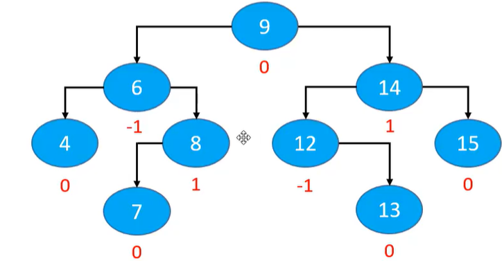

> 注意：
>
> ① AVL树是最早发明的自平衡二叉搜索树之一
>
> ② AVL 取名于两位发明者的名字 ：G. M. Adelson-Velsky 和 E. M. Landis（来自苏联的科学家）

### 继承机构

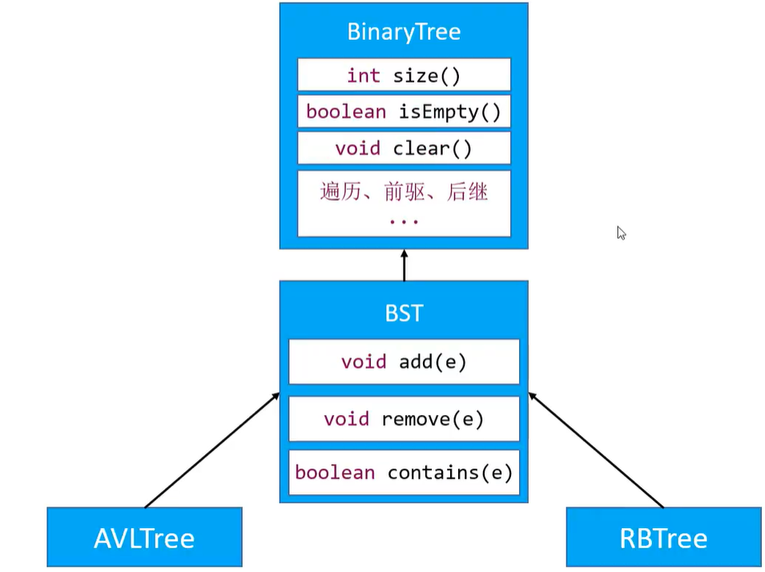

### 添加导致的失衡

示例：往下面这棵子树中添加 13

- 最坏情况：可能会导致所有祖先节点都失衡 

- 父节点、非祖先节点，都不可能失衡

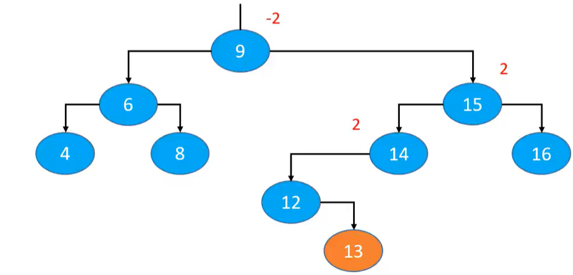

四种添加失衡情况及其处理（有且仅有四种）

- LL-g右旋转（单旋）

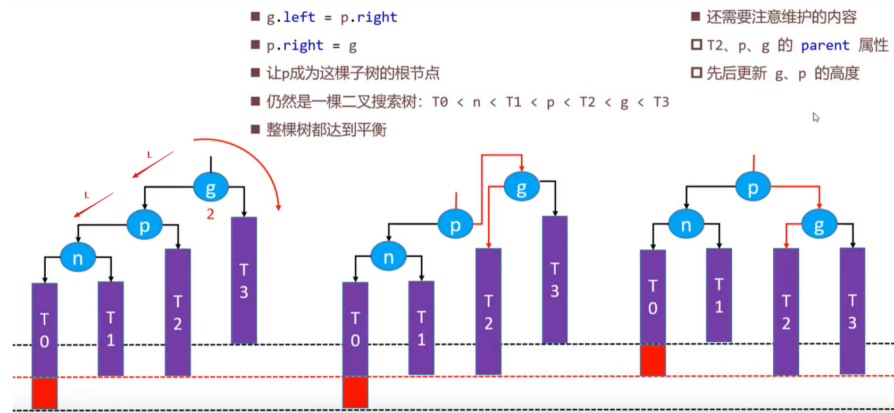

- RR-g左旋转（单旋）

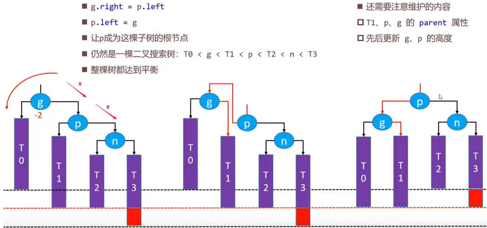

- LR-p左旋转，g右旋转(双旋)

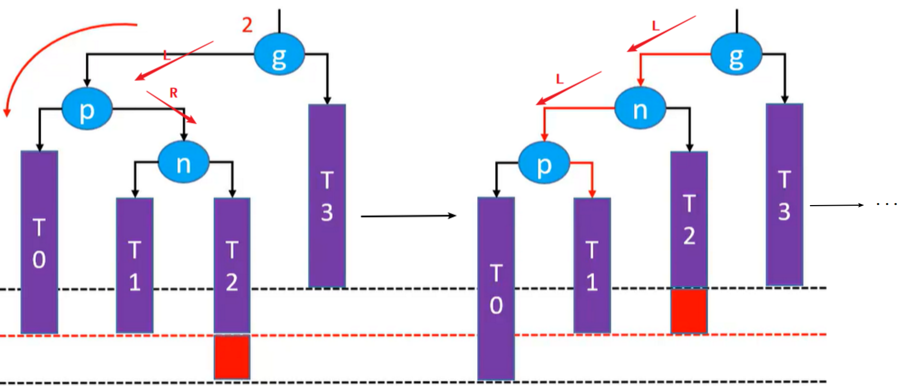

- RL-p右旋转，g左旋转(双旋）

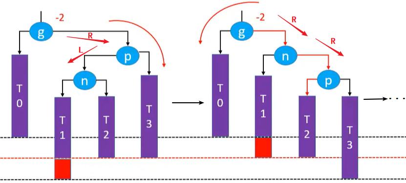

四种添加失衡情况的统一处理

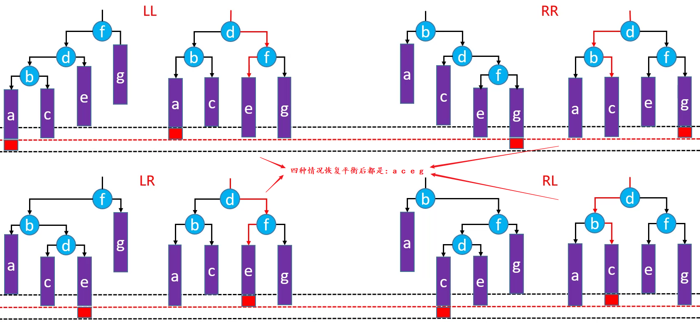

### 删除导致的失衡

示例：删除下面这棵树的16

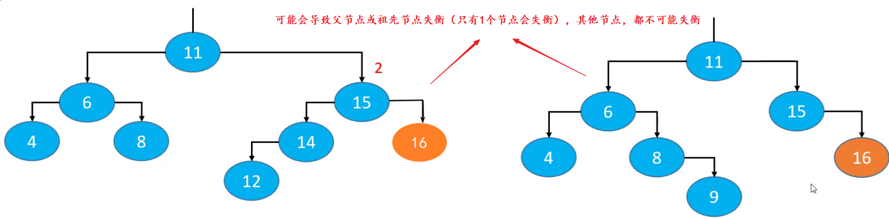

删除后需要使用 LL-右旋转 解决失衡的情况

- 如果绿色节点不存在，更高层的祖先节点可能也会失衡，需要再次恢复平衡，然后又可能导致更高层的祖先节点失衡... 
- 极端情况下，所有祖先节点都需要进行恢复平衡的操作，共 O(logn) 次调整

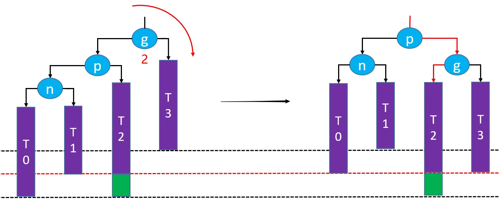

删除后需要使用 RR-左旋转 解决失衡的情况

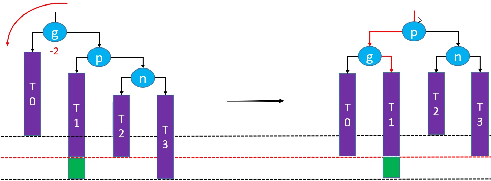

删除后需要使用 LR-p左旋转，g右旋转(双旋) 解决失衡的情况

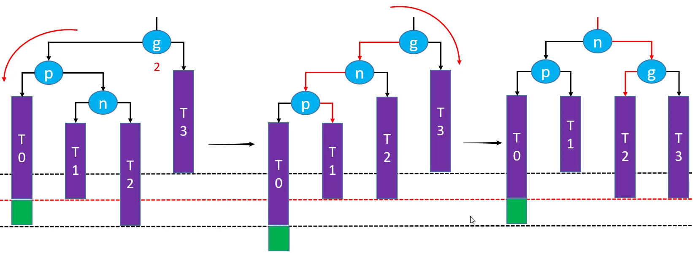

删除后需要使用 RL-p右旋转，g左旋转(双旋） 解决失衡的情况

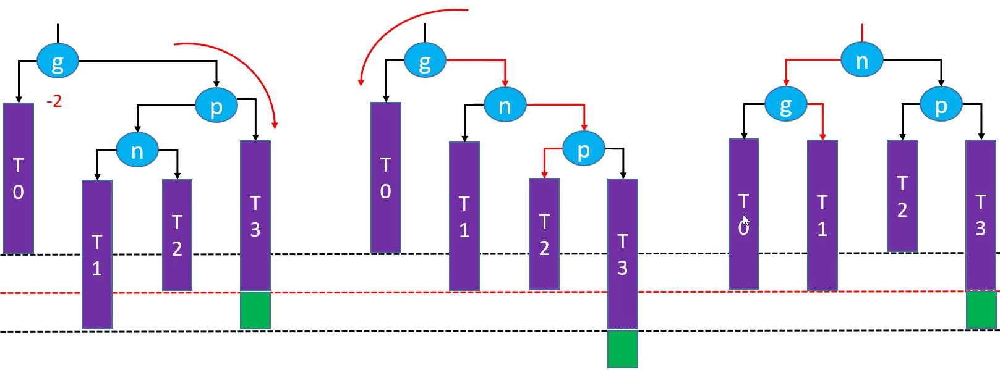

### 总结

添加

- 可能会导致 `所有祖先节点` 都失衡

- 只要让高度最低的失衡节点恢复平衡，整棵树就恢复平衡【`仅需 O(1) 次调整`】

删除

- 可能会导致父节点或祖先节点失衡（`只有1个节点会失衡`）

- 恢复平衡后，可能会导致更高层的祖先节点失衡【`最多需要 O(logn) 次调整`】 

平均时间复杂度

- 搜索：O(logn) 

- 添加：O(logn)，仅需 O(1) 次的旋转操作

- 删除：O(logn)，最多需要 O(logn) 次的旋转操作

### 代码实现

**平衡二叉搜索树**

```java
/**
 * @Description 平衡二叉搜索树
 * @author Polaris
 * @version
 * @date 2020年3月10日下午8:33:51
 */
public class BBSTree<E> extends BSTree<E>{
	
	public BBSTree() {
		this(null);
	}

	public BBSTree(Comparator<E> comparator) {
		super(comparator);
	}
	
	/**
	 *	左旋转，以RR为例
	 */
	protected void rotateLeft(Node<E> grand) {
		Node<E> parent = grand.right;
		Node<E> child = parent.left;//child就是T1子树
		grand.right = child;
		parent.left = grand;
		
		afterRotate(grand, parent, child);
	}
	
	/**
	 *	右旋转，以LL为例
	 */
	protected void rotateRight(Node<E> grand) {
		Node<E> parent = grand.left;
		Node<E> child = parent.right;
		grand.left = child;
		parent.right = grand;
		
		afterRotate(grand, parent, child);
	}
	
	/**
	 * 	抽取左旋转和右旋转中的重复代码
	 */
	protected void afterRotate(Node<E> grand,Node<E> parent,Node<E> child) {
		//更新parent的parent（让parent成为子树的根节点）
		parent.parent = grand.parent;
		if(grand.isLeftChild()) {
			grand.parent.left = parent;
		} else if(grand.isRightChild()) {
			grand.parent.right = parent;
		} else { //grand是root节点
			root = parent;
		}
		//更新child的parent
		if(child != null) {
			child.parent = grand;		
		}
		//更新grand的parent
		grand.parent = parent;
	}
	
	/**
	 * 	统一旋转
	 */
	protected void rotate(
			Node<E> r, //之前的根节点
			Node<E> a,Node<E> b,Node<E> c,
			Node<E> d,
			Node<E> e,Node<E> f,Node<E> g) {
		//让d成为这棵子树的根节点
		d.parent = r.parent;
		if(r.isLeftChild()) {
			r.parent.left = d;
		} else if(r.isRightChild()) {
			r.parent.right = d;
		} else {
			root = d;
		}
		//处理a,b,c之间的关系
		b.left = a;
		if(a != null) {
			a.parent = b;
		}
		b.right = c;
		if(c != null) {
			c.parent = b;
		}
		
		//处理e,f,g之间的关系
		f.left = e;
		if(e != null) {
			e.parent = f;
		}
		f.right = g;
		if(g != null) {
			g.parent = f;
		}
		
		//处理b,d,f之间的关系
		d.left = b;
		d.right = f;
		b.parent = d;
		f.parent = d;
	}
	
}
```

**AVL树**

```java
/**
 * @Description AVL树
 * @author Polaris
 * @version
 * @date 2020年3月10日下午8:35:05
 */
public class AVLTree<E> extends BBSTree<E> {
	
	public AVLTree() {
		this(null);
	}

	public AVLTree(Comparator<E> comparator) {
		super(comparator);
	}
	
	/**
	 * AVL树特有的节点，多了height属性用于计算平衡因子
	 */
	private static class AVLNode<E> extends Node<E> {
		//每个新添加的未经过处理的节点必然是叶子节点（高度默认为 1）
		int height = 1;//AVL树平衡因子：左子树高度 - 右子树高度（默认为叶子节点的高度1）
		
		public AVLNode(E element, Node<E> parent) {
			super(element, parent);
		}
		
		/*
		 * 	更新当前节点自己的高度
		 */
		public void updateHeight() {
			int leftHeight = left == null ? 0 : ((AVLNode<E>)left).height;
			int rightHeight = right == null ? 0 : ((AVLNode<E>)right).height;
			height = 1 + Math.max(leftHeight, rightHeight);
		}
		
		/*
		 * 	获取当前节点的平衡因子
		 */
		public int balanceFactor() {
			int leftHeight = left == null ? 0 : ((AVLNode<E>)left).height;
			int rightHeight = right == null ? 0 : ((AVLNode<E>)right).height;
			return leftHeight - rightHeight;
		}
		
		/*
		 * 	获取当前节点高度更高一点的子树
		 */
		public Node<E> tallerChild() {
			int leftHeight = left == null ? 0 : ((AVLNode<E>)left).height;
			int rightHeight = right == null ? 0 : ((AVLNode<E>)right).height;
			if(leftHeight > rightHeight) return left;
			if(leftHeight < rightHeight) return right;
			//当左右子树相等时，就返回和当前节点同方向(比如当前节点parent的左子树)的子树
			return isLeftChild() ? left :right;
		}
		
		@Override
		public String toString() {
			String parentString = "null";
			if (parent != null) {
				parentString = parent.element.toString();
			}
			return element + "_p(" + parentString + ")_h(" + height + ")";
		}
	}
	
	/**
	 * 	重写createNode，用于创建AVL特有的AVL节点
	 */
	@Override
	protected Node<E> createNode(E element, Node<E> parent) {
		return new AVLNode<>(element, parent);
	}
	
	/**
	 * 	实现添加新节点后的处理操作(通过当前节点找到失衡节点进行调整)
	 */
	@Override
	protected void afterAdd(Node<E> node) {
		while ((node = node.parent) != null) {
			if (isBalanced(node)) {	//如果平衡
				//更新高度（如果采用递归更新高度效率太差，直接在找parent失衡节点时就更新高度）
				updateHeight(node);
			} else {	//如果不平衡(记得要在恢复平衡时更新高度)
				// 恢复平衡
				rebalance(node);
				break;//找到一个不平衡节点恢复平衡则整棵树都平衡
			}
		}
	}
	
	@Override
	protected void afterRemove(Node<E> node,Node<E> replacement) {
		while ((node = node.parent) != null) {
			if (isBalanced(node)) {	//如果平衡
				//更新高度（如果采用递归更新高度效率太差，直接在找parent失衡节点时就更新高度）
				updateHeight(node);
			} else {	//如果不平衡(记得要在恢复平衡时更新高度)
				// 恢复平衡
				rebalance(node);
			}
		}
	}
	
	/**
	 * 	判断当前节点是否平衡
	 */
	private boolean isBalanced(Node<E> node) {
		return Math.abs(((AVLNode<E>)node).balanceFactor()) <= 1;
	}
	
	/**
	 * 	更新某个节点的高度(将强制转换封装为方法)
	 */
	private	void updateHeight(Node<E> node) {
		((AVLNode<E>)node).updateHeight();
	}
	
	//————————方式一：分开处理——————————
	/**
	 * 	恢复平衡（四种失衡情况单独处理）
	 * @param node 高度最低的那个不平衡节点
	 */
	private void rebalance(Node<E> grand) {
		//p是g左右子树中高度较高的子树
		Node<E> parent = ((AVLNode<E>)grand).tallerChild();
		//n是p左右子树中高度较高的子树
		Node<E> node = ((AVLNode<E>)parent).tallerChild();
		if(parent.isLeftChild()) { //L
			if(node.isLeftChild()) { //LL
				rotateRight(grand);//g左旋转
			} else { //LR
				rotateLeft(parent);//p左旋转
				rotateRight(grand);//g右旋转
			}
		} else { //R
			if(node.isLeftChild()) { //RL
				rotateRight(parent);//p右旋转
				rotateLeft(grand);//g左旋转
			} else { //RR
				rotateLeft(grand);
			}
		}
	}
	
	@Override
	protected void afterRotate(Node<E> grand, Node<E> parent, Node<E> child) {
		super.afterRotate(grand, parent, child);
		//更新高度
		updateHeight(grand);//g比较矮
		updateHeight(parent);//p比较高
	}
	
	//————————方式二：统一处理————————
	/**
	 * 	恢复平衡（四种失衡情况一起处理）
	 * @param node 高度最低的那个不平衡节点
	 */
	private void rebalance2(Node<E> grand) {
		//p是g左右子树中高度较高的子树
		Node<E> parent = ((AVLNode<E>)grand).tallerChild();
		//n是p左右子树中高度较高的子树
		Node<E> node = ((AVLNode<E>)parent).tallerChild();
		if(parent.isLeftChild()) { //L
			if(node.isLeftChild()) { //LL
				rotate(grand,node.left,node,node.right, 
						parent,parent.right,grand,grand.right);
			} else { //LR
				rotate(grand,parent.left,parent,node.left,
						node,node.right,grand,grand.right);
			}
		} else { //R
			if(node.isLeftChild()) { //RL
				rotate(grand,grand.left,grand,node.left,
						node,node.right,parent,parent.right);
			} else { //RR
				rotate(grand,grand.left,grand,parent.left,
						parent,node.left,node,node.right);
			}
		}
	}
	
	@Override
	protected void rotate(Node<E> r, Node<E> a, Node<E> b, Node<E> c, Node<E> d, Node<E> e, Node<E> f, Node<E> g) {
		super.rotate(r, a, b, c, d, e, f, g);
		//更新高度
		updateHeight(b);
		updateHeight(f);
		updateHeight(d);
	}
}
```

### 测试

```java
public class AVLTreeTest {
	//添加删除测试
	@Test
	public void test() {
		Integer[] data = new Integer[] {
				67,52,92,96,53,95,13,63,34,82,76,54,9,68,39};
		AVLTree<Integer> avl = new AVLTree<>();
		for (int i = 0; i < data.length; i++) {
			avl.add(data[i]);
		}
		BinaryTrees.println(avl);
		for (int i = 0; i < data.length; i++) {
			avl.remove(data[i]);
			System.out.println("----------------------------");
			System.out.println("【" + data[i] + "】");
			BinaryTrees.println(avl);
		}
	}
}
```

## B树

### 理解

B树 是一种 `平衡的多路搜索树`，多用于文件系统、数据库的实现

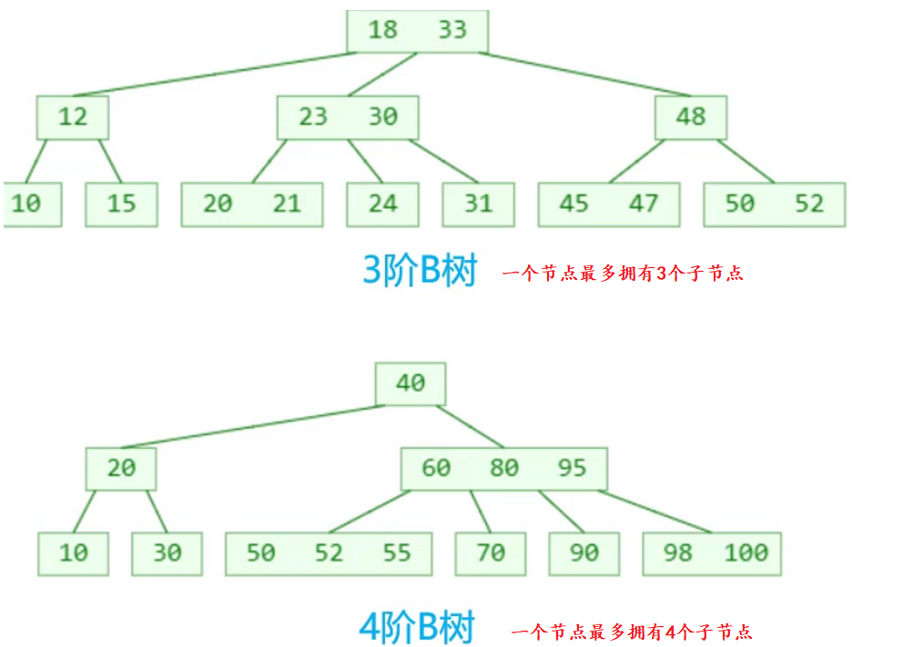

仔细观察B树，有什么眼前一亮的特点？

- 1 个节点可以存储超过 2 个元素、可以拥有超过 2 个子节点 

- 拥有二叉搜索树的一些性质

- 平衡，每个节点的所有子树高度一致

- 比较矮

> 数据库中一般使用 200 ~ 300 阶B树

### m阶B树的性质

> 规定的B树必须要遵守的一些性质

假设一个节点存储的元素个数为 x

- 根节点：**1 ≤ x ≤ m − 1**

- 非根节点：**┌ m/2 ┐ − 1 ≤ x ≤ m − 1**  （┌ ┐ => 向上取整）

- 如果有子节点，子节点个数 ：**y = x + 1**

  - 根节点：**2 ≤ y ≤ m**

  - 非根节点：**┌ m/2 ┐ ≤ y ≤ m** 

    ➢ 比如 m = 3，2 ≤ y ≤ 3，因此可以称为（2, 3）树、2-3树 
    ➢ 比如 m = 4，2 ≤ y ≤ 4，因此可以称为（2, 4）树、2-3-4树 
    ➢ 比如 m = 5，3 ≤ y ≤ 5，因此可以称为（3, 5）树 
    ➢ 比如 m = 6，3 ≤ y ≤ 6，因此可以称为（3, 6）树 
    ➢ 比如 m = 7，4 ≤ y ≤ 7，因此可以称为（4, 7）树

### B树 与二叉搜索树 的关系

B树 和 二叉搜索树，在逻辑上是等价的

多代节点合并，可以获得一个 **超级节点**

- 2代合并的超级节点，最多拥有 4 个子节点（至少是 4阶B树）

- 3代合并的超级节点，最多拥有 8 个子节点（至少是 8阶B树）

- n代合并的超级节点，最多拥有 2^n 个子节点（ 至少是 2^n 阶B树）

m阶B树，最多需要 log2m 代合并

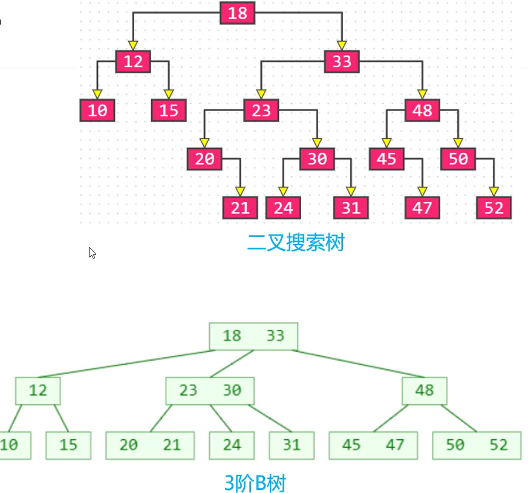

### B树搜索

跟二叉搜索树的搜索类似

- 先在节点内部从小到大开始搜索元素

- 如果命中，搜索结束 

- 如果未命中，再去对应的子节点中搜索元素，重复步骤 1

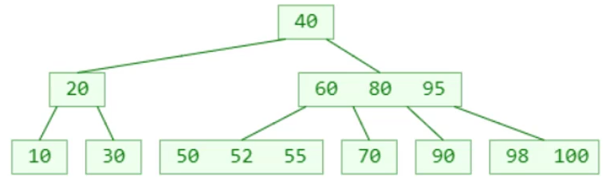

### B树添加

新添加的元素必定是添加到 叶子节点 中   √ 	红黑树会用到这个结论

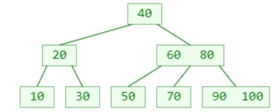

- 插入55
  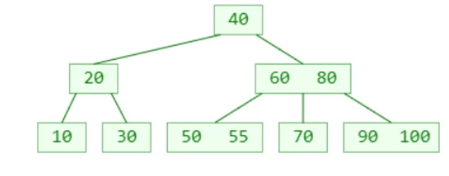
- 插入98

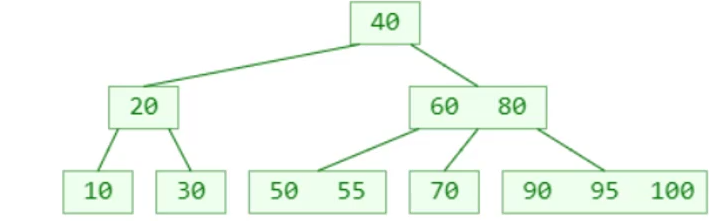

- 再插入 98 呢？（假设这是一棵 4阶B树）

  - 最右下角的叶子节点的元素个数将超过限制
  - 这种现象可以称之为：**上溢（overflow）**

添加 – 上溢的解决(假设5阶)

- 上溢节点的元素个数必然等于 m

- 假设上溢节点最中间元素的位置为 k

  - 将 k 位置的元素向上与父节点合并

  - 将 [0, k-1] 和 [k + 1, m - 1] 位置的元素分裂成 2 个子节点 

    - 这 2 个子节点的元素个数，必然都不会低于最低限制（┌ m/2 ┐ − 1）

- 一次分裂完毕后，有可能导致父节点上溢，依然按照上述方法解决

  - 最极端的情况，有可能一直分裂到根节点。如果一直传播到根节点就会导致B树变高(仅此一种情况导致B树变高)

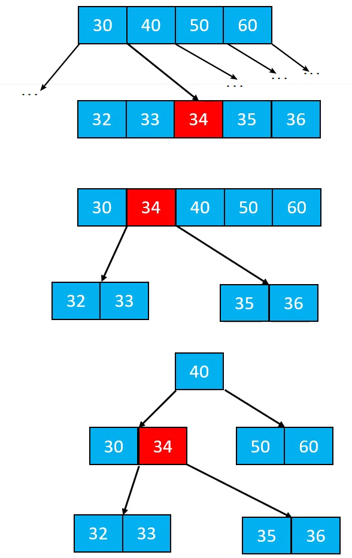

插入98

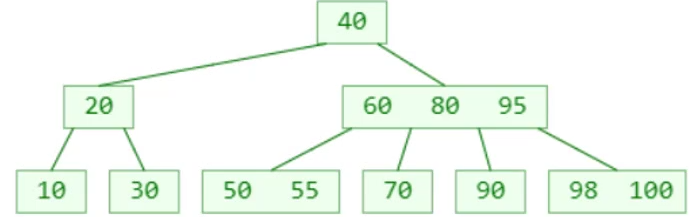

插入52

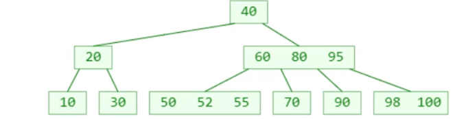

插入54

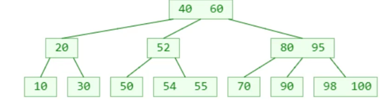

### B树删除

如果需要删除的元素在 叶子节点 中，那么直接删除即可

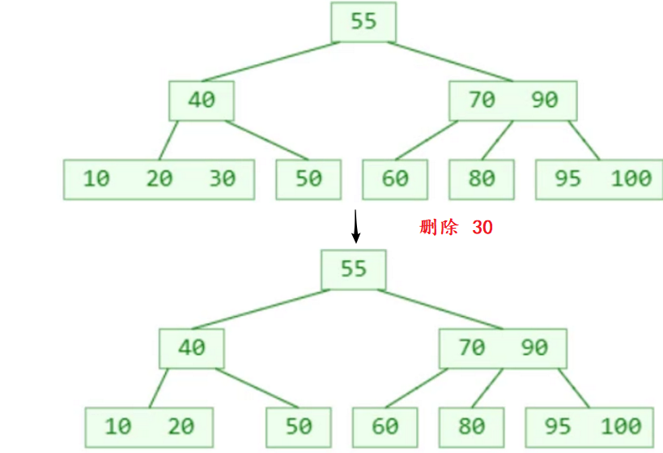

如果需要删除的元素在 非叶子节点 中

- 先找到前驱或后继元素，覆盖所需删除元素的值
- 再把前驱或后继元素删除

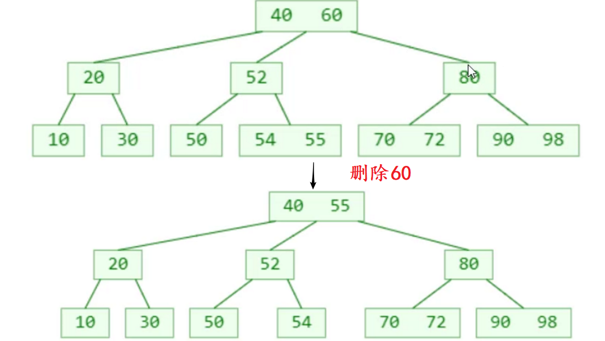

- `非叶子节点` 的前驱或后继元素，必定在 `叶子节点` 中
  - 所以这里的删除前驱或后继元素 ，就是最开始提到的情况：删除的元素在叶子节点中
  - `真正的删除元素都是发生在叶子节点中`  √红黑树会用到这个结论

删除-非叶子节点的 下溢 现象

- 删除 22 ？（假设这是一棵 5阶B树） 

  - 叶子节点被删掉一个元素后，元素个数可能会低于最低限制( 即`┌ m/2 ┐−1` )
  - 这种现象称为：`**下溢（underflow）**`

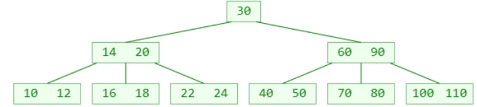

删除-非叶子节点的 下溢 解决

- 下溢节点的元素数量必然等于 `**┌ m/2 ┐ − 2**`

- 如果下溢节点临近的兄弟节点，有至少 `**┌ m/2 ┐** `个元素，可以向其借一个元素 

  - 将父节点的元素 `**b**` 插入到下溢节点的 `**0**` 位置（最小位置）
  - 用兄弟节点的元素 `**a**`（最大的元素）替代父节点的元素 **b**
  - 这种操作其实就是：`**旋转** ` 

> 注意：因为 b > a，所以不能破环二叉搜索树的性质直接将a放到下溢节点去。

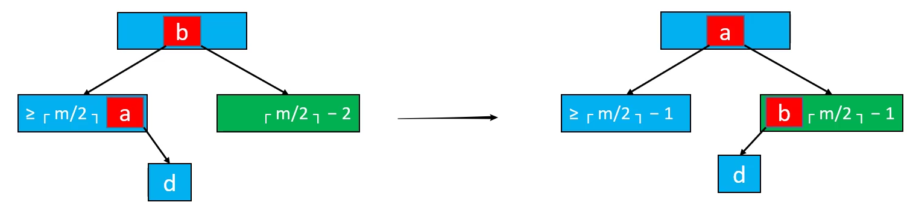

- 如果下溢节点临近的兄弟节点，只有 `**┌ m/2 ┐ − 1**` 个元素
- 将父节点的元素 **b** 挪下来跟左右子节点进行合并
- 合并后的节点元素个数等于`**┌ m/2 ┐ + ┌ m/2 ┐ − 2**`，不会超过 `**m − 1**` 上溢
- 这个操作可能会导致父节点下溢，依然按照上述方法解决，下溢现象可能会一直往上传播。`如果一直传播到根节点就会导致B树变矮(仅此一种情况导致B树变矮)`

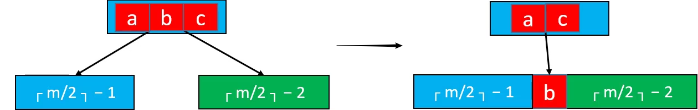

### 理解4阶b树

> "理解了4阶b树，将能更好的学习理解 红黑树"

4阶B树的性质

- 所有节点能存储的元素个数 x ：**1 ≤ x ≤ 3**
- 所有非叶子节点的子节点个数 y ：**2 ≤ y ≤ 4** 

添加

- 手绘 从 1 添加到 22

删除

- 手绘 从 1 删除到 22

## 红黑树

### 理解

红黑树也是一种 `自平衡的二叉搜索树`，以前也叫做平衡二叉B树（Symmetric Binary B-tree）。

**红黑树必须满足以下 5 条性质 **

- 节点是 `RED` 或者 `BLACK` 
- 根节点是 `BLACK`
- 叶子节点（外部节点，空节点）都是 `BLACK`
- `RED` 节点的子节点都是 `BLACK 

  - `RED` 节点的 parent 都是 `BLACK` 

  - 从根节点到叶子节点的所有路径上不能有 2 个连续的 `RED` 节点
- 从任一节点到叶子节点的所有路径都包含 `相同数目` 的 `BLACK` 节点

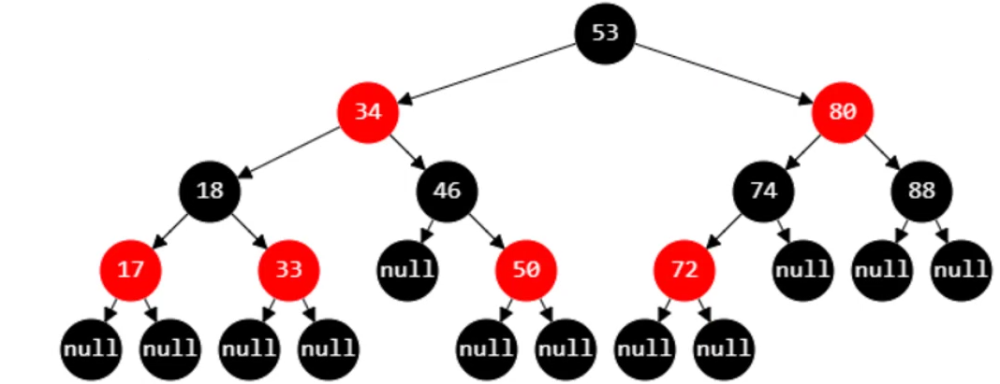

> 注意：红黑树的 `叶子节点` 是让原来度为 **0** 的节点或度为 **1** 的节点都变成度为 **2** 的节点后的叶子节点。（增加空节点 **null** 实现此功能）此时红黑树就变成了真二叉树。

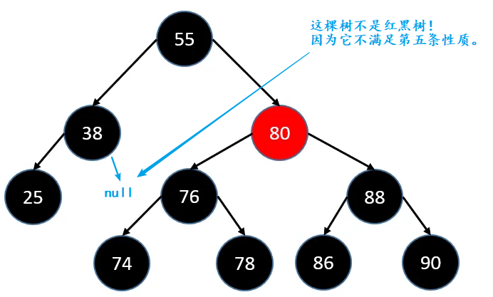

> 注意：之后展示的红黑树都会省略 null 节点 （空节点是假想出来的）

**红黑树的平衡** （为什么满足以上5条性质，就能保证红黑树是平衡的？）

- 以上5条性质，可以保证 红黑树 等价于 4阶B树

- 相比AVL树，红黑树的平衡标准比较宽松：`没有一条路径会大于其他路径的2倍 `

- 可以理解为是一种弱平衡、黑高度平衡 (任意一条路的黑节点数量都是相等的)

- 红黑树的最大高度是 2 ∗ log(n + 1) ，依然是 O(logn) 级别

**红黑树的平均时间复杂度**

- 搜索：O(logn)

- 添加：O(logn)，O(1) 次的旋转操作

- 删除：O(logn)，O(1) 次的旋转操作

**AVL树 对比 红黑树**

- AVL树

  - 平衡标准比较严格：`每个左右子树的高度差不超过1`

  - 最大高度是 1.44 ∗ log(n + 2) − 1.328（100W个节点，AVL树最大树高28）

  - 搜索、添加、删除都是 O(logn) 复杂度，其中添加仅需 O(1) 次旋转调整、删除最多需要 O(logn) 次旋转调整

- 红黑树
  - 平衡标准比较宽松：`没有一条路径会大于其他路径的2倍`

  - 最大高度是 2 ∗ log(n + 1)（ 100W个节点，红黑树最大树高40）
  - 搜索、添加、删除都是 O(logn) 复杂度，其中添加、删除都仅需 O(1) 次旋转调整


- 搜索的次数远远大于插入和删除，选择AVL树；搜索、插入、删除次数几乎差不多，选择红黑树

- 相对于AVL树来说，红黑树牺牲了部分平衡性以换取插入/删除操作时少量的旋转操作，整体来说性能要优于AVL树

- 红黑树的平均统计性能优于AVL树，实际应用中更多选择使用红黑树

### 红黑树的等价变换

红黑树 和 四阶B树(2-3-4树）具有等价性

`BLACK` 节点与它的 `RED` 子节点融合在一起，形成1个B树节点

红黑树的 `BLACK` 节点个数 与 4阶B树的节点总个数 相等

> 注意：用 2-3树 与 红黑树 进行类比，这是极其不严谨的，2-3树 并不能完美匹配 红 黑树 的所有情况

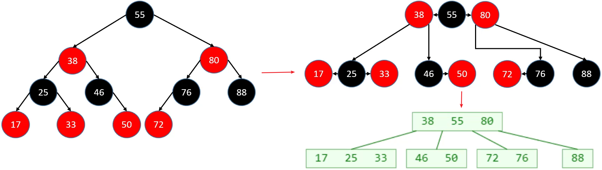

### 红黑树 与 2-3-4树 的比较

如果下图最底层的 BLACK 节点是不存在的，在B树中是什么样的情形？=>整棵B树只有1个节点，而且是超级节点

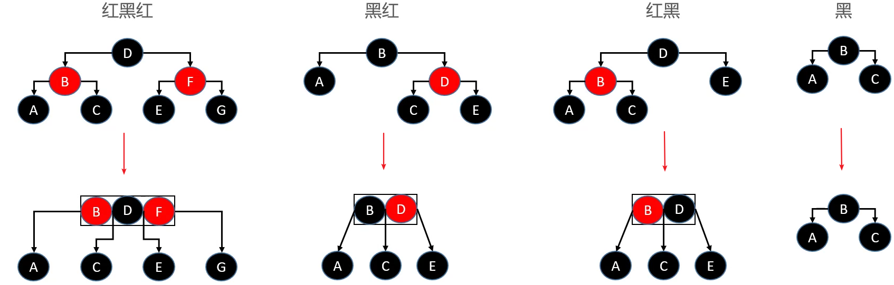

### 添加节点

已知：

-  B树中，新元素必定是添加到叶子节点中

-  4阶B树所有节点的元素个数 x 都符合 1 ≤ x ≤ 3

> 注意：
>
> ① 建议新添加的节点默认为 `RED`，这样能够让红黑树的性质尽快满足(性质1，2，3，5 都满足，性质 4 不一定)
>
> ② 如果添加的是根节点，染成 `BLACK` 即可

**添加的所有情况**

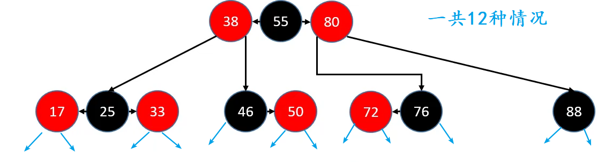

有 4 种情况既满足红黑树的性质四：parent 为 `BLACK`，同时也满足4阶B树的性质，因此不用做任何额外的处理。

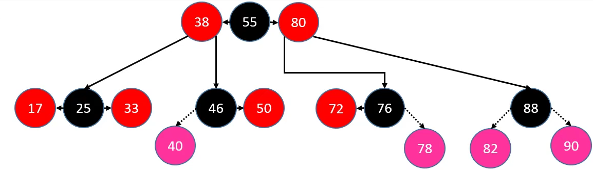

有 8 种情况不满足红黑树的性质四：parent 为 `RED`（ Double Red ），其中前 4 种属于B树节点上溢的情况

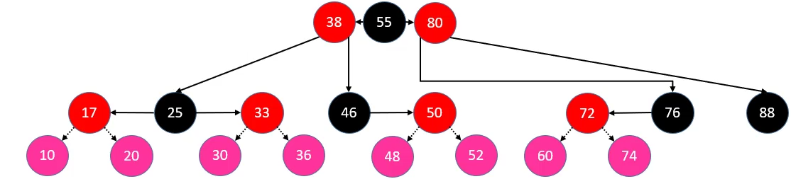

**添加 – 修复性质4 – LL\RR**

判定条件：uncle 不是 `RED`

- parent 染成 `BLACK`，grand 染成 `RED`

- grand 进行单旋操作： 

  - LL：右旋转
  - RR：左旋转

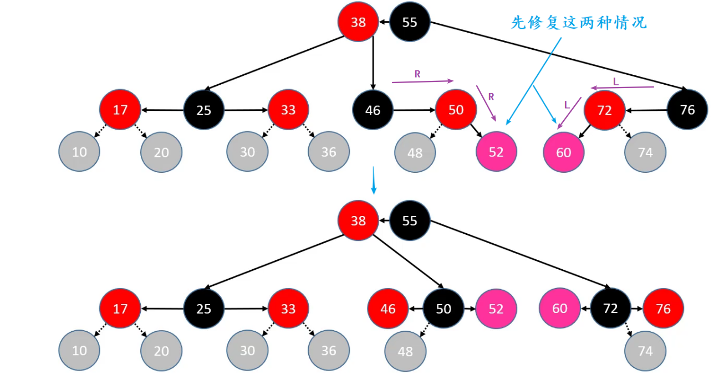

**添加 – 修复性质4 – LR\RL**

判定条件：uncle 不是 `RED`

- 自己染成 `BLACK`，grand 染成 `RED`

- 进行双旋操作：

  - LR：parent 左旋转， grand 右旋转
  - RL：parent 右旋转， grand 左旋转

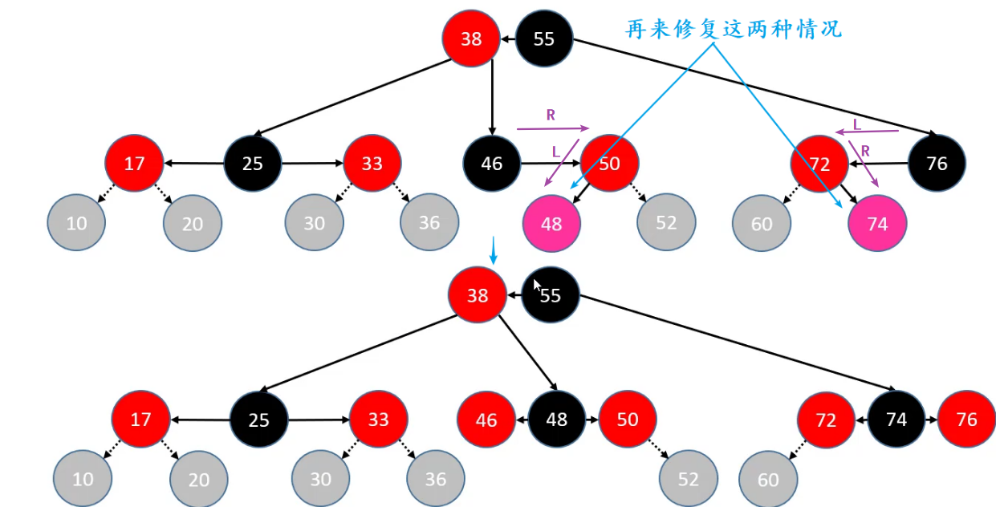

**添加 – 修复性质4 – 上溢 – LL**

> 注意：之前修复的四种情况，添加节点的叔父节点都为null(null默认记为黑色)。

判定条件：uncle 是 `RED`

- parent、uncle 染成 `BLACK`
- grand 向上合并，且染成 `RED`，当做是新添加的节点进行处理

grand 向上合并时，可能继续发生上溢

若上溢持续到根节点，只需将根节点染成 `BLACK`

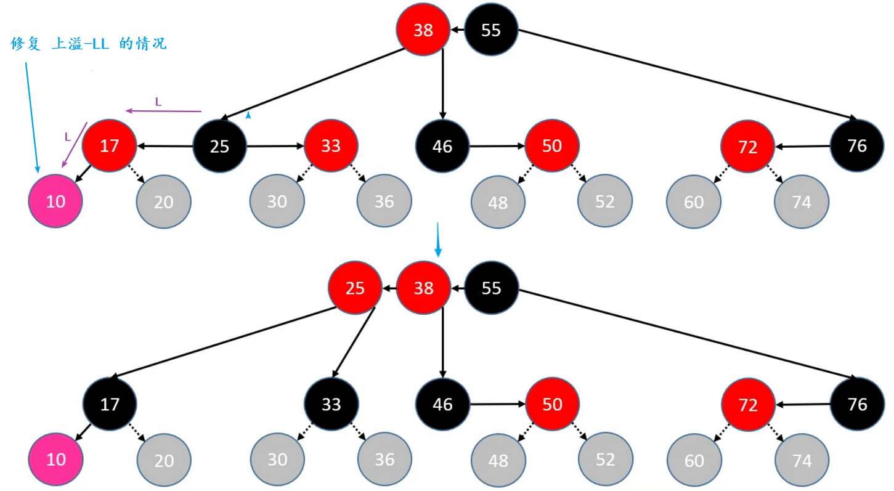

**添加 – 修复性质4 – 上溢 – RR**

判定条件：uncle 是 `RED`

- parent、uncle 染成 `BLACK`
- grand 向上合并，且染成 `RED`，当做是新添加的节点进行处理

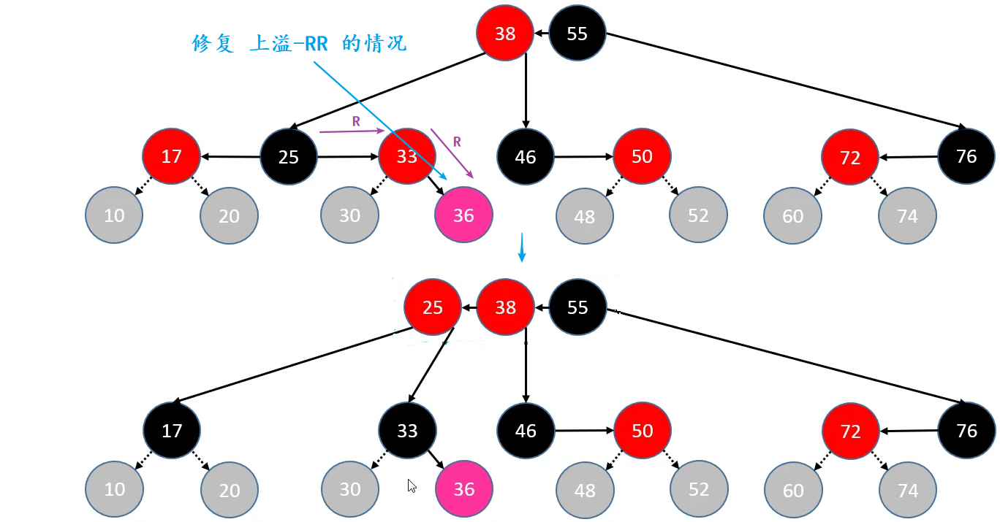

**添加 – 修复性质4 – 上溢 – LR**

判定条件：uncle 是 `RED`

- parent、uncle 染成 `BLACK`
- grand 向上合并，且染成 `RED`，当做是新添加的节点进行处理

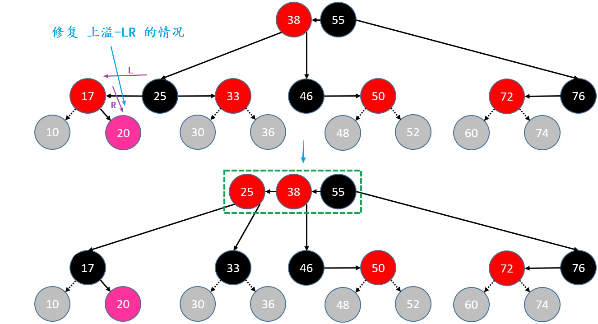

**添加 – 修复性质4 – 上溢 – RL**

判定条件：uncle 是 `RED`

- parent、uncle 染成 `BLACK`
- grand 向上合并，且染成 `RED`，当做是新添加的节点进行处理

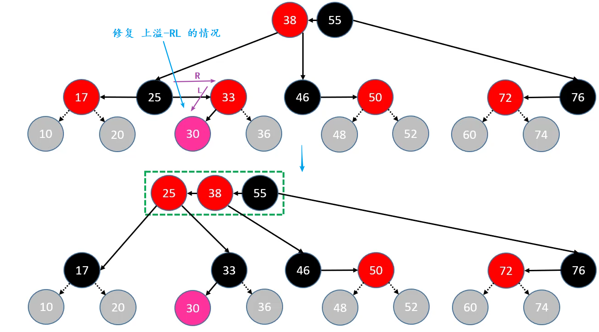

### 删除节点

> 已知：B树中，最后真正被删除的元素都在叶子节点中

**删除-RED节点**

直接删除，不用做任何调整

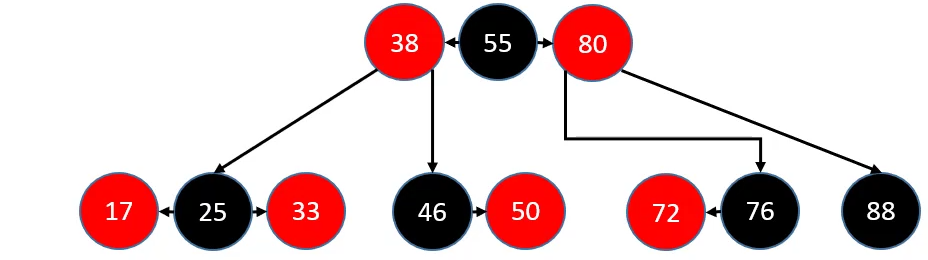

**删除 – BLACK 节点** （有 3 种情况）

删除拥有 2 个 `RED` 子节点的 `BLACK` 节点 （如 25）

- 不可能被直接删除，因为会找它的前驱节点或后继节点替代删除，在BSTree中已经实现了此功能因此也不用考虑这种情况

删除拥有 1 个 `RED` 子节点的 `BLACK` 节点 （如 46，76）

删除 `BLACK` 叶子节点 （如 88）

> 总结：删除后真正需要处理的只有两种情况：① 删除拥有 1 个 `RED` 子节点的 `BLACK` 节点 ② 删除 `BLACK` 叶子节点

**删除 - 拥有 1 个** **RED** **子节点的 BLACK 节点** 

判定条件：用以替代的子节点是 `RED`  	“注意：删除Black叶子节点，没有用于替代的就相当于用null(默认为Black)替代”

将替代的子节点染成 `BLACK` 即可保持红黑树性质

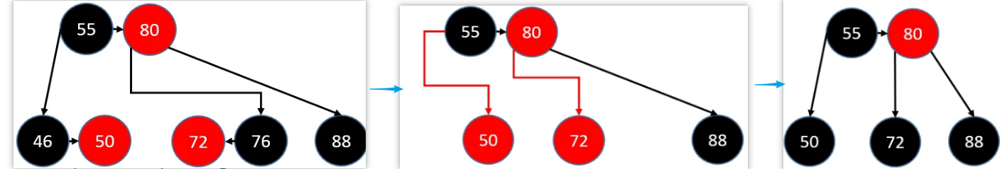

**删除 - BLACK 叶子节点 - sibling为 BLACK**

`BLACK` 叶子节点被删除后，会导致B树节点下溢（比如删除88）

判定条件：如果 sibling 至少有 1 个 `RED` 子节点

- 进行旋转操作
- 旋转之后的中心节点继承 parent 的颜色
- 旋转之后的左右节点染为 `BLACK`

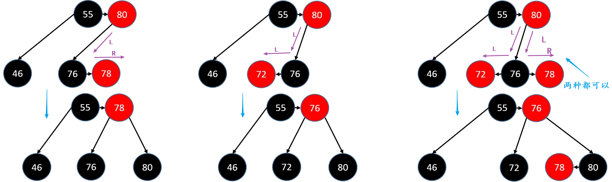

判定条件：如果 sibling 没有 `RED` 子节点

- 将 sibling 染成 `RED`、parent 染成 `BLACK` 即可修复红黑树性质 （合并）
- 如果 parent 是 `BLACK` 会导致 parent 也下溢，这时只需要把 parent 当做被删除的节点处理即可（递归）

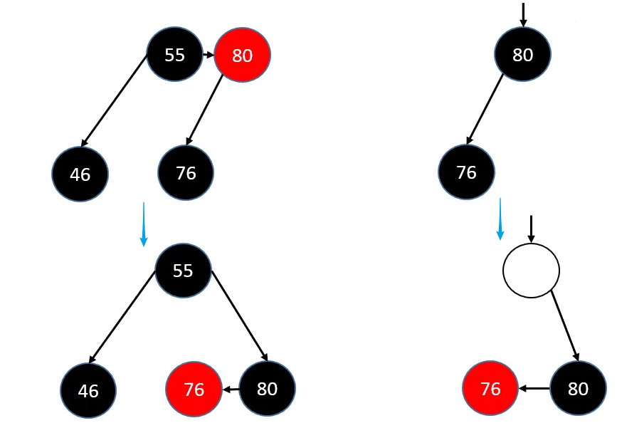

**删除 - BLACK 叶子节点 - sibling为** **RED**

如果 sibling 是 `RED`

- sibling 染成 `BLACK`，parent 染成 `RED`，进行旋转
- 于是又回到 sibling 是 `*BLACK` 的情况

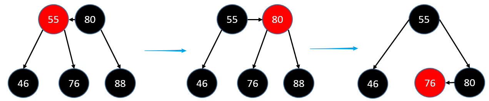

### 实现

```java
/**
 * @Description 红黑树
 * @author Polaris
 * @version
 * @date 2020年3月10日下午8:35:16
 */
public class RBTree<E> extends BBSTree<E>{
	private static final boolean RED = false;
	private static final boolean BLACK = true;
	
	public RBTree() {
		this(null);
	}

	public RBTree(Comparator<E> comparator) {
		super(comparator);
	}
	
	/**
	 * RB树特有的节点
	 */
	private static class RBNode<E> extends Node<E> {
		boolean color = RED;
		public RBNode(E element, Node<E> parent) {
			super(element, parent);
		}
		
		@Override
		public String toString() {
			String str = "";
			if(color == RED) {
				str = "R_";
			}
			return str + element.toString();
		}
	}
	
	@Override
	protected Node<E> createNode(E element, Node<E> parent) {
		return new RBNode<E>(element,parent);
	}
	
	/**
	 * 给节点上色
	 */
	private Node<E> color(Node<E> node,boolean color) {
		if(node == null) return node;
		((RBNode<E>)node).color = color;
		return node;
	}
	
	/**
	 * 将节点染成红色
	 */
	private Node<E> red(Node<E> node){
		return color(node,RED);
	}
	
	/**
	 * 将节点染成黑色
	 */
	private Node<E> black(Node<E> node){
		return color(node,BLACK);
	}
	
	/**
	 * 获取当前节点的颜色
	 */
	private boolean colorOf(Node<E> node) {
		return node == null ? BLACK : ((RBNode<E>)node).color;
	}
	
	/**
	 * 判断当前颜色是否为黑色
	 */
	private boolean isBlack(Node<E> node) {
		return colorOf(node) == BLACK;
	}
	
	/**
	 * 判断当前颜色是否为红色
	 */
	private boolean isRed(Node<E> node) {
		return colorOf(node) == RED;
	}

	/**
	 * 	实现添加新节点后的处理操作
	 */
	@Override
	protected void afterAdd(Node<E> node) {
		Node<E> parent = node.parent;
		//添加的是根节点 或 上溢到根节点
		if(parent == null) {
			black(node);
			return;
		}
		//类型一：parent是黑色（不用处理四种情况）
		if(isBlack(parent)) return;
		//类型二：parent是红色且uncle是红色（会上溢的四种情况）
		Node<E> uncle = parent.getSibling();
		Node<E> grand = red(parent.parent);//以下情况都需要将grand染成红色，可以统一处理
		if(isRed(uncle)) {
			black(parent);
			black(uncle);
			//把祖父节点当作是新添加的节点
			afterAdd(grand);//上溢递归调用
			return;
		}
		//类型三：parent是红色且uncle不是红色（需要旋转的四种情况）
		if(parent.isLeftChild()) {//L
			if(node.isLeftChild()) { //LL
				black(parent);
			} else { //LR
				black(node);
				rotateLeft(parent);
			}
			rotateRight(grand);
		} else { //R
			if(node.isLeftChild()) { //RL
				black(node);
				rotateRight(parent);
			} else { //RR
				black(parent);
			}
			rotateLeft(grand);
		}
	}
	
	/**
	 * 	实现删除节点后的处理操作
	 */
	@Override
	protected void afterRemove(Node<E> node,Node<E> replacement) {
		//情况一：如果删除的节点是红色，不用处理
		if(isRed(node)) return;
		//情况二：用于取代node子节点的是红色节点
		if(isRed(replacement)) {
			black(replacement);
			return;
		}
		//情况三：删除的是黑色叶子节点（下溢）
		Node<E> parent = node.parent;
		//删除的是根节点
		if(parent == null) return;
		//判断被删除的node的节点是左还是右
		boolean left = parent.left == null || node.isLeftChild();
		Node<E> sibling = left ? parent.right : parent.left;
		if(left) { //被删除的节点在左边，兄弟节点在右边(镜像对称处理)
			if(isRed(sibling)) { //兄弟节点是红色，就要转成黑色
				black(sibling);
				red(parent);
				rotateLeft(parent);
				//更换兄弟
				sibling = parent.right;
			}
			//兄弟节点必然是黑色
			if(isBlack(sibling.left) && isBlack(sibling.right)) {
				//兄弟节点没有一个红色子节点，父节点要向下向子节点合并
				boolean parentBlack = isBlack(parent);
				black(parent);
				red(sibling);
				if(parentBlack) {
					afterRemove(parent, null);
				}
			} else { //兄弟节点至少有 1 个红色节点,就要向兄弟节点借元素
				if(isBlack(sibling.right)) {
					//兄弟节点的右边不是红色，则兄弟要先旋转
					rotateRight(sibling);
					sibling = parent.right;
				}
				color(sibling,colorOf(parent));
				black(sibling.right);
				black(parent);
				rotateLeft(parent);
			}
		} else { //被删除的节点在右边，兄弟节点在左边（图示的是这种）
			if(isRed(sibling)) { //兄弟节点是红色，就要转成黑色
				black(sibling);
				red(parent);
				rotateRight(parent);
				//更换兄弟
				sibling = parent.left;
			}
			//兄弟节点必然是黑色
			if(isBlack(sibling.left) && isBlack(sibling.right)) {
				//兄弟节点没有一个红色子节点，父节点要向下向子节点合并
				boolean parentBlack = isBlack(parent);
				black(parent);
				red(sibling);
				if(parentBlack) {
					afterRemove(parent, null);
				}
			} else { //兄弟节点至少有 1 个红色节点,就要向兄弟节点借元素
				if(isBlack(sibling.left)) {
					//兄弟节点的左边不是红色，则兄弟要先旋转
					rotateLeft(sibling);
					sibling = parent.left;
				}
				color(sibling,colorOf(parent));
				black(sibling.left);
				black(parent);
				rotateRight(parent);
			}
		}
	}
	
}
```

### 测试

```java
public class RBTreeTest {
	//添加测试
	@Test
	public void test() {
		Integer[] data = new Integer[] {
				55,87,56,74,96,22,62,20,70,68,90,50};
		RBTree<Integer> rb = new RBTree<>();
		for (int i = 0; i < data.length; i++) {
			rb.add(data[i]);
			System.out.println("----------------------------");
			System.out.println("【" + data[i] + "】");
			BinaryTrees.println(rb);
		}
		BinaryTrees.println(rb);
	}
	
	//删除测试
	@Test
	public void test1() {
		Integer[] data = new Integer[] {
				55,87,56,74,96,22,62,20,70,68,90,50};
		RBTree<Integer> rb = new RBTree<>();
		for (int i = 0; i < data.length; i++) {
			rb.add(data[i]);
		}
		BinaryTrees.println(rb);
		for (int i = 0; i < data.length; i++) {
			rb.remove(data[i]);
			System.out.println("----------------------------");
			System.out.println("【" + data[i] + "】");
			BinaryTrees.println(rb);
		}
	}
}
```