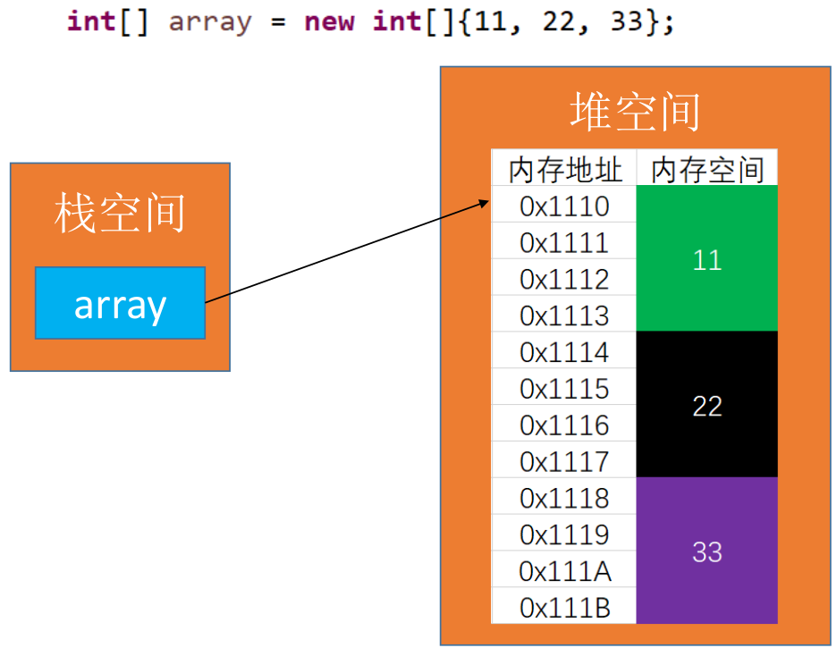

# 线性结构

## 动态数组ArrayList

### 理解

数组是一种顺序存储的线性表，所有元素的内存地址是连续的。



在很多编程语言中，数组都有个致命的缺点：<span style="color:skyblue">无法动态修改容量</span>。实际开发中，我们更希望数组的容量是可以<span style="color:red">动态改变的</span>。

### 属性设计


### 接口设计

> 注意与ArrayList源码对比分析

```java
public interface List<E> {
    /** 元素数量 */
    int size();

    /** 是否为空 */
    boolean isEmpty();

    /** 是否包含某个元素 */
    boolean contains(E element);

    /** 添加元素到末尾 */
    void add(E element);

    /** 获取index位置的元素 */
    E get(int index);

    /** 设置index位置的元素 */
    E set(int index,E element);

    /** 往index位置添加元素 */
    void add(int index,E element);

    /** 删除index位置对应的元素 */
    E remove(int index);

    /** 查看元素的位置 */
    int indexOf(E element);

    /** 清除所有元素 */
    void clear();
}
```

### 图解方法

**添加元素-add(E element)**


**添加元素-add(int index,E element)**


**删除元素-remove(int index)**


**如何扩容**


### 实现

```java
public class ArrayList<E> implements List<E>{
    /** 元素数量 */
    private int size = 0;

    /** 所有元素 */
    private E[] elements;

    /**	默认容量 */
    private static final int DEFAULT_CAPACITY = 10;

    /** 元素未找到返回的下标 */
    private static final int ELEMENT_NOT_FOUND = -1;

    public ArrayList() {
        this(DEFAULT_CAPACITY);
    }

    public ArrayList(int capaticy) {
        capaticy = capaticy < DEFAULT_CAPACITY ? DEFAULT_CAPACITY : capaticy;
        elements = (E[])new Object[capaticy];
    }

    /**
     * @Description 判断下标是否越界
     */
    private void indexCheck(int index) {
        if(index < 0 || index > size) {
            throw new IndexOutOfBoundsException("Index:" + index + ",Size:" + size);
        }
    }

    /**
     * @Description 数组容量不够则扩容
     */
    private void ensureCapacity(int size) {
        int oldCapacity = elements.length;
        if(size < oldCapacity) return;
        int newCapacity = oldCapacity + (oldCapacity >> 1);//1.5倍
        E[] newElements = (E[])new Object[newCapacity];
//        for (int i = 0; i < size; i++) {
//            newElements[i] = elements[i];
//        }
        System.arraycopy(elements,0,newElements,0,elements.length);
        elements = newElements;
        System.out.println("扩容：" + oldCapacity + "=>" + newCapacity);
    }

    /**
     * @Description 数组容量太多则缩容
     */
    private void trim() {
        int oldCapacity = elements.length;
        if(size >= (oldCapacity >> 1)) return;
        if(oldCapacity <= DEFAULT_CAPACITY) return;
        //剩余空间很多，可以缩容
        int newCapacity = oldCapacity >> 1;
        E[] newElements = (E[])new Object[newCapacity];
//        for (int i = 0; i < size; i++) {
//            newElements[i] = elements[i];
//        }
        System.arraycopy(elements,0,newElements,0,elements.length);
        elements = newElements;
        System.out.println("缩容：" + oldCapacity + "=>" + newCapacity);
    }

    /**
     * @Description 是否为空
     * @return
     */
    public boolean isEmpty() {
        return size == 0;
    }

    /**
     * @Description 元素的数量
     * @return size
     */
    public int size() {
        return size;
    }

    /**
     * @Description 往index位置添加元素
     * @param index
     * @param element
     * @return
     */
    public void add(int index, E element) {
        //最好复杂度：O(1)、最坏复杂度：O(n)、平均复杂度：O(n)
        indexCheck(index);
        ensureCapacity(size);
        for(int i = size;i > index;i--) {
            elements[i] = elements[i - 1];
        }
        elements[index] = element;
        size++;
    }

    /**
     * @Description 添加元素到最后面
     * @param element
     */
    public void add(E element) {
        //最好：O(1)
        //最坏：O(n)  => 扩容的情况
        //平均：O(1)
        //均摊复杂度：O(1)  =>把扩容情况均摊到每一种情况去
        //         (一般均摊等于最好)。
        //什么情况下使用均摊复杂度：经过连续的多次复杂度比较低的
        //         情况后，出现个别复杂度比较高的情况。
        add(size, element);
    }

    /**
     * @Description 删除index位置对应的元素
     * @param index
     * @return oldEle
     */
    public E remove(int index) {
        //最好复杂度：O(1)、最坏复杂度：O(n)、平均复杂度：O(n)
        indexCheck(index);
        E oldEle = elements[index];
        if(index != size - 1) {
            for(int i = index;i < size;i++) {
                elements[i] = elements[i + 1];
            }
        }
        elements[--size] = null;//内存管理细节

        trim(); //内存紧张考虑缩容
        return oldEle;
    }

    /**
     * @Description 删除某个元素
     * @param element
     */
    public void remove(E element) { //O(1)
        remove(indexOf(element));
    }

    /**
     * @Description 设置index位置的元素
     * @param index
     * @param element
     * @return
     */
    public E set(int index, E element) {  //O(1)
        indexCheck(index);
        E old = elements[index];
        elements[index] = element;
        return old;
    }

    /**
     * @Description 返回index位置对应的元素
     * @param index
     * @return
     */
    public E get(int index) {
        indexCheck(index);
        return elements[index];
    }

    /**
     * @Description 查看元素的位置
     * @param element
     * @return
     */
    public int indexOf(E element) {
        if(element == null) {
            for (int i = 0; i < size; i++) {
                if(elements[i] == null) return i;
            }
        } else {
            for (int i = 0; i < size; i++) {
                if(element.equals(elements[i])) return i;
            }
        }
        return ELEMENT_NOT_FOUND;
    }

    /**
     * @Description 是否包含某个元素
     * @param element
     * @return
     */
    public boolean contains(E element) {
        return indexOf(element) != ELEMENT_NOT_FOUND;
    }

    /**
     * @Description 清除所有元素
     */
    public void clear() {
        //方法一：只是访问不到了，数组每一个位置对应的对象还存在。
        //       当对某个位置再次add操作时，此位置存储的地址值对
        //       应以前的对象才会被销毁。
        //size = 0;
        //方法二：对每一个位置对应的对象地址值置空（内存管理细节）
        for (int i = 0; i < size; i++) {
            elements[i] = null;
        }
        size = 0;
    }

    @Override
    public String toString() {
        StringBuilder str = new StringBuilder();
        str.append("size=").append(size).append(" : [");
        for (int i = 0; i < size; i++) {
            if(i != 0) str.append(", ");
            str.append(elements[i]);
        }
        str.append("]");
        return str.toString();
    }
}
```

## 单向链表LinkedList

### 理解

动态数组有个明显的缺点：可能会造成内存空间的大量浪费。能否用到多少就申请多少内存？链表可以办到这一点。

链表存储结构的特点：

- 链表是一种链式存储的线性表，通过指针域描述数据元素之间的逻辑关系，不需要地址连续的存储空间。
- 动态存储空间分配，即时申请即时使用。
- 访问第i个元素，必须顺序依此访问前面的1 ~ i-1的数据元素，也就是说是一种顺序存取结构。
  插入/删除操作不需要移动数据元素。

> 注意：
>
> ① Java中如何实现“指针”**：**Java中的对象引用变量并不是存储实际数据，而是存储该对象在内存中的存储地址。
>
> ② 链表分为带头节点的链表和没有头节点的链表，根据实际的需求来确定。

### 图解方法


### 实现

```java
class SingleLinkedList<E> implements List<E>{
	/**
	 *	元素的数量
	 */
	private int size;
	
	/**
	 *  指向第一个节点的指针
	 */
	private Node<E> first;

	/**
	 * 	元素未找到返回的下标
	 */
	private static final int ELEMENT_NOT_FOUND = -1;

	/**
	 * @Description 判断下标是否越界
	 */
	private void indexCheck(int index) {
		if(index < 0 || index >= size) {
			throw new IndexOutOfBoundsException("Index:" 
					+ index + ",Size:" + size);
		}
	}
	
	/**
	 * @Description 获取index位置对应的节点
	 * @return
	 */
	private Node<E> getNode(int index) {
		indexCheck(index);
		Node<E> temp = first;
		for(int i = 0;i < index;i++) {
			temp = temp.next;
		}
		return temp;
	}

	/**
	 * @Description 是否为空
	 * @return
	 */
	public boolean isEmpty() {
		return size == 0;
	}

	/**
	 * @Description 元素的数量
	 * @return size
	 */
	public int size() {
		return size;
	}

	/**
	 * @Description 往index位置添加元素
	 * @param index
	 * @param element
	 * @return
	 */
	public void add(int index, E element) {
		if(index < 0 || index > size) {
			throw new IndexOutOfBoundsException("Index:" 
					+ index + ",Size:" + size);
		}
		if (index == 0) {
			first = new Node<>(element, first);
		} else {
			Node<E> prev = getNode(index - 1);
			prev.next = new Node<>(element, prev.next);
		}
		size++;
	}

	/**
	 * @Description 添加元素到最后面
	 * @param element
	 */
	public void add(E element) {
		add(size, element);
	}

	/**
	 * @Description 删除index位置对应的元素
	 * @param index
	 * @return oldEle
	 */
	public E remove(int index) {
		indexCheck(index);
		Node<E> node = first;
		if (index == 0) {
			first = first.next;
		} else {
			Node<E> prev = getNode(index - 1);
			node = prev.next;
			prev.next = node.next;
		}
		size--;
		return node.element;
	}

	/**
	 * @Description 设置index位置的元素
	 * @param index
	 * @param element
	 * @return
	 */
	public E set(int index, E element) {
		Node<E> node = getNode(index);
		E oldElement = node.element;
		node.element = element;
		return oldElement;
	}

	/**
	 * @Description 返回index位置对应的元素
	 * @param index
	 * @return
	 */
	public E get(int index) {
		return getNode(index).element;
	}

	/**
	 * @Description 查看元素的位置
	 * @param element
	 * @return
	 */
	public int indexOf(E element) {
		if (element == null) {
			Node<E> node = first;
			for (int i = 0; i < size; i++) {
				if (node.element == null) return i;
				
				node = node.next;
			}
		} else {
			Node<E> node = first;
			for (int i = 0; i < size; i++) {
				if (element.equals(node.element)) return i;
				
				node = node.next;
			}
		}
		return ELEMENT_NOT_FOUND;
	}

	/**
	 * @Description 是否包含某个元素
	 * @param element
	 * @return
	 */
	public boolean contains(E element) {
		return indexOf(element) != ELEMENT_NOT_FOUND;
	}

	/**
	 * @Description 清除所有元素
	 */
	public void clear() {
		size = 0;
		first = null;
	}
	
	@Override
	public String toString() {
		Node<E> temp = first;
		StringBuilder str = new StringBuilder();
		for(int i = 0;i < size;i++) {
			if(i != 0) {
				str.append(",");
			}
			str.append(temp.element);
			temp = temp.next;
		}
		return "size=" + size + ", [" + str + "]";
	}
	
	/**
	 * @Description 节点内部类
	 */
	private static class Node<E> {
		E element;
		Node<E> next;
		
		public Node(E element, Node<E> next) {
			this.element = element;
			this.next = next;
		}

		@Override
		public String toString() {
			return element + "";
		}
	}
	
}
```

## 双向链表LinkedList

### 单向链表缺点

单向链表，查找的方向只能是一个方向，而双向链表可以向前或者向后查找。

单向链表不能自我删除，需要靠辅助节点 ，而双向链表，则可以自我删除，所以前面我们单链表删除节点，总是要先找到待删除节点的前一个节点。

### 实现

```java
public class LinkedList<E> implements List<E>{
	/**
	 *	元素的数量
	 */
	private int size;
	
	/**
	 *  指向第一个节点的指针
	 */
	private Node<E> first;

	/**
	 *  指向最后一个节点的指针
	 */
	private Node<E> last;
	
	/**
	 * 	元素未找到返回的下标
	 */
	private static final int ELEMENT_NOT_FOUND = -1;

	/**
	 * @Description 判断下标是否越界
	 */
	private void indexCheck(int index) {
		if(index < 0 || index >= size) {
			throw new IndexOutOfBoundsException("Index:" 
					+ index + ",Size:" + size);
		}
	}
	
	/**
	 * @Description 获取index位置对应的节点
	 * @return
	 */
	private Node<E> getNode(int index) {
		indexCheck(index);
		if(index < (size << 1)) {
			Node<E> temp = first;
			for(int i = 0;i < index;i++) {
				temp = temp.next;
			}
			return temp;
		} else {
			Node<E> temp = last;
			for(int i = size - 1;i > index;i--) {
				temp = temp.prev;
			}
			return temp;
		}
	}

	/**
	 * @Description 是否为空
	 * @return
	 */
	public boolean isEmpty() {
		return size == 0;
	}

	/**
	 * @Description 元素的数量
	 * @return size
	 */
	public int size() {
		return size;
	}

	/**
	 * @Description 往index位置添加元素
	 * @param index
	 * @param element
	 * @return
	 */
	public void add(int index, E element) {
		if(index < 0 || index > size) {
			throw new IndexOutOfBoundsException("Index:" 
					+ index + ",Size:" + size);
		}
		if(index == size) { //往最后面添加元素时
			Node<E> oldLast = last;
			last = new Node<E>(oldLast,element,null);
			if(oldLast == null) { //链表添加第一个元素时
				first = last;
			} else {
				oldLast.next = last;
			}
		} else {
			Node<E> next = getNode(index);
			Node<E> prev = next.prev;
			Node<E> node = new Node<E>(prev,element,next);
			next.prev = node;
			if(prev == null) { //=>index == 0时
				first = node;
			} else {
				prev.next = node;
			}
		}
		
		size++;
	}

	/**
	 * @Description 添加元素到最后面
	 * @param element
	 */
	public void add(E element) {
		add(size, element);
	}

	/**
	 * @Description 删除index位置对应的元素
	 * @param index
	 * @return oldEle
	 */
	public E remove(int index) {
		indexCheck(index);
		Node<E> node = getNode(index);
		Node<E> prev = node.prev;
		Node<E> next = node.next;
		if(prev == null) { //index == 0
			first = next;
		} else {
			prev.next = next;
		}
		if(next == null) { //index == size - 1
			last = prev;
		} else {
			next.prev = prev;
		}
		size--;
		return node.element;
	}

	/**
	 * @Description 设置index位置的元素
	 * @param index
	 * @param element
	 * @return
	 */
	public E set(int index, E element) {
		Node<E> node = getNode(index);
		E oldElement = node.element;
		node.element = element;
		return oldElement;
	}

	/**
	 * @Description 返回index位置对应的元素
	 * @param index
	 * @return
	 */
	public E get(int index) {
		return getNode(index).element;
	}

	/**
	 * @Description 查看元素的位置
	 * @param element
	 * @return
	 */
	public int indexOf(E element) {
		if (element == null) {
			Node<E> node = first;
			for (int i = 0; i < size; i++) {
				if (node.element == null) return i;
				
				node = node.next;
			}
		} else {
			Node<E> node = first;
			for (int i = 0; i < size; i++) {
				if (element.equals(node.element)) return i;
				
				node = node.next;
			}
		}
		return ELEMENT_NOT_FOUND;
	}

	/**
	 * @Description 是否包含某个元素
	 * @param element
	 * @return
	 */
	public boolean contains(E element) {
		return indexOf(element) != ELEMENT_NOT_FOUND;
	}

	/**
	 * @Description 清除所有元素
	 */
	public void clear() {
		size = 0;
		first = null;
		last = null;
		/*
		 * gc root对象：① 被栈指针指向的对象，如new LinkedList()
		 * 
		 * => 只要断掉first和last，当前链表不被gc root对象指向就
		 *    会被回收。
		 */
	}
	
	@Override
	public String toString() {
		Node<E> temp = first;
		StringBuilder str = new StringBuilder();
		for(int i = 0;i < size;i++) {
			if(i != 0) {
				str.append(",");
			}
			str.append(temp);
			temp = temp.next;
		}
		return "size=" + size + ", [" + str + "]";
	}
	
	/**
	 * @Description 节点内部类
	 */
	private static class Node<E> {
		Node<E> prev;
		E element;
		Node<E> next;
		
		public Node(Node<E> prev,E element, Node<E> next) {
			this.prev = prev;
			this.element = element;
			this.next = next;
		}

		@Override
		public String toString() {
			StringBuilder str = new StringBuilder();
			if(prev != null) {
				str.append(prev.element);
			}
			str.append("_").append(element).append("_");
			if(next != null) {
				str.append(next.element);
			}
			return str + "";
		}
	}
	
}
```

### ArrayList与LinkedList对比

ArrayList开辟，销毁内存空间的次数相对较少，但可能造成内存空间浪费(缩容解决)。LinkedList开辟、销毁内存空间的次数相对较多，但不会造成内存空间的浪费。

如果频繁在尾部进行添加，删除操作，动态数组与双向链表均可选择。

如果频繁在头部进行添加，删除操作，建议选择使用双向链表。

如果有频繁的(在任意位置)添加，删除操作，建议选择双向链表。

如果有频繁的查询操作(随机访问操作)，建议选择动态数组。

> 是否有了双向链表，单向链表就没任何用处了？ =>  并非如此，在哈希表的设计中就用到了单链表。

## 循环链表LinkedList

### 单向循环链表

> 注意：单向循环链表相对于单链表(SingleLinkedList)只需修改添加和删除。

```java
/**
 * @Description 往index位置添加元素
 * @param index
 * @param element
 * @return
 */
public void add(int index, E element) {
	if(index < 0 || index > size) {
		throw new IndexOutOfBoundsException("Index:" 
				+ index + ",Size:" + size);
	}
	if (index == 0) {
		Node<E> newFirst = new Node<>(element, first);
		//拿到最后一个节点
		Node<E> last = (size == 0) ? newFirst : getNode(size - 1);
		last.next = newFirst;
		first = newFirst;
	} else {
		Node<E> prev = getNode(index - 1);
		prev.next = new Node<>(element, prev.next);
	}
	size++;
}
/**
 * @Description 删除index位置对应的元素
 * @param index
 * @return oldEle
 */
public E remove(int index) {
	indexCheck(index);
	Node<E> node = first;
	if (index == 0) {
		if(size == 1) {
			first = null;
		} else {
			//拿到最后一个节点,注意一定要在改变first之前
			Node<E> last = getNode(size - 1);
			first = first.next;
			last.next = first;
		}
	} else {
		Node<E> prev = getNode(index - 1);
		node = prev.next;
		prev.next = node.next;
	}
	size--;
	return node.element;
}
```

### 双向循环链表

> 注意：双向循环链表相对于双向链表(LinkedList)只用修改添加和删除。


```java
/**
 * @Description 往index位置添加元素
 * @param index
 * @param element
 * @return
 */
public void add(int index, E element) {
	if(index < 0 || index > size) {
		throw new IndexOutOfBoundsException("Index:" 
				+ index + ",Size:" + size);
	}
	if(index == size) { //往最后面添加元素时
		Node<E> oldLast = last;
		last = new Node<E>(oldLast,element,first);
		if(oldLast == null) { //链表添加第一个元素时
			first = last;
			first.next = first;
			first.prev = first;
		} else {
			oldLast.next = last;
			first.prev = last;
		}
	} else {
		Node<E> next = getNode(index);
		Node<E> prev = next.prev;
		Node<E> node = new Node<E>(prev,element,next);
		next.prev = node;
		prev.next = node;
		if(index == 0) { //=>index == 0时
			first = node;
		}
	}
	size++;
}

/**
 * @Description 删除index位置对应的元素
 * @param index
 * @return node.element
 */
public E remove(int index) {
	indexCheck(index);
	Node<E> node = first;
	if(size == 1) {
		first = null;
		last = null;
	} else {
		node = getNode(index);
		Node<E> prev = node.prev;
		Node<E> next = node.next;
		prev.next = next;
		next.prev = prev;
		if(index == 0) { //index == 0
			first = next;
		} 
		if(index == size - 1) { //index == size - 1
			last = prev;
		} 
	}
	size--;
	return node.element;
}
```

### 约瑟夫问题 (单向循环链表的应用)

约瑟夫问题：设编号为1，2，3...n的n个人围成一圈，约定编号为 k (1 <= k <= n)的人从1开始报数，数到m的那个人出列，它的下一位又从1开始报数，数到m的那个人又出列，依此类推，直到所有人出列为止，由此产生一个出列编号的序列。

> 注意：约瑟夫问题也可以用其它数据结构解决，不一定要用循环链表，但是循环链表解决此问题很简单。


**使用循环链表解决约瑟夫问题**

为了发挥循环链表的最大威力，可对CircleLinkedList做如下改进：


```java
public class LinkedListTest {	
	@Test
	public void test1() {
		CircleLinkedListForJosephus<Integer> list 
			= new CircleLinkedListForJosephus<Integer>();
		for(int i = 1; i <= 8;i++) {
			list.add(i);
		}
		//current指向头节点
		list.reset();
		while(!list.isEmpty()) {
			list.next();
			list.next();
			System.out.print(list.remove() + " ");//数了三次后删除
			//3 6 1 5 2 8 4 7 
		}
	}
}

class CircleLinkedListForJosephus<E> implements List<E>{
	/**
	 *	元素的数量
	 */
	private int size;
	
	/**
	 *  指向第一个节点的指针
	 */
	private Node<E> first;

	/**
	 *  指向最后一个节点的指针
	 */
	private Node<E> last;
	
	/**
	 * 用于指向某个节点的指针
	 */
	private Node<E> current;
	
	/**
	 * 	元素未找到返回的下标
	 */
	private static final int ELEMENT_NOT_FOUND = -1;

	/**
	 * @Description 判断下标是否越界
	 */
	private void indexCheck(int index) {
		if(index < 0 || index >= size) {
			throw new IndexOutOfBoundsException("Index:" 
					+ index + ",Size:" + size);
		}
	}
	
	/**
	 * @Description 获取index位置对应的节点
	 * @return
	 */
	private Node<E> getNode(int index) {
		indexCheck(index);
		if(index < (size << 1)) {
			Node<E> temp = first;
			for(int i = 0;i < index;i++) {
				temp = temp.next;
			}
			return temp;
		} else {
			Node<E> temp = last;
			for(int i = size - 1;i > index;i--) {
				temp = temp.prev;
			}
			return temp;
		}
	}

	/**
	 * @Description 让current指向头节点
	 */
	public void reset() {
		current = first;
	}
	
	/**
	 * @Description 让current后移一步
	 * @return
	 */
	public E next() {
		if(current == null) return null;
		current = current.next;
		return current.element;
	}
	
	/**
	 * @Description 删除current所指向的节点,并将current下移
	 * @return
	 */
	public E remove() {
		if(current == null) return null;
		Node<E> next = current.next;
		int index = indexOf(current.element);
		E element = remove(index);
		if(size == 0) {
			current = null;
		} else {
			current = next;
		}
		return element;
	}
	
	/**
	 * @Description 是否为空
	 * @return
	 */
	public boolean isEmpty() {
		return size == 0;
	}

	/**
	 * @Description 元素的数量
	 * @return size
	 */
	public int size() {
		return size;
	}

	/**
	 * @Description 往index位置添加元素
	 * @param index
	 * @param element
	 * @return
	 */
	public void add(int index, E element) {
		if(index < 0 || index > size) {
			throw new IndexOutOfBoundsException("Index:" 
					+ index + ",Size:" + size);
		}
		if(index == size) { //往最后面添加元素时
			Node<E> oldLast = last;
			last = new Node<E>(oldLast,element,first);
			if(oldLast == null) { //链表添加第一个元素时
				first = last;
				first.next = first;
				first.prev = first;
			} else {
				oldLast.next = last;
				first.prev = last;
			}
		} else {
			Node<E> next = getNode(index);
			Node<E> prev = next.prev;
			Node<E> node = new Node<E>(prev,element,next);
			next.prev = node;
			prev.next = node;
			if(index == 0) { //=>index == 0时
				first = node;
			}
		}
		size++;
	}

	/**
	 * @Description 添加元素到最后面
	 * @param element
	 */
	public void add(E element) {
		add(size, element);
	}

	/**
	 * @Description 删除index位置对应的元素
	 * @param index
	 * @return node.element
	 */
	public E remove(int index) {
		indexCheck(index);
		Node<E> node = first;
		if(size == 1) {
			first = null;
			last = null;
		} else {
			node = getNode(index);
			Node<E> prev = node.prev;
			Node<E> next = node.next;
			prev.next = next;
			next.prev = prev;
			if(index == 0) { //index == 0
				first = next;
			} 
			if(index == size - 1) { //index == size - 1
				last = prev;
			} 
		}
		size--;
		return node.element;
	}

	/**
	 * @Description 设置index位置的元素
	 * @param index
	 * @param element
	 * @return
	 */
	public E set(int index, E element) {
		Node<E> node = getNode(index);
		E oldElement = node.element;
		node.element = element;
		return oldElement;
	}

	/**
	 * @Description 返回index位置对应的元素
	 * @param index
	 * @return
	 */
	public E get(int index) {
		return getNode(index).element;
	}

	/**
	 * @Description 查看元素的位置
	 * @param element
	 * @return
	 */
	public int indexOf(E element) {
		if (element == null) {
			Node<E> node = first;
			for (int i = 0; i < size; i++) {
				if (node.element == null) return i;
				
				node = node.next;
			}
		} else {
			Node<E> node = first;
			for (int i = 0; i < size; i++) {
				if (element.equals(node.element)) return i;
				
				node = node.next;
			}
		}
		return ELEMENT_NOT_FOUND;
	}

	/**
	 * @Description 是否包含某个元素
	 * @param element
	 * @return
	 */
	public boolean contains(E element) {
		return indexOf(element) != ELEMENT_NOT_FOUND;
	}

	/**
	 * @Description 清除所有元素
	 */
	public void clear() {
		size = 0;
		first = null;
		last = null;
		/*
		 * gc root对象：① 被栈指针指向的对象，如new LinkedList()
		 * 
		 * => 只要断掉first和last，当前链表不被gc root对象指向就
		 *    会被回收。
		 */
	}
	
	@Override
	public String toString() {
		Node<E> temp = first;
		StringBuilder str = new StringBuilder();
		for(int i = 0;i < size;i++) {
			if(i != 0) {
				str.append(",");
			}
			str.append(temp);
			temp = temp.next;
		}
		return "size=" + size + ", [" + str + "]";
	}
	
	/**
	 * @Description 节点内部类
	 */
	private static class Node<E> {
		Node<E> prev;
		E element;
		Node<E> next;
		
		public Node(Node<E> prev,E element, Node<E> next) {
			this.prev = prev;
			this.element = element;
			this.next = next;
		}

		@Override
		public String toString() {
			StringBuilder str = new StringBuilder();
			if(prev != null) {
				str.append(prev.element);
			}
			str.append("_").append(element).append("_");
			if(next != null) {
				str.append(next.element);
			}
			return str + "";
		}
	}
	
}
```

## 栈(stack)

### 理解

栈是一个`先入后出`（FILO => First In Last Out）的有序列表。往栈中添加元素的操作，一般叫做`入栈(push)`。从栈中移除元素的操作，一般叫做 `出栈(pop)`，注意只能移除栈顶元素，也叫做弹出栈顶元素。

栈是限制线性表中元素的插入和删除 `只能在线性表的同一端` 进行的一种特殊线性表。允许插入和删除的一端为变化的一端，称为 `栈顶(Top)`，另一端为固定的一端，称为 `栈底(Bottom)`。

出栈(pop)和入栈(push)的概念如下:


> 注意：这里说的“栈”与内存中的“栈空间”是两个不同的概念。

### 栈的应用场景

- `子程序的调用`：在跳往子程序前，会先将下一个指令的地址存到堆栈中，直到子程序执行完后再将地址取出，以回到原来的程序中。

- `处理递归调用`：和子程序的调用类似，只是除了存储下一个指令的地址外，也将参数，区域变量等数据存入堆栈中。

- `表达式的转换与求值(实际解决)`：如中缀表达式转后缀表达式

- `二叉树的遍历`

- `图形的深度优先（depth-first）搜索法`

### ArrayList模拟栈

```java
public class StackTest {
	@Test
	public void test1() {
		ArrayListStack<Integer> stack = new ArrayListStack<Integer>();
		stack.push(11);
		stack.push(22);
		stack.push(33);
		stack.push(44);
		System.out.println(stack.peek());//44
           stack.list();
		while(!stack.isEmpty()) {
			System.out.print(stack.pop() + " ");
			//44 33 22 11 
		}
		System.out.println(stack.isEmpty());
		
	}
}

class ArrayListStack<E> {
	private List<E> list = new ArrayList<E>();
	
	//栈的长度
	public int size() {
		return list.size();
	}
	
	// 判断栈空
	public boolean isEmpty() {
		return list.isEmpty();
	}

	// 入栈
	public void push(E element) {
		list.add(element);
	}

	// 出栈
	public E pop() {
		return list.remove(list.size() - 1);
	}

	// 获取栈顶元素
	public E peek() {
		return list.get(list.size() - 1);
	}
 
   //遍历栈
	public void list() {
		if(isEmpty()) {
			System.out.println("栈空，无数据！");
			return;
		}
		for (int i = list.size() - 1; i >= 0; i--) {
			System.out.println("stack[" + i + "] = " + list.get(i));
		}
	}
}
```

### LinkedList模拟栈

```java
//只需要将以上代码的
private List<E> list = new ArrayList<E>();
//改为
private List<E> list = new LinkedList<E>();
```

### 栈的应用-综合计算器(自定义优先级)

> 即使用栈计算一个中缀表达式的结果


```java
public class Calculator {
	public static void main(String[] args) {
		String expression = "7*2*2-5+1+4/2";
		calculator(expression);
            //表达式 7*2*2-5+1+4/2 的结果为：26
	}
	
	public static void calculator(String expression) {
		ArrayListStack2<Integer> numStack = new ArrayListStack2<>();
		ArrayListStack2<Integer> operStack = new ArrayListStack2<>();
		int index = 0;//用于扫描
		int num1 = 0;
		int num2 = 0;
		int oper = 0;
		int res = 0;
		char ch = ' ';//将每次扫描得到的字符保存到ch
		String keepNum = "";//用于拼接多位数
		//开始循环扫描expression
		while(true) {
			ch = expression.substring(index, index + 1).charAt(0);
			if(operStack.isOper(ch)) {
				if(!operStack.isEmpty()) {
					if(operStack.priority(ch) <= 
							operStack.priority(operStack.peek())) {
						num1 = numStack.pop();
						num2 = numStack.pop();
						oper = operStack.pop();
						res = numStack.cal(num1, num2, oper);
						//将运算结果入数栈
						numStack.push(res);
						//将操作符入符号栈
						operStack.push(ch + 0);
					} else {
						//当前操作符的优先级大于栈中的操作符优先级，直接入符号栈
						operStack.push(ch + 0);
					}
				} else {
					//符号栈为空就直接入符号栈
					operStack.push(ch + 0);
				}
			} else {
				//如果是数就直接入数栈
				//numStack.push(ch - 48);//'1' => 1  （只能处理一位数）
				//能够处理多位数的思路：
					//当处理数时，需要向expression表达式的index后再看一位，
					//如果是数就拼接并继续扫描，是符号才入栈
				keepNum += ch;
				if(index == expression.length() - 1) {
					//如果ch已经是expression的最后一位，就直接入栈
					numStack.push(Integer.parseInt(keepNum));
				} else {
					if(operStack.isOper(expression.substring(index + 1, index + 2)
							.charAt(0))) {
						numStack.push(Integer.parseInt(keepNum));
						//将keepNum清空
						keepNum = "";
					}
				}
			}
			//使index + 1，并判断是否扫描到expression的最后
			index++;
			if(index >= expression.length()) {
				break;
			}
		}
		
		//当表达式扫描完毕，就顺序的从数栈和符号栈中pop出相应的数和符号并运算
		while(true) {
			if(operStack.isEmpty()) {
				break;
			}
			num1 = numStack.pop();
			num2 = numStack.pop();
			oper = operStack.pop();
			res = numStack.cal(num1, num2, oper);
			numStack.push(res);
		}
		//将数栈的最后数pop出，得到结果
		int res2 = numStack.pop();
		System.out.println("表达式 " + expression 
				+ " 的结果为：" + res2);
	}
}

//数组模拟栈，需要扩展一些功能
class ArrayListStack2<E> {
	private List<E> list = new ArrayList<E>();
	
	//栈的长度
	public int size() {
		return list.size();
	}
	
	// 判断栈空
	public boolean isEmpty() {
		return list.isEmpty();
	}

	// 入栈
	public void push(E element) {
		list.add(element);
	}

	// 出栈
	public E pop() {
		return list.remove(list.size() - 1);
	}

	// 获取栈顶元素
	public E peek() {
		return list.get(list.size() - 1);
	}
	
	//遍历栈
	public void list() {
		if(isEmpty()) {
			System.out.println("栈空，无数据！");
			return;
		}
		for (int i = list.size() - 1; i >= 0; i--) {
			System.out.println("stack[" + i + "] = " + list.get(i));
		}
	}
	
	//返回运算符的自定义优先级（假定优先级使用数字表示）
	public int priority(int oper) {
		if(oper == '*' || oper == '/') {
			return 1;
		} else if(oper == '+' || oper == '-') {
			return 0;
		} else {
			return -1;//假定目前的表达式只有+-*/
		}
	}
	
	//判断当前字符是否是一个运算符
	public boolean isOper(char val) {
		return val == '+' || val == '-' || val == '*' || val == '/';
	}
	
	//计算两个操作数的方法
	public int cal(int num1,int num2,int oper) {
		int res = 0;
		switch(oper) {
		case '+':
			res = num2 + num1;
			break;
		case '-':
			res = num2 - num1;
			break;
		case '*':
			res = num2 * num1;
			break;
		case '/':
			res = num2 / num1;
			break;
		default:
			break;
		}
		return res;
	}
}
```

### 栈的应用-逆波兰计算器

**逆波兰表达式(前缀表达式)**

前缀表达式的运算符位于操作数之前。

前缀表达式的计算机求值：从右至左扫描表达式，遇到数字时，将数字压入堆栈，遇到运算符时，弹出栈顶的两个数，用运算符对它们做相应的计算（栈顶元素 和 次顶元素），并将结果入栈；重复上述过程直到表达式最左端，最后运算得出的值即为表达式的结果

```java
//举例：(3+4)×5-6 对应的前缀表达式就是 - × + 3 4 5 6 , 针对前缀表达式求值步骤如下:
//① 从右至左扫描，将6、5、4、3压入堆栈
//② 遇到+运算符，因此弹出3和4（3为栈顶元素，4为次顶元素），计算出3+4的值，得7，再将7入栈
//③ 接下来是×运算符，因此弹出7和5，计算出7×5=35，将35入栈
//④ 最后是-运算符，计算出35-6的值，即29，由此得出最终结果
```

**中缀表达式**

中缀表达式就是常见的运算表达式，如(3+4)×5-6

中缀表达式的求值是我们人最熟悉的，但是对计算机来说却不好操作(上述案例就能看的这个问题)，因此，在计算结果时，往往会将中缀表达式转成其它表达式来操作(一般转成后缀表达式)

**后缀表达式**

与前缀表达式相似，只是运算符位于操作数之后


**后缀表达式的计算机求值**

`从左至右`扫描表达式，遇到数字时，将数字压入堆栈，遇到运算符时，弹出栈顶的两个数，用运算符对它们做相应的计算（次顶元素 和 栈顶元素），并将结果入栈；重复上述过程直到表达式最右端，最后运算得出的值即为表达式的结果

```java
//例如: (3+4)×5-6 对应的后缀表达式就是 3 4 + 5 × 6 - , 针对后缀表达式求值步骤如下:
//① 从左至右扫描，将3和4压入堆栈；
//② 遇到+运算符，因此弹出4和3（4为栈顶元素，3为次顶元素），计算出3+4的值，得7，再将7入栈；
//③ 将5入栈；
//④ 接下来是×运算符，因此弹出5和7，计算出7×5=35，将35入栈；
//⑤ 将6入栈；
//⑥ 最后是-运算符，计算出35-6的值，即29，由此得出最终结果
```

**中缀表达式转换为后缀表达式**

后缀表达式适合计算式进行运算，但是人却不太容易写出来，尤其是表达式很长的情况下，因此在开发中，需要将**中缀表达式**转成**后缀表达式**。

具体步骤:

```java
//1.初始化两个栈：运算符栈s1和储存中间结果的栈s2；
//2.从左至右扫描中缀表达式；
//3.遇到操作数时，将其压s2；
//4.遇到运算符时，比较其与s1栈顶运算符的优先级：
//    ① 如果s1为空，或栈顶运算符为左括号“(”，则直接将此运算符入栈；
//    ② 否则，若优先级比栈顶运算符的高，也将运算符压入s1；
//    ③ 否则，将s1栈顶的运算符弹出并压入到s2中，再次转到(4-1)与s1中新的栈顶
//      运算符相比较； 
//5.遇到括号时：
//   ① 如果是左括号“(”，则直接压入s1
//   ② 如果是右括号“)”，则依次弹出s1栈顶的运算符，并压入s2，直到遇到左括号
//     为止，此时将这一对括号丢弃
//6.重复步骤2至5，直到表达式的最右边
//7.将s1中剩余的运算符依次弹出并压入s2
//8.依次弹出s2中的元素并输出，结果的逆序即为中缀表达式对应的后缀表达式
```


**使用栈实现逆波兰计算器(计算整数)**

```java
public class ReversePolishCalculate {
	//直接输入一个后缀表达式计算结果
	@Test
	public void test1() {
		// 定义一个逆波兰表达式
		// 为了方便，逆波兰表达式的数字和符号使用空格隔开
		// (30+4)*5-6 => 30 4 + 5 * 6 - => 29
		// 4*5-8+60+8/2 => 4 5 * 8 - 60 + 8 2 / + => 76
		String suffixExpression = "4 5 * 8 - 60 + 8 2 / +";
		// 思路：
		//   ① 先将 "3 4 + 5 * 6 -" 放入ArrayList中
		//   ② 将ArrayList 传递给一个方法，遍历ArrayList配合栈完成计算

		List<String> list = getListString(suffixExpression);
		System.out.println(list);
		int res = calculate(list);
		System.out.println("计算的结果是 " + res);
	}
	
	// 完成将一个中缀表达式转为后缀表达式的功能并计算结果
	@Test
	public void test2() {
		// 思路：
		// 	 ① 直接对str操作不方便，因此先将中缀表达式字符串转换为List
		//   ② 中缀表达式对应的list => 后缀表达式对应的list
		String expression = "1+((2+3)*4)-5";
		List<String> list = toInfixExpressionList(expression);
		System.out.println(list);
		// [1, +, (, (, 2, +, 3, ), *, 4, ), -, 5]
		List<String> list2 = parseSuffixExpressionList(list);
		System.out.println(list2);
		//[1, 2, 3, +, 4, *, +, 5, -]
		System.out.println("expression的计算结果为：" + calculate(list2));//16
	}

	// 将一个中缀表达式转换成对应的List
	public static List<String> toInfixExpressionList(String s) {
		List<String> ls = new ArrayList<String>();
		int i = 0;// 用于遍历中缀表达式字符串s的指针
		String str;// 对多位数的拼接
		char c;// 每遍历一个字符，就放入c
		do {
			// '0' => [48] '9' => [57]
			if ((c = s.charAt(i)) < 48 || (c = s.charAt(i)) > 57) {
				// 如果c是一个非数字，就加入ls中
				ls.add("" + c);
				i++;// i需要后移
			} else {
				// 如果是一个数字，需要考虑多位数
				str = "";// 先将str置空
				while (i < s.length() && (c = s.charAt(i)) > 48 && (c = s.charAt(i)) <= 57) {
					str += c;// 拼接
					i++;
				}
				ls.add(str);
			}
		} while (i < s.length());
		return ls;
	}

	//中缀表达式对应的list => 后缀表达式对应的list
	public static List<String> parseSuffixExpressionList(List<String> ls) {
		Stack<String> s1 = new Stack<String>();// 符号栈
		// 注意：因为s2这个栈在整个转换过程中没有pop操作且后面要逆序输出，
		//      很麻烦，所以用ArrayList代替。
		// Stack<String> s2 = new Stack<String>();//存储中间结果的栈
		List<String> s2 = new ArrayList<String>();// 存储中间结果的List
		// 遍历ls
		for (String item : ls) {
			// 如果是一个数字，入s2
			if (item.matches("\\d+")) {
				s2.add(item);
			} else if (item.equals("(")) {
				s1.push(item);
			} else if(item.equals(")")) {
				while(!s1.peek().equals("(")) {
					s2.add(s1.pop());
				}
				s1.pop();//将"("弹出s1栈
			} else {
				//思路：当item的优先级小于等于s1栈顶运算符时，将s1栈顶的运算符弹出
				//      并加入s2中，再次与s1中新的栈顶运算符比较优先级。
				//注意：我们需要一个比较运算符优先级高低的方法
				while(s1.size() != 0 && 
						Operation.getValue(s1.peek()) 
						>= Operation.getValue(item)) {
					s2.add(s1.pop());
				}
				//还需要将item压入栈中
				s1.push(item);
			}
		}
		//将s1中剩余的运算符依次弹出并加入s2
		while(s1.size() != 0) {
			s2.add(s1.pop());
		}
		return s2;//注意因为是存放到List中的，所以按顺序输出即可
	}

	// 将一个逆波兰表达式的数据和运算符放入ArrayList中
	public static List<String> getListString(String suffixExpression) {
		// 将suffixExpression分隔
		String[] split = suffixExpression.split(" ");
		ArrayList<String> list = new ArrayList<String>();
		for (String ele : split) {
			list.add(ele);
		}
		return list;
	}

	// 完成对逆波兰表达式的运算
	public static int calculate(List<String> ls) {
		Stack<String> stack = new Stack<String>();
		for (String item : ls) {
			// 使用正则表达式取出数
			if (item.matches("\\d+")) {// 匹配的是多位数
				stack.push(item);
			} else {
				// pop出两个数运算，结果入栈
				int num2 = Integer.parseInt(stack.pop());
				int num1 = Integer.parseInt(stack.pop());
				int res = 0;
				if (item.equals("+")) {
					res = num1 + num2;
				} else if (item.equals("-")) {
					res = num1 - num2;
				} else if (item.equals("*")) {
					res = num1 * num2;
				} else if (item.equals("/")) {
					res = num1 / num2;
				} else {
					throw new RuntimeException("运算符有误！");
				}
				// 把res入栈
				stack.push("" + res);
			}
		}
		// 最后留在stack中数据就是运算结果
		return Integer.parseInt(stack.pop());
	}
}

//返回一个运算符对应的优先级的类
class Operation {
	private static int ADD = 1;
	private static int SUB = 1;
	private static int MUL = 2;
	private static int DIV = 2;
	
	public static int getValue(String operation) {
		int result = 0;
		switch (operation) {
		case "+":
			result = ADD;
			break;
		case "-":
			result = SUB;
			break;
		case "*":
			result = MUL;
			break;
		case "/":
			result = DIV;
			break;
		default:
			System.out.println("不存在该运算符！");
			break;
		}
		return result;
	}
}
```

##队列(queue)

### 理解

- 队列是一个有序列表，可以用`数组`或`链表`来实现。

- 遵循`先入先出`的原则。即：先存入队列的数据，要先取出。后存入的要后取出
- `队尾（rear）`：只能从队尾添加元素，一般叫做 `入队(enQueue)`。
- `队头（front）`：只能从队头移除元素，一般叫做 `出队(deQueue)`。


> 注意：队列优先使用双向链表实现，因为队列主要是往头尾操作元素。

### LinkedList(双向链表)模拟队列

> Java官方使用LinkedList实现了Queue接口

```java
public class LinkedListQueue<E> {
	private List<E> list = new LinkedList<E>();

	//元素的数量
	public int size() {
		return list.size();
	}
	// 判断队列是否为空
	public boolean isEmpty() {
		return list.isEmpty();
	}

	// 入队
	public void enQueue(E element) {
		list.add(element);
	}

	// 出队
	public E deQueue() {
		return list.remove(0);
	}

	// 看一眼头部数据
	public E peekFront() {
		return list.get(0);
	}
	
	//清空队列元素
	public void clear() {
		list.clear();
	}
}
```

###  **LinkedList模拟双端队列**

> deque => double ended queue

双端队列是能在头尾两端添加、删除的队列。


```java
public class LinkedListDeque<E> {
	private List<E> list = new LinkedList<E>();

	// 元素的数量
	public int size() {
		return list.size();
	}

	// 判断队列是否为空
	public boolean isEmpty() {
		return list.isEmpty();
	}

	// 从队尾入队
	public void enQueueRear(E element) {
		list.add(element);
	}

	// 从队头出队
	public E deQueueFront() {
		return list.remove(0);
	}

	// 从队头入队
	public void enQueueFront(E element) {
		list.add(0,element);
	}

	// 从队尾出队
	public E deQueueRear() {
		return list.remove(list.size() - 1);
	}

	// 看一眼头部数据
	public E peekront() {
		return list.get(0);
	}
	
	// 看一眼尾部数据
	public E peekRear() {
		return list.get(list.size() - 1);
	}

	// 清空队列元素
	public void clear() {
		list.clear();
	}
}
```

### ArrayList模拟循环队列

其实队列底层也可以使用动态数组(ArrayList)实现，并且采用循环队列的方式各项接口也可以优化到 O(1) 的时间复杂度，这个用数组实现并且优化之后的队列也叫做：循环队列。

```java
@SuppressWarnings("unchecked")
public class ArrayListCircleQueue<E> {
	private int front;//存储队头下标
	private E[] elements;
	private static final int DEFAULT_CAPACITY = 10;
	private int size;

	
	public ArrayListCircleQueue() {
		elements = (E[]) new Object[DEFAULT_CAPACITY];
	}
	
	/**
	 * @Description 数组容量不够则扩容
	 */
	private void ensureCapacity(int capacity) {
		int oldCapacity = elements.length;
		if(capacity <= oldCapacity) return;
		int newCapacity = oldCapacity + (oldCapacity >> 1);//1.5倍
		E[] newElements = (E[])new Object[newCapacity];
		for (int i = 0; i < size; i++) {
			newElements[i] = elements[getRealIndex(i)];
		}
		elements = newElements;
		//重置front
		front = 0;
		System.out.println("扩容：" + oldCapacity + "=>" + newCapacity);
	}
	
	/**
	 * @Description 根据传入索引获取循环队列真实索引
	 * @param index
	 * @return
	 */
	private int getRealIndex(int index) {
		//注意：
		//  ① 尽量避免使用乘，除，模，浮点数运算，效率低下。
		//  ② 循环队列不会出现index为负数的情况，双端循环队列才会。
		//return (front + index) % elements.length;
		index += front;
		//注意使用此方法要保证index不会大于等于element.length的两倍。
		return index - (index >= elements.length ? elements.length : 0);
	}
	
	// 元素的数量
	public int size() {
		return size;
	}

	// 判断队列是否为空
	public boolean isEmpty() {
		return size == 0;
	}

	// 入队
	public void enQueue(E element) {
		ensureCapacity(size + 1);
		elements[getRealIndex(size)] = element;
		size++;
	}

	// 出队
	public E deQueue() {
		E frontElement = elements[front];
		elements[front] = null;
		front = getRealIndex(1);
		size--;
		return frontElement;
	}

	// 显示队列的头数据
	public E peek() {
		if(isEmpty()) {
			throw new RuntimeException("队列空，没有数据！");
		}
		return elements[front];
	}

	// 清空队列元素
	public void clear() {
		for (int i = 0; i < size; i++) {
			elements[getRealIndex(i)] = null;
		}
		size = 0;
		front = 0;
		if(elements != null && elements.length > DEFAULT_CAPACITY) {
			elements = (E[]) new Object[DEFAULT_CAPACITY];
		}
	}
	
	@Override
	public String toString() {
		StringBuilder str = new StringBuilder();
		str.append("capcacity=").append(elements.length)
		.append(" front=").append(front)
		.append(" size=").append(size).append(",[");
		for(int i = 0;i < elements.length;i++) {
			if(i != 0) {
				str.append(",");
			}
			str.append(elements[i]);
		}
		str.append("]");
		return str.toString();
	}
}
```

### ArrayList模拟循环双端队列

```java
@SuppressWarnings("unchecked")
public class ArrayListCircleDeque<E> {
	private int front;//存储队头下标
	private E[] elements;
	private static final int DEFAULT_CAPACITY = 10;
	private int size;
	
	public ArrayListCircleDeque() {
		elements = (E[]) new Object[DEFAULT_CAPACITY];
	}
	
	/**
	 * @Description 数组容量不够则扩容
	 */
	private void ensureCapacity(int capacity) {
		int oldCapacity = elements.length;
		if(capacity <= oldCapacity) return;
		int newCapacity = oldCapacity + (oldCapacity >> 1);//1.5倍
		E[] newElements = (E[])new Object[newCapacity];
		for (int i = 0; i < size; i++) {
			newElements[i] = elements[getRealIndex(i)];
		}
		elements = newElements;
		//重置front
		front = 0;
		System.out.println("扩容：" + oldCapacity + "=>" + newCapacity);
	}
	
	/**
	 * @Description 根据传入索引获取循环队列真实索引
	 * @param index
	 * @return
	 */
	private int getRealIndex(int index) {
		index += front;
		if(index < 0) {
			return index + elements.length;
		}
		return index - (index >= elements.length ? elements.length : 0);
	}
	
	// 元素的数量
	public int size() {
		return size;
	}

	// 判断队列是否为空
	public boolean isEmpty() {
		return size == 0;
	}

	// 从队尾入队
	public void enQueueRear(E element) {
		ensureCapacity(size + 1);
		elements[getRealIndex(size)] = element;
		size++;
	}

	// 从队头出队
	public E deQueueFront() {
		E frontElement = elements[front];
		elements[front] = null;
		front = getRealIndex(1);
		size--;
		return frontElement;
	}

	// 从队头入队
	public void enQueueFront(E element) {
		ensureCapacity(size + 1);
		front = getRealIndex(-1);
		elements[front] = element;
		size++;
	}

	// 从队尾出队
	public E deQueueRear() {
		int realIndex = getRealIndex(size - 1);
		E rearElement = elements[realIndex];
		elements[realIndex] = null;
		size--;
		return rearElement;
	}

	// 显示队列的头数据,注意不是取出数据
	public E front() {
		return elements[front];
	}

	// 显示队尾数据
	public E rear() {
		return elements[getRealIndex(size - 1)];
	}

	// 清空队列元素
	public void clear() {
		for (int i = 0; i < size; i++) {
			elements[getRealIndex(i)] = null;
		}
		size = 0;
		front = 0;
		if(elements != null && elements.length > DEFAULT_CAPACITY) {
			elements = (E[]) new Object[DEFAULT_CAPACITY];
		}
	}
	
	@Override
	public String toString() {
		StringBuilder str = new StringBuilder();
		str.append("capcacity=").append(elements.length)
		.append(" front=").append(front)
		.append(" size=").append(size).append(",[");
		for(int i = 0;i < elements.length;i++) {
			if(i != 0) {
				str.append(",");
			}
			str.append(elements[i]);
		}
		str.append("]");
		return str.toString();
	}
}
```