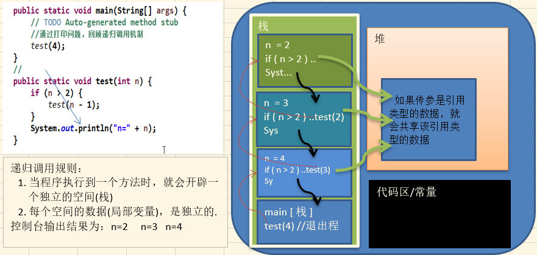
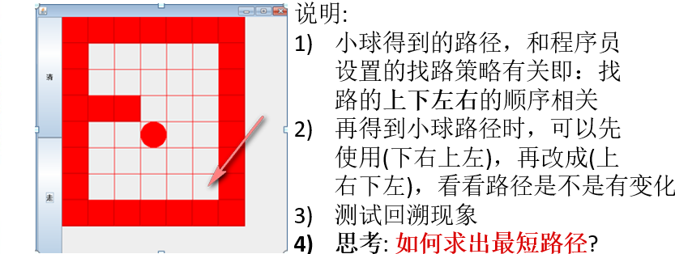
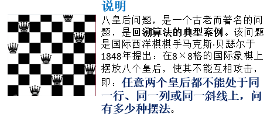

# 递归

## 理解

递归就是 `方法自己调用自己,每次调用时传入不同的变量`。递归有助于编程者解决复杂的问题,同时可以让代码变得简洁。



## 应用场景

- 各种数学问题如: 8皇后问题 , 汉诺塔, 阶乘问题, 迷宫问题, 球和篮子的问题(google编程大赛)
- 各种算法中也会使用到递归，比如快排，归并排序，二分查找，分治算法等
- 用栈解决的问题 => 使用递归可以让代码更简洁

##  递归需要遵守的重要规则

- 执行一个方法时，就创建一个 `新的受保护的独立空间`(栈空间)。
- 方法的 `局部变量是独立` 的，不会相互影响, 比如上述n变量。
- 如果方法中使用的是引用类型变量(比如数组)，就会 `共享该引用类型的数据`。
- 递归 `必须向退出递归的条件逼近`，否则就是无限递归,出现StackOverflowError栈溢出了。
- 当一个方法执行完毕，或者遇到return，就会返回，遵守 `谁调用，就将结果返回给谁`，同时当方法执行完毕或者返回时，该方法也就执行完毕。

## 递归的应用-迷宫问题



```java
public class MazeRetrospective {
	public static void main(String[] args) {
		//创建一个二维数组，模拟迷宫地图
		int[][] map = new int[8][7];
		//使用1代表墙
		for(int i = 0;i < 7;i++) {
			map[0][i] = 1;
			map[7][i] = 1;
		}
		for(int i = 0;i < 8;i++) {
			map[i][0] = 1;
			map[i][6] = 1;
		}
		//设置挡板
		map[2][1] = 1;
		map[2][2] = 1;
		map[2][3] = 1;
		map[5][4] = 1;
		map[5][5] = 1;
		//输出地图
		System.out.println("初始化地图：");
		for(int i = 0;i < 8;i++) {
			for(int j = 0;j < 7;j++) {
				System.out.print(map[i][j] + " ");
			}
			System.out.println();
		}
	
		//使用递归回溯给小球找路
		setWay(map, 1, 1);
		System.out.println("小球走过后的地图：");
		for(int i = 0;i < 8;i++) {
			for(int j = 0;j < 7;j++) {
				System.out.print(map[i][j] + " ");
			}
			System.out.println();
		}
	}
	
	/**
	 * 使用递归回溯给小球找路 => 
	 * 说明：① 小球能到map[6][5]则说明通路找到。
	 * 		② 当map[i][j]为0表示该点没有走过，当为1表示墙，
	 *        3表示已经走过但是走不通。
	 *      ③ 走迷宫时，需要确定一个策略(方法)：下=>右=>上=>左，
	 *        如果走不通再回溯
	 * @param map 表示地图
	 * @param i 表示从哪里走:(i,j)
	 * @param j 表示从哪里走:(i,j)
	 * @return 如果找到通路返回true，否则返回false
	 */
	public static boolean setWay(int[][] map,int i,int j) {
		if(map[6][5] == 2) {
			//通路已经找到
			return true;
		} else {
			//如果当前点还没有走过
			if(map[i][j] == 0) {
				//按照策略走
				map[i][j] = 2;//假定该点可以走通
				if(setWay(map,i + 1,j)) {
					//向下能走通
					return true;
				} else if(setWay(map,i,j + 1)) {
					//向右能走通
					return true;
				} else if(setWay(map,i - 1,j)) {
					//向上能走通
					return true;
				} else if(setWay(map,i,j - 1)) {
					//向左能走通
					return true;
				} else {
					//不能走通，该点是死路
					map[i][j] = 3;
					return false;
				}
			} else {
				//如果map[i][j]不等0，则可能是1，2，3
				return false;
			}
		}
	}
}
//结果：
//  1 1 1 1 1 1 1 
//  1 2 2 2 2 3 1 
//  1 1 1 1 2 3 1 
//  1 0 0 0 2 3 1 
//  1 0 0 2 2 3 1 
//  1 0 0 2 1 1 1 
//  1 0 0 2 2 2 1 
//  1 1 1 1 1 1 1 
```

## 递归的应用-八皇后问题(回溯算法)



**思路分析**

- 第一个皇后先放第一行第一列。

- 第二个皇后放在第二行第一列、然后判断是否OK， 如果不OK，继续放在第二列、第三列、依次把所有列都放完，找到一个合适的。

- 继续第三个皇后，还是第一列、第二列……直到第8个皇后也能放在一个不冲突的位置，算是找到了一个正确解。

- 当得到一个正确解时，在栈回退到上一个栈时就会开始回溯（一层一层的回溯）。即将第一个皇后放到第一列的所有正确解，全部得到。

- 然后回头继续第一个皇后放第二列，后面继续循环执行上面的步骤。

> 说明：理论上应该创建一个二维数组来表示棋盘，但是实际上可以通过算法，用一个一维数组即可解决问题. arr[8] = {0 , 4, 7, 5, 2, 6, 1, 3} //对应arr 下标 表示第几行，即第几个皇后，arr[i] = val , val 表示第i+1个皇后，放在第i+1行的第val+1列。

**实现**

```java
public class EightQueensHhess {
	int max = 8;//定义有多少个皇后
	int[] array = new int[max];//数组array保存皇后放置位置的结果
	static int count = 0;
	static int judgeCount = 0;
	public static void main(String[] args) {
		EightQueensHhess queen = new EightQueensHhess();
		queen.check(0);
		System.out.println("一共有 " + count + " 种解法");
		System.out.println("整个过程判断冲突的次数为 " + judgeCount + " 次");
	}
	
	//放置第n个皇后的方法
	//注意：check每一次递归时，进入check中都有for(int i = 0;i < max;i++)，
	//      因此会进行回溯。
	private void check(int n) {
		if(n == max) {
			//n从零开始，当n为8时就已经将8个皇后放置好了
			show();
			return;
		}
		//依次放入皇后并判断是否冲突
		for(int i = 0;i < max;i++) {
			//先把当前这个皇后n放到该行第一列
			array[n] = i;
			//判断当放置第n个皇后到i列时是否冲突
			if(judge(n)) {
				//如果不冲突就放第n+1个皇后，即开始递归
				check(n+1);
			}
			//注意：如果冲突就继续执行array[n] = i，即将第n个皇后放置
			//     在本行后移的一个位置。
		}
	}
	
	/**
	 * @Description 查看当我们放置第n个皇后时，就去检测该皇后和前面已经
	 * 				摆放的皇后是否存在冲突。
	 * @param n 表示第n个皇后
	 * @return
	 */
	private boolean judge(int n) {
		judgeCount++;
		for(int i = 0;i < n;i++) {
			//1.array[i] == array[n]表示判断第n个皇后是否和前面的n-1个
			//  皇后在同一列。
			//2.Math.abs(n-i) == Math.abs(array[n] - array[i]表示判断
			//  第n个皇后是否和第i个皇后是否在同一斜线。
			//3.没有必要判断是否在同一行，因为n每次都会递增。
			if(array[i] == array[n] || 
					Math.abs(n-i) == Math.abs(array[n] - array[i])) {
				return false;
			}
		}
		return true;
	}
	
	//将皇后摆放的位置输出的方法
	private void show() {
		count++;
		for (int i = 0; i < array.length; i++) {
			System.out.print(array[i] + " ");
		}
		System.out.println();
	}
}
```