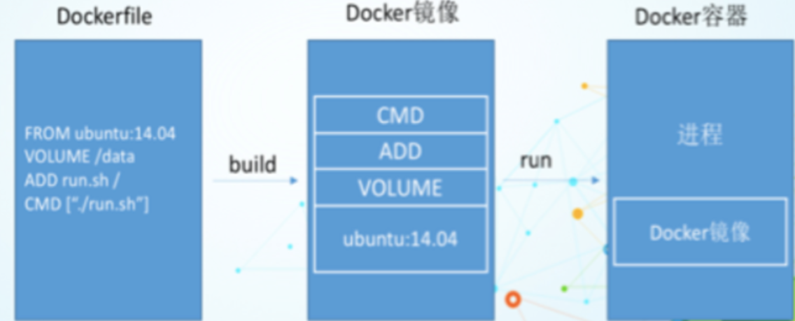
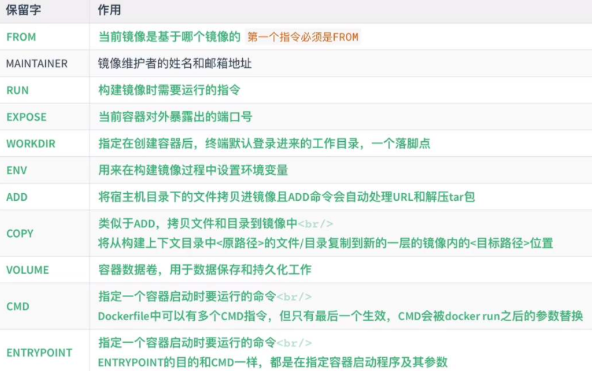
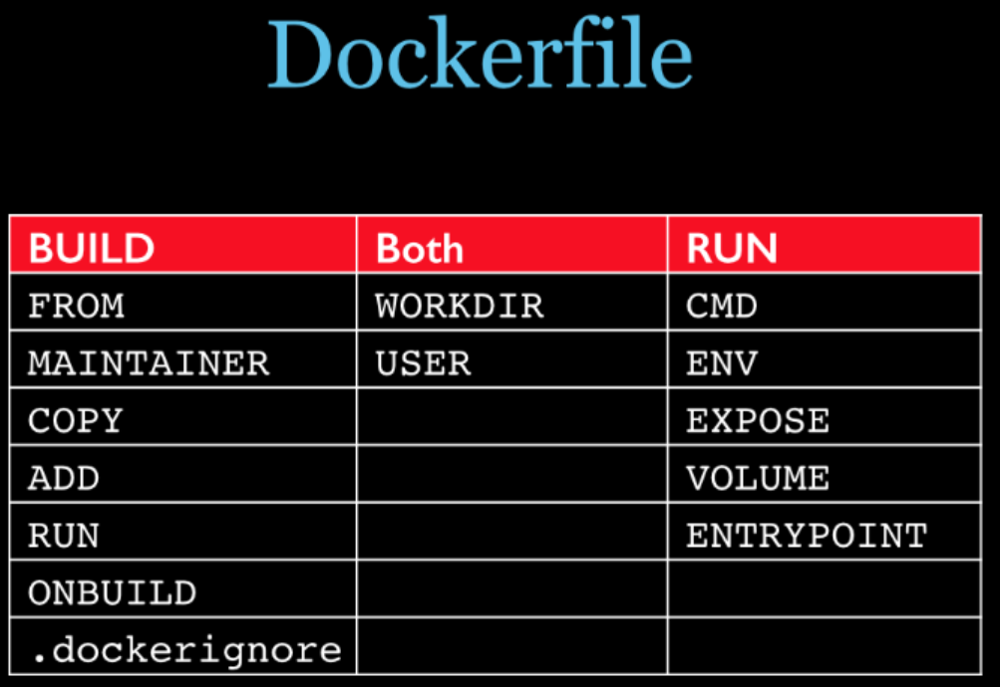
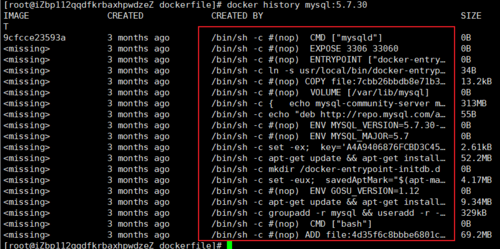
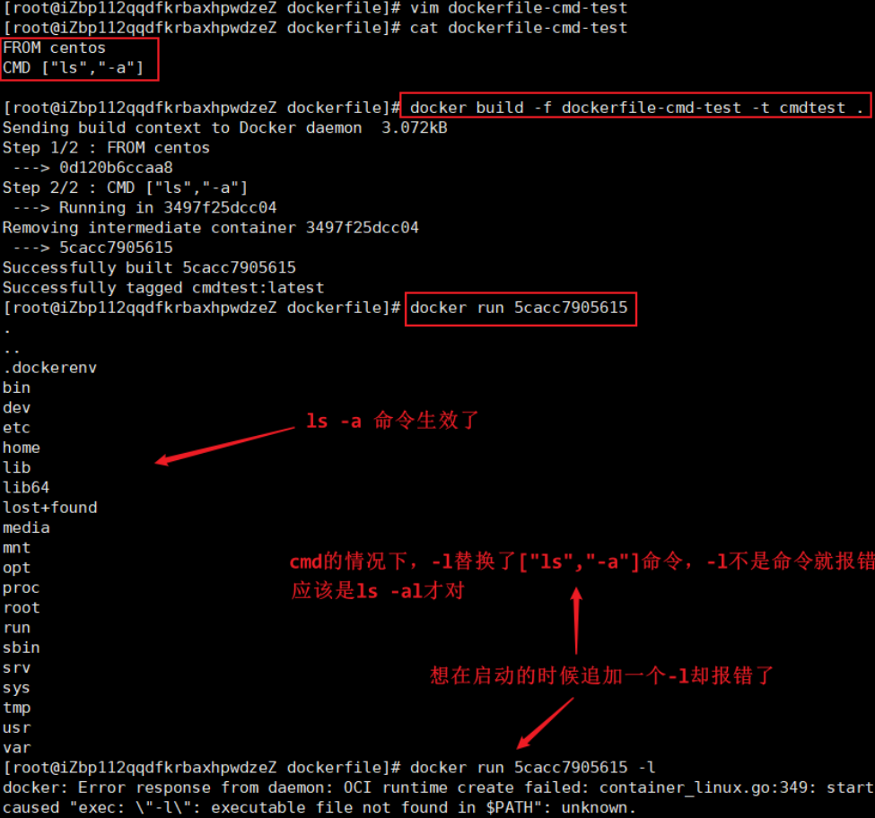

# DockerFile

## 理解

DockerFIle是用来构建Docker镜像的构建文件，是由一系列命令和参数构成的脚本

通过DockerFile构建镜像的步骤

- 编写DockerFIle文件
- docker build  构建成一个镜像

## DockerFile编写规则

- 每条保留字指令都必须为大写字母且后面要跟随至少一个参数
- 指令按照从上到下，顺序执行
- #表示注释
- 每条指令都会创建一个新的镜像层，并对镜像进行提交

## DockerFile执行流程

- docker从基础镜像运行一个容器
- 执行一条指令并对容器做出修改
- 执行类似docekr commit的操作提交一个新的镜像层
- docker再基于刚提交的镜像运行一个新容器
- 执行dockerfile中的下一条指令直到所有指令都执行完成

## 原理

从应用软件的角度来看，Dockerfile、Docker镜像与Docker容器分别代表软件的三个不同阶段。Dockerfile是软件的原材料，Docker镜像是软件的交付品，Docker容器则可以认为是软件的运行态。Dockerfile面向开发，Docker镜像成为交付标准，Docker容器则涉及部署与运维，三者缺一不可，合力充当Docker体系的基石。



- Dockerfile：需要定义一个Dockerfile，Dockerfile定义了进程需要的一切东西。Dockerfile涉及的内容包括执行代码或者是文件、环境变量、依赖包、运行时环境、动态链接库、操作系统的发行版、服务进程和内核进程(当应用进程需要和系统服务和内核进程打交道，这时需要考虑如何设计namespace的权限控制)等等;

- Docker镜像：在用Dockerfile定义一个文件之后，docker build时会产生一个Docker镜像，当运行 Docker镜像时，会真正开始提供服务

- Docker容器：”容器是直接提供服务的

## DockerFile保留字指令



总结：



## 例-DockerFile构建CentOS镜像

```shell
# 1.编写Dockerfile文件
[root@iZbp112qqdfkrbaxhpwdzeZ dockerfile]# cat mydockerfile-centos 
FROM centos
MAINTAINER mpolaris<polaris424@foxmail.com>

ENV MYPATH /usr/local
WORKDIR $MYPATH

RUN yum -y install vim
RUN yum -y install net-tools

EXPOSE 80

CMD echo $MYPATH
CMD echo "----end----"
CMD /bin/bash


# 2.通过该文件构建镜像
[root@iZbp112qqdfkrbaxhpwdzeZ dockerfile]# docker build -f mydockerfile-centos -t mycentos .

Sending build context to Docker daemon  2.048kB
Step 1/10 : FROM centos
 ---> 0d120b6ccaa8
Step 2/10 : MAINTAINER mpolaris<polaris424@foxmail.com>
 ---> Running in 38835352c142
...
Successfully built 17c46e00233b
Successfully tagged mycentos:latest

# 3.测试运行
[root@iZbp112qqdfkrbaxhpwdzeZ dockerfile]# docker run -it mycentos
[root@447d59aa5819 local]# pwd
/usr/local
[root@447d59aa5819 local]# ifconfig
eth0: flags=4163<UP,BROADCAST,RUNNING,MULTICAST>  mtu 1500
..
[root@447d59aa5819 local]# vim test

# 4.总结:对比原来的centos镜像，我们配置了
#   工作目录默认是根目录
#   下载了vim和net-tools软件，都可以用了
```

我们可以通过 `doker history 镜像名` 查看该镜像的变更历史



## CMD 和 ENTRYPOINT 的区别

测试CMD指令



测试ENTRYPOINT发现与CMD不同的是可以在运行的时候直接追加-l，因为它是直接拼接在ENTRYPOINT命令后面的

## 例-DockerFile构建Tomcat镜像

准备镜像文件Tomcat压缩包，JDK压缩包(Tomcat依赖于JDK)

编写DockerFIle文件，按照官方命名 Dockerfile为文件名，build就会自动寻找这个文件不用-f指定了

```shell
FROM centos
MAINTAINER mpolaris<polaris424@foxmail.com>

# 把宿主机当前上下文的readme.txt拷贝到容器/usr/local/路径下
COPY readme.txt /usr/local/readme.txt

# 把java与tomcat添加到容器中,如果是压缩包会自动解压
ADD jdk-8u221-linux-x64.tar.gz /usr/local/
ADD apache-tomcat-8.5.58.tar.gz /usr/local/

# 安装vim编辑器
RUN yum -y install vim

# 设置工作访问时候的WORKDIR路径，登录落脚点
ENV MYPATH /usr/local
WORKDIR $MYPATH

# 配置java与tomcat环境变量
ENV JAVA_HOME /usr/local/jdk1.8.0_221
ENV CLASSPATH $JAVA_HOME/lib/dt.jar:$JAVA_HOME/lib/tools.jar
ENV CATALINA_HOME /usr/local/apache-tomcat-8.5.58
ENV CATALINA_BASE /usr/local/apache-tomcat-8.5.58
ENV PATH $PATH:$JAVA_HOME/bin:$CATALINA_HOME/lib:$CATALINA_HOME/bin

# 容器运行时监听的端口
EXPOSE 8080

# 启动时运行tomcat
CMD /usr/local/apache-tomcat-8.5.58/bin/startup.sh && tail -F /usr/local/apache-tomcat-8.5.58/bin/logs/catalina.out
```

构建镜像

```shell
# .代表当前目录
# docker build -t 镜像名称[:tag] .
docker build -t mytomcat .
```

运行

```shell
docker run -d -p 8080:8080 --name tomcat01 \
-v /home/build/tomcat/webapps:/usr/local/apache-tomcat-8.5.54/webapps \
-v /home/build/tomcat/logs:/usr/local/apache-tomcat-8.5.54/logs \
mytomcat
```