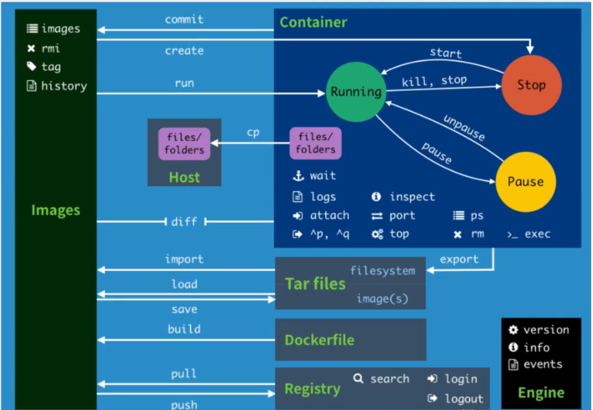

# Docker 常用命令

> 官网命令参考：https://docs.docker.com/engine/reference

### 帮助命令

```shell
# 版本信息
docker version
# 详细信息
docker info            
# 帮助命令
docker 命令 --help      
```

### 镜像命令

```shell
# 查看本地所有镜像
docker images   
#   -q：仅显示id
#   -a：显示所有镜像（默认隐藏中间镜像）

# 搜索所有镜像
docker search 镜像名 

# 拉取镜像
docker pull 镜像名:[tag]
#   1.如果不写tag默认下载latest
#   2.会分层下载 => docker image的核心：联合文件系统

# 删除镜像
docker rmi [镜像名|镜像id]
#   -f：强制删除
#   递归删除全部镜像
docker rmi -f $(docker images -aq) 
#   删除多个镜像
docker rmi -f [镜像名/镜像id|镜像名/镜像id|镜像名/镜像id] 

# 镜像的导入导出
#   1.将本地镜像导出
docker save -o 导出的路径（如./tomcat.image） 镜像id
#   2.加载本地的镜像文件,加载后名字和TAG都变成了none
docker load-i 镜像文件（如tomcat.image）
#   3.修改镜像的名字
docker tag 镜像id 新镜像名字:TAG

# 查看容器的元数据
docker inspect [容器id|容器名]
```

### 容器命令

```shell
# 新建容器并运行
docker run [可选参数] 镜像名|镜像id[:tag]
#   --name：给容器起名字
#   -d：后台运行dnn
#   -it：使用交互方式运行，进入容器查看内容
#   -p：指定容器端口，可以与通过（-p 3306:3306）与主机端口映射
#       ① -p 主机端口:容器端口           
#       ② -p 容器端口
#       ② -p 主机ip:主机端口:容器端口
#   -P：随机指定端口

# 启动并进入容器
docker run -it centos  
#    exit：       进入容器后使用此命令直接停止容器并退出
#    ctrl+P+Q     进入容器后使用此快捷键不停止容器直接退出
#    /bin/bash    指此脚本使用/bin/sh来解释执行

# 后台创建并启动容器
docker run -d 镜像名/镜像id
# ↑ 问题：docker ps 发现centos并没有运行  
#      => 原因:容器后台运行对应就必须要有一个前台进程，docekr发现没有前台应用就
#        会自动停止它

# 查看运行中的容器
docker ps [可选参数]
#   -a          查看所有运行的容器（包括曾经运行过的容器）
#   -n=数字     显示最近创建的多少个容器
#   -q：        只显示容器的编号

# 删除容器
docker rm [可选参数] 容器id       # 删除指定容器，不能删除正在运行的容器
#   -f：强制删除
docker rm -f $(docker ps -aq)   # 删除所有容器
docker ps -a -q|xargs docker rm # 删除所有容器

# 启动和停止容器
docker start 容器id      # 启动容器，启动之前运行过的容器
docker restart 容器id    # 重启容器
docker stop 容器id       # 停止正在运行容器
docker kill 容器id       # 强制停止容器

# 查看容器的日志
docker logs  -tf --tail 条数 容器id  # 显示指定条数的日志
#   -t：时间戳
#   -f：可以滚动查看日志的最后几行
#   --tail number：要显示的日志条数

# 进入当前正在运行的容器
#   方式一：进入容器后开启一个新的终端，可以在里面操作（常用）
docker exec -it 容器id /bin/bash  # 也可以直接写成bash，它是/bin下的一个命令
#   方式二：进入容器正在执行的终端，不会启动新的终端
docker attach 容器id

# 查看容器内的进程信息
docker top 容器id

# 从容器内拷贝文件到主机上（反向一样）
#    1.从容器内拷贝文件到主机上 
docker cp 容器id:容器内文件名字 目的主机路径
#    2.从主机拷贝文件到容器内
docker cp 主机上文件名字 容器id:容器内文件名字
# 思考：我们每次改动容器应用的配置文件都需要进入容器内部，十分麻烦。
#      我们应该可以在容器外部提供一个映射路径，达到在容器外部修改外部的配置文件则容器内部的配置文件就能相应自动修改
#      => 使用数据卷技术解决
```

### 常用命令总结



### 例-Docker部署ES

```shell
# 1.注意点：
#   ① es暴露的端口很多
#   ② es十分的耗内存，一启动就是1.x个G
#   ③ es的数据一般需要放置到安全目录！挂载

# 2.创建elasticsearch容器并启动
docker run -d --name elasticsearch -p 9200:9200 \
-p 9300:9300 -e "discovery.type=single-node" elasticsearch:7.9.1

# 3.启动elasticsearch后发现服务器十分的卡，查看一下cpu的状态
docker stats
#   CONTAINER ID        NAME                CPU %      MEM USAGE / LIMIT    
#   355e1cbc8dd9        elasticsearch       0.24%      1.243GiB / 1.796GiB 
#   dd4766dff995        tomcat01            0.15%      84.05MiB / 1.796GiB 

# 4.测试es成功后应该马上关闭它，并增加内存的限制修改配置文件
curl localhost:9200  # 测试es是否成功

# 5.重新开启elasticsearch ，并通过-e命令修改配置文件
docker run -d --name elasticsearch -p 9200:9200 \
-p 9300:9300 -e "discovery.type=single-node" \
-e ES_JAVA_OPTS="-Xms64m -Xmx512m"  elasticsearch:7.9.1
```

### 例-Portainer可视化面板安装

Portainer是Docker图形化界面管理工具，可以提供一个后台面板供我们操作

```shell
docker run -d -p 9000:9000 \
    --restart=always \
    -v /var/run/docker.sock:/var/run/docker.sock \
    --name prtainer-test \
    docker.io/portainer/portainer
    
# 访问测试（访问外网的8088即可）
```