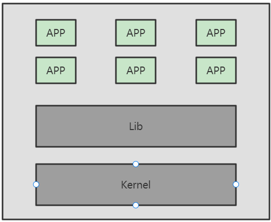
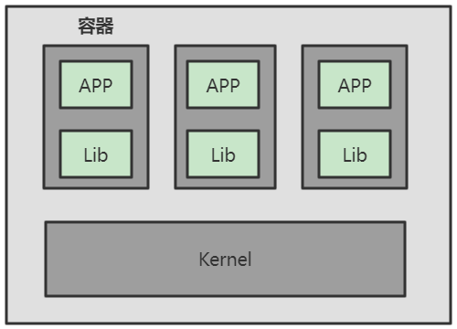
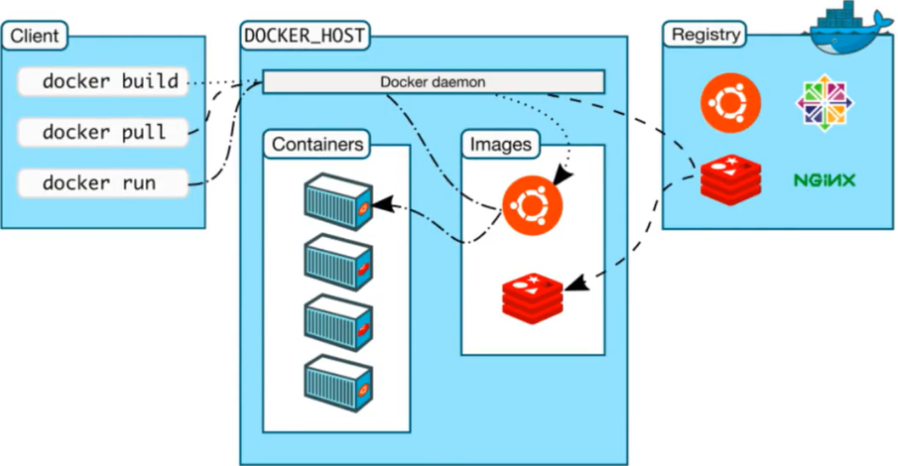
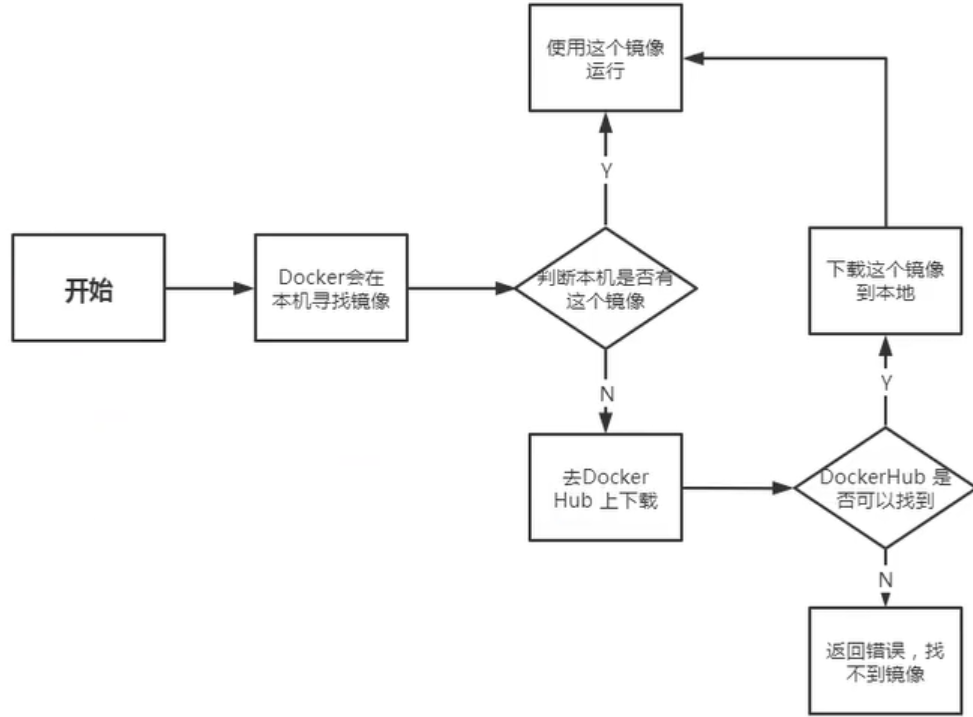
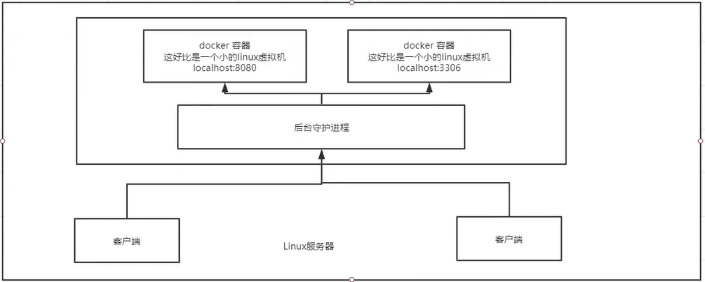
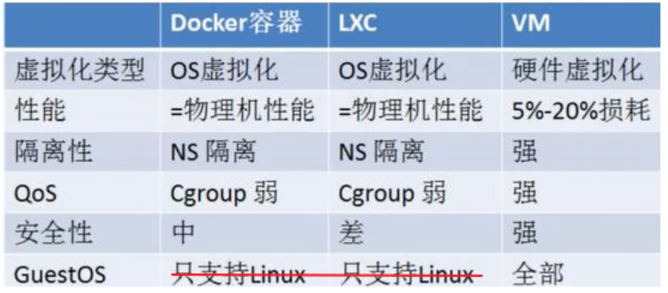
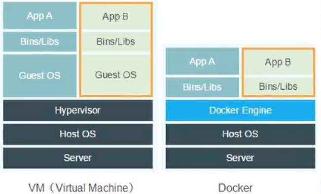

# Docker 概述

## Docker为什么出现

一款产品开发到上线有两套环境

环境配置十分麻烦，每一个机器都要部署环境（集群Redis，Hadoop..）

项目能不能都带上环境安装打包 => Docker提出解决方案

## 虚拟化技术和容器技术

### 虚拟化技术

虚拟机是完全虚拟了一个主机，运行了一个完整的操作系统，然后在这个系统上安装和运行软件

缺点：资源占用十分多，冗余步骤多，启动慢



### 容器化技术

不是完整的模拟了一个操作系统

容器内的应用直接运行在宿主机的内核中，容器是没有自己的内核的，也没有虚拟硬件

每个容器间相互隔离，每个容器内都有一个属于自己的文件系统互不影响



## Docker理解

基于Go语言开发，是一个开源的容器引擎

让开发者可以打包他们的应用以及依赖包到一个可移植的镜像中，然后发布到任何流行的 Linux或Windows 机器上

可以实现虚拟化。容器是完全使用沙箱机制，相互之间不会有任何接口

一个完整的Docker由以下几部分组成：

- DockerClient客户端
- Docker Daemon守护进程
- Docker Image镜像
- DockerContainer容器


## Docker的作用

**使应用更快速的交付和部署**

- 传统：很多帮助文档，安装程序
- Docker：打包镜像发布测试，一键运行

**更便捷的升级和扩缩容**

- Docker部署应用就像搭积木一样

**更简单的系统运维**

-  在容器化后，开发与测试环境都是高度一致的

**更高效的计算资源利用**

- Docker是内核级的虚拟化，可以在一个物理机上运行很多个容器示例，服务器的性能可以被压榨到极致

## Docker中的名词概念

Docker的架构图:



### 镜像（image）

相当于一个模板，可以通过这个模板来创建容器服务。我们可以通过这个镜像创建多个容器

### 容器（container）

Docker可以利用容器技术独立运行一个或一组应用，这个容器可以理解为一个简易的操作系统

### 仓库（repository）

存放镜像的地方，分为共有仓库和私有仓库

## 安装Docker        

CentOS安装Docker

```shell
# 1.卸载旧的Docker
yum remove docker \
  docker-client \
  docker-client-latest \
  docker-common \
  docker-latest \
  docker-latest-logrotate \
  docker-logrotate \
  docker-engine
# 2.安装yum-utils软件包可以提供yum-config-manager实用程序
yum install -y yum-utils
# 3.设置想要从哪个仓库下载
 yum-config-manager \
    --add-repo \
    http://mirrors.aliyun.com/docker-ce/linux/centos/docker-ce.repo
   //https://download.docker.com/linux/centos/docker-ce.repo 默认国外docker
# 4.更新yum软件包索引
yum makecache fast
# 5.安装最新版的Docker Engine和容器（docker-ce社区版，ee是企业版需要授权）
yum install docker-ce docker-ce-cli containerd.io
# 6.启动docker，设置docker为开机自启
systemctl start docker
systemctl enable docker
# 7.查看版本
docker version
# 8.测试helloworld
docker run hello-world
# 9.查看hello-world镜像
docker images
# 10.卸载docker
#    卸载依赖
yum remove docker-ce docker-ce-cli containerd.io
#    删除目录
rm -rf /var/lib/docker
#    手动删除所有已编辑的配置文件
# 11.配置docker镜像加速器
#    通过修改daemon配置文件/etc/docker/daemon.json来使用加速器
mkdir -p /etc/docker
tee /etc/docker/daemon.json <<-'EOF'
{
  "registry-mirrors": ["https://sjmzhm90.mirror.aliyuncs.com"]
}
EOF
systemctl daemon-reload
systemctl restart docker
```

## Docker原理

### docker run

 

### 底层原理

Docker是一个Client-Server结构的系统，Docker的守护进程运行在主机上，通过Socket从客户端访问！Docker-Server接受到Docker-Client的指令就会执行该命令



### Docker为什么比虚拟机快？



- Docker有着比虚拟机更少的抽象层

- Docker利用的是宿主机的内核，vm需要GuestOS

  