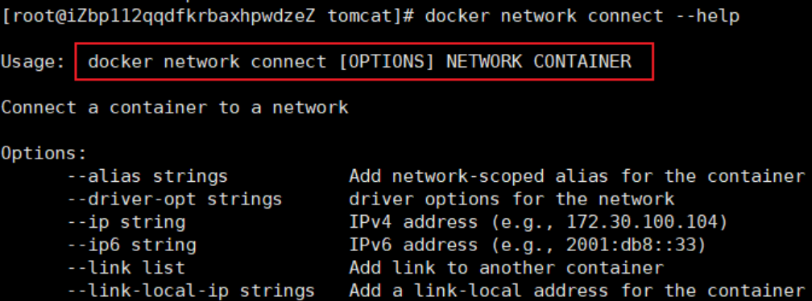

# Docker 网络

## Docker0

查看宿主机Ip地址


启动一个容器，并查看容器内部Ip地址

```shell
# 1.启动一个tomcat容器并查看容器的内部网络地址
#   如下：除了本地回环地址还有一个eth0地址，它是docker分配的
[root@iZbp112qqdfkrbaxhpwdzeZ tomcat]# docker run -d -P --name tomcat01 tomcat
3fdc590a6dd3677bd2250bf4b9dd7ecb16f94b018a95d13c565122b5c2101d27
[root@iZbp112qqdfkrbaxhpwdzeZ tomcat]# docker exec -it tomcat01 ip addr
1: lo: <LOOPBACK,UP,LOWER_UP> mtu 65536 qdisc noqueue state UNKNOWN group default qlen 1
    link/loopback 00:00:00:00:00:00 brd 00:00:00:00:00:00
    inet 127.0.0.1/8 scope host lo
       valid_lft forever preferred_lft forever
56: eth0@if57: <BROADCAST,MULTICAST,UP,LOWER_UP> mtu 1500 qdisc noqueue state UP group default 
    link/ether 02:42:ac:11:00:03 brd ff:ff:ff:ff:ff:ff link-netnsid 0
    inet 172.17.0.3/16 brd 172.17.255.255 scope global eth0
       valid_lft forever preferred_lft forever
       
# 2.思考：linux能否ping通容器内部？=> 可以
[root@iZbp112qqdfkrbaxhpwdzeZ tomcat]# ping 172.17.0.3
PING 172.17.0.3 (172.17.0.3) 56(84) bytes of data.
64 bytes from 172.17.0.3: icmp_seq=1 ttl=64 time=0.075 ms
```

再次查看主机ip地址发现多了一个57ip地址对应了容器内的56ip地址


测试docker的两个容器间是否能ping通 => 可以

```shell
# 容器和容器间是可以互相ping通的
[root@iZbp112qqdfkrbaxhpwdzeZ tomcat]# docker exec -it tomcat02 ping 172.17.0.3
PING 172.17.0.3 (172.17.0.3) 56(84) bytes of data.
64 bytes from 172.17.0.3: icmp_seq=1 ttl=64 time=0.099 ms
```

## 原理

### 观察发现

只要安装了docker，主机就会有一个网卡g

每启动一个docker容器，docker就会给容器分配一个ip，且主机对应也会多一个网卡

### veth-pair技术

veth-pair就是一对的虚拟设备接口，他们都是成对出现的，一端连着协议一端彼此相连

正因为有此特性，veth-pair充当了一个桥梁，专门用于连接各种虚拟网络设备的

### 两个docker容器维护能互相连同

tomcat01和tomcat02是共用的一个路由器(docker0)

所有的容器不指定网络的情况下，都是由docker0路由的，docker会给我们的容器分配一个默认的可用IP


> 注意：
>
> Docker中所有的网络接口都是虚拟的，虚拟的转发效率很高
>
> 只要容器删除，相对应的一对网桥也就没了

## 容器互连之--link

docker0不支持容器名连接访问还需要配置--link，我们最好自定义网络不使用docker0

思考：

- 如果两个容器互连，一个容器的ip换掉了，不修改就无法互连了。怎样处理？

- 可以通过名字来访问容器？

```shell
# 1.直接ping 容器名是不行的
[root@iZbp112qqdfkrbaxhpwdzeZ tomcat]# docker exec -it tomcat02 ping tomcat01
ping: tomcat01: Name or service not known

# 2.通过--link可以解决tomcat3 ping tomcat02，但是反过来还是不能ping通
[root@iZbp112qqdfkrbaxhpwdzeZ tomcat]# docker run -d -P --name tomcat03 --link tomcat02 tomcat
a0b9cd4889b676a5a7f4670dfc54c23e59bbbae299c4fd0a06729913797d5f38
[root@iZbp112qqdfkrbaxhpwdzeZ tomcat]# docker exec -it tomcat03 ping tomcat02
PING tomcat02 (172.17.0.4) 56(84) bytes of data.
64 bytes from tomcat02 (172.17.0.4): icmp_seq=1 ttl=64 time=0.122 ms
[root@iZbp112qqdfkrbaxhpwdzeZ tomcat]# docker exec -it tomcat02 ping tomcat03
ping: tomcat03: Name or service not known

# 3.查看--link原理
#   ① 可以查看tomcat03容器详细信息
[root@iZbp112qqdfkrbaxhpwdzeZ tomcat]# docker inspect a0b9cd4889b6 
...
"HostConfig": {
    ...
    "Links": [
        "/tomcat02:/tomcat03/tomcat02"
    ],
#   ② 可以查看tomcat03容器的hosts配置文件
[root@iZbp112qqdfkrbaxhpwdzeZ tomcat]# docker exec -it tomcat03 cat /etc/hosts
127.0.0.1	localhost
::1	localhost ip6-localhost ip6-loopback
fe00::0	ip6-localnet
ff00::0	ip6-mcastprefix
ff02::1	ip6-allnodes
ff02::2	ip6-allrouters
172.17.0.4	tomcat02 d0c223a02773
172.17.0.2	a0b9cd4889b6

# 4.结论：--link就是我们在hosts配置文件中增加了一个映射
#         172.17.0.4   tomcat02 d0c223a02773
# 5.再tomcat02去--link一次tomcat03就双向映射成功了。即可以相互通过名字ping通
```

## 自定义网络

### 查看所有的docker网络


### 网络模式

- bridge：桥接模式，我们自定义网络也是这种模式
- none：不配置网络
- host：主机模式，和宿主机共享网络
- container：容器内网络直接连通，局限性大（用的少）

### 创建接模式的网络

```shell
# 1.我们之前直接启动的命令会默认加上--net bridge，就是默认使用的docker0
#   docker0特点：默认不能通过域名访问，通过--link映射可以实现
docker run -d -P --name tomcat01 --net bridge tomcat

# 2.自定义一个网络！
#   ① 创建一个网络。
#     --subnet指定子网，--gateway指定默认网关，bridge不写也可以因为默认bridge模式
 docker network create --driver bridge --subnet 192.168.0.0/16 \
 --gateway 192.168.0.1 mynet
#   ② 查看是否创建成功
[root@iZbp112qqdfkrbaxhpwdzeZ tomcat]# docker network ls
NETWORK ID          NAME                DRIVER              SCOPE
f940fe645554        bridge              bridge              local
dd3eb6d211e5        host                host                local
cc9e8bea9efb        mynet               bridge              local
18255b8d53cc        none                null                local
#   ③ 查看我们自己的网络
docker network inspect mynet
```

### 运行容器并指定使用自定义网络mynet

```shell
# 1.启动两个tomcat并指定使用mynet网络
docker run -d -P --name tomcat-net-02 --net mynet tomcat
docker run -d -P --name tomcat-net-01 --net mynet tomcat

# 2.查看我们自己的网络
docker network inspect mynet
"Containers": {
    "8f87cda9fac1962711e0e68c20f571774112e8e510720d71504f085594e97ef1": {
        "Name": "tomcat-net-01",
        "EndpointID": "d5c000ec737ff8d3cb194a1a4b20e551f357bd0a1f454f4daeb0e88344744265",
        "MacAddress": "02:42:c0:a8:00:02",
        "IPv4Address": "192.168.0.2/16",
        "IPv6Address": ""
    },
    "b675b0c0bb43f0f4e424d760afc3bfc0f9112e3f90e7f616e3f33e6b20bae39d": {
        "Name": "tomcat-net-02",
        "EndpointID": "4d706c97f5dc1585363a5ced4a85b9ae3bee5f48983b18d6c3a3523bea605bc5",
        "MacAddress": "02:42:c0:a8:00:03",
        "IPv4Address": "192.168.0.3/16",
        "IPv6Address": ""
    }
},

# 3.再次测试两个容器相互通过容器名是能直接ping通的
docker exec -it tomcat-net-01 ping tomcat-net-02
docker exec -it tomcat02-net-02 ping tomcat-net-01
```

### 使用自定义网络的好处

- 不同的集群使用不同的网络，能保证集群都是安全且健康的

- 不同的网络之间也是可以连通的

### 不同网络连通

通过connect命令连接一个网络的容器到另一个网络



测试

```shell
# 1.再建两个容器使用的是docker0网络
docker run -d -P --name tomcat01 tomcat
docker run -d -P --name tomcat02 tomcat

# 2.两个不同的网络互相ping是不行的
[root@iZ tomcat]# docker exec -it tomcat01 ping tomcat-net-01
ping: tomcat-net-01: Name or service not known

# 3.通过connect 连通后，tomcat01被加到了mynet网络去了？
#     => 其实就是给一个容器分配了两个ip
#     => 例如阿里云服务：一个公网ip，一个私网ip
[root@iZ tomcat]# docker network connect mynet tomcat01
[root@iZ tomcat]# docker network inspect mynet
"Containers": {
    "588d80b0de7142496643b833bb8eb32e5f0609281f81ef7cddd75fb96ff8e6f3": {
        "Name": "tomcat01",
        "EndpointID": "a99b4a72f5d4c44d30c389a5cc305898cef2e24f6576bc12f1dd77c958cbc567",
        "MacAddress": "02:42:c0:a8:00:04",
        "IPv4Address": "192.168.0.4/16",
        "IPv6Address": ""
    },
    "8f87cda9fac1962711e0e68c20f571774112e8e510720d71504f085594e97ef1": {
        "Name": "tomcat-net-01",
        "EndpointID": "d5c000ec737ff8d3cb194a1a4b20e551f357bd0a1f454f4daeb0e88344744265",
        "MacAddress": "02:42:c0:a8:00:02",
        "IPv4Address": "192.168.0.2/16",
        "IPv6Address": ""
    },
    "b675b0c0bb43f0f4e424d760afc3bfc0f9112e3f90e7f616e3f33e6b20bae39d": {
        "Name": "tomcat-net-02",
        "EndpointID": "4d706c97f5dc1585363a5ced4a85b9ae3bee5f48983b18d6c3a3523bea605bc5",
        "MacAddress": "02:42:c0:a8:00:03",
        "IPv4Address": "192.168.0.3/16",
        "IPv6Address": ""
    }
},

# 4.再次测试已经能够tomcat01已经能ping通mynet内的任意容器了
[root@iZ tomcat]# docker exec -it tomcat01 ping tomcat-net-01
PING tomcat-net-01 (192.168.0.2) 56(84) bytes of data.
64 bytes from tomcat-net-01.mynet (192.168.0.2): icmp_seq=1 ttl=64 time=0.073 ms
[root@iZ tomcat]# docker exec -it tomcat01 ping tomcat-net-02
PING tomcat-net-02 (192.168.0.3) 56(84) bytes of data.
64 bytes from tomcat-net-02.mynet (192.168.0.3): icmp_seq=1 ttl=64 time=0.088 ms
```