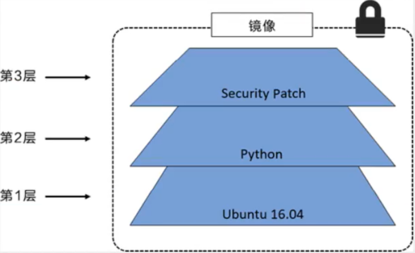
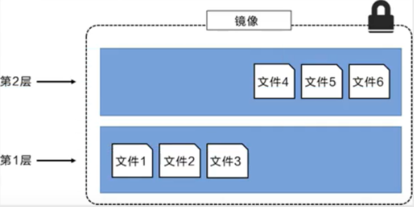
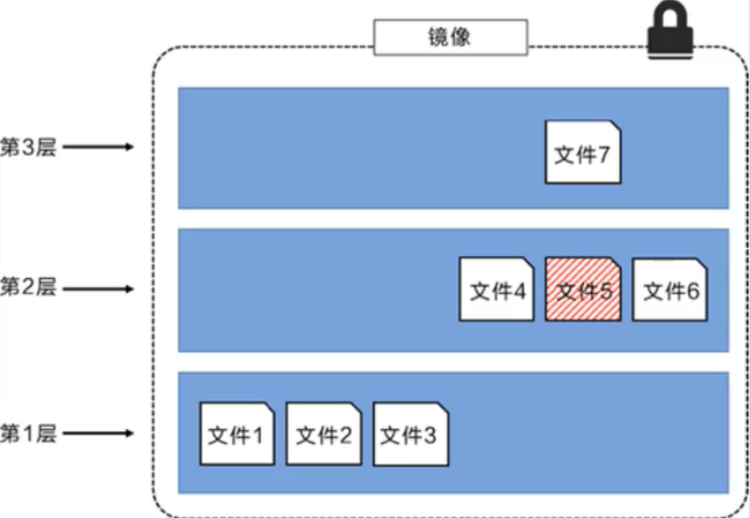
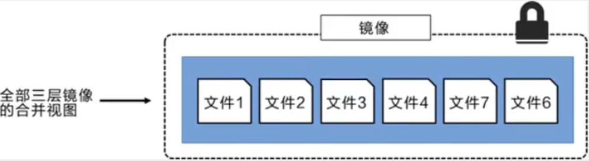
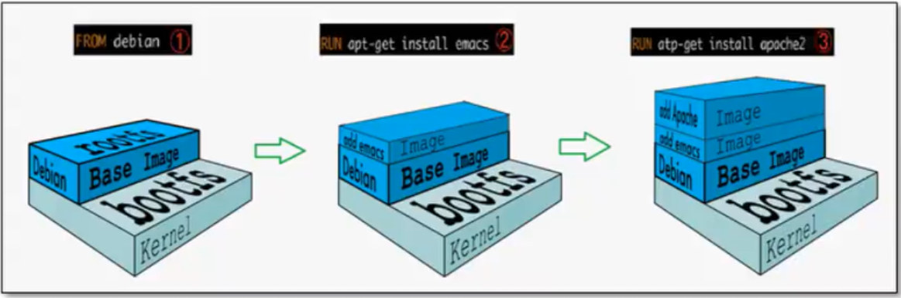

# Docker镜像

## Docker中央仓库

Docker官方的中央仓库，这个仓库的镜像是最全的但是下载速度很慢

国内的Docker镜像网站：

- [网易蜂巢](c.163.com/hub)
- [daoCloud](hub.daocloud.io)
- 阿里云

公司内会采用私服的方式拉取镜像：(需要添加配置才能生效)

```shell
# 1.进入/etc/docker/daemon.json
# 2. 添加如下配置
{
    "registry-mirros":["https://registry.docker-cn.com"],
    "insecure-registries":["ip:port"]
}
# 3.重启两个服务
systemctl daemon-reload
systemctl restart docker
```

## 镜像

### 镜像是什么

镜像是一种轻量级，可执行的独立软件包，用来打包软件运行环境和基于运行环境开发的软件，它包含运行某个软件所需的所有内容，包括代码，运行时，库，环境变量和配置文件

### 如何得到镜像

- 从远程仓库下载

- 朋友拷贝

- 自己制作一个镜像DockerFile

## UnionFS联合文件系统

Union文件系统是一种分层，轻量级并且高性能的文件系统，它支持对文件系统的修改作为一次提交来一层层叠加，同时可以将不同目录挂载到同一个虚拟文件系统下

Union文件系统是Docker镜像的基础，镜像可通过分层来进项继承，基于基础镜像（没有父镜像），可以制作各种具体的应用镜像

特性：一次同时加载多个文件系统，但从外面看起来只能看到一个文件系统，联合加载会把各层文件系统叠加起来，这样最终的文件系统会包括所有底层的文件和目录

### 分层理解

我们去下载一个镜像，会发现是一层一层的在下载，Docker镜像为什么会采用这种分层的结构？

最大的好处就是资源共享！比如有多个镜像都从相同的Base镜像构建而来，那么宿主机只需要在磁盘上保留一份base镜像，同时内存中也只需要加载一份base镜像，这样就可以为所有的容器服务了，而且镜像的每一层都可以被共享

查看镜像分层的命令：

```shell
docker images inspect
```

所有的Docker镜像都起始于一个基础镜像层，当进行修改或者增加新的内容时，就会在当前镜像层之上创建新的镜像层。例如：假如基于Ubuntu Linux 16.04创建一个新的镜像，这就是新镜像的第一层。如果在该镜像中添加Python包，就会在基础镜像之上创建第二个镜像层。如果继续添加一个安全补丁就会创建第三个镜像层。



在添加额外的镜像层的同时，镜像始终保持是当前所有镜像的组合，理解这一点非常重要。如下：每个镜像包含了三个文件，而镜像包含了来自两个镜像层的六个文件



上图中的镜像层更之前图中的略有区别，主要目的是便于展示文件。下图中展示了一个稍微复杂的三层镜像，在外部看来整个镜像只有六个文件，这是因为最上层中的文件7是文件5的一个更新版本



这种情况下，上层镜像层中的文件覆盖了底层镜像层中的文件。这样就使得文件的更新版本作为一个新镜像层加入到镜像当中。Docker通过存储引擎（新版本采用快照机制）的方式来实现镜像层堆栈，并保证多镜像层对外展示为统一的文件系统。

Linux上可用的存储引擎有AUFS，Overlay2，Device Mapper，Btrfs以及ZFS。每种存储引擎都基于Linux中对应的文件系统或者块设备技术，并且每种存储引擎都有其独有的性能特点。

Docker在Windows上仅支持windowsfilter一种存储引擎，该引擎基于NTFS文件系统之上实现了分层和CoW。下面展示了与系统显示相同的三层镜像。所有镜像层堆叠并合并，对外提供统一的视图



特别的，Docker镜像都是只读的，当容器启动时一个新的可写层被加载到镜像的顶部！这一层就是我们通常说的容器层，容器之下的都叫镜像层！

## Docker 镜像加载原理

docker的镜像实际上由一层一层的文件系统组成，这种层级的文件系统就是UnionFS

`bootfs` (boot file system)主要包括bootloader和kernerl，bootloader主要是引导加载kernel，Linux刚启动时会加载bootfs文件系统，在Docker镜像的最底层就是bootfs。这一层与我们典型的Linux/Unix系统是一样的，包含boot加载器和内核。当boot加载完成之后整个内核就都在内存中了，此时内存的使用权已由bootfs转交给内核，此时系统也会卸载bootfs。

`rootfs` (root file system) 在bootfs之上，包含的就是典型Linux系统的/dev，/proc，/bin，/etc等标准目录和文件，rootfs就是各种不同的操作系统发行版，比如Ubuntu，Centos等



平时我们安装进虚拟机的CentOS都是几个G，为什么Doccker才几百M？对于一个精简的OS，rootfs可以很小，只需要包含最基本的命令，工具和程序库就可以了，因为底层直接用Host的kernel，自己只需要提供rootfs就可以了。由此可见对于不同的Linux发行版，bootfs基本是一致的，rootfs会有差别，因此不同的发行版可以公用bootfs

## 提交一个自定义镜像

提交容器成为一个新的副本

```shell
docker commit -m="提交的描述信息" -a="作者" 容器id 目标镜像名:[tag]
```

## 发布自己的镜像到DockerHub

在Docker官网注册账号

在自己的服务器上提交自己的镜像

```shell
# 1.登录
docker login -u 用户名
# 2.提交镜像
docker push 用户名/镜像名:版本号 
```