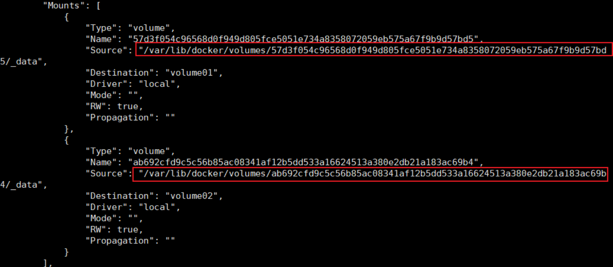
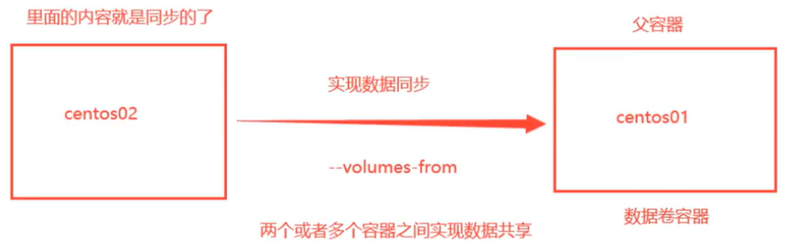
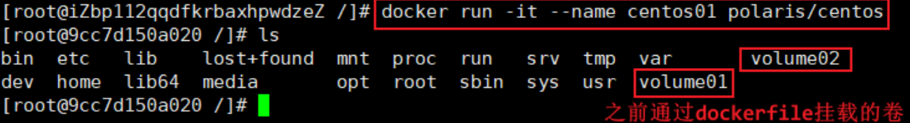
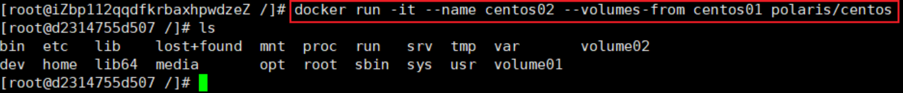
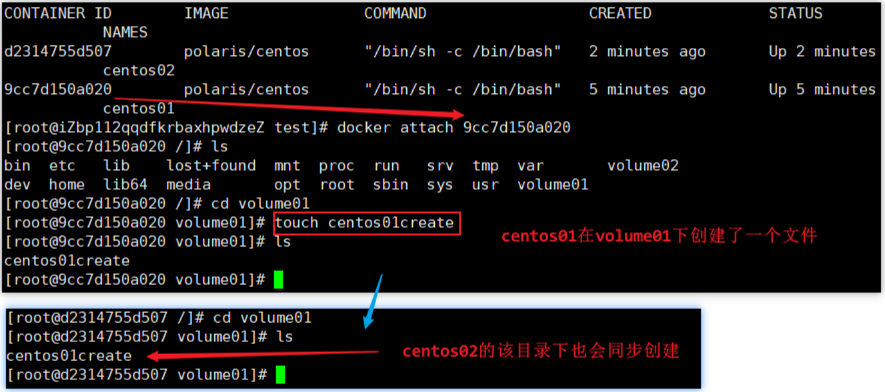

# 数据卷与数据卷容器

## 什么是数据卷

Docker的理念

- 将运用与运行的环境打包形成容器运行 ，运行可以伴随着容器，但是我们 `对数据的要求希望是持久化的`

- `容器之间希望有可能共享数据`

Docker容器产生的数据如果不通过docker commit生成新的镜像，使得数据做为镜像的一部分保存下来，那么当容器删除后，数据自然也就没有了。

为了很好的实现数据保存和数据共享，Docker提出了 `Volume` 这个概念，简单的说就是绕过默认的联合文件系统，而以正常的文件或者目录的形式存在于宿主机上。又被称作 `数据卷`

> 理解：其实相当于把宿主机上的某一个目录映射成一个数据卷，像U盘一样挂载到容器内部的联合文件系统中去

## 数据卷能做什么

- 容器的持久化
- 容器间继承+共享数据

> 卷就是目录或文件，存在于一个或多个容器中。它是由docker挂载到容器中的，但不属于联合文件系统，因此能够绕过Union File System提供一些用于持续存储或共享数据的特性
>
> 卷的设计目的就是数据的持久化，完全独立于容器的生存周期，因此Docker不会在容器删除时删除其挂载的数据卷

## 数据卷的特点

- 数据卷可在容器之间共享或重用数据
- 卷中的更改可以直接生效
- 数据卷中的更改不会包含在镜像的更新中
- 数据卷的生命周期一直持续到没有容器使用它为止

## 数据卷的管理

```shell
# 1.创建数据卷
#   创建后默认会放在一个目录下：/var/lib/docker/volumes/数据卷名称/_data
#   _data目录下就是数据卷存放的内容即映射
docker volume create 数据卷名称

# 2.查看数据卷的详细信息
docker volume inspect 数据卷名称

# 3.查看全部的数据卷
docker volume ls

# 4.删除数据卷
docker volume rm 数据卷容器
```

## 命令挂载数据卷到容器

方式一：直接指定一个路径作为数据卷的存放位置，运行镜像并挂载数据卷。使用这种方式的宿主机映射路径下是空的，需要手动添加内容

```shell
docker run -it -v 宿主机绝对路径目录:容器内目录:[ro|rw]  镜像名
# 1. ro即readonly只读，此时说明这个路径只能通过宿主机来操作，容器内部无法操作
#    rw指readwrite可读可写 
# 2. 一旦设置了这个容器的权限，容器对我们挂载出来的内容就有限定了
```

方式二：数据卷存放在默认路径

- 使用这种方式会将容器内部自带的文件，存储在默认的存放路径中
- 两个名词：`具名挂载` 和 `匿名挂载`

```shell
# 映射数据卷时，如果数据卷不存在Docker会自动创建

# 1.匿名挂载：-v 容器内路径
docker run -d -P --name nginx01 -v /etc/nginx nginx

# 2.具名挂载：
docker run -d -P --name nginx01 -v mynginx:/etc/nginx nginx
```

查看数据卷是否挂载成功：

```shell
docker inspect 容器id
```

> 数据卷挂在好之后
>
> - 容器和宿主机之间数据共享
> - 容器停止退出后主机修改的数据与容器完全同步
> - 容器删除后宿主机上对应挂载目录的数据不会删除

## DockerFile 挂载数据卷到容器

DockerFIle就是用来构建docker镜像的构建文件，内容就是一段命令脚本，通过这个脚本可以生成镜像

通过dockerfile挂载数据卷的方式很常用，如果构建镜像时没有挂载，也可以再使用-v命令手动挂载

```shell
# 1.在主机/home目录下创建一个docker-test-volume目录并进入
mkdir /home/docker-test-volume
cd /home/docker-test-volume

# 2.在该目录下创建一个文件
vim dockerfile01

# 3.在文件中写入一段命令脚本，每一个命令就是镜像的一层
FROM centos                          # 以已有的centos镜像为基础
VOLUME ["volume01","volume02"]       # 通过VOLUME命令挂载数据卷
CMD echo "----end-----"              # 生成完镜像后会在命令行发送一段消息
CMD /bin/bash                        # 进入容器走的是/bin/bash控制台

# 4.写完脚本后保存，再通过下面的命令构建镜像。-f指定文件，-t指定目标镜像名
docker build -f dockerfile01 -t polaris/centos .
```

docker inspect查看以下卷挂载是否成功



##  数据卷容器

给一个命名的容器挂载数据卷，其他容器通过挂载这个父容器实现数据共享

挂载了数据卷的容器称为数据卷容器



示例：

启动centos01当作父容器



启动centos02并通过 `--volumes-from` 命令挂载父容器centos01



测试



> 注意：停掉或删除父容器，其他容器的对应数据依然还会在