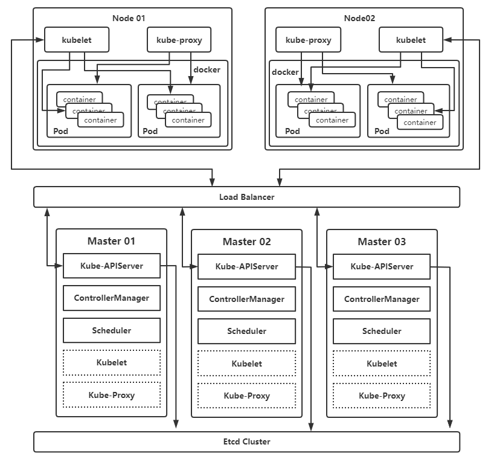

# 基本概念

 ## 为什么要使用 K8S

裸容器容易出现的问题：

- 宿主机宕机容器无法自动恢复
- 程序级健康检查依旧不到位
- 程序的扩容、部署、回滚、更新依旧不够灵活
- 端口问题并未得到解决

容器编排应运而生：

- 轻松管理成千上万的业务容器
- 全自动容灾机制
- 全自动扩缩容、回滚
- 原生支持服务发现和负载均衡
- 更加灵活方便的健康检查
- 存储的编排
- 有状态服务的编排
- 集群一键安装
- ...

## K8S 架构解析

Kubernetes 是谷歌开发的第三个容器管理系统，提供了资源调度、扩容缩容、服务发现、存储编排、自动部署与回滚、并且具有天生高可用、负载均衡、故障自动恢复等功能的“生态系统”，目前已成为云原生领域的标准。



### 控制节点组件

```shell
# 1. APIServer
#    APIServer 是整个集群的控制中枢，提供集群中各个模块之前的数据交换，并将集群状态和信息存储到分布式键-值（key-value）
#    存储系统 Etcd 集群中。同时它也是集群管理、资源配额、提供完备的集群安全机制的入口，为集群各类资源对象提供增删改查以及
#    watch的 REST API 接口
# 2. Scheduler
#    Scheduler是集群Pod的调度中心，主要是通过调度算法将Pod分配到最佳的Node节点，它通过APIServer监听所有Pod的状态，一
#    旦发现新的未被调度到任何Node节点的Pod（PodSpec.NodeName为空），就会根据一系列策略选择最佳节点进行调度
# 3. Controller Manager
#    Controller Manager 是集群状态管理器，以保证Pod或其他资源达到期望值。当集群中某个Pod的副本数或其他资源因故障和错误
#    导致无法正常运行，没有达到设定的值时，Controller Manager 会尝试自动修复并使其达到期望状态
# 4. Etcd
#    Etcd 由 CoreOS 开发，用于可靠地存储集群的配置数据，是一种持久性、轻量型、分布式的键-值（key-value）数据存储组件，
#    作为Kubernetes集群的持久化存储系统
```

特别的：

- APIServer 是无状态服务，它会把数据存储到 Etcd 中

- Scheduler 和 Controller Manager 是有状态服务，是需要主从机制实现的。
  - K8S 1.20 版本以下，主从信息保存在 kube-system 命名空间下的 ep （Endpoints）资源中
  - K8S 1.20 版本及以后，主从信息保存在 kube-system 命名空间下的 leases 资源中

```shell
# < 1.20
kubectl get ep -n kube-system
# >= 1.20
kubectl get leases -n kube-system
```

### 工作节点组件

```shell
# 1. Kubelet
#    负责与 Master 通信协作，管理该节点上的Pod,对容器进行健康检查与监控，同时负责上报节点和节点上面Pod的状态
# 2. Kube-Porxy
#    负责各 Pod 之间的通信和负载均衡，将指定的流量分发到后端正确的机器上。
# 3. Runtime(如Docker)
#    负责容器的管理
# 4. CoreDNS
#    用于Kubernetes集群内部Service的解析，可以让Pod把Service名称解析成Service的IP,然后通过Service的IP地址进行连接到到
#    对应的应用上
# 5. Calico
#    符合 CNI 标准的一个网络插件，它负责给每个Pod分配一个不会重复的IP,并且把每个节点当作一个“路由器”，这样一个节点的Pod就可
#    以通过IP地址访问到其他节点的Pod
```
