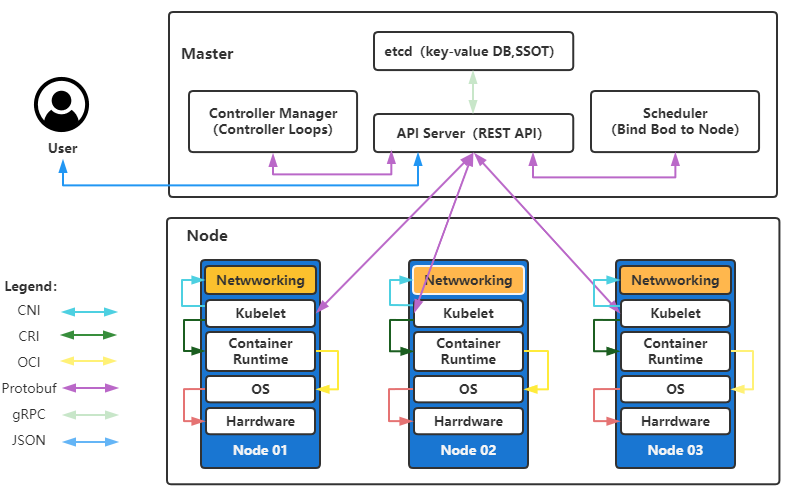
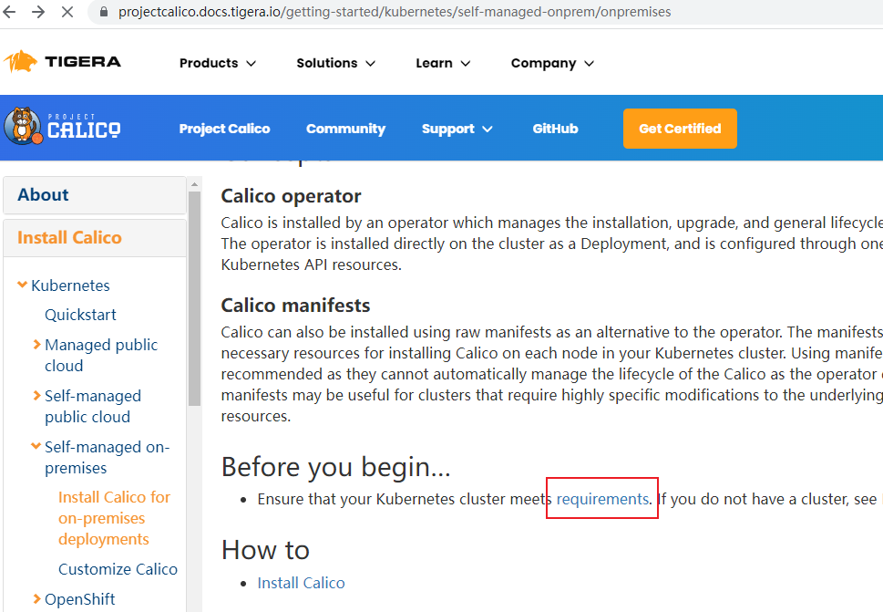

# K8S 高可用集群安装

> 基于 1.23.1

## 理解与初始化

### Kubeadm和二进制安装区别

Kubeadm 安装 K8s 高可用集群是官方推荐的方式。但是生产环境还是建议使用二进制安装方式！

经测试如果有两套 K8s 集群分别为 Kubeadm 安装和二进制安装。集群规格为3个 master 节点和几个 node 节点。如果把所有机器一起关机再启动的话二进制 K8s 集群恢复的更快且未出现集群不可用！而Kubeadm 搭建的 K8s 集群出现过集群不可用的情况！

- 推荐使用 Kubeadm 安装开发环境 K8s 集群，安装过程较简单！

- 推荐使用 二进制 安装生产环境 K8s 集群，更有保障！虽然手动部署麻烦点但期间可以学习很多工作原理，也利于后期维护。
- 还有其他安装方式如：ansible、官方自动化工具。待探索

> 注意：
>
> 1. ansible方式：
>
> ​          Master节点安装不需要自动化
>
> ​          由于会经常添加Node节点，playbook
>
> 2. 安装需要注意的细节
>
>    ​    <span style="color:red">生产环境中 etcd 一定要和系统盘分开，一定要用ssd硬盘</span>
>
>    ​    Docker 数据盘也要和系统盘分开，有条件使用 ssd 硬盘

### K8s 高可用架构图

#### 总览 

```shell
# 键值数据库，用于存放K8s数据（资源充足可独立部署），只与APIServer 交互
Etcd


# 控制节点（用于控制整个集群）
Master*
- Kube-APIServer        # 整个K8s的控制单元，所有流量都会经过它（集群统一入口，以restful方式操作）
- ControllerManager     # 集群控制器（处理集群中常规后台任务，一个资源对应一个控制器）
- Scheduler             # 集群调度器（选择node节点进行应用部署）
- Kubelet | Kube-Proxy  # 当机器资源不够时，master节点也可部署node组件即 Kubelet 和 Kube-Proxy     
 
 
# 负载均衡(方案有：nginx+keepalived、keepalived+haproxy、f5硬件负载等)
Load Balancer


# 业务节点（用于跑pod和容器）
Node*
 - Kubelet            # master 的代理组件，管理当前 node 的各种容器操作
 - Kube-Proxy         # 提供网络代理，负载均衡的操作
```


#### 内部关系



####  核心概念

```shell
# 三个重要核心概念
# 1. pod
- 最小部署单元
- 一组容器的集合
- 一个pod中的容器共享网络
- 生命周期是短暂的（例如服务器重启后会重新创建pod）

# 2. controller
- 确保预期的pod副本数量
- 无状态应用部署（与存储、网络ip唯一等限制无关）
- 有状态应用部署
- 可以确保所有的node运行同一个pod
- 一次性任务和定时性任务

# 3. Service
- 定义一组pod的访问规则
```

### 集群网段划分

集群安装时会涉及到三个网段，三个网段一定不能有重复或交叉！

- 宿主机网段：就是安装k8s的服务器

- Pod网段：k8s Pod的网段，相当于容器的IP

- Service网段：k8s service网段，service用于集群容器通信。

计算方法

```shell
# 一般service网段会设置为 10.96.0.0/12
# Pod网段会设置成 10.244.0.0/12 或者 172.16.0.0/12
# 宿主机网段可能是 192.168.0.0/24

# 需要注意的是这三个网段不能有任何交叉。比如如果宿主机的IP是 10.105.0.x，那么service网段就不能是 10.96.0.0/12，因为 10.96.0.0/12 网段可用IP是：10.96.0.1 ~ 10.111.255.255。所以10.105是在这个范围之内的属于网络交叉，此时service网段需要更换，可以更改为192.168.0.0/16网段（注意如果service网段是192.168开头的子网掩码最好不要是12而是16，因为子网掩码是12他的起始IP为192.160.0.1 不是192.168.0.1）。

# 注意搭配，均为10网段、172网段、192网段的搭配，第一个开头数字不一样就免去了网段冲突的可能性，也可以减去计算的步骤。
```

当前规划

```shell
# 1. 主机节点网段
192.168.101.0/24

# 2. Service 网段（相当与Pod的代理，可以代理到Pod上）
10.96.0.0/12

# 3. Pod 网段（Pod是容器的集合）
172.16.0.0/12
```

### 集群资源配置

| 机器角色（主机名） | Ip              | 规格 |
| ------------------ | --------------- | ---- |
| k8s-master01       | 192.168.101.101 | 2C4G |
| k8s-master02       | 192.168.101.102 | 2C4G |
| k8s-master03       | 192.168.101.103 | 2C4G |
| k8s-node01         | 192.168.101.201 | 2C4G |
| k8s-node02         | 192.168.101.202 | 2C4G |
| k8s-master-lb      | 192.168.101.200 | -    |

### K8S 版本要求

- 生产环境一定要安装稳定版本
- 小版本号(第三个) 一定要大于5，例如 1.23.5

### OS系统初始化

在开始之前，部署 Kubernetes 集群机器需要满足以下条件：

- 硬件配置：>= 2GB RAM，>= 2 CPU ，>= 30GB 磁盘
- 集群中所有机器之间网络互通。所有机器使用静态Ip，不能使用 DHCP

- 操作系统 CentOS7.x-86_x64，系统升级到 7.9
- 设置yum源与安装基础软件
- 关闭防火墙、安全组件、swap 分区、dnsmasq、NetworkManager
- 设置hosts、更改主机名
- 时间同步
- 配置 limit
- Master01 配置免密登录其他节点
- 升级centos 内核到 4.18 +
- 安装 ipvsadm 替代 iptables
- 开启一些 k8s 集群中必须的内核参数

```shell
# 1. 升级系统(此处升级没有升级内核，后面会单独升级内核)
yum update -y --exclude=kernel*
#    升级后
[root@localhost ~]# cat /etc/redhat-release
CentOS Linux release 7.9.2009 (Core)

# 2. 设置yum源与安装基础软件
#   base 源
curl -o /etc/yum.repos.d/CentOS-Base.repo https://mirrors.aliyun.com/repo/Centos-7.repo
#  替换阿里云 mirror 地址（阿里源Bug）
sed -i -e '/mirrors.cloud.aliyuncs.com/d' -e '/mirrors.aliyuncs.com/d' /etc/yum.repos.d/CentOS-Base.repo
#   在新主机上首次安装 Docker Engine-Community 之前需要设置 Docker 仓库
#   之后可以从仓库安装和更新 Docker
#   安装所需的软件包。yum-utils 提供了 yum-config-manager
#   且 device mapper 存储驱动程序需要 device-mapper-persistent-data 和 lvm2 
yum install -y yum-utils device-mapper-persistent-data lvm2
#   设置 docker 稳定的 yum 源
yum-config-manager --add-repo https://mirrors.aliyun.com/docker-ce/linux/centos/docker-ce.repo
#   添加 k8s 阿里 yum 源
cat > /etc/yum.repos.d/kubernetes.repo << EOF
[kubernetes]
name=Kubernetes
baseurl=https://mirrors.aliyun.com/kubernetes/yum/repos/kubernetes-el7-x86_64
enabled=1
gpgcheck=0
repo_gpgcheck=0
gpgkey=https://mirrors.aliyun.com/kubernetes/yum/doc/yum-key.gpg
https://mirrors.aliyun.com/kubernetes/yum/doc/rpm-package-key.gpg
EOF
# 必备软件安装
yum install wget jq psmisc vim net-tools telnet yum-utils device-mapper-persistent-data lvm2 git sshpass -y

# 3. 关闭防火墙
systemctl disable --now firewalld
#    关闭selinux
setenforce 0   # 临时
sed -i 's#SELINUX=enforcing#SELINUX=disabled#g' /etc/sysconfig/selinux  # 永久
sed -i 's#SELINUX=enforcing#SELINUX=disabled#g' /etc/selinux/config     # 永久
#    关闭swap分区
swapoff -a && sysctl -w vm.swappiness=0       # 临时
sed -ri '/^[^#]*swap/s@^@#@' /etc/fstab       # 永久
#    关闭dnsmasq
systemctl disable --now dnsmasq
# 关闭NetworkManager
systemctl disable --now NetworkManager


# 4. 在 master 添加 hosts
cat >> /etc/hosts << EOF
192.168.101.101 k8s-master01
192.168.101.102 k8s-master02
192.168.101.103 k8s-master03
192.168.101.200 k8s-master-lb  # 如果不是高可用集群，该IP为Master01的IP
192.168.101.201 k8s-node01
192.168.101.202 k8s-node02
EOF
#    设置主机名（可与host名一致）
hostnamectl set-hostname <hostname>

# 5.时间同步
rpm -ivh http://mirrors.wlnmp.com/centos/wlnmp-release-centos.noarch.rpm
yum install ntpdate -y
ln -sf /usr/share/zoneinfo/Asia/Shanghai /etc/localtime
echo 'Asia/Shanghai' >/etc/timezone
ntpdate time2.aliyun.com
echo "*/5 * * * * ntpdate time2.aliyun.com" >> /etc/crontab

# 6. 配置 limit
ulimit -SHn 65535
cat >> /etc/security/limits.conf << EOF
* soft nofile 65536
* hard nofile 131072
* soft nproc 65535
* hard nproc 655350
* soft memlock unlimited
* hard memlock unlimited
EOF

# 7. 在 Master01 配置免密登录其他节点
mkdir -p /root/.ssh && cd /root/.ssh && ssh-keygen -f "id_rsa" -N "";
for i in k8s-master01 k8s-master02 k8s-master03 k8s-node01 k8s-node02;do sshpass -p "1234321" ssh-copy-id -o StrictHostKeyChecking=no root@$i ;done 

# 8.centos7升级内核版本（需要升级至4.18+）
#   内核升级原因:
#      ①. ipvs对内核版本有要求
#      ②. centos7默认内核版本为3.10，使用docker和 k8s可能会出现
#         一些bug。如容器报磁盘空间不足但是宿主机磁盘是够的
#   导入公钥
rpm --import https://www.elrepo.org/RPM-GPG-KEY-elrepo.org
#   Centos7添加ElRepo源
rpm -Uvh http://www.elrepo.org/elrepo-release-7.0-2.el7.elrepo.noarch.rpm
#   查看可以更新的内核版本（其中-lt为长期支持版本，-ml为最新稳定版本）
yum --disablerepo="*" --enablerepo="elrepo-kernel" list available
#   安装lt版本（毕竟Centos7已经停止支持）
yum --enablerepo=elrepo-kernel install kernel-lt -y
#   查看系统有哪些内核启动项
awk -F\' '$1=="menuentry " {print $2}' /etc/grub2.cfg
#   设置启动项，
#   设置从第一个CentOS Linux (5.4.209-1.el7.elrepo.x86_64) 7 (Core)启动
grub2-set-default 0
#   重启服务器
reboot
#   移除旧内核（不建议）
yum remove kernel -y

# 9. 安装ipvsadm（ipvs对内核版本有要求，必须先升级内核）
#   理解：
#     ①. ipvs相对与iptables性能更好.特别是集群规模很大时，iptables代理模式几乎不可用
#     ②. kube-proxy当前实现了三种代理模式：userspace, iptables, ipvs
#        - userspace mode: userspace是在用户空间，通过kube-proxy来实现service
#                    的代理服务
#        - iptables mode：该模式完全利用内核iptables来实现service的代理和LB, 这是
#                    K8s在v1.2及之后版本默认模式
#        - ipvs mode：在kubernetes 1.8以上的版本中，对于kube-proxy组件增加了除
#                    iptables模式和用户模式之外还支持ipvs模式
# 安装ipvs客户端工具
yum install ipvsadm ipset sysstat conntrack libseccomp -y
# 注意：所有节点配置ipvs模块，在内核4.19版本nf_conntrack_ipv4 已经改为nf_conntrack
# 导入模块
modprobe -- ip_vs
modprobe -- ip_vs_rr
modprobe -- ip_vs_wrr
modprobe -- ip_vs_sh
modprobe -- nf_conntrack
#  配置
cat >> /etc/modules-load.d/ipvs.conf << EOF
ip_vs
ip_vs_lc
ip_vs_wlc
ip_vs_rr
ip_vs_wrr
ip_vs_lblc
ip_vs_lblcr
ip_vs_dh
ip_vs_sh
ip_vs_fo
ip_vs_nq
ip_vs_sed
ip_vs_ftp
ip_vs_sh
nf_conntrack
ip_tables
ip_set
xt_set
ipt_set
ipt_rpfilter
ipt_REJECT
ipip
EOF
# 应用
systemctl enable --now systemd-modules-load.service
# 检查是否加载
lsmod | grep --color=auto -e ip_vs -e nf_conntrack

# 10.开启一些 k8s 集群中必须的内核参数
cat <<EOF > /etc/sysctl.d/k8s.conf
net.ipv4.ip_forward = 1
net.bridge.bridge-nf-call-iptables = 1
net.bridge.bridge-nf-call-ip6tables = 1
fs.may_detach_mounts = 1
net.ipv4.conf.all.route_localnet = 1
vm.overcommit_memory=1
vm.panic_on_oom=0
fs.inotify.max_user_watches=89100
fs.file-max=52706963
fs.nr_open=52706963
net.netfilter.nf_conntrack_max=2310720
net.ipv4.tcp_keepalive_time = 600
net.ipv4.tcp_keepalive_probes = 3
net.ipv4.tcp_keepalive_intvl =15
net.ipv4.tcp_max_tw_buckets = 36000
net.ipv4.tcp_tw_reuse = 1
net.ipv4.tcp_max_orphans = 327680
net.ipv4.tcp_orphan_retries = 3
net.ipv4.tcp_syncookies = 1
net.ipv4.tcp_max_syn_backlog = 16384
net.ipv4.ip_conntrack_max = 65536
net.ipv4.tcp_max_syn_backlog = 16384
net.ipv4.tcp_timestamps = 0
net.core.somaxconn = 16384
EOF
# 应用
sysctl --system
# 所有节点配置完内核后，重启服务器，保证重启后内核依旧加载
lsmod | grep --color=auto -e ip_vs -e nf_conntrack
```

### 所有节点安装 Runtime(Docker)

如果安装的版本低于1.24，选择Docker和Containerd均可，高于1.24选择Containerd作为Runtime。

```shell
#    可以在 k8s 源码的 CHANGELOG 文件中查找指定k8s版本推荐的docker版本
yum install docker-ce-20.10.* docker-ce-cli-20.10.* -y
#    由于新版Kubelet建议使用systemd，所以把Docker的CgroupDriver也改成systemd
mkdir -p /etc/docker && cat > /etc/docker/daemon.json <<EOF
{
  "exec-opts": ["native.cgroupdriver=systemd"]
}
EOF
#   添加阿里云 YUM 软件源
#sudo tee /etc/docker/daemon.json <<-'EOF'
#{
#  "registry-mirrors": ["https://sjmzhm90.mirror.aliyuncs.com"]
#}
#EOF
#   开机自启动
 systemctl daemon-reload && systemctl enable --now docker
```

### 集群安装不成功排查步骤

```shell
# 1. 检查所有节点firewalld和selinux是否已经关闭，getenforce命令结果必须为disabled
#
# 2. 检查宿主机网段、service网段、pod网段是否冲突，需要注意子网掩码
#
# 3. 检查集群的VIP是不是可以telnet（master节点）
#   - Kubeadm：telnet VIP 16443
#   - 二进制：telnet VIP 8443
#   - 如果上述不通，telnet 127.0.0.1 16443或8443
#   - 如果127.0.0.1通的，但是VIP不通，则可以认为是VIP的问题，VIP的问题一般为：
#     a. 该环境不支持VIP
#     b. 集群防火墙或者selinux没有关闭
#     c. VIP没有成功绑定
#     
# 4. 如果上述均正常，需要查看系统日志有无异常
#    - 首先查看各个服务器有无异常日志：tail -f /var/log/messages
#    - 查看有无异常容器：kubectl get po --all-namespaces  | grep -v Running
#    - 如果有异常容器，根据异常的状态获取对应错误日志，之后可以尝试Google或百度进行排查
#    - 对应状态错误日志查看方式如下表
```


## 集群搭建(kubeadm方式)

### Kubeadm 安装梳理

```shell
# 1. 安装及优化部分
#   - 基本环境配置及优化
#   - 安装 Runtime（如docker）
#   - Kubeadm & Kubelet & Kubectl
#   - 高可用实现

# 2. 集群建立部分
#   - Master 节点初始化
#   - Node 节点配置
#   - CNI 网络插件安装

# 3. Addons 安装
#   - Metrics Server 数据采集
#   - Dashboard 图形化工具
#   ...

# 4. 收尾工作
#   - 集群可用性验证
#   - 生产必备配置
```

### 所有节点安装kubeadm/kubelet/kubectl

```shell
#   在Master01节点查看最新的Kubernetes版本
yum list kubeadm.x86_64 --showduplicates | sort -r

#   安装1.23最新版本kubeadm、kubelet和kubectl(安装kubeadm会把依赖的kubelet和kubectl一起装上)
yum install -y kubeadm-1.23.1  kubelet-1.23.1 kubectl-1.23.1

#   设置Kubelet开机自启动（由于还未初始化，没有kubelet的配置文件，此时kubelet无法启动，无需管理）
systemctl daemon-reload && systemctl enable --now kubelet
```

### 高可用组件HAProxy/KeepAlived

> 注意：
>
> 1. 如果不是高可用集群，haproxy和keepalived无需安装
> 2. 公有云要用公有云自带的负载均衡，比如阿里云的SLB，腾讯云的ELB，用来替代haproxy和keepalived，因为公有云大部分都是不支持keepalived的，另外如果用阿里云的话，kubectl 控制端不能放在master节点，推荐使用腾讯云，因为阿里云的slb有回环的问题，也就是slb代理的服务器不能反向访问SLB，但是腾讯云修复了这个问题。
> 3. 如果一定要使用阿里云且控制端放在master节点，则需要在slb后面再加一层代理 (例如Nginx代理)

所有 Master 节点通过 yum 安装 HAProxy 和 KeepAlived

```shell
yum install -y  keepalived haproxy
```

所有 Master 节点配置 HAProxy（详细配置参考 HAProxy 文档，所有 Master 节点的 HAProxy配置相同）

> 注意：最后面需要改成 Master 节点的主机地址

```shell
mkdir -p /etc/haproxy

cat > /etc/haproxy/haproxy.cfg << EOF
global
  maxconn  2000
  ulimit-n  16384
  log  127.0.0.1 local0 err
  stats timeout 30s

defaults
  log global
  mode  http
  option  httplog
  timeout connect 5000
  timeout client  50000
  timeout server  50000
  timeout http-request 15s
  timeout http-keep-alive 15s
  frontend monitor-in
  bind *:33305
  mode http
  option httplog
  monitor-uri /monitor

frontend k8s-master
  bind 0.0.0.0:16443
  bind 127.0.0.1:16443                    # 16443 为 haproxy 端口
  mode tcp
  option tcplog
  tcp-request inspect-delay 5s
  default_backend k8s-master

backend k8s-master
  mode tcp
  option tcplog
  option tcp-check
  balance roundrobin
  default-server inter 10s downinter 5s rise 2 fall 2 slowstart 60s maxconn 250 maxqueue 256 weight 100
  server k8s-master01 192.168.101.101:6443  check          # 6443 为 apiserver 端口
  server k8s-master02 192.168.101.102:6443  check
  server k8s-master03 192.168.101.103:6443  check
EOF
```

Master01 节点配置 keepalived

```shell
cat > /etc/keepalived/keepalived.conf << EOF
! Configuration File for keepalived
global_defs {
    router_id LVS_DEVEL
script_user root
    enable_script_security
}
vrrp_script chk_apiserver {
    script "/etc/keepalived/check_apiserver.sh"
    interval 5
    weight -5
    fall 2  
    rise 1
}
vrrp_instance VI_1 {
    state MASTER                           # 角色
    interface enp0s3                       # 网卡名
    mcast_src_ip 192.168.101.101           # 本机IP
    virtual_router_id 51
    priority 101
    advert_int 2
    authentication {
        auth_type PASS
        auth_pass K8SHA_KA_AUTH
    }
    virtual_ipaddress {
        192.168.101.200                     # 虚拟Ip
    }
    track_script {
       chk_apiserver
    }
}
EOF
```

Master02 节点配置 keepalived

```shell
# 相对与 Master01
...
state BACKUP
...
mcast_src_ip 192.168.1.102
...
```

Master03 节点配置 keepalived

```shell
# 相对与 Master01
...
state BACKUP
...
mcast_src_ip 192.168.1.103
...
```

所有master节点配置KeepAlived健康检查文件

```shell
cat > /etc/keepalived/check_apiserver.sh << EOF
#!/bin/bash

err=0
for k in \$(seq 1 3)
do
    check_code=\$(pgrep haproxy)
    if [[ \$check_code == "" ]]; then
        err=\$(expr \$err + 1)
        sleep 1
        continue
    else
        err=0
        break
    fi
done

if [[ \$err != "0" ]]; then
    echo "systemctl stop keepalived"
    /usr/bin/systemctl stop keepalived
    exit 1
else
    exit 0
fi
EOF
# 赋权
chmod +x /etc/keepalived/check_apiserver.sh
```

启动 haproxy 和 keepalived

```shell
systemctl daemon-reload && systemctl enable --now haproxy && systemctl enable --now keepalived
```

<span style="color:red">重要：如果安装了keepalived和haproxy，需要测试keepalived是否是正常的</span>

```shell
# 测试VIP
[root@k8s-master01 ~]# ping 192.168.101.200 -c 4
PING 192.168.101.200 (192.168.101.200) 56(84) bytes of data.
64 bytes from 192.168.101.200: icmp_seq=1 ttl=64 time=0.464 ms

[root@k8s-master01 ~]# telnet 192.168.101.200 16443
Trying 192.168.101.200...
Connected to 192.168.101.200.
Escape character is '^]'.

# 如果ping不通且telnet没有出现 ']'符号则认为VIP不可以，不可在继续往下执行
# 需要排查keepalived的问题，比如防火墙和selinux，haproxy和keepalived的状态，监听端口等
#   - 所有节点查看防火墙状态必须为disable和inactive：systemctl status firewalld
#   - 所有节点查看selinux状态，必须为disable：getenforce
#   - master节点查看haproxy和keepalived状态：systemctl status keepalived haproxy
#   - master节点查看监听端口：netstat -lntp
```

### kubeadm集群初始化

[官方初始化文档](https://kubernetes.io/docs/setup/production-environment/tools/kubeadm/high-availability/)

在Master01节点创建kubeadm-config.yaml配置文件如下：

```shell
cat > /root/kubeadm-config.yaml << EOF
apiVersion: kubeadm.k8s.io/v1beta2
bootstrapTokens:
- groups:
  - system:bootstrappers:kubeadm:default-node-token
  token: 7t2weq.bjbawausm0jaxury
  ttl: 24h0m0s
  usages:
  - signing
  - authentication
kind: InitConfiguration
localAPIEndpoint:
  advertiseAddress: 192.168.101.101               # 本机IP（即 Master01 Ip地址）
  bindPort: 6443
nodeRegistration:
  criSocket: /var/run/dockershim.sock             # 如果是Docker作为Runtime配置此项
  # criSocket: /run/containerd/containerd.sock    # 如果是Containerd作为Runtime配置此项
  name: k8s-master01                              # 本主机名
  taints:
  - effect: NoSchedule
    key: node-role.kubernetes.io/master
---
apiServer:
  # 注意: 如果不是高可用集群,证书因该颁发给 Master01
  certSANs:
  - 192.168.101.200                                # 将证书颁发给虚拟IP
  timeoutForControlPlane: 4m0s
apiVersion: kubeadm.k8s.io/v1beta2
certificatesDir: /etc/kubernetes/pki
clusterName: kubernetes
# 注意: 
#  1.如果不是高可用集群 controlPlaneEndpoint 应为 master01的地址和apiserver的端口
#    即 192.168.101.101:6443
#  2.如果是 公有云lb 负载，controlPlaneEndpoint 应为负载均衡的地址
controlPlaneEndpoint: 192.168.101.200:16443        # 虚拟IP地址和haproxy端口
controllerManager: {}
dns:
  type: CoreDNS
etcd:
  local:
    dataDir: /var/lib/etcd
imageRepository: registry.cn-hangzhou.aliyuncs.com/google_containers
kind: ClusterConfiguration
kubernetesVersion: v1.23.1                          # 更改此处的版本号和kubeadm version一致
networking:
  dnsDomain: cluster.local
  podSubnet: 172.16.0.0/12                          # pod容器的网段
  serviceSubnet: 10.96.0.0/12                       # 访问service的网段
scheduler: {}
EOF
```

更新 kubeadm文件

```shell
kubeadm config migrate --old-config kubeadm-config.yaml --new-config new.yaml
```

将new.yaml文件复制到其他master节点

```shell
for i in k8s-master02 k8s-master03; do scp new.yaml $i:/root/; done
```

之后所有Master节点执行下面命令提前下载镜像，可以节省初始化时间（<span style="color:red">其他节点不需要更改任何配置，包括IP地址也不需要更改</span>）

```shell
kubeadm config images pull --config /root/new.yaml
```

所有节点设置开机自启动 kubelet（<span style="color:red">如果启动失败无需管它，初始化成功以后即可启动</span>）

```shell
systemctl enable --now kubelet
```

<span style="color:red">在 Master01 节点进行初始化</span>，初始化以后会在 `/etc/kubernetes` 目录下生成对应的证书和配置文件，之后其他 Master 节点加入 Master01 即可

```shell
kubeadm init --config /root/new.yaml  --upload-certs

# 此外还有一种不用配置文件的初始化方式，所有需要改的属性都通过参数传入，不常用
# kubeadm init --control-plane-endpoint "LOAD_BALANCER_DNS:LOAD_BALANCER_PORT"--upload-certs
```

如果初始化失败，重置后再次初始化（没有失败不要执行）

```shell
# 查看报错日志
tail -f /var/log/message

# 重置
kubeadm reset -f
ipvsadm --clear
rm -rf ~/.kube
```

初始化成功后，会产生 Token 值，用于其他节点加入时使用，因此要记录下初始化成功生成的 token 值

```shell
You can now join any number of the control-plane node running the following command on each as root:
  # master 节点加入集群命令
  kubeadm join 192.168.101.200:16443 --token 7t2weq.bjbawausm0jaxury \
        --discovery-token-ca-cert-hash sha256:e3a321294a9553a3af63004481e372036d74b2bb135d104bd857dea4069e1591 \
        --control-plane --certificate-key f3dbbc49002743a8371984239db2a64740c10e8e4157bcb5b38631e982da1165


Then you can join any number of worker nodes by running the following on each as root:
# node 节点加入集群命令
kubeadm join 192.168.101.200:16443 --token 7t2weq.bjbawausm0jaxury \
        --discovery-token-ca-cert-hash sha256:e3a321294a9553a3af63004481e372036d74b2bb135d104bd857dea4069e1591
```

Master01节点配置环境变量，用于访问Kubernetes集群

```shell
# 下面两种方式在初始化成功后，输出提示中都有提到
# 方式一：配置环境变量
cat <<EOF >> /root/.bashrc
export KUBECONFIG=/etc/kubernetes/admin.conf
EOF
source /root/.bashrc
# 方式二：
mkdir -p $HOME/.kube
# 集群管理员的config文件
sudo cp -i /etc/kubernetes/admin.conf $HOME/.kube/config
sudo chown $(id -u):$(id -g) $HOME/.kube/config  
# 按提示操作（配置完成后就可以看到集群状态了）


# 为什么要配置环境变量？
# 当未配置环境变量时执行kubectl命令会报错，即连接不上k8s集群
[root@k8s-master01 ~]# kubectl get node
The connection to the server localhost:8080 was refused - did you spcify the right host or port?
# 原因是 kubectl 连接 k8s集群 是需要一个证书文件的，这个文件就是/etc/kubernetes 下的admin.conf


# 查看节点状态
kubectl get node
# 采用初始化安装方式，所有的系统组件均以容器的方式运行并且在kube-system命名空间内，此时可以查看Pod状态
kubectl get po -n kube-system
# 我们发现coredns一直处于pending状态，其实是因为没有安装网络插件导致的，后面再安装！
```

### 高可用 Master

其他master加入集群，master02和master03分别执行

```shell
kubeadm join 192.168.101.200:16443 --token 7t2weq.bjbawausm0jaxury \
        --discovery-token-ca-cert-hash sha256:e3a321294a9553a3af63004481e372036d74b2bb135d104bd857dea4069e1591 \
        --control-plane --certificate-key f3dbbc49002743a8371984239db2a64740c10e8e4157bcb5b38631e982da1165
```

### Node节点配置

Node节点上主要部署公司的一些业务应用，生产环境中不建议Master节点部署系统组件之外的其他Pod，测试环境可以允许Master节点部署Pod以节省系统资源。

Node节点加入集群，node01 和 node02 分别执行：

```shell
kubeadm join 192.168.101.200:16443 --token 7t2weq.bjbawausm0jaxury \
        --discovery-token-ca-cert-hash sha256:e3a321294a9553a3af63004481e372036d74b2bb135d104bd857dea4069e1591
```

所有节点初始化完成后，查看集群状态

```shell
[root@k8s-master01 ~]# kubectl get node
NAME           STATUS     ROLES                  AGE   VERSION
k8s-master01   NotReady   control-plane,master   17m   v1.23.1
k8s-master02   NotReady   control-plane,master   68s   v1.23.1
k8s-master03   NotReady   control-plane,master   15s   v1.23.1
k8s-node01     NotReady   <none>                 10s   v1.23.1
k8s-node02     NotReady   <none>                 15s   v1.23.1
```

### Token 过期处理

```shell
# 1.查看kube-system命名空间下的所有用户凭证
kubectl get secret -n kube-system


# 2.如何查看其他节点加入集群用的是哪个token呢？
# 其实在前面集群初始化时，kubeadm-config.yaml配置文件中已经指定了token的uid
# 如下：7t2weq
bootstrapTokens:
- groups:
  - system:bootstrappers:kubeadm:default-node-token
  token: 7t2weq.bjbawausm0jaxury
# 查找
[root@k8s-master01 ~]# kubectl get secret -n kube-system | grep 7t2weq
bootstrap-token-7t2weq                           bootstrap.kubernetes.io/token         6      27m
  
  
# 3.查看token详情
[root@k8s-master01 ~]# kubectl get secret -n kube-system bootstrap-token-7t2weq -oyaml 
apiVersion: v1
data:
  auth-extra-groups: c3lzdGVtOmJvb3RzdHJhcHBlcnM6a3ViZWFkbTpkZWZhdWx0LW5vZGUtdG9rZW4=
  expiration: MjAyMi0wOC0wOVQxNjo0NzozOFo=     # base64 加密的有效时间
  token-id: N3Qyd2Vx
  token-secret: YmpiYXdhdXNtMGpheHVyeQ==
  usage-bootstrap-authentication: dHJ1ZQ==
  usage-bootstrap-signing: dHJ1ZQ==
kind: Secret
metadata:
  creationTimestamp: "2022-08-08T16:47:38Z"
  name: bootstrap-token-7t2weq
  namespace: kube-system
  resourceVersion: "388"
  uid: 943050b8-110a-43f0-b16d-9eecdb5e8b4f
type: bootstrap.kubernetes.io/token
# base64解密token有效时间（发现有效时间是1天）
echo "MjAyMi0wOC0wOVQxNjo0NzozOFo=" | base64 -d

# 4. 重新生成集群加入使用的token
kubeadm token create --print-join-command

# 5. 重新生成集群加入使用的证书(master节点加入时需要)
kubeadm init phase upload-certs  --upload-certs
```

### 安装网络插件 Calico

> 在 Master01 节点安装 Calico

跨节点通信就是通过网络插件实现的。K8s可以使用的网络插件有很多，这里我们推荐使用 Calico（用的人比较多，且支持网络策略）

在 Calico 官方 查看 k8s 版本对应的 Calico 版本



```shell
# 下载指定版本的配置文件 
# v3.23 -> 适用于k8s v1.21、v1.22、v1.23
wget https://docs.projectcalico.org/v3.23/manifests/calico.yaml --no-check-certificate


# 修改配置(去掉注释并修改为我们规划的Pod网段)
- name: CALICO_IPV4POOL_CIDR
  value: "172.16.0.0/12"
  
# 此外，我们可以用下面的方法查询 Pod 网段 (下面是初始化成功后由new.yamlchu'shi'hua写入的配置文件)
POD_SUBNET=$(cat /etc/kubernetes/manifests/kube-controller-manager.yaml | grep cluster-cidr= | awk -F= '{print $NF}')
  
  
# 部署应用
kubectl apply -f calico.yaml
```

###  Metrics 部署

在新版的 Kubernetes 中系统资源的采集均使用 Metrics-server，可以通过 Metrics 采集节点和 Pod 的内存、磁盘、CPU和网络的使用率。

[Metrics-server 下载地址](https://github.com/kubernetes-sigs/metrics-server)

将Master01节点的front-proxy-ca.crt复制到所有Node节点

```shell
scp /etc/kubernetes/pki/front-proxy-ca.crt k8s-node01:/etc/kubernetes/pki/front-proxy-ca.crt
```

获取metrics-server, 注意使用的版本,我这里使用的是0.5.0版本的

```shell
wget https://github.com/kubernetes-sigs/metrics-server/releases/download/v0.5.0/components.yaml
```

修改deployment, 注意修改的是镜像和初始化参数

```shell
apiVersion: v1
kind: ServiceAccount
metadata:
  labels:
    k8s-app: metrics-server
  name: metrics-server
  namespace: kube-system
---
apiVersion: rbac.authorization.k8s.io/v1
kind: ClusterRole
metadata:
  labels:
    k8s-app: metrics-server
    rbac.authorization.k8s.io/aggregate-to-admin: "true"
    rbac.authorization.k8s.io/aggregate-to-edit: "true"
    rbac.authorization.k8s.io/aggregate-to-view: "true"
  name: system:aggregated-metrics-reader
rules:
- apiGroups:
  - metrics.k8s.io
  resources:
  - pods
  - nodes
  verbs:
  - get
  - list
  - watch
---
apiVersion: rbac.authorization.k8s.io/v1
kind: ClusterRole
metadata:
  labels:
    k8s-app: metrics-server
  name: system:metrics-server
rules:
- apiGroups:
  - ""
  resources:
  - pods
  - nodes
  - nodes/stats
  - namespaces
  - configmaps
  verbs:
  - get
  - list
  - watch
---
apiVersion: rbac.authorization.k8s.io/v1
kind: RoleBinding
metadata:
  labels:
    k8s-app: metrics-server
  name: metrics-server-auth-reader
  namespace: kube-system
roleRef:
  apiGroup: rbac.authorization.k8s.io
  kind: Role
  name: extension-apiserver-authentication-reader
subjects:
- kind: ServiceAccount
  name: metrics-server
  namespace: kube-system
---
apiVersion: rbac.authorization.k8s.io/v1
kind: ClusterRoleBinding
metadata:
  labels:
    k8s-app: metrics-server
  name: metrics-server:system:auth-delegator
roleRef:
  apiGroup: rbac.authorization.k8s.io
  kind: ClusterRole
  name: system:auth-delegator
subjects:
- kind: ServiceAccount
  name: metrics-server
  namespace: kube-system
---
apiVersion: rbac.authorization.k8s.io/v1
kind: ClusterRoleBinding
metadata:
  labels:
    k8s-app: metrics-server
  name: system:metrics-server
roleRef:
  apiGroup: rbac.authorization.k8s.io
  kind: ClusterRole
  name: system:metrics-server
subjects:
- kind: ServiceAccount
  name: metrics-server
  namespace: kube-system
---
apiVersion: v1
kind: Service
metadata:
  labels:
    k8s-app: metrics-server
  name: metrics-server
  namespace: kube-system
spec:
  ports:
  - name: https
    port: 443
    protocol: TCP
    targetPort: https
  selector:
    k8s-app: metrics-server
---
apiVersion: apps/v1
kind: Deployment
metadata:
  labels:
    k8s-app: metrics-server
  name: metrics-server
  namespace: kube-system
spec:
  selector:
    matchLabels:
      k8s-app: metrics-server
  strategy:
    rollingUpdate:
      maxUnavailable: 0
  template:
    metadata:
      labels:
        k8s-app: metrics-server
    spec:
      containers:
      - args:
        - --cert-dir=/tmp
        # 443 -> 4443
        - --secure-port=4443
        - --kubelet-preferred-address-types=InternalIP,ExternalIP,Hostname
        - --kubelet-use-node-status-port
        - --metric-resolution=15s
        # 下面为新增参数（证书相关）
        - --kubelet-insecure-tls
        - --requestheader-client-ca-file=/etc/kubernetes/pki/front-proxy-ca.crt # change to front-proxy-ca.crt for kubeadm
        - --requestheader-username-headers=X-Remote-User
        - --requestheader-group-headers=X-Remote-Group
        - --requestheader-extra-headers-prefix=X-Remote-Extra-
        # 修改为国内镜像
        image: registry.cn-beijing.aliyuncs.com/dotbalo/metrics-server:0.5.0
        imagePullPolicy: IfNotPresent
        livenessProbe:
          failureThreshold: 3
          httpGet:
            path: /livez
            port: https
            scheme: HTTPS
          periodSeconds: 10
        name: metrics-server
        ports:
        # 443 -> 4443
        - containerPort: 4443
          name: https
          protocol: TCP
        readinessProbe:
          failureThreshold: 3
          httpGet:
            path: /readyz
            port: https
            scheme: HTTPS
          initialDelaySeconds: 20
          periodSeconds: 10
        resources:
          requests:
            cpu: 100m
            memory: 200Mi
        securityContext:
          readOnlyRootFilesystem: true
          runAsNonRoot: true
          runAsUser: 1000
        volumeMounts:
        - mountPath: /tmp
          name: tmp-dir
        # 新增volume
        - name: ca-ssl
          mountPath: /etc/kubernetes/pki
      nodeSelector:
        kubernetes.io/os: linux
      priorityClassName: system-cluster-critical
      serviceAccountName: metrics-server
      volumes:
      - emptyDir: {}
        name: tmp-dir
      # 新增volume 
      - name: ca-ssl
        hostPath:
          path: /etc/kubernetes/pki

---
apiVersion: apiregistration.k8s.io/v1
kind: APIService
metadata:
  labels:
    k8s-app: metrics-server
  name: v1beta1.metrics.k8s.io
spec:
  group: metrics.k8s.io
  groupPriorityMinimum: 100
  insecureSkipTLSVerify: true
  service:
    name: metrics-server
    namespace: kube-system
  version: v1beta1
  versionPriority: 100
```

将Master01节点的front-proxy-ca.crt复制到所有Node节点

```shell
# 其他node节点同理
scp /etc/kubernetes/pki/front-proxy-ca.crt k8s-node01:/etc/kubernetes/pki/front-proxy-ca.crt
```

安装metrics-server

```shell
[root@k8s-master01 1.8+]# kubectl apply -f components.yaml
```

查看pod运行情况，如果成功的话会自动在kube-system下面创建一个pod

需要注意的是，启动需要一定时间，看情况。

```shell
[root@k8s-master01 1.8+]# kubectl get pod -n kube-system
metrics-server-5cf8885b66-xfwkt            1/1     Running   0             63s
```

使用kubectl top node 查看资源使用情况

```shell
# 报错没关系，是因为pod还没完全创建成功，需要等一段时间。
[root@k8s-master01 ~]# kubectl top node
error: metrics not available yet
[root@k8s-master01 ~]# kubectl top node
error: metrics not available yet
[root@k8s-master01 ~]# kubectl top node
error: metrics not available yet
[root@k8s-master01 ~]# kubectl top node
NAME           CPU(cores)   CPU%   MEMORY(bytes)   MEMORY%   
k8s-master01   205m         10%    1678Mi          43%       
k8s-master02   141m         7%     1388Mi          36%       
k8s-master03   147m         7%     1154Mi          30%       
k8s-node01     58m          2%     639Mi           16%       
k8s-node02     52m          2%     928Mi           24%       
[root@k8s-master01 ~]# kubectl top po -A
NAMESPACE              NAME                                         CPU(cores)   MEMORY(bytes)   
kube-system            calico-kube-controllers-5c64b68895-59585     3m           24Mi            
kube-system            calico-node-54bzb                            16m          129Mi           
kube-system            calico-node-7n4hz                            17m          132Mi
...
```

如果部署失败

```shell
# 1.查看metrics-server服务日志
kubectl logs -n kube-system metrics-server-5cf8885b66-xfwkt

# 2.删除metrics-server资源
[root@k8s-master01 ~]#  kubectl delete -f components.yaml
```

###0 Dashboard 部署

Dashboard 用于展示集群中的各类资源，同时也可以通过 Dashboard 实时查看 Pod 的日志和在容器中执行一些命令等。

```shell
# 官方github：https://github.com/kubernetes/dashboard。其中有安装命令如下
kubectl apply -f https://raw.githubusercontent.com/kubernetes/dashboard/v2.5.1/aio/deploy/recommended.yaml

# 查看Dashboard pod运行情况
kubectl get po -n kubernetes-dashboard
```

在谷歌浏览器启动文件中加入启动参数，用于解决无法访问Dashboard的问题

```shell
--test-type --ignore-certificate-errors
```

访问Dashboard

```shell
kubectl get svc -n kubernetes-dashboard
# 还没有装ingress，所以我们把dashboard service的spec下的type由ClusterIp改为NodePort的方式就可以访问到dashboard了
# NodePort的意思就是在宿主机上启动一个端口映射到当前服务
kubectl edit svc kubernetes-dashboard -n !$
# 查看暴露的service端口
[root@k8s-master01 ~]# kubectl get svc -n kubernetes-dashboard
NAME                        TYPE        CLUSTER-IP     EXTERNAL-IP   PORT(S)         AGE
dashboard-metrics-scraper   ClusterIP   10.96.92.72    <none>        8000/TCP        8m57s
kubernetes-dashboard        NodePort    10.96.68.151   <none>        443:31532/TCP   8m57s
# 访问（根据自己的实例端口号，通过任意安装了kube-proxy的宿主机或的IP+端口或虚拟IP+端口即可访问到dashboard）
https://192.168.101.101:31532/#/login


# Token方式登陆：页面提示需要token
# 我们需要创建一个超级管理员用户（技术细节后面再说）
cat > /root/admin.yaml << EOF  
apiVersion: v1
kind: ServiceAccount
metadata:
  name: admin-user
  namespace: kube-system
---
apiVersion: rbac.authorization.k8s.io/v1 
kind: ClusterRoleBinding 
metadata: 
  name: admin-user
  annotations:
    rbac.authorization.kubernetes.io/autoupdate: "true"
    license: 34C7357D6D1C641D4CA1E369E7244F61
roleRef:
  apiGroup: rbac.authorization.k8s.io
  kind: ClusterRole
  name: cluster-admin
subjects:
- kind: ServiceAccount
  name: admin-user
  namespace: kube-system
EOF
# 创建admin-user用户
kubectl create -f admin.yaml 
# 查看admin用户Toekn值
 kubectl -n kube-system describe secret $(kubectl -n kube-system get secret | grep admin-user | awk '{print $1}')
```

###11 更好用的Dashboard之Kuboard

[官网](https://www.kuboard.cn/support)

```shell
# 1.安装
kubectl apply -f https://addons.kuboard.cn/kuboard/kuboard-v3.yaml

# 2.等待 Kuboard v3 就绪(等待 kuboard 名称空间中所有的 Pod 就绪)
watch kubectl get pods -n kuboard

# 3.访问 Kuboard
#   查看kuboard暴露的service
kubectl get svc -A
#   在浏览器中打开链接 http://your-node-ip-address:30080
#   输入初始用户名和密码，并登录
#      - 用户名： admin
#      - 密码： Kuboard123
```

###2 必要的配置更改

```shell
# 将Kube-proxy改为ipvs模式，因为在初始化集群的时候没有对Kube-proxy做配置，所以需要自行修改一下：
# kubeadm的安装方式是把配置文件放在configMap中的，所以我们通过如下方式修改
# 在 master01 节点修改(修改为mode: ipvs)
kubectl edit cm kube-proxy -n kube-system

# 更新Kube-Proxy的Pod：
kubectl patch daemonset kube-proxy -p "{\"spec\":{\"template\":{\"metadata\":{\"annotations\":{\"date\":\"`date +'%s'`\"}}}}}" -n kube-system

# 验证Kube-Proxy模式（默认为iptables）
[root@k8s-master01 ~]# curl 127.0.0.1:10249/proxyMode
ipvs
```

###3 注意事项

- kubeadm安装的集群，证书有效期默认是一年。

- master节点的kube-apiserver、kube-scheduler、kube-controller-manager、etcd都是以容器运行的。可以通过kubectl get po -n kube-system查看。

- kubeadm启动和二进制不同的是：

```shell
# 1. kubelet的配置文件在/etc/sysconfig/kubelet和/var/lib/kubelet/config.yaml，修改后需要重启kubelet进程

# 2. 其他组件的配置文件在/etc/kubernetes/manifests目录下，比如kube-apiserver.yaml，该yaml文件更改后kubelet会自动刷新配置，也就是会重启pod。不能再次创建该文件

# 3. kube-proxy的配置在kube-system命名空间下的configmap中，可以通过以下命令修改
kubectl edit cm kube-proxy -n kube-system
#    更改完成后，可以通过patch重启kube-proxy
kubectl patch daemonset kube-proxy -p "{\"spec\":{\"template\":{\"metadata\":{\"annotations\":{\"date\":\"`date +'%s'`\"}}}}}" -n kube-system
```

- Kubeadm安装后，master节点默认不允许部署pod，可以通过以下方式打开

```shell
# 例如 dashboard 和 metrics 都是自动部署在 node 节点上的
kubectl get po -A -owide | egrep "(dashboard|metrics)"

# 原因其实是kubeadm的部署方式会默认给所有的Master节点添加一个污点(Taints)

# 查看Taints
[root@k8s-master01 ~]# kubectl  describe node -l node-role.kubernetes.io/master=  | grep Taints
Taints:             node-role.kubernetes.io/master:NoSchedule
Taints:             node-role.kubernetes.io/master:NoSchedule
Taints:             node-role.kubernetes.io/master:NoSchedule


# 删除Taint
[root@k8s-master01 ~]# kubectl  taint node  -l node-role.kubernetes.io/master node-role.kubernetes.io/master:NoSchedule-
node/k8s-master01 untainted
node/k8s-master02 untainted
node/k8s-master03 untainted

# 再次查看已删除
[root@k8s-master01 ~]# kubectl  describe node -l node-role.kubernetes.io/master=  | grep Taints
Taints:             <none>
Taints:             <none>
Taints:             <none>
```

###4 测试 kubernetes 集群

验证项：

- Pod必须能解析Service
- Pod必须能解析跨namespace的Service
- 每个节点都必须要能访问Kubernetes的kubernetes svc 443和kube-dns的service 53
- Pod和Pod之前要能通
  - 同namespace能通信
  - 跨namespace能通信
  - 跨机器能通信

安装busybox

```shell
cat<<EOF | kubectl apply -f -
apiVersion: v1
kind: Pod
metadata:
  name: busybox
  namespace: default
spec:
  containers:
  - name: busybox
    image: busybox:1.28
    command:
      - sleep
      - "3600"
    imagePullPolicy: IfNotPresent
  restartPolicy: Always
EOF
```

验证解析

```shell
# 同namespace解析
[root@k8s-master01 ~]# kubectl exec  busybox -n default -- nslookup kubernetes
Server:    10.96.0.10
Address 1: 10.96.0.10 kube-dns.kube-system.svc.cluster.local

Name:      kubernetes
Address 1: 10.96.0.1 kubernetes.default.svc.cluster.local


# 跨 namespace 解析
[root@k8s-master01 ~]#  kubectl exec  busybox -n default -- nslookup kube-dns.kube-system
Server:    10.96.0.10
Address 1: 10.96.0.10 kube-dns.kube-system.svc.cluster.local

Name:      kube-dns.kube-system
Address 1: 10.96.0.10 kube-dns.kube-system.svc.cluster.local
```

网络通信状态

```shell
# 查看集群中所有 namespaces 容器
kubectl get po --all-namespaces

# k8s service
[root@k8s-master01 1.8+]# kubectl get svc
NAME         TYPE        CLUSTER-IP   EXTERNAL-IP   PORT(S)   AGE
kubernetes   ClusterIP   10.96.0.1    <none>        443/TCP   10h

# k8s 有两个很重要的 svc
# kubernetes service
[root@k8s-master01 ~]# kubectl get svc
NAME         TYPE        CLUSTER-IP   EXTERNAL-IP   PORT(S)   AGE
kubernetes   ClusterIP   10.96.0.1    <none>        443/TCP   26h
# kube-dns service
[root@k8s-master01 ~]# kubectl get svc -n kube-system
NAME             TYPE        CLUSTER-IP      EXTERNAL-IP   PORT(S)                  AGE
kube-dns         ClusterIP   10.96.0.10      <none>        53/UDP,53/TCP,9153/TCP   26h
metrics-server   ClusterIP   10.108.177.15   <none>        443/TCP                  71m
# 在所有节点上测试是否和上述两个ClUSTER-IP互通
telnet 10.96.0.1 443
telnet 10.96.0.10 53

# 测试所有的 pod ip 是否能够连通
# 查看每个 pod 的ip
kubectl get po --all-namespaces -owide

# 测试pod之间是否是连通的
# 例如进入master03上的calico-node-7n4hz容器,在容器内ping其他pod的ip
kubectl exec -it calico-node-7n4hz -n kube-system -- sh
```

## 集群搭建(二进制方式)

### 二进制安装梳理

```shell
# 1. 安装及优化部分
#   - 基本环境配置及优化
#   - 安装 Runtime（如docker）
#   - K8s 组件及Etcd安装
#   - 高可用实现

# 2. 集群建立部分
#   - 生成集群证书
#   - Master 节点配置
#   - Node 节点配置
#   - CNI 网络插件安装

# 3. Addons 安装
#   - Metrics Server 数据采集
#   - Dashboard 图形化工具
#   - CoreDNS
#   ...

# 4. 收尾工作
#   - 集群可用性验证
#   - 生产必备配置
```

### k8s 及etcd安装

以下操作都在 <span style="color:red">master01</span> 执行

```shell
# 下载 k8s 二进制包
wget https://dl.k8s.io/v1.23.1/kubernetes-server-linux-amd64.tar.gz

# 下载 etcd 二进制包
wget https://github.com/etcd-io/etcd/releases/download/v3.5.1/etcd-v3.5.1-linux-amd64.tar.gz

# 解压kubernetes安装文件
 tar -xf kubernetes-server-linux-amd64.tar.gz  --strip-components=3 -C /usr/local/bin kubernetes/server/bin/kube{let,ctl,-apiserver,-controller-manager,-scheduler,-proxy}
 
# 解压etcd安装文件
tar -zxvf etcd-v3.5.1-linux-amd64.tar.gz --strip-components=1 -C /usr/local/bin etcd-v3.5.1-linux-amd64/etcd{,ctl}

# 版本查看
kubelet --version
etcdctl version

# 将组件发送到其他节点
MasterNodes='k8s-master02 k8s-master03'
WorkNodes='k8s-node01 k8s-node02'
for NODE in $MasterNodes; do scp /usr/local/bin/kube{let,ctl,-apiserver,-controller-manager,-scheduler,-proxy} $NODE:/usr/local/bin/;scp /usr/local/bin/etcd* $NODE:/usr/local/bin/;done
for NODE in $WorkNodes; do scp /usr/local/bin/kube{let,-proxy} $NODE:/usr/local/bin/; done
```

<span style="color:red">所有节点</span> 创建/opt/cni/bin目录

```shell
# Calico 会用到的目录
mkdir -p /opt/cni/bin
```

###  二进制生成证书

> <span style="color:red">二进制安装最关键步骤，一步错误全盘皆输，一定要注意每个步骤都要是正确的</span>

Master01下载生成证书工具

```shell
wget "https://pkg.cfssl.org/R1.2/cfssl_linux-amd64" -O /usr/local/bin/cfssl

wget "https://pkg.cfssl.org/R1.2/cfssljson_linux-amd64" -O /usr/local/bin/cfssljson

chmod +x /usr/local/bin/cfssl /usr/local/bin/cfssljson
```

#### etcd证书

所有Master节点创建etcd证书目录

```shell
mkdir -p /etc/etcd/ssl 
```

Master01节点生成etcd证书

```shell
# 编写生成证书的CSR文件：证书签名请求文件，配置了一些域名、公司、单位
# 注意：过期时间expiry设置为100年
cat > /root/etcd-ca-csr.json << EOF 
{
  "CN": "etcd",
  "key": {
    "algo": "rsa",
    "size": 2048
  },
  "names": [
    {
      "C": "CN",
      "ST": "Beijing",
      "L": "Beijing",
      "O": "etcd",
      "OU": "Etcd Security"
    }
  ],
  "ca": {
    "expiry": "876000h"
  }
}
EOF

# 生成根证书（其他的客户端证书则由根证书颁发）
cfssl gencert -initca etcd-ca-csr.json | cfssljson -bare /etc/etcd/ssl/etcd-ca

# 创建ca-config文件
cat > /root/ca-config.json << EOF
{
  "signing": {
    "default": {
      "expiry": "876000h"
    },
    "profiles": {
      "kubernetes": {
        "usages": [
            "signing",
            "key encipherment",
            "server auth",
            "client auth"
        ],
        "expiry": "876000h"
      }
    }
  }
}
EOF

# 编写etcd客户端证书
cat > /root/etcd-csr.json << EOF
{
  "CN": "etcd",
  "key": {
    "algo": "rsa",
    "size": 2048
  },
  "names": [
    {
      "C": "CN",
      "ST": "Beijing",
      "L": "Beijing",
      "O": "etcd",
      "OU": "Etcd Security"
    }
  ]
}
EOF

# 生成etcd客户端证书
# hostname要把etcd所在机器的主机名和主机Ip都写上
cfssl gencert \
-ca=/etc/etcd/ssl/etcd-ca.pem \
-ca-key=/etc/etcd/ssl/etcd-ca-key.pem \
-config=ca-config.json \
-hostname=127.0.0.1,k8s-master01,k8s-master02,k8s-master03,192.168.21.10,192.168.21.11,192.168.21.12 \
-profile=kubernetes \
   etcd-csr.json | cfssljson -bare /etc/etcd/ssl/etcd
   
# 将证书复制到其他master节点
MasterNodes='k8s-master02 k8s-master03'
for NODE in $MasterNodes; do
     ssh $NODE "mkdir -p /etc/etcd/ssl"
     for FILE in etcd-ca-key.pem  etcd-ca.pem  etcd-key.pem  etcd.pem; do
       scp /etc/etcd/ssl/${FILE} $NODE:/etc/etcd/ssl/${FILE}
     done
 done
```

#### k8s组件证书

所有节点创建kubernetes相关目录

```shell
mkdir -p /etc/kubernetes/pki
```

> 以下所有操作都在 master01 执行

生成apiserver证书

```shell
# 编写apiserver根证书文件
cat > /root/ca-csr.json << EOF
{
  "CN": "kubernetes",
  "key": {
    "algo": "rsa",
    "size": 2048
  },
  "names": [
    {
      "C": "CN",
      "ST": "Beijing",
      "L": "Beijing",
      "O": "Kubernetes",
      "OU": "Kubernetes-manual"
    }
  ],
  "ca": {
    "expiry": "876000h"
  }
}
EOF

# 生成apiserver根证书（其他的客户端证书则由根证书颁发）
cfssl gencert -initca ca-csr.json | cfssljson -bare /etc/kubernetes/pki/ca

# 创建apiserver客户端证书文件
cat > /root/apiserver-csr.json << EOF
{
  "CN": "kube-apiserver",
  "key": {
    "algo": "rsa",
    "size": 2048
  },
  "names": [
    {
      "C": "CN",
      "ST": "Beijing",
      "L": "Beijing",
      "O": "Kubernetes",
      "OU": "Kubernetes-manual"
    }
  ]
}
EOF

# 生成apiserver客户端证书
# 10.96.0.1 是k8s service的网段的第一个ip地址
# 如果说需要更改k8s service网段，那就需要更改10.96.0.1
# 192.168.101.200 为虚拟IP
# 如果不是高可用集群 192.168.101.200 改为为Master01的IP
cfssl gencert -ca=/etc/kubernetes/pki/ca.pem   -ca-key=/etc/kubernetes/pki/ca-key.pem -config=ca-config.json -hostname=10.96.0.1,192.168.101.200,127.0.0.1,kubernetes,kubernetes.default,kubernetes.default.svc,kubernetes.default.svc.cluster,kubernetes.default.svc.cluster.local,192.168.101.101,192.168.101.102,192.168.101.103   -profile=kubernetes   apiserver-csr.json | cfssljson -bare /etc/kubernetes/pki/apiserver
```

生成apiserver的聚合证书（前面kubeadmin metrics-server安装就用到过这个证书）

相对与apiserver证书，该证书的权限较小。可以让第三方组件使用

```shell
# 编写apiserver聚合根证书文件
cat > /root/front-proxy-ca-csr.json << EOF
{
  "CN": "kubernetes",
  "key": {
     "algo": "rsa",
     "size": 2048
  },
  "ca": {
    "expiry": "876000h"
  }
}
EOF

# 生成apiserver聚合根证书（其他的客户端证书则由根证书颁发）
cfssl gencert -initca front-proxy-ca-csr.json | cfssljson -bare /etc/kubernetes/pki/front-proxy-ca

# 编写apiserver聚合客户端证书文件
cat > /root/front-proxy-client-csr.json << EOF
{
  "CN": "front-proxy-client",
  "key": {
     "algo": "rsa",
     "size": 2048
  }
}
EOF

# 生成apiserver聚合客户端证书
cfssl gencert -ca=/etc/kubernetes/pki/front-proxy-ca.pem -ca-key=/etc/kubernetes/pki/front-proxy-ca-key.pem -config=ca-config.json -profile=kubernetes front-proxy-client-csr.json | cfssljson -bare /etc/kubernetes/pki/front-proxy-client
```

生成controller-manage的证书

```shell
# 编写根证书文件
cat > /root/manager-csr.json << EOF
{
  "CN": "system:kube-controller-manager",
  "key": {
    "algo": "rsa",
    "size": 2048
  },
  "names": [
    {
      "C": "CN",
      "ST": "Beijing",
      "L": "Beijing",
      "O": "system:kube-controller-manager",
      "OU": "Kubernetes-manual"
    }
  ]
}
EOF

# 生成controller-manage根证书
cfssl gencert \
   -ca=/etc/kubernetes/pki/ca.pem \
   -ca-key=/etc/kubernetes/pki/ca-key.pem \
   -config=ca-config.json \
   -profile=kubernetes \
   manager-csr.json | cfssljson -bare /etc/kubernetes/pki/controller-manager
   
# 生成controller-manage与apiserver通讯的证书  
# 注意：如果不是高可用集群，192.168.101.200:8443改为master01的地址，8443改为apiserver的端口，默认是6443
# set-cluster：设置一个集群项
kubectl config set-cluster kubernetes \
     --certificate-authority=/etc/kubernetes/pki/ca.pem \
     --embed-certs=true \
     --server=https://192.168.101.200:8443 \
     --kubeconfig=/etc/kubernetes/controller-manager.kubeconfig
     
# 设置一个环境项，一个上下文（相当于配置了一个用户）
kubectl config set-context system:kube-controller-manager@kubernetes \
    --cluster=kubernetes \
    --user=system:kube-controller-manager \
    --kubeconfig=/etc/kubernetes/controller-manager.kubeconfig

# 设置一个用户项（set-credentials ，设置用户用哪个证书去生成kubeconfig）
kubectl config set-credentials system:kube-controller-manager \
     --client-certificate=/etc/kubernetes/pki/controller-manager.pem \
     --client-key=/etc/kubernetes/pki/controller-manager-key.pem \
     --embed-certs=true \
     --kubeconfig=/etc/kubernetes/controller-manager.kubeconfig
     
# 使用某个环境当做默认环境（kubeconfig是可以配置多个集群的）
kubectl config use-context system:kube-controller-manager@kubernetes \
     --kubeconfig=/etc/kubernetes/controller-manager.kubeconfig
```

生成scheduler的证书

```shell
# 编写scheduler的根证书文件
cat > /root/scheduler-csr.json << EOF
{
  "CN": "system:kube-scheduler",
  "key": {
    "algo": "rsa",
    "size": 2048
  },
  "names": [
    {
      "C": "CN",
      "ST": "Beijing",
      "L": "Beijing",
      "O": "system:kube-scheduler",
      "OU": "Kubernetes-manual"
    }
  ]
}
EOF

# 生成scheduler的根证书文件
cfssl gencert \
   -ca=/etc/kubernetes/pki/ca.pem \
   -ca-key=/etc/kubernetes/pki/ca-key.pem \
   -config=ca-config.json \
   -profile=kubernetes \
   scheduler-csr.json | cfssljson -bare /etc/kubernetes/pki/scheduler
   
# 生成scheduler与apiserver通讯的证书
# 注意，如果不是高可用集群，192.168.101.200:8443改为master01的地址，8443改为apiserver的端口，默认是6443
# set-cluster：设置一个集群项
kubectl config set-cluster kubernetes \
     --certificate-authority=/etc/kubernetes/pki/ca.pem \
     --embed-certs=true \
     --server=https://192.168.101.200:8443 \
     --kubeconfig=/etc/kubernetes/scheduler.kubeconfig

# 设置一个环境项，一个上下文（相当于配置了一个用户）
kubectl config set-context system:kube-scheduler@kubernetes \
     --cluster=kubernetes \
     --user=system:kube-scheduler \
     --kubeconfig=/etc/kubernetes/scheduler.kubeconfig
     
# 设置一个用户项（set-credentials ，设置用户用哪个证书去生成kubeconfig）
kubectl config set-credentials system:kube-scheduler \
     --client-certificate=/etc/kubernetes/pki/scheduler.pem \
     --client-key=/etc/kubernetes/pki/scheduler-key.pem \
     --embed-certs=true \
     --kubeconfig=/etc/kubernetes/scheduler.kubeconfig

# 使用某个环境当做默认环境（kubeconfig是可以配置多个集群的）
kubectl config use-context system:kube-scheduler@kubernetes \
     --kubeconfig=/etc/kubernetes/scheduler.kubeconfig
```

生成管理员根证书文件

```shell
# 编写管理员根证书文件
cat > /root/admin-csr.json << EOF
{
  "CN": "admin",
  "key": {
    "algo": "rsa",
    "size": 2048
  },
  "names": [
    {
      "C": "CN",
      "ST": "Beijing",
      "L": "Beijing",
      "O": "system:masters",
      "OU": "Kubernetes-manual"
    }
  ]
}
EOF

# 生成管理员根证书
cfssl gencert \
   -ca=/etc/kubernetes/pki/ca.pem \
   -ca-key=/etc/kubernetes/pki/ca-key.pem \
   -config=ca-config.json \
   -profile=kubernetes \
   admin-csr.json | cfssljson -bare /etc/kubernetes/pki/admin
   
# 生成管理员与apiserver通信的证书
# 注意，如果不是高可用集群，192.168.101.200:8443改为master01的地址，8443改为apiserver的端口，默认是6443
kubectl config set-cluster kubernetes \
    --certificate-authority=/etc/kubernetes/pki/ca.pem  \
    --embed-certs=true  \
    --server=https://192.168.101.200:8443 \
    --kubeconfig=/etc/kubernetes/admin.kubeconfig

# # 设置一个环境项，一个上下文（相当于配置了一个用户）
kubectl config set-context kubernetes-admin@kubernetes \
    --cluster=kubernetes \
    --user=kubernetes-admin \
    --kubeconfig=/etc/kubernetes/admin.kubeconfig

# 设置一个用户项（set-credentials ，设置用户用哪个证书去生成kubeconfig）
kubectl config set-credentials kubernetes-admin \
    --client-certificate=/etc/kubernetes/pki/admin.pem \
    --client-key=/etc/kubernetes/pki/admin-key.pem  \
    --embed-certs=true  \
    --kubeconfig=/etc/kubernetes/admin.kubeconfig

# 使用某个环境当做默认环境（kubeconfig是可以配置多个集群的）
kubectl config use-context kubernetes-admin@kubernetes  \
    --kubeconfig=/etc/kubernetes/admin.kubeconfig
```

生成密钥对（创建ServiceAccount Key  ->  secret）

```shell
# 作用：我们在创建service account时，会生成一个对应的 secret，secret里面是有tokenn的，这个token 是由 controller-manager 生成的， controller-manager 就是基于当前的这个密钥对证书生成的token！

# 生成私钥
openssl genrsa -out /etc/kubernetes/pki/sa.key 2048

# 生成公钥
openssl rsa -in /etc/kubernetes/pki/sa.key -pubout -out /etc/kubernetes/pki/sa.pub
```

#### 将证书发送到其他节点

```shell
# 发送证书至其他节点
for NODE in k8s-master02 k8s-master03; do 
  for FILE in $(ls /etc/kubernetes/pki | grep -v etcd); do
    scp /etc/kubernetes/pki/${FILE} $NODE:/etc/kubernetes/pki/${FILE};
  done;
  for FILE in admin.kubeconfig controller-manager.kubeconfig scheduler.kubeconfig; do
    scp /etc/kubernetes/${FILE} $NODE:/etc/kubernetes/${FILE};
  done;
done
```

#### 查看证书文件

```shell
[root@k8s-master01 ~]# echo "$(ls /etc/kubernetes/pki)"
admin.csr
admin-key.pem
admin.pem
apiserver.csr
apiserver-key.pem
apiserver.pem
ca.csr
ca-key.pem
ca.pem
controller-manager.csr
controller-manager-key.pem
controller-manager.pem
front-proxy-ca.csr
front-proxy-ca-key.pem
front-proxy-ca.pem
front-proxy-client.csr
front-proxy-client-key.pem
front-proxy-client.pem
sa.key
sa.pub
scheduler.csr
scheduler-key.pem
scheduler.pem
[root@k8s-master01 ~]# ls /etc/kubernetes/pki | wc -l
23
```

### 二进制高可用Etcd集群搭建

> 注意：
>
> 1. etcd配置大致相同，注意修改每个Master节点的etcd配置的主机名和IP地址
>
> 2. 2380端口用于集群通信，2379端口用于客户端连接
>
> 3. 就算Master节点只有一个，Etcd也强烈建议至少三集群。因为Etcd是k8s的数据库，单节点Etcd一旦宕机可能集群数据就丢失了

#### Master01

```shell
cat > /etc/etcd/etcd.config.yml << EOF
name: 'k8s-master01'
data-dir: /var/lib/etcd
wal-dir: /var/lib/etcd/wal
snapshot-count: 5000
heartbeat-interval: 100
election-timeout: 1000
quota-backend-bytes: 0
listen-peer-urls: 'https://192.168.101.101:2380'
listen-client-urls: 'https://192.168.101.101:2379,http://127.0.0.1:2379'
max-snapshots: 3
max-wals: 5
cors:
initial-advertise-peer-urls: 'https://192.168.101.101:2380'
advertise-client-urls: 'https://192.168.101.101:2379'
discovery:
discovery-fallback: 'proxy'
discovery-proxy:
discovery-srv:
initial-cluster: 'k8s-master01=https://192.168.101.101:2380,k8s-master02=https://192.168.101.102:2380,k8s-master03=https://192.168.101.103:2380'
initial-cluster-token: 'etcd-k8s-cluster'
initial-cluster-state: 'new'
strict-reconfig-check: false
enable-v2: true
enable-pprof: true
proxy: 'off'
proxy-failure-wait: 5000
proxy-refresh-interval: 30000
proxy-dial-timeout: 1000
proxy-write-timeout: 5000
proxy-read-timeout: 0
client-transport-security:
  cert-file: '/etc/kubernetes/pki/etcd/etcd.pem'
  key-file: '/etc/kubernetes/pki/etcd/etcd-key.pem'
  client-cert-auth: true
  trusted-ca-file: '/etc/kubernetes/pki/etcd/etcd-ca.pem'
  auto-tls: true
peer-transport-security:
  cert-file: '/etc/kubernetes/pki/etcd/etcd.pem'
  key-file: '/etc/kubernetes/pki/etcd/etcd-key.pem'
  peer-client-cert-auth: true
  trusted-ca-file: '/etc/kubernetes/pki/etcd/etcd-ca.pem'
  auto-tls: true
debug: false
log-package-levels:
log-outputs: [default]
force-new-cluster: false
EOF
```

#### Master02

```shell
# 在Master01的配置基础上只需修改部分参数
...
name: 'k8s-master02'
...
listen-peer-urls: 'https://192.168.101.102:2380'
listen-client-urls: 'https://192.168.101.102:2379,http://127.0.0.1:2379'
...
initial-advertise-peer-urls: 'https://192.168.101.102:2380'
advertise-client-urls: 'https://192.168.101.102:2379'
...
```

#### Master03

```shell
# 在Master01的配置基础上只需修改部分参数
...
name: 'k8s-master03'
...
listen-peer-urls: 'https://192.168.101.103:2380'
listen-client-urls: 'https://192.168.101.103:2379,http://127.0.0.1:2379'
...
initial-advertise-peer-urls: 'https://192.168.101.103:2380'
advertise-client-urls: 'https://192.168.101.103:2379'
...
```

#### 创建 Service

所有Master节点创建etcd service

```shell
cat > /usr/lib/systemd/system/etcd.service << EOF
[Unit]
Description=Etcd Service
Documentation=https://coreos.com/etcd/docs/latest/
After=network.target

[Service]
Type=notify
ExecStart=/usr/local/bin/etcd --config-file=/etc/etcd/etcd.config.yml
Restart=on-failure
RestartSec=10
LimitNOFILE=65536

[Install]
WantedBy=multi-user.target
Alias=etcd3.service
EOF
```

所有Master节点创建etcd的证书目录并启动

```shell
# 注意：三个节点尽量同时启动，否则可能会启动失败
mkdir /etc/kubernetes/pki/etcd
ln -s /etc/etcd/ssl/* /etc/kubernetes/pki/etcd/
systemctl daemon-reload && systemctl enable --now etcd

# 检查是否报错
tail -f -n 200 /var/log/messages
```

查看etcd状态

```shell
export ETCDCTL_API=3

etcdctl --endpoints="192.168.101.101:2379,192.168.101.102:2379,192.168.101.103:2379" --cacert=/etc/kubernetes/pki/etcd/etcd-ca.pem --cert=/etc/kubernetes/pki/etcd/etcd.pem --key=/etc/kubernetes/pki/etcd/etcd-key.pem  endpoint status --write-out=table
```

### K8s 集群高可用配置

> 注意：
>
> 1. 如果不是高可用集群，haproxy和keepalived无需安装
> 2. 如果在云上安装也无需执行此节的步骤可以直接使用云上的lb。比如阿里云slb、腾讯云elb等
> 3. 公有云要用公有云自带的负载均衡，比如阿里云的SLB、腾讯云的ELB用来替代haproxy和keepalived，因为公有云大部分都是不支持keepalived的，另外如果用阿里云的话kubectl控制端不能放在master节点。推荐使用腾讯云，因为阿里云的slb有回环的问题，也就是slb代理的服务器不能反向访问SLB，但是腾讯云修复了这个问题。

安装与配置 keepalived、haproxy 与 kubeadm 方式安装K8S集群一致！

<span style="color:red">重要的！！haproxy 的端口由 16443改成了 8443。在haproxy配置文件中记得修改！</span>

### 二进制配置Master节点

```shell
# 所有节点创建相关目录
mkdir -p \
/etc/kubernetes/manifests \
/etc/systemd/system/kubelet.service.d \
/var/lib/kubelet \
/var/log/kubernetes
```

#### ApiServer

所有Master节点创建kube-apiserver service

Master01配置

> 注意：其中 10.96.0.0/12 为 k8s service 网段

```shell
cat > /usr/lib/systemd/system/kube-apiserver.service << EOF
[Unit]
Description=Kubernetes API Server
Documentation=https://github.com/kubernetes/kubernetes
After=network.target

[Service]
ExecStart=/usr/local/bin/kube-apiserver \
      --v=2  \
      --logtostderr=true  \
      --allow-privileged=true  \
      --bind-address=0.0.0.0  \
      --secure-port=6443  \
      --insecure-port=0  \
      --advertise-address=192.168.101.101 \
      --service-cluster-ip-range=10.96.0.0/12  \
      --service-node-port-range=30000-32767  \
      --etcd-servers=https://192.168.101.101:2379,https://192.168.101.102:2379,https://192.168.101.103:2379 \
      --etcd-cafile=/etc/etcd/ssl/etcd-ca.pem  \
      --etcd-certfile=/etc/etcd/ssl/etcd.pem  \
      --etcd-keyfile=/etc/etcd/ssl/etcd-key.pem  \
      --client-ca-file=/etc/kubernetes/pki/ca.pem  \
      --tls-cert-file=/etc/kubernetes/pki/apiserver.pem  \
      --tls-private-key-file=/etc/kubernetes/pki/apiserver-key.pem  \
      --kubelet-client-certificate=/etc/kubernetes/pki/apiserver.pem  \
      --kubelet-client-key=/etc/kubernetes/pki/apiserver-key.pem  \
      --service-account-key-file=/etc/kubernetes/pki/sa.pub  \
      --service-account-signing-key-file=/etc/kubernetes/pki/sa.key  \
      --service-account-issuer=https://kubernetes.default.svc.cluster.local \
      --kubelet-preferred-address-types=InternalIP,ExternalIP,Hostname  \
      --enable-admission-plugins=NamespaceLifecycle,LimitRanger,ServiceAccount,DefaultStorageClass,DefaultTolerationSeconds,NodeRestriction,ResourceQuota  \
      --authorization-mode=Node,RBAC  \
      --enable-bootstrap-token-auth=true  \
      --requestheader-client-ca-file=/etc/kubernetes/pki/front-proxy-ca.pem  \
      --proxy-client-cert-file=/etc/kubernetes/pki/front-proxy-client.pem  \
      --proxy-client-key-file=/etc/kubernetes/pki/front-proxy-client-key.pem  \
      --requestheader-allowed-names=aggregator  \
      --requestheader-group-headers=X-Remote-Group  \
      --requestheader-extra-headers-prefix=X-Remote-Extra-  \
      --requestheader-username-headers=X-Remote-User
      # --token-auth-file=/etc/kubernetes/token.csv

Restart=on-failure
RestartSec=10s
LimitNOFILE=65535

[Install]
WantedBy=multi-user.target
EOF
```

master02

```shell
# 与 master01 配置基本一致，只修改部分参数
...
--advertise-address=192.168.101.102
...
```

master03

```shell
# 与 master01 配置基本一致，只修改部分参数
...
--advertise-address=192.168.101.103
...
```

 所有master启动 ApiService

```shell
# 启动
systemctl daemon-reload && systemctl enable --now kube-apiserver

# 检查状态
systemctl status kube-apiserver

# 如果系统日志有这些提示可以忽略
 transport: loopyWriter.run returning. connection error: desc = "transport is closing"
```

#### ControllerManager

所有Master节点配置kube-controller-manager service（所有master节点配置一样）

> 注意：其中 172.16.0.0/12 为 k8s pod 网段

```shell
cat > /usr/lib/systemd/system/kube-controller-manager.service << EOF
[Unit]
Description=Kubernetes Controller Manager
Documentation=https://github.com/kubernetes/kubernetes
After=network.target

[Service]
ExecStart=/usr/local/bin/kube-controller-manager \
      --v=2 \
      --logtostderr=true \
      --address=127.0.0.1 \
      --root-ca-file=/etc/kubernetes/pki/ca.pem \
      --cluster-signing-cert-file=/etc/kubernetes/pki/ca.pem \
      --cluster-signing-key-file=/etc/kubernetes/pki/ca-key.pem \
      --service-account-private-key-file=/etc/kubernetes/pki/sa.key \
      --kubeconfig=/etc/kubernetes/controller-manager.kubeconfig \
      --leader-elect=true \
      --use-service-account-credentials=true \
      --node-monitor-grace-period=40s \
      --node-monitor-period=5s \
      --pod-eviction-timeout=2m0s \
      --controllers=*,bootstrapsigner,tokencleaner \
      --allocate-node-cidrs=true \
      --cluster-cidr=172.16.0.0/12 \
      --requestheader-client-ca-file=/etc/kubernetes/pki/front-proxy-ca.pem \
      --node-cidr-mask-size=24
      
Restart=always
RestartSec=10s

[Install]
WantedBy=multi-user.target
EOF
```

所有Master节点启动kube-controller-manager

```shell
# 启动
systemctl daemon-reload && systemctl enable --now kube-controller-manager

# 查看启动状态
systemctl status kube-controller-manager
```

#### Scheduler

所有Master节点配置kube-scheduler service（所有master节点配置一样）

```shell
cat >  /usr/lib/systemd/system/kube-scheduler.service << EOF
[Unit]
Description=Kubernetes Scheduler
Documentation=https://github.com/kubernetes/kubernetes
After=network.target

[Service]
ExecStart=/usr/local/bin/kube-scheduler \
      --v=2 \
      --logtostderr=true \
      --address=127.0.0.1 \
      --leader-elect=true \
      --kubeconfig=/etc/kubernetes/scheduler.kubeconfig

Restart=always
RestartSec=10s

[Install]
WantedBy=multi-user.target
EOF
```

所有Master节点启动

```shell
systemctl daemon-reload &&  systemctl enable --now kube-scheduler
```

### TLS Bootstrapping配置

对于 Node 节点的 Kubelet，Kube-Proxy，它们也是需要和 api-server进行通信的！而Kubelet 是和主机有关的 (与主机名和主机Ip地址有绑定关系)，所以说它的证书不能用一个配置文件统一生成，每一个节点的证书都是不一样的。

因为可能有几百上千的 Node 节点，我们不可能手动为每个节点生成证书。所以我们需要一种机制自动的为所有 Kubelet 生成证书。 而 TLS Bootstrapping 便可以实现为所有 Node 节点自动颁发证书。

Master01创建bootstrap：

```shell
# 创建 bootstrap.secret.yaml
cat >  /root/bootstrap.secret.yaml << EOF
apiVersion: v1
kind: Secret
metadata:
  name: bootstrap-token-c8ad9c
  namespace: kube-system
type: bootstrap.kubernetes.io/token
stringData:
  description: "The default bootstrap token generated by 'kubelet '."
  token-id: c8ad9c
  token-secret: 2e4d610cf3e7426e
  usage-bootstrap-authentication: "true"
  usage-bootstrap-signing: "true"
  auth-extra-groups:  system:bootstrappers:default-node-token,system:bootstrappers:worker,system:bootstrappers:ingress
 
---
apiVersion: rbac.authorization.k8s.io/v1
kind: ClusterRoleBinding
metadata:
  name: kubelet-bootstrap
roleRef:
  apiGroup: rbac.authorization.k8s.io
  kind: ClusterRole
  name: system:node-bootstrapper
subjects:
- apiGroup: rbac.authorization.k8s.io
  kind: Group
  name: system:bootstrappers:default-node-token
---
apiVersion: rbac.authorization.k8s.io/v1
kind: ClusterRoleBinding
metadata:
  name: node-autoapprove-bootstrap
roleRef:
  apiGroup: rbac.authorization.k8s.io
  kind: ClusterRole
  name: system:certificates.k8s.io:certificatesigningrequests:nodeclient
subjects:
- apiGroup: rbac.authorization.k8s.io
  kind: Group
  name: system:bootstrappers:default-node-token
---
apiVersion: rbac.authorization.k8s.io/v1
kind: ClusterRoleBinding
metadata:
  name: node-autoapprove-certificate-rotation
roleRef:
  apiGroup: rbac.authorization.k8s.io
  kind: ClusterRole
  name: system:certificates.k8s.io:certificatesigningrequests:selfnodeclient
subjects:
- apiGroup: rbac.authorization.k8s.io
  kind: Group
  name: system:nodes
---
apiVersion: rbac.authorization.k8s.io/v1
kind: ClusterRole
metadata:
  annotations:
    rbac.authorization.kubernetes.io/autoupdate: "true"
  labels:
    kubernetes.io/bootstrapping: rbac-defaults
  name: system:kube-apiserver-to-kubelet
rules:
  - apiGroups:
      - ""
    resources:
      - nodes/proxy
      - nodes/stats
      - nodes/log
      - nodes/spec
      - nodes/metrics
    verbs:
      - "*"
---
apiVersion: rbac.authorization.k8s.io/v1
kind: ClusterRoleBinding
metadata:
  name: system:kube-apiserver
  namespace: ""
roleRef:
  apiGroup: rbac.authorization.k8s.io
  kind: ClusterRole
  name: system:kube-apiserver-to-kubelet
subjects:
  - apiGroup: rbac.authorization.k8s.io
    kind: User
    name: kube-apiserver
EOF


# Master01创建bootstrap
# 注意：如果不是高可用集群，192.168.101.200:8443 改为master01的地址，8443改为apiserver的端口，默认是6443
# 设置集群项
kubectl config set-cluster kubernetes \
    --certificate-authority=/etc/kubernetes/pki/ca.pem \
    --embed-certs=true \
    --server=https://192.168.101.200:8443 \
    --kubeconfig=/etc/kubernetes/bootstrap-kubelet.kubeconfig
# 设置用户项
kubectl config set-credentials tls-bootstrap-token-user \
    --token=c8ad9c.2e4d610cf3e7426e \
    --kubeconfig=/etc/kubernetes/bootstrap-kubelet.kubeconfig
# 设置环境项
kubectl config set-context tls-bootstrap-token-user@kubernetes \
    --cluster=kubernetes \
    --user=tls-bootstrap-token-user \
    --kubeconfig=/etc/kubernetes/bootstrap-kubelet.kubeconfig
# 使用某个环境当作默认环境
kubectl config use-context tls-bootstrap-token-user@kubernetes \
    --kubeconfig=/etc/kubernetes/bootstrap-kubelet.kubeconfig
    
    
# 注意：
#   1.如果要修改bootstrap.secret.yaml的token-id和token-secret。需要保证下面的字符串一致的并且位数是一样的。
apiVersion: v1
kind: Secret
metadata:
  name: bootstrap-token-c8ad9c
...
================================
stringData:
  description: "The default bootstrap token generated by 'kubelet '."
  token-id: c8ad9c
  token-secret: 2e4d610cf3e7426e
....

#   2.还要保证上面生成kube-config 命令的--token=c8ad9c.2e4d610cf3e7426e与bootstrap.secret.yaml中修改的字符串要一致（c8ad9c.2e4d610cf3e7426e）
```

master01 使用 kubectl 创建 bootstarp token

```shell
# 要想正常使用 kubectl命令，还需要配置 admin.kubeconfig
# 前面 kubeadm 使用kubectl命令时已经讲过
mkdir -p /root/.kube
cp /etc/kubernetes/admin.kubeconfig /root/.kube/config

# 创建 bootstarp token
kubectl create -f bootstrap.secret.yaml
```

### 二进制 Node 节点配置

#### kubelet配置

Master01节点复制证书至Node节点

```shell
cd /etc/kubernetes/

# 向所有节点发送了根证书、聚合证书、bootstrap
for NODE in k8s-master02 k8s-master03 k8s-node01 k8s-node02; do
     ssh $NODE mkdir -p /etc/kubernetes/pki
     for FILE in pki/ca.pem pki/ca-key.pem pki/front-proxy-ca.pem bootstrap-kubelet.kubeconfig; do
       scp /etc/kubernetes/$FILE $NODE:/etc/kubernetes/${FILE}
     done
done
```

所有节点kubelet配置

```shell
# 创建相关目录
mkdir -p /var/lib/kubelet /var/log/kubernetes /etc/systemd/system/kubelet.service.d /etc/kubernetes/manifests/

# 配置kubelet service
cat > /usr/lib/systemd/system/kubelet.service << EOF
[Unit]
Description=Kubernetes Kubelet
Documentation=https://github.com/kubernetes/kubernetes

[Service]
ExecStart=/usr/local/bin/kubelet

Restart=always
StartLimitInterval=0
RestartSec=10

[Install]
WantedBy=multi-user.target
EOF


# 所有节点配置kubelet service的配置文件（也可以写到kubelet.service）
# 注意：因为使用EOF，所有下面配置的 $ 要转义

#  如果Runtime为Containerd，请使用如下Kubelet的配置
cat > /etc/systemd/system/kubelet.service.d/10-kubelet.conf << EOF
[Service]
Environment="KUBELET_KUBECONFIG_ARGS=--bootstrap-kubeconfig=/etc/kubernetes/bootstrap-kubelet.kubeconfig --kubeconfig=/etc/kubernetes/kubelet.kubeconfig"
Environment="KUBELET_SYSTEM_ARGS=--network-plugin=cni --cni-conf-dir=/etc/cni/net.d --cni-bin-dir=/opt/cni/bin --container-runtime=remote --runtime-request-timeout=15m --container-runtime-endpoint=unix:///run/containerd/containerd.sock --cgroup-driver=systemd"
Environment="KUBELET_CONFIG_ARGS=--config=/etc/kubernetes/kubelet-conf.yml"
Environment="KUBELET_EXTRA_ARGS=--node-labels=node.kubernetes.io/node='' "
ExecStart=
ExecStart=/usr/local/bin/kubelet \$KUBELET_KUBECONFIG_ARGS \$KUBELET_CONFIG_ARGS \$KUBELET_SYSTEM_ARGS \$KUBELET_EXTRA_ARGS
EOF

#  如果Runtime为Docker，请使用如下Kubelet的配置
cat > /etc/systemd/system/kubelet.service.d/10-kubelet.conf << EOF
[Service]
Environment="KUBELET_KUBECONFIG_ARGS=--bootstrap-kubeconfig=/etc/kubernetes/bootstrap-kubelet.kubeconfig --kubeconfig=/etc/kubernetes/kubelet.kubeconfig"
Environment="KUBELET_SYSTEM_ARGS=--network-plugin=cni --cni-conf-dir=/etc/cni/net.d --cni-bin-dir=/opt/cni/bin"
Environment="KUBELET_CONFIG_ARGS=--config=/etc/kubernetes/kubelet-conf.yml --pod-infra-container-image=registry.cn-hangzhou.aliyuncs.com/google_containers/pause:3.5"
Environment="KUBELET_EXTRA_ARGS=--node-labels=node.kubernetes.io/node='' "
ExecStart=
ExecStart=/usr/local/bin/kubelet \$KUBELET_KUBECONFIG_ARGS \$KUBELET_CONFIG_ARGS \$KUBELET_SYSTEM_ARGS \$KUBELET_EXTRA_ARGS
EOF
```

创建kubelet的配置文件

> 注意：如果更改了k8s的service网段，需要更改kubelet-conf.yml 的clusterDNS:配置，改成 k8s Service 网段的第十个地址，比如 10.96.0.10

```shell
cat > /etc/kubernetes/kubelet-conf.yml << EOF
apiVersion: kubelet.config.k8s.io/v1beta1
kind: KubeletConfiguration
address: 0.0.0.0
port: 10250
readOnlyPort: 10255
authentication:
  anonymous:
    enabled: false
  webhook:
    cacheTTL: 2m0s
    enabled: true
  x509:
    clientCAFile: /etc/kubernetes/pki/ca.pem
authorization:
  mode: Webhook
  webhook:
    cacheAuthorizedTTL: 5m0s
    cacheUnauthorizedTTL: 30s
cgroupDriver: systemd
cgroupsPerQOS: true
clusterDNS:
- 10.96.0.10
clusterDomain: cluster.local
containerLogMaxFiles: 5
containerLogMaxSize: 10Mi
contentType: application/vnd.kubernetes.protobuf
cpuCFSQuota: true
cpuManagerPolicy: none
cpuManagerReconcilePeriod: 10s
enableControllerAttachDetach: true
enableDebuggingHandlers: true
enforceNodeAllocatable:
- pods
eventBurst: 10
eventRecordQPS: 5
evictionHard:
  imagefs.available: 15%
  memory.available: 100Mi
  nodefs.available: 10%
  nodefs.inodesFree: 5%
evictionPressureTransitionPeriod: 5m0s
failSwapOn: true
fileCheckFrequency: 20s
hairpinMode: promiscuous-bridge
healthzBindAddress: 127.0.0.1
healthzPort: 10248
httpCheckFrequency: 20s
imageGCHighThresholdPercent: 85
imageGCLowThresholdPercent: 80
imageMinimumGCAge: 2m0s
iptablesDropBit: 15
iptablesMasqueradeBit: 14
kubeAPIBurst: 10
kubeAPIQPS: 5
makeIPTablesUtilChains: true
maxOpenFiles: 1000000
maxPods: 110
nodeStatusUpdateFrequency: 10s
oomScoreAdj: -999
podPidsLimit: -1
registryBurst: 10
registryPullQPS: 5
resolvConf: /etc/resolv.conf
rotateCertificates: true
runtimeRequestTimeout: 2m0s
serializeImagePulls: true
staticPodPath: /etc/kubernetes/manifests
streamingConnectionIdleTimeout: 4h0m0s
syncFrequency: 1m0s
volumeStatsAggPeriod: 1m0s
EOF
```

启动所有节点kubelet

```shell
systemctl daemon-reload && systemctl enable --now kubelet

# 此时系统日志/var/log/messages显示只有如下信息为正常(还没安装cni网络插件)
Unable to update cni config: no networks found in /etc/cni/net.d

# 如果有很多报错日志，或者有大量看不懂的报错
# 说明kubelet的配置有误，需要检查kubelet配置
```

Master01 查看集群状态

```shell
kubectl get node
```

#### kube-proxy配置

以下操作只在Master01执行

```shell
# 注意，如果不是高可用集群，192.168.101.200:8443改为master01的地址，8443改为apiserver的端口，默认是6443

# 步骤1
kubectl -n kube-system create serviceaccount kube-proxy

# 步骤2
kubectl create clusterrolebinding system:kube-proxy \
    --clusterrole system:node-proxier \
    --serviceaccount kube-system:kube-proxy

# 步骤3
# 变量声明
SECRET=$(kubectl -n kube-system get sa/kube-proxy \
    --output=jsonpath='{.secrets[0].name}')    
JWT_TOKEN=$(kubectl -n kube-system get secret/$SECRET \
--output=jsonpath='{.data.token}' | base64 -d)
PKI_DIR=/etc/kubernetes/pki
K8S_DIR=/etc/kubernetes
# 设置集群项
kubectl config set-cluster kubernetes \
    --certificate-authority=/etc/kubernetes/pki/ca.pem \
    --embed-certs=true \
    --server=https://192.168.101.200:8443 \
    --kubeconfig=${K8S_DIR}/kube-proxy.kubeconfig
# 设置用户项
kubectl config set-credentials kubernetes \
    --token=${JWT_TOKEN} \
    --kubeconfig=/etc/kubernetes/kube-proxy.kubeconfig
# 设置环境项
kubectl config set-context kubernetes \
    --cluster=kubernetes \
    --user=kubernetes \
    --kubeconfig=/etc/kubernetes/kube-proxy.kubeconfig
# 使用某个环境当作默认环境
kubectl config use-context kubernetes \
    --kubeconfig=/etc/kubernetes/kube-proxy.kubeconfig
    
    
    
    
# 将kubeconfig发送至其他节点    
for NODE in k8s-master02 k8s-master03 k8s-node01 k8s-node02; do
     scp /etc/kubernetes/kube-proxy.kubeconfig $NODE:/etc/kubernetes/kube-proxy.kubeconfig
done
```

所有节点添加kube-proxy的配置和service文件：

```shell
# service文件
cat > /usr/lib/systemd/system/kube-proxy.service << EOF
[Unit]
Description=Kubernetes Kube Proxy
Documentation=https://github.com/kubernetes/kubernetes
After=network.target

[Service]
ExecStart=/usr/local/bin/kube-proxy \
  --config=/etc/kubernetes/kube-proxy.yaml \
  --v=2

Restart=always
RestartSec=10s

[Install]
WantedBy=multi-user.target
EOF


# 配置文件
# 如果更改了集群Pod的网段，需要更改kube-proxy.yaml的clusterCIDR为自己的Pod网段
cat > /etc/kubernetes/kube-proxy.yaml << EOF
apiVersion: kubeproxy.config.k8s.io/v1alpha1
bindAddress: 0.0.0.0
clientConnection:
  acceptContentTypes: ""
  burst: 10
  contentType: application/vnd.kubernetes.protobuf
  kubeconfig: /etc/kubernetes/kube-proxy.kubeconfig
  qps: 5
clusterCIDR: 172.16.0.0/12
configSyncPeriod: 15m0s
conntrack:
  max: null
  maxPerCore: 32768
  min: 131072
  tcpCloseWaitTimeout: 1h0m0s
  tcpEstablishedTimeout: 24h0m0s
enableProfiling: false
healthzBindAddress: 0.0.0.0:10256
hostnameOverride: ""
iptables:
  masqueradeAll: false
  masqueradeBit: 14
  minSyncPeriod: 0s
  syncPeriod: 30s
ipvs:
  masqueradeAll: true
  minSyncPeriod: 5s
  scheduler: "rr"
  syncPeriod: 30s
kind: KubeProxyConfiguration
metricsBindAddress: 127.0.0.1:10249
mode: "ipvs"
nodePortAddresses: null
oomScoreAdj: -999
portRange: ""
udpIdleTimeout: 250ms
EOF
```

所有节点启动kube-proxy

```shell
systemctl daemon-reload && systemctl enable --now kube-proxy
```

### CNI 网络插件 Calico

以下步骤只在master01执行

在/root下 创建 [calico-etcd.yaml](https://gitee.com/monap-k8s/k8s-ha-install/raw/manual-installation-v1.23.x/calico/calico-etcd.yaml) 文件 与 [calico.yaml](https://gitee.com/monap-k8s/k8s-ha-install/raw/manual-installation-v1.23.x/calico/calico.yaml) 文件

修改配置文件

```shell
# 更改calico的网段，主要需要将红色部分的网段，改为自己的Pod网段
sed -i "s#POD_CIDR#172.16.0.0/12#g" /root/calico.yaml
# 检查网段是自己的Pod网段
grep "IPV4POOL_CIDR" calico.yaml  -A 1
```

部署 calico

```shell
kubectl apply -f calico.yaml
```

查看容器状态

```shell
kubectl get po -n kube-system
```

如果容器状态异常可以使用kubectl describe 或者kubectl logs查看容器的日志

###0 安装 CoreDNS

> 注意：如果更改了k8s service的网段需要将coredns的serviceIP改成k8s service网段的第十个IP

在 /root 下 创建 [coredns.yaml](https://gitee.com/monap-k8s/k8s-ha-install/raw/manual-installation-v1.23.x/CoreDNS/coredns.yaml) 文件

```shell
COREDNS_SERVICE_IP="$(kubectl get svc | grep kubernetes | awk '{print $3}')0"

sed -i "s#KUBEDNS_SERVICE_IP#${COREDNS_SERVICE_IP}#g" /root/coredns.yaml

# 安装coredns
kubectl  create -f /root/coredns.yaml
```

###1 Metrics

在新版的Kubernetes中系统资源的采集均使用Metrics-server，可以通过Metrics采集节点和Pod的内存、磁盘、CPU和网络的使用率。

在Master01下执行如下操作：

在 /root 下 创建metrics的 yaml配置文件 [comp.yaml](https://gitee.com/monap-k8s/k8s-ha-install/raw/manual-installation-v1.23.x/metrics-server/comp.yaml)

安装 metrics server

```shell
kubectl  create -f comp.yaml

# 等待metrics server启动然后查看状态
kubectl  top node
```

###2 Dashboard

与 kubeadm 安装方式一致

###3 二进制高可用集群可用性验

与 kubeadm 方式验证一致

###4 生产环境关键性配置

所有节点配置docker，采用containerd作为Runtime无需配置

```shell
vim /etc/docker/daemon.json
{
 "registry-mirrors": [
    "https://registry.docker-cn.com",
    "http://hub-mirror.c.163.com",
    "https://docker.mirrors.ustc.edu.cn"
  ],
 "exec-opts": ["native.cgroupdriver=systemd"],
 "max-concurrent-downloads": 10,
 "max-concurrent-uploads": 5,
 "log-opts": {
   "max-size": "300m",
   "max-file": "2"
 },
 "live-restore": true
}
```

controller-manager 配置

```shell
 vim /usr/lib/systemd/system/kube-controller-manager.service
 
# 注释掉，新版已默认为true 
# --feature-gates=RotateKubeletClientCertificate=true,RotateKubeletServerCertificate=true \


# 新增，设置controller-manager颁发的证书有效期100年（最大好像5年），快到期后bootstrap又会自动颁发
--cluster-signing-duration=876000h0m0s \
```

kubelet service 配置

```shell
[Service]

Environment="KUBELET_KUBECONFIG_ARGS=--kubeconfig=/etc/kubernetes/kubelet.kubeconfig --bootstrap-kubeconfig=/etc/kubernetes/bootstrap-kubelet.kubeconfig"

Environment="KUBELET_SYSTEM_ARGS=--network-plugin=cni --cni-conf-dir=/etc/cni/net.d --cni-bin-dir=/opt/cni/bin"

Environment="KUBELET_CONFIG_ARGS=--config=/etc/kubernetes/kubelet-conf.yml  --pod-infra-container-image=registry.cn-hangzhou.aliyuncs.com/google_containers/pause:3.6"

Environment="KUBELET_EXTRA_ARGS=--tls-cipher-suites=TLS_ECDHE_RSA_WITH_AES_128_GCM_SHA256,TLS_ECDHE_RSA_WITH_AES_256_GCM_SHA384    --image-pull-progress-deadline=30m"

ExecStart=

ExecStart=/usr/local/bin/kubelet $KUBELET_KUBECONFIG_ARGS $KUBELET_CONFIG_ARGS $KUBELET_SYSTEM_ARGS $KUBELET_EXTRA_ARGS


=======================
# 新增1：如果公司有安全团队，可能会对k8s进行扫描。但是k8s默认的加密方式是非常简单的，一扫描就会扫出漏洞。所以我们改一下它的加密方式
--tls-cipher-suites=TLS_ECDHE_RSA_WITH_AES_128_GCM_SHA256,TLS_ECDHE_RSA_WITH_AES_256_GCM_SHA384 

# 新增2：kubectl下载镜像的超时时间设置为30min，避免在公网下下载慢循环下载
--image-pull-progress-deadline=30m
```

kubelet config 配置

```shell
vim /etc/kubernetes/kubelet-conf.yml

# 添加如下配置
rotateServerCertificates: true          # 
allowedUnsafeSysctls:                   # 允许修改内核（涉及安全问题，按需配置）
 - "net.core*"
 - "net.ipv4.*"
kubeReserved:                           # 为 k8s 组件预留资源
  cpu: "1"
  memory: 1Gi
  ephemeral-storage: 10Gi
systemReserved:                         # 为系统预留资源
  cpu: "1"
  memory: 1Gi
  ephemeral-storage: 10Gi
```

###5 TLS Bootstrapping 原理

> [TLS Bootstrapping 官方文档](https://kubernetes.io/docs/reference/access-authn-authz/kubelet-tls-bootstrapping/)

Kubelet 与其他组件获得证书方式不一样，它是自动的。因为手动生成证书的过程比较复杂，加入有100个node节点就需要生成100次kubelet证书，这肯定是不推荐的！！

以node01举例，我们在配置一个node节点时，上面是没有 `kubelet.kubeconfig` 的。那它后面是如何出现的呢？其实就是用 `bootstrap-kubelet.kubeconfig` （它是 Bootstraping 认证的 kubeconfig ）去和apiserver节点交互，自动的申请了一个  `kubelet.kubeconfig` 放在了该 node 节点的 /etc/kubernetes 下，最后再启动 kubeclet 进程。

#### Kubelet 启动过程

```shell
# 启动过程
# 1. 查找 kubelet kubeconfig 文件，文件一般位于 /etc/kubernetes/kubelet.kubeconfig
# 2. 从kubeconfig文件中检索 APIServer 的 URL 和 证书
# 3. 尝试使用这些 证书 来与 API 服务器通信
```

#### TLS Bootstrapping 初始化流程

包含 CSR 申请和证书颁发原理 与 证书自动续期原理

```shell
# 1. Kubelet 启动
# 2. Kubelet 查看 kubelet.kubeconfig 文件，假设没有这个文件
# 3. kubelet就会去查看本地的 bootstrap.kubeconfig
# 4. Kubelet 读取bootstrap.kubeconfig文件，检索 APIServer 的 url 和一个 token
# 5. kubelet 连接 APIServer，使用这个token进行认证
#    a. APIServer 会识别 tokenId，然后查找该 tokenId 对应的 bootstrap 的一个 secret
#    b. APIServer 找到这个secret中的 auth-extra-groups 字段识别，就会把这个token识别成一个
#       username，名称是 system:bootstrap:<token-id> ，属于 system:bootstrappers 这个组
#       这个组具有申请 CSR 的权限，该组的权限绑定在一个叫 system:node-bootstrrapper 的
#       clusterrole（clusterrole 是 k8s 集群级别的权限控制，它作用整个k8s集群。与之对应的是
#       clusterrolebinding 集群权限的绑定，它可以帮某个clusterrole 绑定到一个用户、组或
#       serviceaccount）
#    c. CSR：相当于一个申请表，可以拿着这个申请表去申请证书
# 6. 经过上面的认证，kubelet就有了一个创建和检索 CSR 的权限
# 7. kubelet 为自己创建一个 CSR ，名称为 kubernetes.io/kube-apiserver-client-kubelet
# 8. 该 CSR 被允许有两种方式
#    a. k8s 管理员使用kubectl手动的颁发证书（就是一条命令）
#    b. 如果配置了相关权限，kube-controller-manager 会自动同意
#       x. Controller-manager 有一个CSRApprovingController,它会校验 kubectl 发来的 csr 的usrnane和group是否有
#          创建 csr 的权限，而且还要验证签发者是否是kubernetes.io/kube-apiserver-client-kubelet
#       y. Controller-manager 同意 CSR 请求
# 9. CSR 被同意后， Controller-manager 创建 kubectl 的证书文件
# 10.Controller-manager 将证书更新至 CSR 的 status 字段
# 11.Kubectl 从 apiserver 获取证书
# 12.Kubelet从获取到的key和证书文件创建kubelet.kubeconfig
# 13.Kubelet 启动完成并正常工作
# 14.可选：如果配置了自动续期，kubelet会在证书文件快过期时利用之前的kubeconfig文件去申请一个新的证书，相当于续约
# 15.新的证书被同意或签发取决于我们的配置（自动或手动）
```
