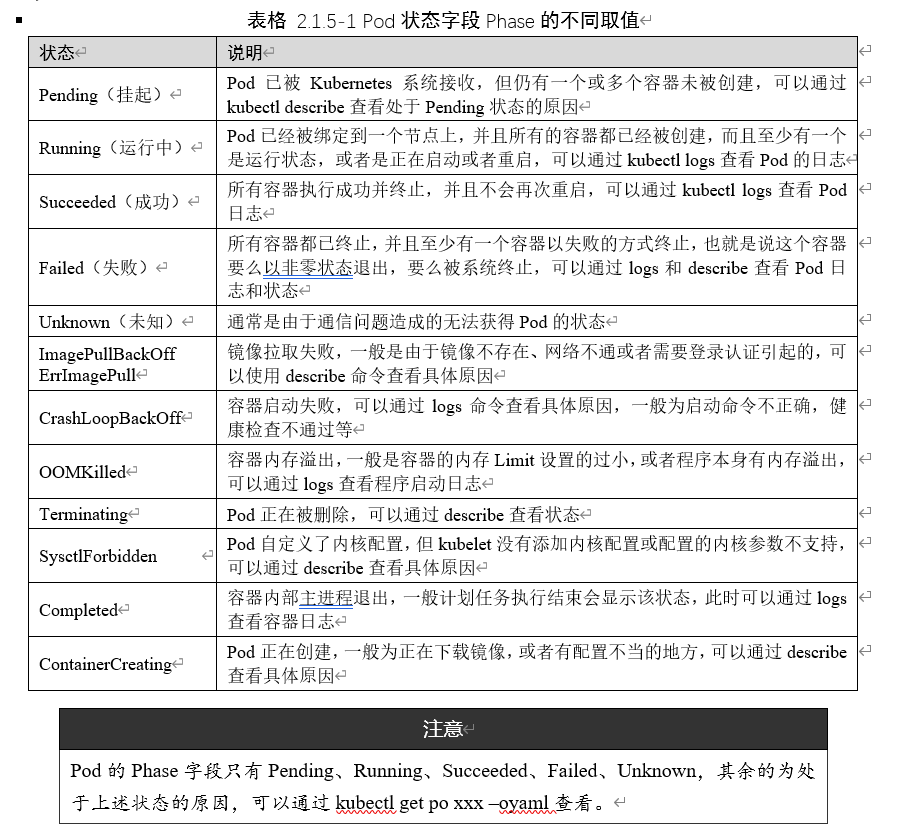

# Pod 基础

## 什么是Pod

Pod可以简单地理解为是一组、一个或多个容器构成，每个Pod还包含一个Pause容器。

Pause容器是Pod的父容器，它主要负责僵尸进程的回收管理，同时通过Pause容器可以使同一个Pod里面的不同容器共享存储、网络、PID、IPC等，容器之间可以使用 `localhost:port` 相互访问，可以使用 volume 等实现数据共享。

根据 Docker 的构造，Pod可被建模为一组具有共享命令空间、卷、IP地址和Port端口的容器。


## 为什么要引入Pod

- 强依赖的服务需要部署在一起（如nginx与php）
- 多个服务需要协同工作
- 兼容其他CRI标准的运行时

## Pod 基本操作

### 创建一个Pod

```shell
# 1. 定义一个 Pod
cat > nginx.yaml << EOF
apiVersion: v1                 # 必选，API 的版本号
kind: Pod                      # 必选，类型 Pod
metadata:                      # 必选，元数据
  name: nginx                  # 必选，符合 RFC 1035 规范的 Pod 名称
  labels:                      # 可选，标签
    run: nginx                 # 可选，键值对
spec:                          # 必选，用于定义 Pod 的详细信息
  containers:                  # 必选，容器列表
  - name: nginx                # 必选，符合 RFC 1035 规范的容器名称
    image: nginx:1.15.12       # 必选，容器所用的镜像的地址
    ports:                     # 可选，容器需要暴露的端口号列表
    - containerPort: 80        # 端口号
EOF

# 2. 创建 Pod
kubectl create -f nginx.yaml 


# 3. 查看 Pod 状态：
kubectl get po nginx


# 4. 使用 kubectl run 直接创建一个 Pod（不使用yaml文件快速创建pod，不推荐）
kubectl run nginx-run --image=nginx:1.15.12

# 5. 输出一个简单的创建pod的yaml模板(不会创建pod)
kubectl run nginx --image=nginx:1.15.12 -oyaml --dry-run
```

如何知道pod类型的yaml怎么写？

```shell
kubectl explain pod

kubectl explain pod.spec

...
```

如何确定apiVersion？

```shell
# 查看K8S定义的所有资源名称、缩写、用到的apiVersion
kubectl api-resources

# 如果类型为Pod,可以查看pod这类资源的版本
kubectl api-resources | grep pod
```

###  更改Pod启动命令和参数

```shell
# 新增启动命令与参数
cat > nginx.yaml << EOF
apiVersion: v1
kind: Pod
metadata:
  name: nginx
spec:
  containers:
  - name: nginx
    image: nginx:1.15.12
    command: [ "sleep", "10" ]          # 用于覆盖 ENTRYPOINT,它会覆盖镜像原本的启动命令
    args:                               # 用于覆盖 CMD，它会覆盖镜像原本的启动参数
    ports:
    - containerPort: 80
EOF
```

###  Pod状态及Pod故障排查

pod状态表：



###  Pod镜像拉取策略

通过 `spec.containers[].imagePullPolicy `参数可以指定镜像的拉取策略，目前支持的策略如下:

| 操作方式     | 说明                                                         |
| ------------ | ------------------------------------------------------------ |
| Always       | 总是拉取，当镜像 tag 为 latest 时，且 imagePullPolicy 未配置，默认为 Always |
| Never        | 不管是否存在都不会拉取                                       |
| ifNotPresent | 镜像不存在时拉取镜像，如果 tag 为非 latest，且 imagePullPolicy 未配置，默认为 ifNotPresent |

###  Pod重启策略

可以使用 `spec.restartPolicy `指定容器的重启策略：

| 操作方式  | 说明                                    |
| --------- | --------------------------------------- |
| Always    | 默认策略。容器失效时自动重启该容器      |
| OnFailure | 容器以不为0的状态码中止，自动重启该容器 |
| Never     | 无论何种状态，都不会重启                |

###  Pod的三种探针

| 种类           | 说明                                                         |
| -------------- | ------------------------------------------------------------ |
| startupProbe   | Kubernetes 1.16 新增的探测方式，用于判断容器内的应用程序是否已经启动。如果配置了startupProbe就会先禁用其他探测直到它成功为止。如果探测失败Kubelet会杀死容器，之后根据重启策略进行处理。如果探测成功或没有配置 startupProbe则状态为成功之后就不再探测。适用于探测启动比较慢的Pod |
| livenessProbe  | 用于探测容器是否在运行，如果探测失败kubelet 会 “杀死” 容器并根据重启策略进行相应的处理。如果未指定该探针将默认为 Success。会循环探测！ |
| readinessProbe | 1. 一般用于探测容器内的程序是否健康，即判断容器是否为就绪（Ready）状态。如果是则可以处理请求，反之 Endpoints Controller 将从所有的 Service 的 Endpoints 中删除此容器所在 Pod 的 IP 地址。如果未指定该探针将默认为 Success。会循环探测！<br>2. 检查失败会切断该容器对应Pod的Service流量！<br>3. 不会重启Pod |

### Pod探针的实现方式

| 实现方式         | 说明                                                         |
| ---------------- | ------------------------------------------------------------ |
| ExecAction       | 在容器内执行一个指定的命令，如果命令返回值为0则认为容器健康  |
| TCPSocketAction  | 通过 TCP 连接检查容器指定的端口，如果端口开放则认为容器健康  |
| HTTPSocketAction | 对指定的 URL 进行 GET 请求，如果状态码在 200 ~ 400 之间，则认为容器健康。生产环境常用，要求暴露接口 |

###  livenessProbe 和 readinessProbe

创建一个没有探针的 Pod：

```yaml
# 因为没有配置健康检查，在执行sleep 10 的时候Pod状态已经变成了 Running ,这是非常危险的！
apiVersion: v1
kind: Pod
metadata:
  name: nginx
spec:
  containers:
  - name: nginx
    image: nginx:1.15.12
    imagePullPolicy: IfNotPresent
    command:
    - sh
    - -c
    - sleep 10; nginx -g "daemon off;"
    ports:
    - containerPort: 80
  restartPolicy: Never
```

配置健康检查探针的Pod：

```yaml
apiVersion: v1
kind: Pod
metadata:
  name: nginx
spec:
  containers:
  - name: nginx
    image: nginx:1.15.12
    imagePullPolicy: IfNotPresent
    command:
    - sh
    - -c
    - sleep 10; nginx -g "daemon off;"
    readinessProbe:                      # 可选，健康检查。注意三种检查方式同时只能使用一种！
      httpGet:                           # 接口检测方式
        path: /index.html                # 检查路径
        port: 80
        scheme: HTTP                     # HTTP or HTTPS
        #httpHeaders:                    # 可选, 检查的请求头
        #- name: end-user
        # value: Jason 
      initialDelaySeconds: 10            # 初始化时间, 健康检查延迟执行时间
      timeoutSeconds: 2                  # 超时时间
      periodSeconds: 5                   # 检测间隔
      successThreshold: 1                # 检查成功为 1 次表示就绪
      failureThreshold: 2                # 检测失败 2 次表示未就绪
    livenessProbe:                       # 可选，健康检查
      tcpSocket:                         # 端口检测方式
        port: 80
      initialDelaySeconds: 10            # 初始化时间
      timeoutSeconds: 2                  # 超时时间
      periodSeconds: 5                   # 检测间隔
      successThreshold: 1                # 检查成功为 1 次表示就绪
      failureThreshold: 2                # 检测失败 2 次表示未就绪
    ports:
    - containerPort: 80
```

### StartupProbe

为什么一定要有StartupProbe？在生产环境中经常会遇到一些程序启动非常慢，不用StartupProbe时健康检查该怎么配置？

- 将 init 时间设置的非常长如 180s。会出现的问题是必须要等待 180s 后才能正常工作，这是不能容忍的！
- 另一种方式是将检测失败次数设置的多一些如 10 次，检测间隔改为 20s。会出现的问题是如果程序已经挂了，200s后才能重启容器，这也是不能容忍的！

```yaml
apiVersion: v1
kind: Pod
metadata:
  name: nginx
spec:
  containers:
  - name: nginx
    # 由于 nginx:1.15.12 镜像没有 pgrep 命令，所以这里换了一个镜像（一般带alpine的镜像都有 pgrep 命令）
    image: registry.cn-beijing.aliyuncs.com/dotbalo/nginx:1.15.12-alpine 
    imagePullPolicy: IfNotPresent
    command:
    - sh
    - -c
    - sleep 30; nginx -g "daemon off;"
    startupProbe:
      tcpSocket:                             # 端口检测方式
        port: 80
      initialDelaySeconds: 10                # 初始化时间
      timeoutSeconds: 2                      # 超时时间
      periodSeconds: 5                       # 检测间隔
      successThreshold: 1                    # 检查成功为 1 次表示就绪
      failureThreshold: 5                    # 检测失败 5 次表示未就绪
    readinessProbe:                          # 可选，健康检查。注意三种检查方式同时只能使用一种。
      httpGet:                               # 接口检测方式
        path: /index.html                    # 检查路径
        port: 80
        scheme: HTTP                         # HTTP or HTTPS
        #httpHeaders:                        # 可选, 检查的请求头
        #- name: end-user
        # value: Jason 
      initialDelaySeconds: 10                # 初始化时间, 健康检查延迟执行时间
      timeoutSeconds: 2                      # 超时时间
      periodSeconds: 5                       # 检测间隔
      successThreshold: 1                    # 检查成功为 1 次表示就绪
      failureThreshold: 2                    # 检测失败 2 次表示未就绪
    livenessProbe:                           # 可选，健康检查
      exec:                                  # 端口检测方式
        command:
        - sh
        - -c
        - pgrep nginx
      initialDelaySeconds: 10                # 初始化时间
      timeoutSeconds: 2                      # 超时时间
      periodSeconds: 5                       # 检测间隔
      successThreshold: 1                    # 检查成功为 1 次表示就绪
      failureThreshold: 2                    # 检测失败 2 次表示未就绪
    ports:
    - containerPort: 80
```

###0 preStop 和 postStart

是否用了合理的探针，就能保证 Pod 启动与运行万无一失呢？肯定不是！

- 在传统架构中，更新副本时我们总是先停止一个副本然后把新代码部署上去再启动这个副本。所以说会有一个停止再启动的过程。

- 在 K8S 中默认的更新方式是：先创建一个新的Pod，在新的Pod启动成功后再删除旧的Pod！

- 所以合理的探针能保证平滑的启动，却没有保证平滑的退出，要想做到零宕机的发版还是不够的！

Pod生命周期 -- 启动过程


Pod生命周期 -- 退出过程


PreStop使用场景：

- Pod 删除中做一些收尾工作，比如等待已经进入的请求完全执行完成（平滑退出）
- 例如Spring Cloud体系中，B服务会从注册中心Nacos中拿到A服务所有的Ip地址列表，并轮询向这些Ip地址发请求。如果Pod退出了但是注册中心Naocs还未来得及更新，这时流量还会打到这个退出的A服务副本上，这次的访问就失败了！解决就是通过PreStop发送一个通知告诉Nacos该副本要下线了。或者最简单的方式sleep30s后等待该副本从Nacos注册表中被剔除了再进行Pod删除操作

PreStop与PreStart使用示例：

```yaml
apiVersion: v1
kind: Pod
metadata:
  name: nginx
spec:
  containers:
  - name: nginx
    image: nginx:1.15.12
    imagePullPolicy: IfNotPresent
    lifecycle:
      # 容器创建完成后执行的指令, 可以是 exec httpGet TCPSocket
      # 它的执行和容器的启动命令执行是同时的，所以它不一定比容器启动先执行完成
      # 所以如果是容器启动的前置依赖操作不建议使用该方式，而是使用 init container 做初始化操作
      postStart:                         
        exec:
          command:
          - sh
          - -c
          - 'mkdir /data/'
      # 容器停止之前执行的指令
      preStop:
        exec:
          command:
          - sh
          - -c
          - sleep 10
    ports:
    - containerPort: 80
  restartPolicy: Never
```

###1 gRPC探测

> gRPC 探针 在 K8S 1.24 版本后默认开启

```yaml
apiVersion: v1
kind: Pod
metadata:
  name: etcd-with-grpc
spec:
  containers:
  - name: etcd
    image: registry.cn-hangzhou.aliyuncs.com/google_containers/etcd:3.5.1-0
    command: [ "/usr/local/bin/etcd", "--data-dir", "/var/lib/etcd", "--listen-client-urls", "http://0.0.0.0:2379", "--advertise-client-urls", "http://127.0.0.1:2379", "--log-level", "debug"]
    ports:
    - containerPort: 2379
    livenessProbe:
      grpc:
        port: 2379
      initialDelaySeconds: 10
```
