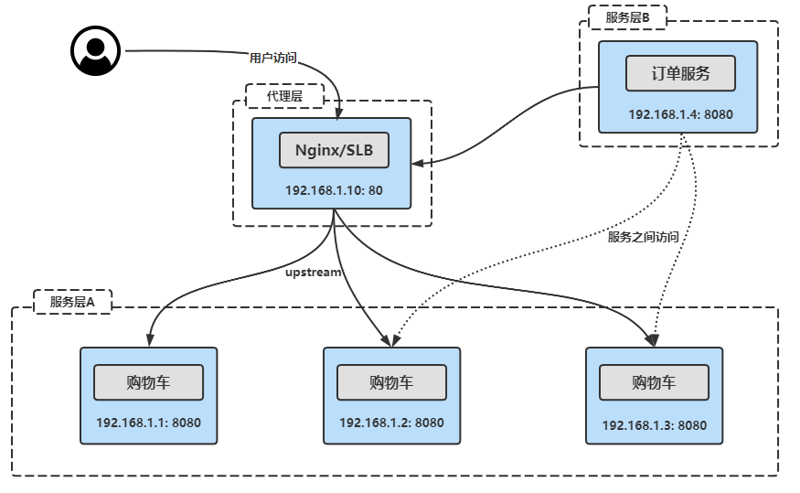
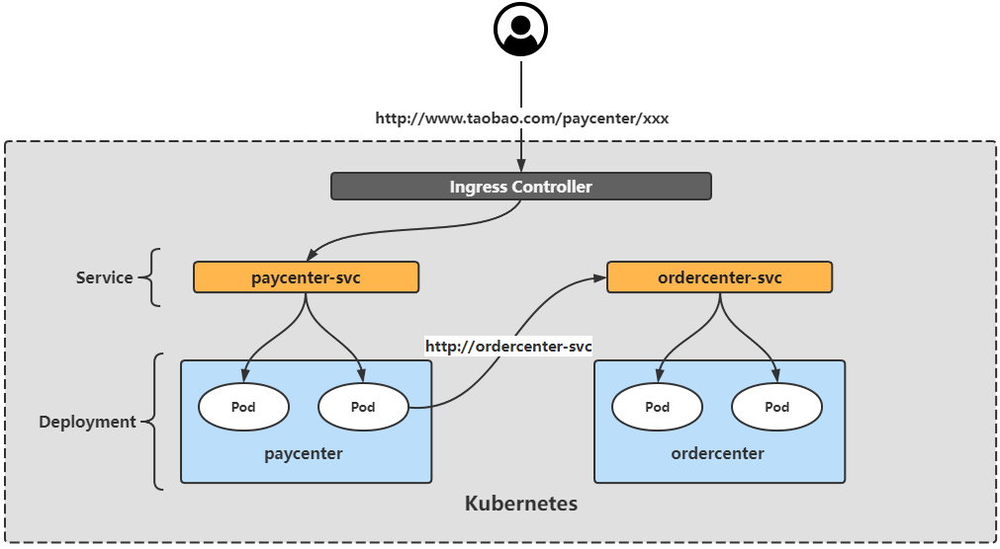
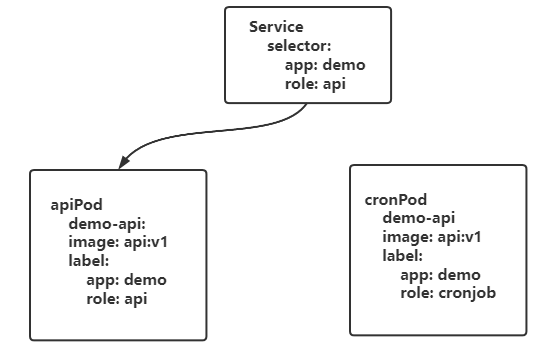
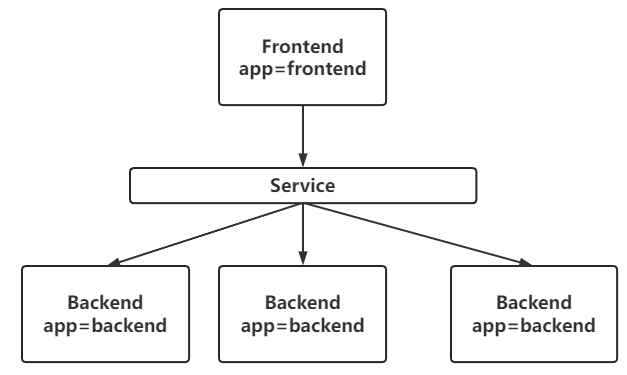
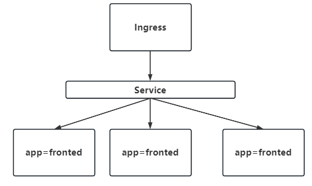
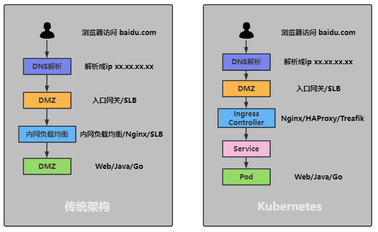
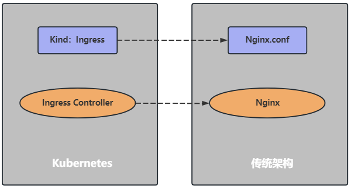

# 服务发布基础

## K8S 如何发布服务

### 传统架构服务发布方式



### K8S 服务发布方式



## Label 和 Selector

### 理解

**Label**

Label（标签）可以对 K8S 的一些对象，如 Pod 和节点进行 “分组”。通过添加 `key=value` 格式的标签，用于区分同样的资源不同的分组！

**Selector**

Selector（标签选择器）可以通过根据资源的标签查询精确的对象信息！



### Label 使用

**应用案例：**

公司与 xx 银行有一条专属的高速光纤通道，此通道只能与 192.168.7.0 网段进行通信，因此只能将与 xx 银行通信的应用部署到 192.168.7.0 网段所在的节点上，此时可以对节点添加Label实现该需求！

```shell
# 对node打标签
kubectl label node k8s-node2 region=subnet7

# Selector 筛选
kubectl get node -l region=subnet7

# 最后在 Deployment 或其他控制器中指定 Pod 部署到该节点
containers:
 ......
dnsPolicy: ClusterFirst
nodeSelector:
  region: subnet7
restartPolicy: Always
......
```

也可以用同样的方式对 Service 添加 Label：

```shell
# 对service打标签
kubectl label svc canary-v1 -n canary-production env=canary version=v1

# 查看该 Service 的标签
kubectl get svc -n canary-production --show-labels

# 还可以查看所有 version 为 v1 的 Service
kubectl get svc --all-namespaces -l version=v1
```

上述演示了对节点、Service 添加自定义标签，对于其他资源的 Label 方式相同

### Selector 使用

```shell
# 首先使用--show-labels 查看指定资源目前已有的 Label
kubectl get svc --show-labels

# 选择匹配 app 为 details 或者 productpage 的 Service
kubectl get svc -l 'app in (details, productpage)' --show-labels

# 选择 app 为 productpage 或 reviews 但不包括 version=v1 的 svc
kubectl get svc -l version!=v1,'app in (details, productpage)' --show-labels

# 选择 label 的 key 名为 app 的 svc
kubectl get svc -l app --show-labels
```

### 修改标签

```shell
# 比如将 version=v1 改为 version=v2
kubectl label svc canary-v1 -n canary-production version=v2 --overwrite
```

### 删除标签

```shell
# 删除 key 名为 version 的标签
kubectl label svc canary-v1 -n canary-production version-service/canary-v1 labeled
```

## Service

### 理解

每个Pod都会获取到它自己的IP地址，但是这些IP地址不总是稳定和可依赖的，这样就会导致一个问题：在Kubernetes集群中，如果一组Pod（比如后端的Pod）为其他Pod（比如前端的Pod）提供服务，那么如果他们之间使用Pod的IP地址进行通信，在Pod重建后将无法再连接。于是Kubernetes引用了Service这样一个抽象概念：逻辑上的一组Pod,即一种可以访问Pod 的策略。这一组Pod 能够被Service通过标签选择器访问到，之后就可以使用Service进行通信。 



### 定义一个Service

```shell
# pod
apiVersion: apps/v1
kind: Deployment
metadata:
  name: nginx-deployment
  labels:
    app: nginx-deploy
spec:
  replicas: 3
  selector:
    matchLabels:
      app: nginx-pod
  template:
    metadata:
      labels:
        app: nginx-pod
    spec:
      containers:
      - name: nginx
        image: nginx:1.15.12-alpine
        ports:
        - containerPort: 80
        #  name: web
---
# svc
apiVersion: v1
kind: Service
metadata:
  name: nginx-svc
spec:
  selector:
    app: nginx-pod
  ports:
    - protocol: TCP
      port: 80            # service 自己的端口号
      targetPort: 80      # pod 服务的正式端口号
      # targetPort: web
```

该示例为 nginx-svc:80 即可访问到具有 app=nginx-pod 标签的pod的80端口上

需要注意的是，Service 能够将一个接收端口映射到任意的 targetPort，如果 targetPort 为空，targetPort 将被设置为与 Port 字段相同的值。 

targetPort 可以设置为一个字符串，指向后端 Pod 的端口名（由`containers.ports.name`定义），分配到该字符串的端口号可以在每个Pod中不同，这样的话即使更改了 Pod 的端口，也不会对 Service 的访问造成影响

Kubernetes Service 能够支持 TCP、UDP、SCTP 等协议，默认为 TCP 协议

### Service 的类型

Kubernetes Service Type（服务类型）主要包括以下几种：

- ClusterIP：在集群内部使用，默认值，只能从集群中访问
- NodePort：在所有安装了 Kube-Proxy 的节点上打开一个端口，此端口可以代理至后端Pod，可以通过 NodePort 从集群外部访问集群内的服务，访问格式为 NodeIP:NodePort
- LoadBalancer：使用云提供商的负载均衡器公开服务，成本较高
- ExternalName：通过返回定义的 CNAME 别名，没有设置任何类型的代理，需要 1.7 或更高版本 kube-dns 支持

### NodePort 类型

如果将 Service 的 type 字段设置为 NodePort，则 Kubernetes 将从`--service-node-port-range` 参数指定的范围（默认为 30000-32767）中自动分配端口，也可以手动指定 NodePort，创建该 Service后，集群每个节点都将暴露一个端口，通过某个宿主机的 IP+端口即可访问到后端的应用。

> `--service-node-port-range` 参数位置：
>
> 二进制安装： /usr/lib/systemd/system/kube-apiserver.service
>
> kubeadm安装： /etc/kubernetes/manifests/kube-apiserver

定义一个 NodePort 类型的 Service 格式如下：

```yaml
apiVersion: v1
kind: Service
metadata:
  name: nginx-svc
spec:
  selector:
    app: nginx-pod
  type: NodePort
  ports:
    - protocol: TCP
      port: 80
      targetPort: 80
      nodePort: 30000
```

### Service 代理 K8S 外部服务

> endpoint 是k8s集群中的一个资源对象，存储在etcd中用来记录一个service对应的所有pod的访问地址。
>
> service配置selector，endpoint controller 才会自动创建对应的endpoint对象，否则不会生成endpoint对象

使用场景：

- 希望在生产环境中使用某个固定的名称而非 IP 地址访问外部的中间件服务

- 希望 Service 指向另一个 Namespace 中或其他集群中的服务

- 正在将工作负载转移到 Kubernetes 集群，但是一部分服务仍运行在 Kubernetes 集群之外

如下 service 不配置selector，而是手动创建一个与Service 标签一致（否则无法关联）的endpoints用于指定外部服务地址：

```yaml
# cat nginx-svc-external.yaml 
apiVersion: v1
kind: Service
metadata:
  name: nginx-svc-external
  labels:
    app: nginx-svc-external
spec:
  type: ClusterIP
  ports:
  - name: http
    port: 80 
    protocol: TCP
    targetPort: 80
  sessionAffinity: None
---
# cat nginx-ep-external.yaml 
apiVersion: v1
kind: Endpoints
metadata:
  name: nginx-svc-external
  labels:
    app: nginx-svc-external
subsets:
- addresses:
  - ip: 140.205.94.189 
  ports:          # endpoints 中 ports 下的配置要与 service 一致
  - name: http
    port: 80
    protocol: TCP
```

> 注意：Endpoint IP 地址不能是 loopback（127.0.0.0/8）、link-local（169.254.0.0/16）或者 link-local 多播地址（224.0.0.0/24）

访问没有 Selector 的 Service 与有 Selector 的 Service 的原理相同，通过 Service 名称即可访问，请求将被路由到用户定义的 Endpoint

### ExternalName Service 代理域名

ExternalName Service 是 Service 的特例，它没有 Selector，也没有定义任何端口和 Endpoint，它通过返回该外部服务的别名来提供服务。

比如可以定义一个 Service，后端设置为一个外部域名，这样通过 Service 的名称即可访问到该域名。使用  nslookup 解析以下文件定义的 Service，集群的 DNS 服务将返回一个值为 my.database.example.com 的 CNAME 记录：

```yaml
kind: Service
apiVersion: v1
metadata:
  name: my-service
  namespace: prod
spec:
  type: ExternalName
  externalName: my.database.example.com
```

### 多端口 Service

例如将 Service 的 80 端口代理到后端的 9376，443 端口代理到后端的 9377：

```yaml
kind: Service
apiVersion: v1
metadata:
  name: my-service
spec:
  selector:
    app: myapp
  ports:
  - name: http
    protocol: TCP
    port: 80
    targetPort: 9376
  - name: https
    protocol: TCP
    port: 443
    targetPort: 9377
```

## Ingress 

### 理解

Ingress 为 Kubernetes 集群中的服务提供了入口，可以提供负载均衡、SSL终止和基于名称（域名）的虚拟主机、应用的灰度发布等功能，在生产环境中常用的 Ingress Controller 有 Treafik、Nginx、HAProxy、Istio等。



### Ingress 发布服务流程



### Ingress 组成



### Ingress Controller 安装

[官方安装文档](https://kubernetes.github.io/ingress-nginx/deploy/#bare-metal-clusters)

使用裸机集群安装方式

```shell
# 获取官方镜像
wget https://raw.githubusercontent.com/kubernetes/ingress-nginx/controller-v1.2.0/deploy/static/provider/baremetal/deploy.yaml

# 修改配置
# Job => ingress-nginx-admission-create
# Job => ingress-nginx-admission-patch
registry.cn-beijing.aliyuncs.com/dotbalo/kube-webhook-certgen:v1.1.1
# Deployment => ingress-nginx-controller
registry.cn-beijing.aliyuncs.com/dotbalo/controller:v1.2.0

# 安装运行
kubectl create -f deploy.yaml
```

### ingress 使用域名发布 K8S 内部服务

创建Ingress

```yaml
# vim web-ingress.yaml
# k8s >= 1.22 必须 v1
# 1.22之前可以使用v1betal
# 1.19版本之后就可以使用v1了
apiVersion: networking.k8s.io/v1   
kind: Ingress
metadata:
  name: nginx-ingress
  # 1.19之前是用annotations 指定ingress-controller 类型的(api版本为v1betal)
  # annotations:
  #   kubernetes.io/ingress.class: "nginx" 
spec:
  ingressClassName: nginx            # 指定 ingress-controller 类型
  rules:                             # 路由规则
  - host: nginx.test.com
    http:
      paths:
      - backend:
          service:
            # 1.19版本之前是直接使用serviceName和servicePort(api版本为v1betal)
            # serviceName: nginx-svc
            # servicePort: 80
            # 下面写法便可以兼容svc
            name: nginx-svc
            port:
              number: 80
        path: /
        pathType: ImplementationSpecific 
```

- pathType：路径的匹配方式，目前有 ImplementationSpecific、Exact 和 Prefix 方式

  - Exact：精确匹配，比如配置的 path 为 `/bar`，那么 `/bar/` 将不能被路由

  - Prefix：前缀匹配，基于以 / 分隔的 URL 路径。比如 path 为 `/abc`，可以匹配 到 `/abc/bbb` 等，比较常用的配置

  - ImplementationSpecific：这种类型的路由匹配根据 Ingress Controller 来实现， 可以当做一个单独的类型，也可以当做 Prefix 和 Exact。ImplementationSpecific 是 1.18 版本引入 Prefix 和 Exact 的默认配置

```shell
# 查看 ingress-controller
[root@k8s-master01 YAML]# kubectl get ingressclass
NAME    CONTROLLER             PARAMETERS   AGE
nginx   k8s.io/ingress-nginx   <none>       28d


# 创建
[root@k8s-master01 YAML]# kubectl create -f web-ingress.yaml
ingress.networking.k8s.io/nginx-ingress created
[root@k8s-master01 YAML]# kubectl get ingress
NAME            CLASS   HOSTS            ADDRESS   PORTS   AGE
nginx-ingress   nginx   nginx.test.com             80      5s

# 访问
# 将域名解析到nginx-controller
[root@k8s-master01 YAML]# kubectl get svc -n ingress-nginx
NAME                                TYPE      CLUSTER-IP     EXTERNAL-IP  PORT(S)                      AGE
ingress-nginx-controller            NodePort  10.99.196.41   <none>       80:31002/TCP,443:32138/TCP   28d
ingress-nginx-controller-admission  ClusterIP 10.108.181.176 <none>       443/TCP                      28d
# 解析地址为 任意节点ip地址 + NodePort
# 本机host文件添加：192.168.21.101 nginx.test.com 
# 访问：http://nginx.test.com:31002
```

原理

```shell
# ingress-nginx-controller 其实就是nginx，ingress就是它的配置文件
# 进入容器
kubectl exec -it ingress-nginx-controller-bdc4b7d6b-772ch -n ingress-nginx -- bash
# 查看配置文件
bash-5.1$ grep -A 20 "nginx.test.com" nginx.conf
        ## start server nginx.test.com
        server {
                server_name nginx.test.com ;

                listen 80  ;
                listen 443  ssl http2 ;

                set $proxy_upstream_name "-";

                ssl_certificate_by_lua_block {
                        certificate.call()
                }

                location / {

                        set $namespace      "default";
                        set $ingress_name   "nginx-ingress";
                        set $service_name   "nginx-svc";
                        set $service_port   "80";
                        set $location_path  "/";
                        set $global_rate_limit_exceeding n;

                        rewrite_by_lua_block {
--
        ## end server nginx.test.com
```

### Ingress特例-不配置域名发布服务

去掉host配置即可

```shell
# vim web-nohost-ingress.yaml
apiVersion: networking.k8s.io/v1   # k8s >= 1.22 必须 v1
kind: Ingress
metadata:
  name: nginx-nohost-ingress
spec:
  ingressClassName: nginx
  rules:
  - http:
      paths:
      - backend:
          service:
            name: nginx-svc
            port:
              number: 80
        path: /no-host
        pathType: ImplementationSpecific 
```

```shell
# 查看
[root@k8s-master01 YAML]# kubectl get ingress -A
NAMESPACE   NAME                  CLASS   HOSTS            ADDRESS          PORTS   AGE
default     nginx-ingress         nginx   nginx.test.com   192.168.21.101   80      34m
default     nginx-nohost-ingress  nginx   *                192.168.21.101   80      2m33s
# 访问
curl 192.168.21.101:31001/no-host
# 报错404
# 排查：查看所有标签为nginx-pod的日志
[root@k8s-master01 YAML]# kubectl logs -f -l app=nginx-pod
2023/03/10 13:39:19 [error] 7#7: *2 open() "/usr/share/nginx/html/no-host" failed (2: No such file or directory), client: 172.25.244.208, server: localhost, request: "GET /no-host HTTP/1.1", host: "192.168.21.101:31002"
```