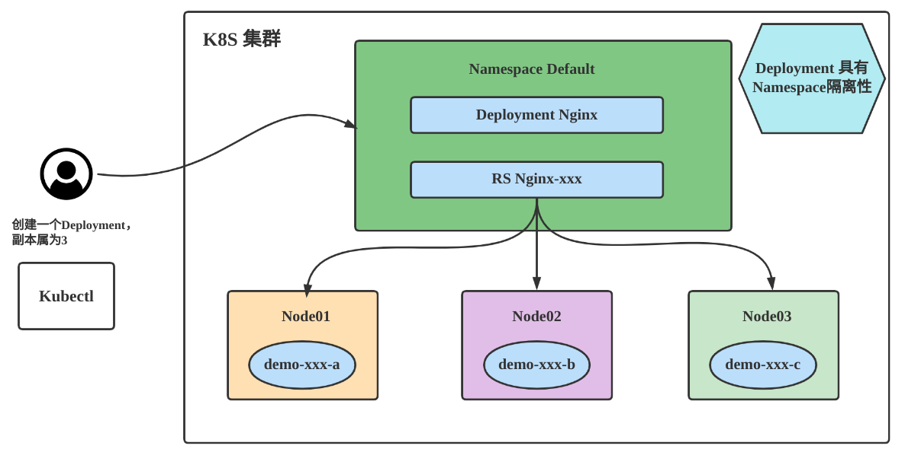
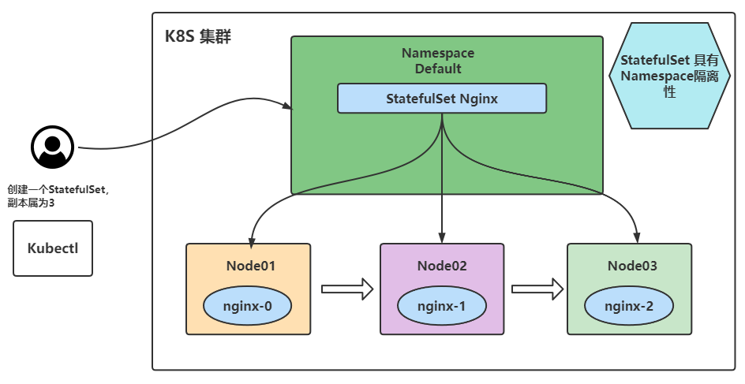
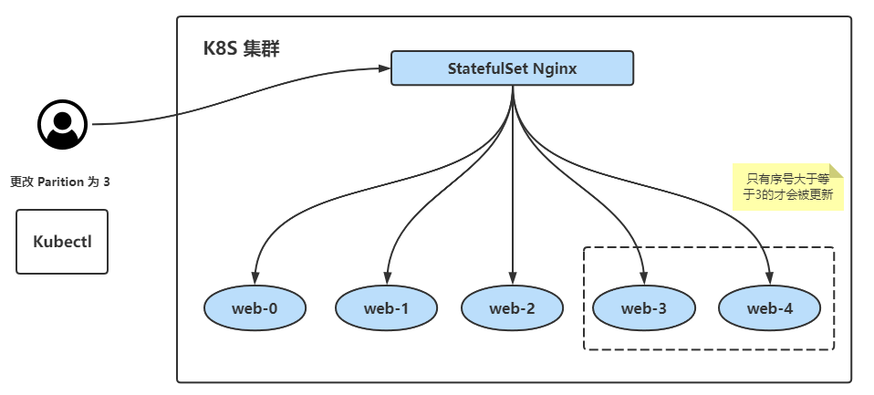
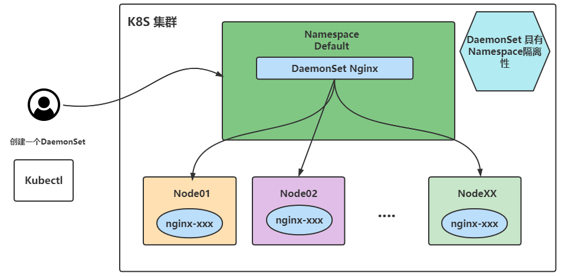
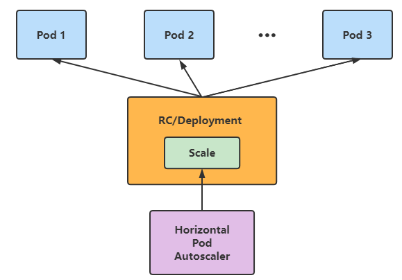

# 资源调度

## 理解

Pod 在生产环境中一般不会单独拿出来创建使用，因为它的有些操作还是比较不方便的。如版本升级、配置更改等操作都需要修改yaml文件然后重新部署Pod。所以在生产环境中一般都用更高级的资源去部署服务！

## Replication Controller 与 ReplicaSet

`Replication Controller`（复制控制器，RC）和 `ReplicaSet`（复制集，RS）是两种简单部署 Pod 的方式。因为在生产环境中主要使用更高级的 Deployment 等方式进行 Pod 的管理和部署，所以只需要简单了解即可。

### RC

`Replication Controller`（简称 RC）可确保 Pod 副本数达到期望值，也就是 RC 定义的数量。换句话说 `Replication Controller` <span style="color:red">可确保一个 Pod 或一组同类 Pod 总是可用</span>。如果存在的 Pod 大于设定的值则 `Replication Controller` 将终止额外的 Pod。如果太小`Replication Controller` 将启动更多的 Pod 用于保证达到期望值。与手动创建 Pod 不同的是用 `Replication Controller` 维护的 Pod 在失败、删除或终止时会自动替换。因此即使应用程序只需要一个 Pod也应该使用 `Replication Controller` 或其他方式管理。`Replication Controller` 类似于进程管理程序，但是 `Replication Controller` 不是监视单个节点上的各个进程，而是监视多个节点上的多个 Pod。

定义一个 `Replication Controller` 的示例如下：

```yaml
apiVersion: v1
kind: ReplicationController    # RC类型
metadata:
  name: nginx
spec:
  replicas: 3                  # 指定副本数
  selector:
    app: nginx
  template:
    metadata:
      name: nginx
      labels:
        app: nginx
  spec:
    containers:
    - name: nginx
      image: nginx
      ports:
      - containerPort: 80
```

### RS 

ReplicaSet 是支持基于集合的标签选择器的下一代 Replication Controller，它主要用作

Deployment 协调创建、删除和更新 Pod，和 Replication Controller 唯一的区别是，ReplicaSet 支持

标签选择器。在实际应用中，虽然 ReplicaSet 可以单独使用，但是一般建议使用 Deployment 来

自动管理 ReplicaSet，除非自定义的 Pod 不需要更新或有其他编排等。

定义一个 ReplicaSet 的示例如下：

```yaml
apiVersion: apps/v1
kind: ReplicaSet
metadata:
  name: frontend
  labels:
    app: guestbook
    tier: frontend
spec:
  # modify replicas according to your case
  replicas: 3
  selector:
    matchLabels:
      tier: frontend
    matchExpressions:
      - {key: tier, operator: In, values: [frontend]}
  template:
    metadata:
      labels:
        app: guestbook
        tier: frontend
    spec:
      containers:
      - name: php-redis
        image: gcr.io/google_samples/gb-frontend:v3
        resources:
          requests:
            cpu: 100m
            memory: 100Mi
        env:
        - name: GET_HOSTS_FROM
          value: dns
          # If your cluster config does not include a dns service, then to
          # instead access environment variables to find service host
          # info, comment out the 'value: dns' line above, and uncomment the
          # line below.
          # value: env
        ports:
         - containerPort: 80
```

Replication Controller 和 ReplicaSet 的创建删除和 Pod 并无太大区别，Replication Controller目前几乎已经不在生产环境中使用，ReplicaSet 也很少单独被使用，都是使用更高级的资源Deployment、DaemonSet、StatefulSet 进行管理 Pod。

## 无状态应用管理 Deployment

### 理解

Deployment 一般用于部署公司的无状态服务，这个也是最常用的控制器，因为企业内部现在都是以为服务为主，而微服务实现无状态化也是最佳实践，可以利用Deployment的高级功能做到无缝迁移、自动扩容缩容、自动灾难恢复、一键回滚等功能。

### Deployment 部署过程



### 获取deployment创建模板

```shell
kubectl create deploy nginx --image=registry.cn-beijing.aliyuncs.com/dotbalo/nginx:1.15.12-alpine --replicas=3 -oyaml --dry-run=client > nginx-deploy.yaml
```

nginx-deploy.yaml

```yaml
apiVersion: apps/v1         # 为apps/v1，必须指定该字段
kind: Deployment
metadata:
  labels:
    app: nginx
  name: nginx
spec:
  replicas: 3               # 创建Pod的副本数
  selector:                 # 定义Deployment如何找到要管理的Pod，与template的label（标签）对应
    matchLabels:
      app: nginx
  template:
    metadata:
      labels:
        app: nginx          # nginx使用label（标签）标记Pod
    spec:                   # 表示Pod运行一个名字为nginx的容器
      containers:
      - image: registry.cn-beijing.aliyuncs.com/dotbalo/nginx:1.15.12-alpine  # 运行此Pod使用的镜像
        name: nginx         # 容器用于发送和接收流量的端口
```

### 创建 Deployment 

```shell
# 创建
kubectl create -f nginx-deploy.yaml


# 查看 deployment
[root@k8s-master01 ~]# kubectl get deploy
NAME    READY   UP-TO-DATE   AVAILABLE   AGE
nginx   1/3     3            1           6s
# ➢ NAME：集群中Deployment的名称
# ➢ READY：Pod就绪个数和总副本数 
# ➢ UP-TO-DATE：显示已达到期望状态的被更新的副本数
# ➢ AVAILABLE：显示用户可以使用的应用程序副本数，当前为0，说明目前还没有达到期望的Pod
# ➢ AGE：显示应用程序运行的时间


# 查看整个 Deployment 创建的状态
[root@k8s-master01 ~]#  kubectl rollout status deployment/nginx
deployment "nginx" successfully rolled out


# 查看RS（deploy使用RS管理Pod）
# 注意：当 Deployment 有过更新时对应的 RS 可能不止一个，可以通过-o yaml 获取当前对应的 RS 是哪个
#      其余的 RS 为保留的历史版本，用于回滚等操作
[root@k8s-master01 ~]# kubectl get rs
NAME               DESIRED   CURRENT   READY   AGE
nginx-85df6f565c   3         3         3       4m41s
# ➢ DESIRED：应用程序副本数
# ➢ CURRENT：当前正在运行的副本数


# 查看Pod
[root@k8s-master01 ~]# kubectl get pod
NAME                     READY   STATUS    RESTARTS      AGE
etcd-with-grpc           1/1     Running   2 (12m ago)   6d23h
nginx-85df6f565c-89lf6   1/1     Running   0             5m15s
nginx-85df6f565c-pwr6m   1/1     Running   0             5m15s
nginx-85df6f565c-sfbxk   1/1     Running   0             5m15s


# 删除一个pod（测试deploy自动恢复）
[root@k8s-master01 ~]# kubectl delete pod nginx-85df6f565c-sfbxk
pod "nginx-85df6f565c-sfbxk" deleted
[root@k8s-master01 ~]# kubectl get pod
NAME                     READY   STATUS    RESTARTS      AGE
etcd-with-grpc           1/1     Running   2 (17m ago)   6d23h
nginx-85df6f565c-89lf6   1/1     Running   0             9m59s
nginx-85df6f565c-pwr6m   1/1     Running   0             9m59s
nginx-85df6f565c-rch59   1/1     Running   0             76s       # 自动恢复
```

### 滚动更新 Deployment

> 注意：当且仅当 Deployment 的 Pod 模板（即`.spec.template`）更改时才会触发 Deployment更新，例如更改内存、CPU 配置或者容器的 image。

假如更新 Nginx Pod 的 image 使用 `nginx:latest`，并使用--record 记录当前更改的参数，后期回滚时可以查看到对应的信息

```shell
[root@k8s-master01 ~]# kubectl set image deployment nginx nginx=nginx:1.9.1 --record
Flag --record has been deprecated, --record will be removed in the future
deployment.apps/nginx image updated
```

当然也可以使用 edit 命令直接编辑 Deployment，效果相同

```shell
[root@k8s-master01 ~]# kubectl edit deploy nginx
```

同样可以使用 kubectl rollout status 查看更新过程

```shell
[root@k8s-master01 ~]# kubectl rollout status deploy nginx
Waiting for deployment "nginx" rollout to finish: 1 out of 3 new replicas have been updated...
Waiting for deployment "nginx" rollout to finish: 1 out of 3 new replicas have been updated...
Waiting for deployment "nginx" rollout to finish: 1 out of 3 new replicas have been updated...
Waiting for deployment "nginx" rollout to finish: 2 out of 3 new replicas have been updated...
Waiting for deployment "nginx" rollout to finish: 2 out of 3 new replicas have been updated...
Waiting for deployment "nginx" rollout to finish: 2 old replicas are pending termination...
Waiting for deployment "nginx" rollout to finish: 1 old replicas are pending termination...
Waiting for deployment "nginx" rollout to finish: 1 old replicas are pending termination...
deployment "nginx" successfully rolled out
```

可以看出更新过程为新旧交替更新，首先新建一个 Pod，当 Pod 状态为 Running 时删除一个旧的 Pod 同时再创建一个新的 Pod。当触发一个更新后会有新的 ReplicaSet 产生，旧的ReplicaSet 会被保存，查看此时 ReplicaSet可以从 AGE 或 READY 看出来新旧 ReplicaSet

```shell
[root@k8s-master01 ~]# kubectl get rs
NAME               DESIRED   CURRENT   READY   AGE
nginx-7886496b9c   3         3         3       2m47s
nginx-85df6f565c   0         0         0       4h40m
```

通过 describe 查看 Deployment 的详细信息

```shell
[root@k8s-master01 ~]# kubectl describe deploy nginx
...
NewReplicaSet:   nginx-7886496b9c (3/3 replicas created)
Events:
  Type    Reason             Age    From                   Message
  ----    ------             ----   ----                   -------
  Normal  ScalingReplicaSet  97s   deployment-controller  Scaled up replica set nginx-85df6f565c to 3
  Normal  ScalingReplicaSet  23s   deployment-controller  Scaled up replica set nginx-7886496b9c to 1
  Normal  ScalingReplicaSet  22s   deployment-controller  Scaled down replica set nginx-85df6f565c to 2
  Normal  ScalingReplicaSet  22s   deployment-controller  Scaled up replica set nginx-7886496b9c to 2
  Normal  ScalingReplicaSet  21s   deployment-controller  Scaled down replica set nginx-85df6f565c to 1
  Normal  ScalingReplicaSet  21s   deployment-controller  Scaled up replica set nginx-7886496b9c to 3
  Normal  ScalingReplicaSet  19s   deployment-controller  Scaled down replica set nginx-85df6f565c to 0
```

在 describe 中可以看出第一次创建时它创建了一个名为 `nginx-85df6f565c` 的 ReplicaSet 并直接将其扩展为 3 个副本。更新部署时它创建了一个新的 ReplicaSet，命名为 `nginx-7886496b9c`并将其副本数扩展为 1，然后将旧的 ReplicaSet 缩小为 2，这样至少可以有 2 个 Pod 可用，最多创建了 4 个 Pod。以此类推，使用相同的滚动更新策略向上和向下扩展新旧 ReplicaSet，最终新的 ReplicaSet 可以拥有 3 个副本并将旧的 ReplicaSet 缩小为 0。

### 回滚 Deployment

当更新了版本不稳定或配置不合理时可以对其进行回滚操作，假设我们又进行了几次更新（此处以更新镜像版本触发更新，更改配置效果类似）

```shell
[root@k8s-master01 ~]# kubectl set image deploy nginx nginx=dotbalo/canary:v1 --record
[root@k8s-master01 ~]# kubectl set image deploy nginx nginx=dotbalo/canary:v2 --record 
```

使用 kubectl rollout history 查看更新历史

```shell
[root@k8s-master01 ~]# kubectl rollout history deploy nginx
deployment.apps/nginx
REVISION  CHANGE-CAUSE
1         <none>
2         kubectl set image deployment nginx nginx=nginx:1.9.1 --record=true
3         kubectl set image deployment nginx nginx=dotbalo/canary:v1 --record=true
4         kubectl set image deployment nginx nginx=dotbalo/canary:v2 --record=true
```

查看 Deployment 某次更新的详细信息，使用 `--revision` 指定某次更新版本号

```shell
[root@k8s-master01 ~]# kubectl rollout history deploy nginx --revision=3
deployment.apps/nginx with revision #3
Pod Template:
  Labels:       app=nginx
        pod-template-hash=5b4ffbffd7
  Annotations:  kubernetes.io/change-cause: kubectl set image deployment nginx nginx=dotbalo/canary:v1 --record=true
  Containers:
   nginx:
    Image:      dotbalo/canary:v1
    Port:       <none>
    Host Port:  <none>
    Environment:        <none>
    Mounts:     <none>
  Volumes:      <none>
```

如果只需要回滚到上一个稳定版本，使用 kubectl rollout undo 即可

```shell
[root@k8s-master01 ~]# kubectl rollout undo deploy nginx
```

再次查看更新历史，发现 REVISION5 回到了 canary:v1

```shell
[root@k8s-master01 ~]# kubectl rollout history deploy nginx
deployment.apps/nginx
REVISION  CHANGE-CAUSE
1         <none>
2         kubectl set image deployment nginx nginx=nginx:1.9.1 --record=true
4         kubectl set image deployment nginx nginx=dotbalo/canary:v2 --record=true
5         kubectl set image deployment nginx nginx=dotbalo/canary:v1 --record=true
```

如果要回滚到指定版本，使用 `--to-revision` 参数

```shell
[root@k8s-master01 ~]# kubectl rollout undo deploy nginx --to-revision=2
```

### 扩容 Deployment

当公司访问量变大，或者有预期内的活动时，三个 Pod 可能已无法支撑业务时，可以提前对其进行扩展。

使用 kubectl scale 动态调整 Pod 的副本数，比如增加 Pod 为 5 个

```shell
[root@k8s-master01 ~]# kubectl scale deploy nginx --replicas=5
# 再次查看 Pod，此时 Pod 已经变成了 5 个
```

### 暂停和恢复 Deployment 更新

上述演示的均为更改某一处的配置，更改后立即触发更新，大多数情况下可能需要针对一个资源文件更改多处地方而并不需要多次触发更新，此时可以使用 Deployment 暂停功能临时禁用更新操作，对 Deployment 进行多次修改后在进行更新。

使用 kubectl rollout pause 命令即可暂停 Deployment 更新

```shell
[root@k8s-master01 ~]# kubectl rollout pause deploy nginx
```

然后对 Deployment 进行相关更新操作比如先更新镜像，然后对其资源进行限制（如果使用的是 kubectl edit 命令可以直接进行多次修改无需暂停更新，`kubectl set` 命令一般会集成在CICD 流水线中）

```shell
[root@k8s-master01 ~]# kubectl set image deployment/nginx nginx=nginx:1.9.1
deployment.apps/nginx-deployment image updated
[root@k8s-master01 ~]# kubectl set resources deploy nginx -c=nginx --limits=cpu=200m,memory=512Mi
deployment.apps/nginx-deployment resource requirements updated
```

通过 rollout history 可以看到没有新的更新

```shell
[root@k8s-master01 ~]# kubectl rollout history deploy nginx
```

进行完最后一处配置更改后，使用 kubectl rollout resume 恢复 Deployment 更新

```shell
[root@k8s-master01 ~]# kubectl rollout resume deploy nginx
```

可以查看到恢复更新的 Deployment 创建了一个新的 RS

```shell
[root@k8s-master01 ~]# kubectl get rs
```

### 更新 Deployment 的注意事项

历史版本清理策略：

- 在默认情况下 revision 保留 10 个旧的 ReplicaSet，其余的将在后台进行垃圾回收
- 可以在 `.spec.revisionHistoryLimit` 设置保留 ReplicaSet 的个数
- 当设置为 0 时不保留历史记录

更新策略：

- `.spec.strategy.type==Recreate` 表示重建，先删掉旧的Pod再创建新的Pod
- `.spec.strategy.type==RollingUpdate` 表示滚动更新，可以指定maxUnavailable和maxSurge来控制滚动更新过程
  - `.spec.strategy.rollingUpdate.maxUnavailable`，指定在回滚更新时最大不可用的Pod数量，可选字段，默认为25%，可以设置为数字或百分比，如果maxSurge为0，则该值不能为0
  - `.spec.strategy.rollingUpdate.maxSurge` 可以超过期望值的最大Pod数，可选字段，默认为25%，可以设置成数字或百分比，如果maxUnavailable为0，则该值不能为0

Ready 策略：

- `.spec.minReadySeconds` 是可选参数，指定新创建的 Pod 应该在没有任何容器崩溃的情况下视为 Ready（就绪）状态的最小秒数，默认为 0，即一旦被创建就视为可用，通常和容器探针连用

## 有状态应用管理 StatefulSet

### 理解

StatefulSet（有状态集，缩写为 sts），常用于部署有状态的且需要有序启动的应用程序（当然 StateSet也可以通过改变配置实现并行部署Pod），比如在进行SpringCloud项目容器化时， Nacos 的部署是比较适合用 StatefulSet 部署方式的，可以给每个 Nacos 实例创建一个唯一且固定的标识符，并且每个 Nacos 实例无需配置多余的Service，其余Springboot应用可以直接通过 Nacos 的Headless Service 即可进行注册。

需要部署成有状态应用的：

- 需要稳定的独一无二的网络标识符
- 需要持久化数据
- 需要有序的、优雅的部署和扩展
- 需要有序的自动滚动更新

StatefulSet 部署过程：


### Headless Service

> 因为 StatefulSet 用到了 HealessService，所以这里只做简单介绍，后面具体讲Headless Service！

和 Deployment 类似，一个 StatefulSet 也同样管理着基于相同容器规范的Pod。不同的是 StatefulSet 为每个 Pod维护了一个粘性标识！

要定义一个服务(Service)为无头服务(Headless Service)，需要把Service定义中的ClusterIP配置项设置为空即`spec.clusterIP:None`

StatefulSet 创建的 Pod 一般使用 `Headless Service`（无头服务）进行Pod之间的通信，和普通的Service的区别在于 `Headless Service` 没有 ClusterIP(所以没有负载均衡)

同时它会给StatefulSet管理的每个Pod提供一个唯一的DNS域名来作为每个Pod的网络标识，此后无论容器是否重启、IP地址是否改变，K8S会根据服务名称找到对应的该服务对应pod的Pod IP地址进行关联！Pod之间使用域名通信即可。

无头服务管理的域名是如下的格式：

```shell
statefulSetName-{0..N-1}.serviceName.namespace.svc.cluster.local

# statefulSetName               StatefulSet的名字
# 0..N-1                        Pod所在的序号，从0开始到N-1。与statefulSetName组合形成了每个Pod的名称
# serviceName                   Headless Service 的名字，创建 StatefulSet时必须指定 Headless Service 名称
# namespace                     服务所在的命名空间
# .cluster.local                集群的域名,除非做了配置否则集群域名默认就是cluster.local


# 同一个命名空间下的域名可以省略.namespace.svc.cluster.local，即域名也可以为
# 当然我们不推荐跨命名空间访问 Service,可以会有网络交叉的现象发生
statefulSetName-{0..N-1}.serviceName
```

> 注意：
>
> 1. Headless Service 需要提前于 StatefulSet 创建！！
> 2. 被 StatefulSet 管理的 Pod 可以通过 Headless Service 进行通信，不是被 StatefulSet 管理的 Pod 也可以通过 Headless Service 进行通信！

### 创建 StatefulSet

定义一个简单的 StatefulSet 如下：

```yaml
# Headless Service
apiVersion: v1
# Service定义了一个名字为Nginx的Headless Service
metadata:
  name: nginx
  labels:
    app: nginx
spec:
  ports:
  - port: 80
    name: web
  clusterIP: None
  selector:
    app: nginx
---
# StatefulSet
apiVersion: apps/v1
# StatefulSet定义了一个名字为web的StatefulSet，replicas表示部署Pod的副本数，本实例为3
kind: StatefulSet
metadata:
  name: web
spec:
  # 相比于 deployment 多了一个该参数，其他与 deploment 基本一致
  serviceName: "nginx"
  replicas: 3
  selector:
    matchLabels:
      app: nginx
  template:
    metadata:
      labels:
        app: nginx
    spec:
      containers:
      - name: nginx
        image: registry.cn-beijing.aliyuncs.com/dotbalo/nginx:1.15.12-alpine
        ports:
        - containerPort: 80
          name: web
```

> 注意：
>
> 1. 在 StatefulSet 中 必 须 设 置 Pod 选择器 `.spec.selector ` 用 来 匹 配 其 标 签 `.spec.template.metadata.labels`
>
> 2. 在 1.8 版本之前如果未配置该字段 `.spec.selector` 将被设置为默认值，在 1.8 版本之后如果未指定匹配 Pod Selector，则会导致StatefulSet 创建错误
>
> 3. 当 StatefulSet 控制器创建 Pod 时，它会自动添加一个标签 `statefulset.kubernetes.io/pod-name`，该标签的值为 Pod 的名称，用于匹配 Service

开始创建：

```shell
[root@k8s-master01 ]# kubectl create -f sts-web.yaml # 也可以使用-n 部署到其他 namespace
service/nginx created
statefulset.apps/web created
[root@k8s-master01 ]# kubectl get sts
NAME   READY   AGE
web    3/3     7m57s
[root@k8s-master01 application]# kubectl get svc nginx
NAME    TYPE        CLUSTER-IP   EXTERNAL-IP   PORT(S)   AGE
nginx   ClusterIP   None         <none>        80/TCP    8m37s
[root@k8s-master01 application]# kubectl get po -l app=nginx,statefulset.kubernetes.io/pod-name
NAME    READY   STATUS    RESTARTS   AGE
web-0   1/1     Running   0          9m38s
web-1   1/1     Running   0          9m36s
web-2   1/1     Running   0          9m35s
```

### StatefulSet 创建与删除Pod的过程

StatefulSet 管理的 Pod 部署和扩展规则如下：

-  对于具有N个副本的StatefulSet，将按顺序从0到N-1开始创建Pod

-  当删除Pod时，将按照N-1到0的反顺序终止

-  在缩放Pod之前，必须保证当前的Pod是Running（运行中）或者Ready（就绪）

-  在终止Pod之前，它所有的继任者必须是完全关闭状态

StatefulSet 的  `pod.spec.terminationGracePeriodSeconds`（终止 Pod 的等待时间）不应该指定为 0（默认为30），设置为 0 对 StatefulSet 的 Pod 是极其不安全的做法，优雅地删除 StatefulSet 的 Pod 是非常有必要的而且是安全的，因为它可以确保在 Kubelet 从 APIServer 删除之前，让 Pod 正常关闭

当创建上面的 Nginx 实例时，Pod 将按 web-0、web-1、web-2 的顺序部署 3 个 Pod。在 web-0 处于 Running 或者 Ready 之前web-1 不会被部署，相同的web-2 在 web-1 未处于 Running和 Ready 之前也不会被部署。如果在 web-1 处于 Running 和 Ready 状态时，web-0 变成 Failed（失败）状态，那么 web-2 将不会被启动，直到 web-0 恢复为 Running 和 Ready 状态

如果用户将 StatefulSet 的 replicas 设置为 1，那么 web-2 将首先被终止，在完全关闭并删除web-2 之前不会删除 web-1。如果 web-2 终止并且完全关闭后web-0 突然失败，那么在 web- 0 未恢复成 Running 或者 Ready 时，web-1 不会被删除

### StatefulSet 扩容与缩容

和 Deployment 类似，可以通过更新 replicas 字段扩容/缩容 StatefulSet，也可以使用 `kubectl scale`、`kubectl edit` 和 `kubectl patch` 来扩容/缩容一个 StatefulSet。

扩容：

```shell
# 将上述创建的 sts 副本增加到 5 个：
# kubectl scale sts web --replicas=5

# 可以使用以下命令动态查看：
kubectl get pods -w -l app=nginx
```

缩容：

```shell
# 将副本数改为 3（此处演示的为 patch 命令，patch 比 edit 和 scale 稍复杂）
kubectl patch sts web -p '{"spec":{"replicas":3}}'
```

### StatefulSet 更新策略

**On Delete 策略**

OnDelete 更新策略实现了传统的行为，它也是1.7版本之前默认的更新策略。当我们选择这个更新策略并修改 StatefulSet的 `.spec.template` 字段时，StatefulSet 控制器不会自动更新 Pod，必须手动删除 Pod 才能使控制器创建新的 Pod 

**RollingUpdate 策略**

RollingUpdate（滚动更新）更新策略会自动更新一个 StatefulSet 中所有的 Pod，采用与序号索引相反的顺序进行滚动更新，它是1.7版本之后默认的更新策略

```shell
# 比如更改一个名称为 web 的 StatefulSet 使用 RollingUpdate 方式更新
kubectl patch statefulset web -p '{"spec":{"updateStrategy":{"type":"RollingUpdate"}}}'

# 查看更改后的 StatefulSet
kubectl get sts web -o yaml | grep -A 1 "updateStrategy"

# 然后改变容器的镜像触发滚动更新（此处使用的 jsonPath 的方式更改的资源配置，可以使用 set 或 edit 减少复杂度）
kubectl patch statefulset web --type='json' -p='[{"op": "replace", "path": "/spec/template/spec/containers/0/image", "value":"registry.cn-beijing.aliyuncs.com/dotbalo/nginx:1.15.12"}]'
 
# 在更新过程中可以使用 kubectl rollout status sts/<name> 来查看滚动更新的状态
kubectl rollout status sts/web

# 查看更新后的镜像
for p in 0 1 2; do kubectl get po web-$p --template '{{range $i, $c := .spec.containers}}{{$c.image}}{{end}}'; echo; done
```

### StatefulSet 灰度发布

我们可以通过 RollingUpdate 更新策略的分段更新功能实现 StatefulSet 的灰度发布！

分段更新：分段更新是RollingUpdate 策略独有的功能，我们可以使用分段更新实现只更新一部分的Pod



```shell
# 比如我们定义一个分区"partition":3，可以使用 patch 或 edit 直接对 StatefulSet 进行设置
kubectl patch statefulset web -p '{"spec":{"updateStrategy":{"type":"RollingUpdate", "rollingUpdate":{"partition":3}}}}'

# 然后再次使用 patch 改变容器的镜像
kubectl patch statefulset web --type='json' -p='[{"op": "replace", "path": "/spec/template/spec/containers/0/image", "value":"nginx"}]'

# 删除 Pod 触发更新
# 此时因为 Pod web-2 的序号小于分区 3 所以 Pod 不会被更新，还是会使用以前的容器恢复 Pod。
kubectl delete po web-2

# 将分区改为 2，此时会自动更新 web-2，但是不会更新 web-0 和 web-1
kubectl patch statefulset web -p '{"spec":{"updateStrategy":{"type":"RollingUpdate", "rollingUpdate":{"partition":2}}}}'
 
# 按照上述方式，可以实现分阶段更新，类似于灰度/金丝雀发布。查看最终的结果如下
for p in 0 1 2; do kubectl get po web-$p --template '{{range $i, $c := .spec.containers}}{{$c.image}}{{end}}'; echo; done
```

### StatefulSet 级联和非级联删除

删除StatefulSet有两种方式即级联删除和非级联删除：

- 使用非级联方式删除 StatefulSet时，StatefulSet 的 Pod 不会被删除
- 使用级联删除时，StatefulSet 和它的 Pod 都会被删除

**非级联删除**

使用 `kubectl delete sts xxx` 删除 StatefulSet 时只需提供 `--cascade=false` 参数就会采用非级联删除，此时删除 StatefulSet 不会删除它的 Pod

```shell
# 采用非级联删除
kubectl delete statefulset web --cascade=false 

# 查看此时 sts 已经被删除
kubectl get sts

# 该 StatefulSet 管理的 Pod 并未被删除
kubectl get po
```

由于此时删除了 StatefulSet 它管理的 Pod 变成了“孤儿”Pod，因此单独删除 Pod 时该Pod 不会被重建

**级联删除**

```shell
# 省略--cascade=false 参数即为级联删除
kubectl delete statefulset web

# 也可以使用 -f 指定创建 StatefulSet 和 Service 的 yaml 文件，直接删除 StatefulSet 和 Service（此文件将 StatefulSet 和 Service 写在了一起）
kubectl delete -f nginx-sts.yaml
```

## 守护进程集 DaemonSet

### 理解

DaemonSet（守护进程集，缩写为 ds）和守护进程类似，它会在符合匹配条件的节点上均部署一个Pod。当有新节点加入集群时如果符合条件也会为他们新增一个Pod，当节点从集群中移除时这些Pod也会被回收，删除 DaemonSet将会删除它创建的所有Pod。

需要使用DaemonSet部署的服务：

- 运行集群存储 daemon（守护进程），例如在每个节点上运行 Glusterd、Ceph等
- 在每个节点运行日志收集 daemon，比如Fluentd、Logstash
- 在每个节点运行监控 daemon，比如 Prometheus Node Exporter、Collectd、Datadog代理、New Relic 代理或 Ganglia gmond



### 创建 DaemonSet

**必需字段**

和其他所有 Kubernetes 配置一样，DaemonSet 需要 apiVersion、kind 和 metadata 字段，同时也需要一个.spec 配置段。 

**不需要的字段**

DaemonSet 默认会在符合匹配条件的每个node节点上部署Pod，所以没有了副本的概念即 `.spec.replicas`

**指定节点部署 Pod**

如果指定了`.spec.template.spec.nodeSelector`，DaemonSet Controller 将在与 Node Selector（节点选择器）匹配的节点上创建 Pod，比如部署在磁盘类型为 ssd 的节点上（需要提前给节点定义标签 Label）

```yaml
apiVersion: apps/v1
kind: DaemonSet
metadata:
  labels:
    app: nginx
  name: nginx
spec:
  selector:
    matchLabels:
      app: nginx
  template:
    metadata:
      labels:
        app: nginx
    spec:
      containers:
      - image: nginx:1.15.12
        imagePullPolicy: IfNotPresent
        name: nginx
```

### 更新与回滚

[DaemonSet 滚动更新可参考](https://kubernetes.io/docs/tasks/manage-daemon/update-daemon-set/)

如果添加了新节点或修改了节点标签（Label），DaemonSet 将立刻向新匹配上的节点添加Pod，同时删除不能匹配的节点上的 Pod。 

在 Kubernetes 1.6 以后的版本中，可以在 DaemonSet 上执行滚动更新，未来的 Kubernetes 版本将支持节点的可控更新。

DaemonSet 更新策略和 StatefulSet 类似，也有 OnDelete 和 RollingUpdate 两种方式：

```shell
# 查看创建的 DaemonSet 的更新方式：
kubectl get ds nginx -o go-template='{{.spec.updateStrategy.type}}{{"\n"}}'

# 命令式更新，和之前 Deployment、StatefulSet 方式一致
kubectl edit ds/<daemonset-name>
kubectl patch ds/<daemonset-name> -p=<strategic-merge-patch>

# 更新镜像
kubectl set image ds/<daemonset-name><container-name>= <container-new-image> --record=true

# 查看更新状态
kubectl rollout status ds/<daemonset-name>

# 列出所有修订版本
kubectl rollout history daemonset <daemonset-name>

# 回滚到指定 revision
kubectl rollout undo daemonset <daemonset-name> --to-revision=<revision>

# DaemonSet 的更新和回滚与 Deployment 类似，此处不再演示
```

> 注意：
>
> 1. Deployment 回滚的副本保存在 RS 里
> 2. <span style="color:red">DaemonSet 没有 RS 的概念，它回滚的副本保存在 controllerrevision 这个资源中</span>

## HPA

### 理解

HAP （Horizontal Pod Autoscaler） 可以实现自动扩容缩容（水平伸缩）！它也是 K8S 的一种资源！



例如可以使用 Metrics-server 配合 HPA 实现自动 扩缩容，当Metrics-server监听到某个 Pod 的某项指标达到阈值时，我们就可以使用 HPA 对该 Pod 进行扩容

HAP接口类型：

- HAP v1 为稳定版自动水平伸缩，只支持CPU指标
- v2 为 beta 版本，分为 v2bata1(支持 CPU、内存和自定义指标)，v2beta2(支持CPU、内存、自定义指标 Custom 和额外指标 ExternalMetrics)

```shell
[root@k8s-master01 ~]# kubectl get apiservices | grep autosca
v1.autoscaling                         Local     True        40d
v2.autoscaling                         Local     True        40d
v2beta1.autoscaling                    Local     True        40d
v2beta2.autoscaling                    Local     True        40d
```

> 注意：
>
> 1. 一般不会对内存进行自动水平伸缩，因为内存一旦升上去后，垃圾回收做的不好的话内存使用率是不会下降的！就会造成最大副本数很大如20个且不会下降。而CPU是一个非常动态的指标，压力大了升高压力小了就降低
>
> 2. 生产环境下一般使用CPU指标或自定义指标
> 3. ExternalMetrics 即 公有云厂商提供的一些指标

### 自动扩缩容

前提：

- 必须安装metrics-server或其他自定义metrics-server
- 必须配置requests参数
- 不能扩容无法缩放的对象，如DaemonSet

创建deployment时必须配置request参数

```yaml
apiVersion: apps/v1
kind: Deployment
metadata:
  creationTimestamp: null
  labels:
    app: hpa-nginx
  name: hpa-nginx
spec:
  replicas: 1
  selector:
    matchLabels:
      app: hpa-nginx
  template:
    metadata:
      creationTimestamp: null
      labels:
        app: hpa-nginx
    spec:
      containers:
      - image: registry.cn-beijing.aliyuncs.com/dotalo/nginx
        name: nginx
        resources:
          requests:
            cpu: 10m  # 一颗cpu=1000m
```

开始配置自动扩缩容并测试

```shell
# 暴露一个service
kubectl expose deployment hpa-nginx --port=80

# 针对Deployment进行 autoscale（cpu如果大于10%则进行扩容，最小扩容量为1个副本，最大扩容量为10个副本）
kubectl autoscale deployment hpa-nginx --cpu-percent=10 --min=1 --max=10

# 查看hpa状态
[root@k8s-master01 ~]# kubectl get hpa
NAME        REFERENCE              TARGETS   MINPODS   MAXPODS   REPLICAS   AGE
hpa-nginx   Deployment/hpa-nginx   0%/10%    1         10        1          18s

# 执行死循环模拟使cpu上升
while true; do wget -q -O- http://192.168.42.44 > /dev/null; done

# 测试结果：当访问量太大，CPU超过10%，开始自动扩容为10个副本！当访问降下来后CPU恢复，又会缩容到一个副本
```

另外，HPA 自动扩缩容不要随意用！在生产环境中架构是很复杂的，对于前端可以进行HPA没有太大问题，但是对于后端扩缩容的话可能引起连锁反应！例如CPU升高是因为数据库压力大而不是后端服务压力大，如果我们对后端服务配置了HPA就会横向扩容多个副本，但是它们连的数据库是同一个数据库！多副本对数据库会造成更大的压力，最终导致数据库的压力一致下不去，CPU也降不下来！