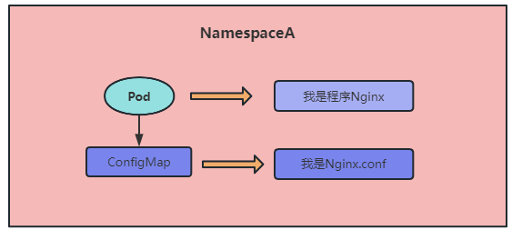

# 配置管理

## 云原生要素-配置分离

### 程序的配置管理问题

传统架构中配置文件都写在程序内部，如果依赖的中间件如MySQL配置变更了，则程序也需要重新修改配置文件并编译打包部署，非常的麻烦！


### 云原生之配置分离

云原生架构下，提倡把配置从程序中分离出来并放到统一的配置管理中心进行管理！例如SpringCloud的配置中心，携程开源的Apollo配置中心

如果没有统一的配置管理中心，可以使用k8s提供的ConfigMap和Secret来实现配置分离，ConfigMap 和 Secret可以挂载到Pod上去供程序使用


以Nginx为例，在传统架构中部署了一个Nginx集群，如果需要修改配置则要到每一个Nginx节点上修改配置。在k8s中pod重启或更新会变会部署到其他节点，即容器所在的节点是不固定的。如果要修改容器配置还要重新生成镜像并部署，非常的麻烦。所以在k8s中不能使用传统架构模式的配置与程序一体！



### 什么是ConfigMap&Secret

- ConfigMap：一般主要用于存放配置文件（明文存放）
- Secret：主要用于存储敏感信息，例如：密码、密钥、证书等等。Secret中的配置文件全部使用base64加密过后的内容，Secret加密数据库密码，在外面看是加密的，进入容器内部查看就是解密的了(安全性有限,相对安全)

> 注意：ConfigMap&Secret 也具有命名空间隔离性

## 创建ConfigMap的几种形式

### 最简-yaml文件创建ConfigMap

configMap配置

```yaml
apiVersion: v1
kind: ConfigMap
metadata:
  name: game-demo
data:
  # 属性形式的keys，每一个key映射到一个简单的值
  player_initial_lives: "3"
  ui_properties_file_name: "user-interface.properties"

  # 文件形式的keys
  game.properties: |
    enemy.types=aliens,monsters
    player.maximum-lives=5    
  user-interface.properties: |
    color.good=purple
    color.bad=yellow
    allow.textmode=true   
```

pod中使用configMap

```yaml
apiVersion: v1
kind: Pod
metadata:
  name: configmap-demo-pod
spec:
  containers:
    - name: demo
      image: alpine
      command: ["sleep", "3600"]
      env:
        # 定义环境变量
        - name: PLAYER_INITIAL_LIVES
          valueFrom:
            configMapKeyRef:
              # 该值来自的ConfigMap
              name: game-demo
              # 获取的键
              key: player_initial_lives
        - name: UI_PROPERTIES_FILE_NAME
          valueFrom:
            configMapKeyRef:
              name: game-demo
              key: ui_properties_file_name
      volumeMounts:
      - name: config
        mountPath: "/config"
        readOnly: true
  volumes:
  # 在Pod级别设置卷，然后将它们挂载到Pod内的容器中
  - name: config
    configMap:
      # 提供要挂载的ConfigMap的名称
      name: game-demo
      # 要作为文件创建的ConfigMap中的键数对
      items:
      - key: "game.properties"
        path: "game.properties"
      - key: "user-interface.properties"
        path: "user-interface.properties"
```

### 其他方式创建ConfigMap

基于目录创建Configmap


```shell
kubectl create configmap -h
kubectl create cm cmfromdir --from-file=conf/
kubectl create cm cmfromfile --from-file=conf/redis.conf
kubectl create cm cmspecialname --from-file=game-conf=game.conf
kubectl create cm cmspecialname2 --from-file=game-conf=game.conf --from-file=redis-conf=redis.conf
kubectl create cm gameenvcm --from-env-file=game.conf
kubectl create cm envfromliteral --from-literal=level=INFO --from-literal=PASSWORD=redis123
kubectl create -f cm.yaml
```

## 使用valueFrom定义环境变量

## 以文件形式挂载生成环境变量

## 自定义挂载权限及名称

## Secret常用类型

## 创建 Secret的几种形式

## 使用Secret拉取私有仓库镜像

## Secret管理HTTPS证书

## 使用SubPath解决挂载覆盖

## ConfigMap&Secret热更新

## ConfigMap&Secret使用限制

## k8s1.19的不可变Secret和ConfigMap

