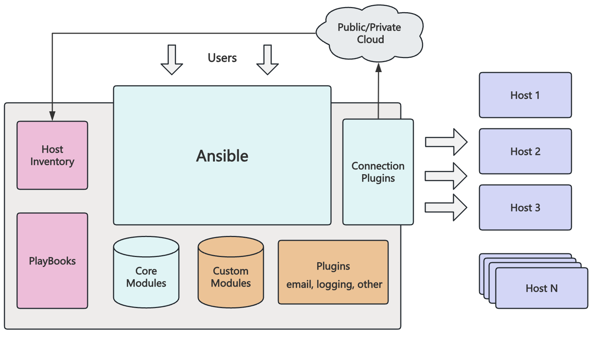

# Ansible 理解

## 什么是 Ansible

Ansible是一款自动化运维工具，基于Python开发，集合了众多运维工具（puppet、cfengine、chef、func、fabric）的优点，实现了批量系统配置、批量程序部署、批量运行命令等功能。

Ansible是基于模块工作的，本身没有批量部署的能力。真正具有批量部署的是Ansible所运行的模块，Ansible只是提供一种框架。主要包括：

- 连接插件connection plugins：负责和被监控端实现通信
- host inventory：指定操作的主机，是一个配置文件里面定义监控的主机
- 各种模块核心模块、command模块、自定义模块
- 借助于插件完成记录日志邮件等功能
- playbook：剧本执行多个任务时，非必需可以让节点一次性运行多个任务。

Ansible架构图：

## Ansible 无需代理

Ansible 围绕无代理架构构建。通常而言，Ansible 通过 OpenSSH 或 WinRM 连接它所管理的主机并且运行任务，方法通常是将称为 Ansible 模块的小程序推送至这些主机。

这些程序用于将系统置于需要的特定状态，在 Ansible 运行完其任务后推送的所有模块都会被删除。

Ansible 不需要批准使用任何特殊代理，然后再部署到受管主机上。由于没有代理，也不需要额外的自定义安全基础架构。

Ansible 具有多个重要的优点：

- 跨平台支持：Ansible 提供Linux、Windows、UNIX和网络设备的无代理支持，适用于物理、虚拟、云和容器环境
- 人类可读的自动化：Ansible Playbook采用YAML文本文件编写，易于阅读，有助于确保所有人都能理解它们的用途
- 完美描述应用：可以通过 Ansible Playbook进行每种更改，并描述和记录应用环境的每一个方面。
- 轻松管理版本控制：Ansible Playbook和项目是纯文本。它们可以视作源代码，放在现有版本控制系统中
- 支持动态清单：可以从外部来源动态更新 Ansible 管理的计算机列表，随时获取所有受管服务器的当前正确列表，不受基础架构或位置的影响
- 编排可与其他系统轻松集成：能够利用环境中现有的 HP SA、Puppet、Jenkins、红帽卫星和其他系统，并且集成到 Ansible 工作流中

## Ansible 方式

Ansible 的设计宗旨是工具易用，自动化易写易读。所以在创建自动化时我们应追求简单化。

Ansible 自动化语言围绕简单易读的声明性文本文件来构建，正确编写的 Ansible Playbook可以清楚地记录你的工作自动化。

Ansible 是一种要求状态引擎，它通过表达你所希望系统处于何种状态来解决如何自动化IT部署的问题。Ansible 的目标是通过仅执行必要的更改使系统处于所需的状态，试图将 Ansible 视为脚本语言并非正确的做法。
