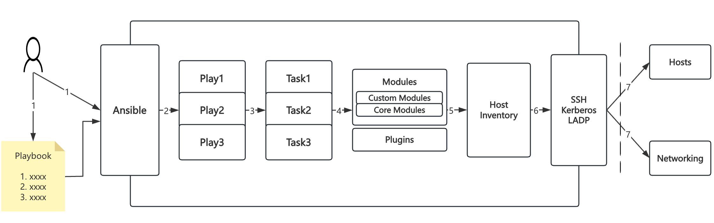

# Playbook基础

## 概述

### Playbook组成

- 一个playbook(剧本)文件是一个YAML语言编写的文本文件
- 通常一个playbook只包括一个play，但可以包括多个Play
- 一个play的主要包括两部分：主机和tasks，即实现在指定一组主机上执行一个tasks定义好的任务列表
- 一个tasks中可以有一个或多个task任务
- 每一个Task本质上就是调用ansible的一个module
- 在复杂场景中，一个playbook中也可以包括多个play，实现对多组不同的主机执行不同的任务



### Playbook与Ad-Hoc对比

> Ad-Hoc：临时命令

- Playbook是对多个AD-Hoc的一种编排组合的实现方式
- Playbook能控制任务执行的先后顺序
- Playbook可以持久保存到文件中从而方便多次调用运行，而Ad-Hoc只能临时运行
- Playbook适合复杂的重复性的任务，而Ad-Hoc适合做快速简单的一次性任务

## ansible-playbook参数

### 常用命令参数

```shell
-k(–ask-pass)        # 用来交互输入ssh密码
-K(-ask-become-pass) # 用来交互输入sudo密码
-u                   # 指定用户

--syntax-check    # 检查yaml文件的语法是否正确
--list-task       # 检查tasks任务
--list-hosts      # 检查生效的主机
--start-at-task='Copy Nginx.conf'  # 指定从某个task开始运行
```

### 完整命令参数

```shell
Options:
  --ask-vault-pass   # 加密playbook文件时提示输入密码
  -C, --check        # 模拟执行，不会真正在机器上执行(查看执行会产生什么变化)
  -D, --diff         # 当更新的文件数及内容较少时，该选项可显示这些文件不同的地方，该选项结合-C用会有较好的效果
  -e EXTRA_VARS, --extra-vars=EXTRA_VARS  # 在Playbook中引入外部参数变量
  --flush-cache      # 将fact清除到的远程主机缓存
  --force-handlers   # 强制运行handlers的任务，即使在任务失败的情况下
  -f FORKS, --forks=FORKS  # 并行任务数。FORKS被指定为一个整数,默认是5
  -h, --help         # 打开帮助文档API
  -i INVENTORY, --inventory-file=INVENTORY  # 指定要读取的Inventory文件
  -l SUBSET, --limit=SUBSET  # 限定执行的主机范围
  --list-hosts       # 列出执行匹配到的主机，但并不会执行
  --list-tags        # 列出所有可用的tags
  --list-tasks       # 出所有即将被执行的任务
  -M MODULE_PATH, --module-path=MODULE_PATH # 要执行的模块的路径
  --new-vault-password-file=NEW_VAULT_PASSWORD_FILE  # new vault password file for rekey
  --output=OUTPUT_FILE  # output file name for encrypt or decrypt; use - for stdout
  --skip-tags=SKIP_TAGS # 跳过指定的tags任务
  --start-at-task=START_AT_TASK  # 从第几条任务(START_AT_TASK)开始执行
  --step             # 逐步执行Playbook定义的任务，并经人工确认后继续执行下一步任务
  --syntax-check     # 检查Playbook中的语法书写,并不实际执行
  -t TAGS, --tags=TAGS  # 指定执行该tags的任务
  --vault-password-file=VAULT_PASSWORD_FILE # vault password file
  -v, --verbose      # 执行详细输出
  --version          # 显示版本
 
  Connection Options:
    control as whom and how to connect to hosts
 
    -k, --ask-pass   # ask for connection password
    --private-key=PRIVATE_KEY_FILE, --key-file=PRIVATE_KEY_FILE # use this file to authenticate the connection
    -u REMOTE_USER, --user=REMOTE_USER # 指定远程主机以USERNAME运行命令
    -c CONNECTION, --connection=CONNECTION # 指定连接方式，可用选项paramiko (SSH)、ssh、local，local方式常用于crontab和kickstarts
    -T TIMEOUT, --timeout=TIMEOUT  # SSH连接超时时间设定，默认10s
    --ssh-common-args=SSH_COMMON_ARGS # specify common arguments to pass to sftp/scp/ssh (e.g.ProxyCommand)
    --sftp-extra-args=SFTP_EXTRA_ARGS # specify extra arguments to pass to sftp only (e.g. -f, -l)
    --scp-extra-args=SCP_EXTRA_ARGS   # specify extra arguments to pass to scp only (e.g. -l)
    --ssh-extra-args=SSH_EXTRA_ARGS   # specify extra arguments to pass to ssh only (e.g. -R)
 
  Privilege Escalation Options:
    control how and which user you become as on target hosts
 
    -s, --sudo          # 相当于Linux系统下的sudo命令
    -U SUDO_USER, --sudo-user=SUDO_USER # 使用sudo，相当于Linux下的sudo命令
    -S, --su            # run operations with su (deprecated, use become)
    -R SU_USER, --su-user=SU_USER # run operations with su as this user (default=root)(deprecated, use become)
    -b, --become        # run operations with become (does not imply password prompting)
    --become-method=BECOME_METHOD # privilege escalation method to use (default=sudo),valid choices: [ sudo | su | pbrun | pfexec | doas |dzdo | ksu | runas ]
    --become-user=BECOME_USER # run operations as this user (default=root)
    --ask-sudo-pass     # 传递sudo密码到远程主机，来保证sudo命令的正常运行
    --ask-su-pass       # ask for su password (deprecated, use become)
    -K, --ask-become-pass # ask for privilege escalation password
```

## Playbook 核心组件

一个playbook中由多个组件组成，其中所用到的常见组件类型如下：

- Hosts执行的远程主机列表
- Tasks任务集，由多个task的元素组成的列表实现，每个task是一个字典，一个完整的代码块功能需最少元素需包括name和task，一个name只能包括一个task
- Variables内置变量或自定义变量在playbook中调用
- Templates模板，可替换模板文件中的变量并实现一些简单逻辑的文件
- Handlers 和notify结合使用，由特定条件触发的操作，满足条件方才执行，否则不执行
- tags标签指定某条任务执行，用于选择运行playbook中的部分代码。ansible具有幂等性，因此会自动跳过没有变化的部分，即便如
  此，有些代码为测试其确实没有发生变化的时间依然会非常地长。此时，如果确信其没有变化，就可以通过tags跳过此些代码片断

### host 组件

Hosts：playbook中的每一个play的目的都是为了让特定主机以某个指定的用户身份执行任务。hosts用于指定要执行指定任务的主机，
须事先定义在主机清单中

```ini
one.example.com
one.example.com:two.example.com
192.168.1.50
192.168.1.*
webservers:dbservers    # 或者，两个组的并集
webservers:&dbservers   # 与，两个组的交集
webservers:!dbservers   # 在webservers组，但不在dbservers组
```

常见用法：

```shell
# 指定一个固定的主机列表
- hosts:
  -
  -
  
# 使用模式匹配主机组
- hosts: webservers

# 动态获取主机列表（从ansible的inventory中获取webservers主机组中的成员列表）
- hosts: "{{ groups['webservers'] }}"

# 使用all关键字匹配所有主机
- hosts: all

# 此外还有一些高级的主机匹配方式，比如根据主机的IP地址，操作系统类型，标签来匹配主机
```

### remote_user 组件

remote_user 是ansible-playbook的一个核心组件，它用于指定远程主机的连接用户。当ansible playbook与远程主机通信时，需要指定一个用户名或密码（或SSH密钥）以便连接到目标主机，通过指定remote_user，可以让 ansible playbook使用特定的用户名密码（或SSH密钥）连接远程主机。

在playbook中，可以通过在hosts部分使用ansible_user或者ansible_ssh_user指定连接到远程主机的用户名。也可以在playbook的vars部分设置全局的ansible_user获取ansible_ssh_user。

```yaml
- name: Example playbook
  hosts: example.com
  remote_user: user
  
  tasks:
    - name: Run a command on the remote host
      command: whoami
```

### task列表和action组件

在ansible的playbook中，任务（task）是一个包含一个或多个操作（action）的列表。任务定义了一个要在目标主机上执行的操作列表，其中每个操作（action）是执行的一项具体任务，任务和操作都可以使用ansible模块执行特定的操作，例如安装软件包，创建文件，运行命令等。

```yaml
tasks:
  - name: Install Apache Web Server
    apt:
      name: apache2
      state: present
    become: true      # 切换到特权模式
    
  - name: Copy Configuration File
    copy:
      src: /path/to/config/file
      dest: /etc/apache2/
    become: true
```

> 其他组件后续章节详细讲解

## 实施 Playbook

### 格式化Ansible Playbook

下面演示临时命令模块在playbook中是如何编写的。

```shell
ansible 172.16.103.129 -m user -a 'name=runtime uid=4000 state=present'
```

这个任务可以将其编写为一个单任务的play并保存在playbook中。生成的playbook如下方所示：

```yml
---
- name: Configure important user consistently
  hosts: 172.16.103.129
  task:
    - name: runtime exists with UID 4000
      user:
        name: runtime
        uid: 4000
        state: present
```

Playbook是以YAML格式编写的文本文件，通常使用扩展名yml保存。Playbook使用空格字符缩进来表示其数据结构。YAML对用于缩进的空格数量没有严格的要求，但有两个基本的规则：

- 处于层次结构中同一级别的数据元素（例如同一列表中的项目）必须具有相同的缩进量。
- 如果项目属于其他项目的子项，其缩进量必须大于父项

只有空格字符可用于缩进，不允许使用tab键。约定俗成的缩进量一般是一级2个空格。

Playbook开头的一行由三个破折号（---）组成，这是文档开始标记。其末尾可能使用三个圆点（...）作为文档结束标记，尽管在实践中这通常会省略。

在这两个标记之间，会以一个play列表的形式来定义playbook。YAML列表中的项目以一个破折号加空格开头。例如，YAML列表可能显示如下：

```yml
- apple
- orange
- grape
```

Play本身是一个键值对集合。同一play中的键应当使用相同的缩进量。以下示例显示了具有三个键的YAML代码片段。前两个键具有简单的值。第三个将含有三个项目的列表作为值。

```yml
- name: just an example
  hosts: webservers
  tasks:
    - first
    - second
    - third
```

作为play中的一部分，tasks属性按顺序实际列出要在受管主机上运行的任务。列表中各项任务本身是一个键值对集合。

还以上面创建用户的play为例，play中唯一任务有两个键：

- name是记录任务用途的可选标签。最好命名所有的任务，从而帮助记录自动流程中的每一步用途。
- user是要为这个任务运行的模块。其参数作为一组键值对传递，它们是模块的子项（name、uid和state）。

下面是一个含有多项任务的tasks属性案例：

```yml
tasks:
  - name: web server is enabled
    service:
      name: httpd
      enabled: true
      
  - name: NTP server is enabled
    service:
      name: chronyd
      enabled: true
      
  - name: Postfix is enabled
    service:
      name: postfix
      enabled: true
```

playbook中play和任务列出的顺序很重要，因为Ansible会按照相同的顺序运行它们。

### 运行playbook

absible-playbook命令可用于运行playbook。该命令在控制节点上执行，要运行的playbook的名称则作为参数传递。

```shell
ansible-playbook site.yml
```

在运行playbook时，将生成输出来显示所执行的play和任务。输出中也会报告执行的每一项任务的结果。

以下示例中显示了一个简单的playbook的内容，后面是运行它的结果。

```shell
[root@localhost ~]# mkdir playdemo
[root@localhost ~]# cd playdemo/
[root@localhost playdemo]# vim webserver.yml
---
- name: play to setup web server
  hosts: webservers
  tasks:
  - name: latest httpd version installed
    yum:
      name: httpd
      state: latest
      
  - name: service is enabled
    service:
      name: httpd
      enabled: true
      
[root@localhost playdemo]# ansible-playbook webserver.yml 
PLAY [play to setup web server] *****************************************************

TASK [Gathering Facts] **************************************************************
ok: [172.16.103.129]
ok: [172.16.103.130]

TASK [latest httpd version installed] ***********************************************
ok: [172.16.103.129]
ok: [172.16.103.130]

TASK [service is enabled] ***********************************************************
changed: [172.16.103.129]
changed: [172.16.103.130]

PLAY RECAP **************************************************************************
172.16.103.129             : ok=3    changed=1    unreachable=0    failed=0    skipped=0    rescued=0    ignored=0   
172.16.103.130             : ok=3    changed=1    unreachable=0    failed=0    skipped=0    rescued=0    ignored=0
```

请注意，在playbook运行时，屏幕中会显示每个play和任务的name键的值。（Gathering Facts任务是一项特别的任务，setup模块通常在play启动时自动运行这项任务。）对于含有多个play和任务的playbook，设置name属性后可以更加轻松地监控playbook执行的进展。

通常而言，Ansible Playbook中的任务是幂等的，而且能够安全地多次运行playbook。如果目标受管主机已处于正确的状态，则不应进行任何更改。如果再次运行这个playbook，所有任务都会以状态OK传递，且不报告任何更改。

### 提高输出的详细程度

ansible-playbook命令提供的默认输出不提供详细的任务执行信息。ansible-playbook -v命令提供了额外的信息，总共有四个级别。

配置Playbook执行的输出详细程序

| 选项	| 描述 |
| ----  | ---- |
| -v	|显示任务结果|
|-vv	|任务结果和任务配置都会显示|
|-vvv	|包含关于与受管主机连接的信息|
|-vvvv	|增加了连接插件相关的额外详细程序选项，<br> 包括受管主机上用于执行脚本的用户以及所执行的脚本|

### 语法验证

在执行playbook之前，最好要进行验证，确保其内容的语法正确无误。ansible-playbook命令提供了一个--syntax-check选项，可用于验证playbook的语法。

下例演示了一个playbook成功通过语法验证：

```shell
[root@localhost playdemo]# ansible-playbook --syntax-check webserver.yml
playbook: webserver.yml
```

语法验证失败时，将报告语法错误。输出中包含语法问题在playbook中的大致位置。

下例演示了一个playbook语法验证失败的情况：

```shell
[root@localhost playdemo]# ansible-playbook --syntax-check webserver.yml
Syntax Error while loading YAML.
  did not find expected '-' indicator

The error appears to be in '/root/playdemo/webserver.yml': line 3, column 1, but may
be elsewhere in the file depending on the exact syntax problem.

The offending line appears to be:

- name: play to setup web server
hosts: webservers
^ here
```

### 执行空运行

可以使用-C选项对playbook执行空运行。这会使Ansible报告在执行该playbook时将会发生什么更改，但不会对受管主机进行任何实际的更改。

下例演示了一个playbook的空运行，它包含单项任务，可确保在受管主机上安装了最新版本的httpd软件包。注意该空运行报告此任务会对受管主机产生的更改。

```shell
ansible-playbook -C webserver.yml 
```

## 实施多个play

### 缩写多个play

Playbook是一个YAML文件，含有由一个或多个play组成的列表。记住一个play按顺序列出了要对清单中的选定主机执行的任务。因此，如果一个playbook中有多个play，每个play可以将其任务应用到单独的一组主机。

在编排可能涉及对不同主机执行不同任务的复杂部署时，这会大有帮助。我们可以这样进行编写：对一组主机运行一个play，完成后再对另一组主机运行另一个play。

缩写包含多个play的playbook非常简单。Playbook中的各个play编写为playbook中的顶级列表项。各个play是含有常用play关键字的列表项。

以下示例显示了含有两个play的简单playbook。第一个play针对172.16.103.129运行，第二个play则针对172.16.103.131运行。

```yml
---
# This is a simple playbook with two plays

- name: first play
  hosts: 172.16.103.129
  tasks:
    - name: first task
      yum:
        name: httpd
        status: present

    - name: second task
      service:
        name: httpd
        enabled: true

- name: second play
  hosts: 172.16.103.131
  tasks:
    - name: first task
      service:
        name: mariadb
        enabled: true
```

### play中的远程用户和特权升级

Play可以将不同的远程用户或特权升级设置用于play，取代配置文件中指定的默认设置。这些在play本身中与hosts或tasks关键字相同的级别上设置。

#### 用户属性

playbook中的任务通常通过与受管主机的网络连接来执行。与临时命令相同，用于任务执行的用户帐户取决于Ansible配置文件/etc/ansible/ansible.cfg中的不同关键字。运行任务的用户可以通过remote_user关键字来定义。不过，如果启用了特权升级，become_user等其他关键字也会发生作用。

如果用于任务执行的Ansible配置中定义的远程用户不合适，可以通过在play中使用remote_user关键字覆盖。

```yml
remote_user: remoteuser
```
#### 特权升级属性

Ansible也提供额外的关键字，从而在playbook内定义特权升级参数。become布尔值关键字可用于启用或禁用特权升级，无论它在Ansible配置文件中的定义为何。它可取yes或true值来启用特权升级，或者取no或false值来禁用它。

```yml
become: true
```

如果启用了特权升级，则可以使用become_method关键字来定义特定play期间要使用的特权升级方法。

以下示例中指定sudo用于特权升级：

```yml
become_method: sudo
```

此外，启用了特权升级时，become_user关键字可定义特定play上下文内要用于特权升级的用户帐户。

```yml
become_user: privileged_user
```

以下示例演示了如何在play中使用这些关键字：

```yml
- name: /etc/hosts is up to date
  hosts: 172.16.103.129
  remote_user: automation
  become: yes
  
  tasks:
    - name: 172.16.103.129 in /etc/hosts
      lineinfile:
        path: /etc/hosts
        line: '172.16.103.129 web1.example.com'
        state: present
```

### 查找用于任务的模块

#### 模块文档

Ansible随附打包的大量模块为管理员提供了许多用于常见管理任务的工具。前面我们介绍了Ansible官方网站的帮助文档链接https://docs.ansible.com/。通过模块索引，可以很轻松的找到对应的模块。例如，适用于用户和服务管理的模块可以在Systems Modules下找到，而适合数据库管理的模块则可在Database Modules下找到。

对于每一个模块，Ansible官网提供了其功能摘要，以及关于如何通过模块的选项来调用各项具体功能的说明。文档还提供了实用的示例，演示各个模块的用法，以及任务中关键字的设置方法。

前面我们用到过ansible-doc -l命令。这将显示模块名称列表以及其功能的概要。

```shell
ansible-doc -l
```

使用ansible-doc [module name]命令来显示模块的详细文档。与Ansible官网一样，该命令提供模块功能的概要、其不同选项的详细信息，以及示例。

```shell
ansible-doc yum     # 显示yum模块的帮助文档
```

ansible-doc命令还提供-s选项，它会生成示例输出，可以充当如何在playbook在使用特定模块的示范。此输出可以作为起步模板，包含在实施该模块以执行任务的playbook中。输出中包含的注释，提醒管理员各个选项的用法。下例演示了yum模块的这种输出：

```shell
ansible-doc -s yum
```

使用ansible-doc命令可以查找和了解如何使用模块。尽管command、shell和raw模块的用法可能看似简单，但在可能时，应尽量避免在playbook中使用它们因为它们可以取胜任意命令，因此使用这些模块时很容易写出非幂等的playbook。

例如，以下使用shell模块的任务为非幂等。每次运行play时，它都会重写/etc/resolv.conf，即使它已经包含了行nameserver 172.16.103.2。

```yml
- name: Non-idepotent approach with shell module
  shell: echo "nameserver 172.16.103.2" > /etc/resolv.conf
```

可以通过多种方式编写以幂等方式使用shell模块的任务，而且有时候进行这些更改并使用shell是最佳的做法。但更快的方案或许是使用ansible-doc发现copy模块，再使用它获得所需的效果。

在以下示例中，如果/etc/resolv.conf文件已包含正确的内容，则不会重写该文件：

```yml
- name: Idempotent approach with copy module
  copy:
    dest: /etc/resolv.conf
    content: "nameserver 172.16.103.2\n"
```

copy模块可以测试来了解是否达到了需要的状态，如果已达到，则不进行任何更改。shell模块容许非常大的灵活性，但需要格外小心，从而确保它以幂等方式运行。

幂等的playbook可以重复运行，确保系统处于特定的状态，而不会破坏状态已经正确的系统。

#### Playbook语法变化

**YAML注释**

注释也可以用于提高可读性。在YAML中，编号或井号字符（#）右侧的所有内容都是注释。如果注释的左侧有内容，请在该编号符号的前面加一个空格。

```shell
# This is a YAML comment
some data # This is also a YAML comment
```

**YAML字符串**

YAML中的字符串通常不需要放在引号里，即使字符串中包含空格。字符串可以用双引号或单引号括起。

```shell
this is a string

'this is another string'

"this is yet another a string"
```

编写多行字符串有两种方式。可以使用管道符表示要保留字符串中的换行字符。

```yml
include_newlines: |
  Example Company
  123 Main Street
  Atlanta, GA 30303
```

要编写多行字符串，还可以使用大于号字符来表示换行字符转换成空格并且行内的引导空白将被删除。这种方法通常用于将很长的字符串在空格字符处断行，使它们跨占多行来提高可读性。

```yml
fold_newlines: >
  This is an example
  of a long string,
  that will become
  a single sentence once folded.
```

**YAML字典**

下面是一个简单的字典形式：

```yml
name: svcrole
svcservice: httpd
svcport: 80
```

字典也可以使用以大括号括起的内联块格式编写，如下所示：

```yml
{name: svcrole, svcservice: httpd, svcport: 80}
```

大多数情况下应避免内联块格式，因为其可读性较低。不过，至少有一种情形中会较常使用它。当playbook中包含角色列表时，较常使用这种语法，从而更加容易区分play中包含的角色和传递给角色的变量。

**YAML列表**

最简单的列表如下：

```yml
hosts:
  - servera
  - serverb
  - serverc
```

列表也有以中括号括起的内联格式，如下所示：

```yml
hosts: [servera, serverb, serverc]
```

我们应该避免使用此语法，因为它通常更难阅读。

#### 过时的“键=值” playbook简写

某些playbook可能使用较旧的简写方法，通过将模块的键值对放在与模块名称相同的行上来定义任务。例如，你可能会看到这种语法：

```yml
tasks:
  - name: shorthand form
    service: name=httpd enabled=true state=started
```

通常我们应该将这样的语法编写为如下所示：

```yml
tasks:
  - name: normal form
    service:
      name: httpd
      enabled: true
      state: started
```

通常我们应避免简写形式，而使用普通形式。

普通形式的行数较多，但更容易操作。任务的关键字垂直堆叠，更容易区分。阅读play时，眼睛直接向一扫视，左右运动较少。而且，普通语法是原生的YAML。

你可能会在文档和他人提供的旧playbook中看到这种语法，而且这种语法仍然可以发挥作用。