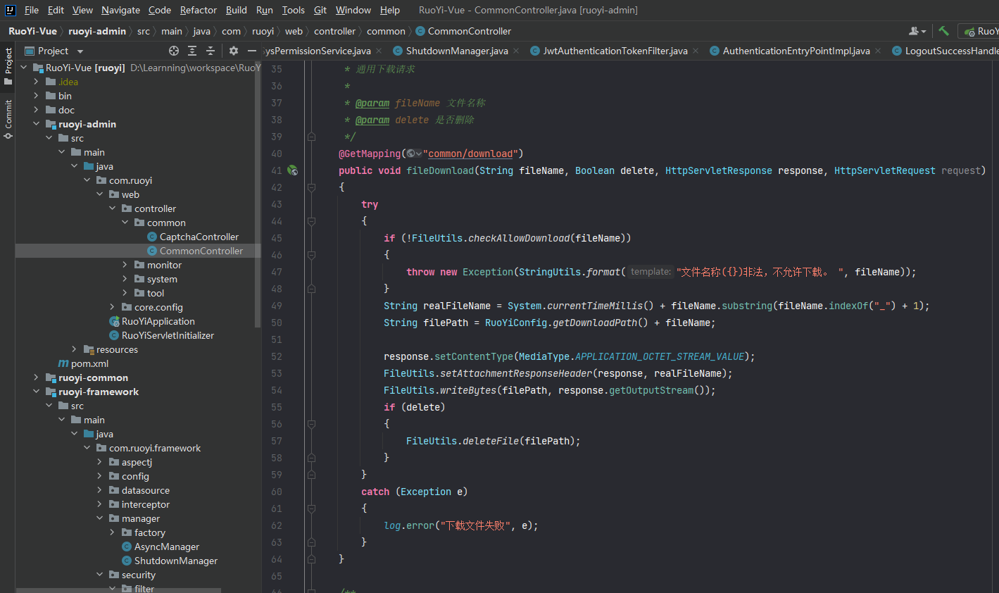
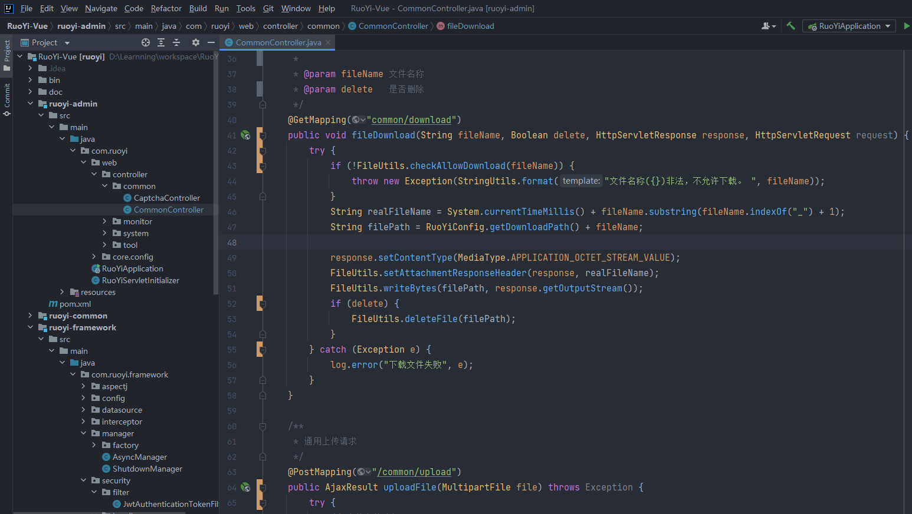

# 常用插件

## 主题插件

**Xcode-Dark Theme：**[Xcode-Dark Theme主题下载地址](https://plugins.jetbrains.com/plugin/13106-xcode-dark-theme/versions)



**One Dark theme：**[One Dark theme主题下载地址](https://plugins.jetbrains.com/plugin/11938-one-dark-theme)



## 常用插件

```shell
# 1.翻译插件
TranslationPlugin

# 2. mybatis日志插件
Mybatis-log-plugin

# 3. mybatis插件
MyBatisX

# 4. alibaba开发规范
Alibaba Java Coding Guidelines

# 5.codota代码补全，基于大数据
codota

# 6. 快捷键练习
key promoter

# 7.ai

Fitten Code
```