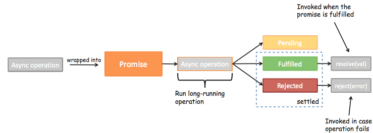

# ES6的Promise

## Promise理解

ES6中一个非常重要和好用的特性就是Promise类。

但是初次接触Promise会一脸懵逼，这TM是什么东西？看看官方或者一些文章对它的介绍和用法也是一头雾水。

Promise到底是做什么的呢？ => <span style="color:red">Promise是异步编程的一种解决方案。一般情况下有异步操作时，使用Promise对这个异步操作进行封装。</span>

那什么时候我们会来处理异步事件呢？一种很常见的场景应该就是 <span  style="color:red">网络请求</span> 了。

我们封装一个网络请求的函数不能立即拿到结果，所以不能像简单的 3+4=7 一样将结果返回。所以我们往往会传入另外一个函数，在数据请求成功时将数据通过传入的函数回调出去。如果只是一个简单的网络请求，那么这种方案不会给我们带来很大的麻烦。但是当网络请求非常复杂时就会出现回调地狱。

OK，我以一个非常夸张的案例来说明。我们来考虑下面的场景(有夸张的成分)：

- 我们需要通过一个url1从服务器加载一个数据data1，data1中包含了下一个请求的url2
- 我们需要通过data1取出url2，从服务器加载数据data2，data2中包含了下一个请求的url3
- 我们需要通过data2取出url3，从服务器加载数据data3，data3中包含了下一个请求的url4
- 发送网络请求url4，获取最终的数据data4

```javascript
$.ajax('url1',function(data1) {
   $.ajax(data1['url2'],function(data2) {
     $.ajax(data2['url3'],function(data3) {
       $.ajax(data3['url4'],function(data4) {
         console.log(data4);
       })
     })
   })
})
```

上面的代码有什么问题吗？正常情况下不会有什么问题，可以正常运行并且获取我们想要的结果。但是这样额代码难看而且不容易维护，我们更加期望的是一种更加优雅的方式来进行这种异步操作。如何做呢？就是使用Promise，Promise可以以一种非常优雅的方式来解决这个问题。

## Promise基本使用

### 定时器的异步事件案例

我们先来看看Promise最基本的语法。

这里我们用一个定时器来模拟异步事件：假设下面的data是从网络上1秒后请求的数据，console.log就是我们的处理方式。

```javascript
setTimeout(() => {
	console.log('Hello World');
},1000)
```

上面是我们过去的处理方式，我们将它用Promise进行封装（虽然这个例子会让我们感觉脱裤放屁多此一举）

- 首先下面的Promise代码明显比上面的代码看起来还要复杂。
- 其次下面的Promise代码中包含的resolve、reject、then、catch都是些什么东西？
- 我们先不管复杂度的问题，因为这样的一个屁大点的程序根本看不出来Promise真正的作用。

```javascript
new Promise((resolve,reject) => {
   setTimeout(() => {
     resolve('Hello World')
     //reject('Error Data')
   }, 1000)
 }).then(data => {
   console.log(data) //Hello World
 }).catch(error => {
   console.log(error) //Error Data
})
//注意：另一种写法，成功和失败的消息都可以写在then这个回调函数中
new Promise((resolve,reject) => {
   setTimeout(() => {
     resolve('Hello World')
     //reject('Error Data')
   }, 1000)
 }).then(data => {
   console.log(data) //Hello World
 },error => {
   console.log(error) //Error Data
})
```

我们先来认认真真的读一读这个程序到底做了什么？

- new Promise很明显是创建一个Promise对象
- 小括号中`(resolve, reject) => {}`也很明显就是一个函数，而且我们这里用的是箭头函数

  - 但是resolve, reject它们是什么呢？

  - 我们先知道一个事实：在创建Promise时传入的这个箭头函数是固定的（一般我们都会这样写）

  - resolve 和 reject 它们两个也是函数，通常情况下我们会根据请求数据的成功和失败来决定调用哪一个。
- 成功还是失败？
  - 如果是成功的，那么通常我们会调用`resolve(messsage)`，这个时候我们后续的<span style="color:red">then会被回调</span>。
  - 如果是失败的，那么通常我们会调用`reject(error)`，这个时候我们后续的<span style="color:red">catch会被回调</span>。 

OK，这就是Promise最基本的使用了。

### Promise三种状态



首先, 当我们开发中有异步操作时, 就可以给异步操作包装一个Promise

异步操作之后会有三种状态

- `pending`：等待状态，比如正在进行网络请求，或者定时器没有到时间。
- `fulfill`：满足状态，当我们主动回调了resolve时，就处于该状态并且会回调 then()
- `reject`：拒绝状态，当我们主动回调了reject时，就处于该状态并且会回调 catch()

```javascript
new Promise((resolve,reject) => {
   setTimeout(() => {
     //resolve('Hello World')
     reject('Error Data')
   }, 1000)
 }).then(data => {
   console.log(data)
 }).catch(error => {
   console.log(error)
})
```

## Promise链式调用

### 使用方式一：异步操作

```javascript
new Promise((resolve, reject) => {
  //1.第一次模拟网络请求的代码
  setTimeout(() => {
    resolve("Hello World");
  }, 2000);
}).then((data) => {
  //第一次拿到结果的处理代码
  console.log(data); //Hello World
  return new Promise((resolve, reject) => {
    //第二次模拟网络请求的代码
    setTimeout(() => {
       resolve(data + " 111");
    }, 2000);
  }).then((data) => {
    //第二次拿到结果的处理代码
    console.log(data); //Hello World 111
    return new Promise((resolve, reject) => {
       //第三次模拟网络请求的代码
       setTimeout(() => {
         resolve(data + "222");
       }, 2000);
    }).then((data) => {
       //第三次拿到结果的处理代码
       console.log(data); //Hello World 111222
       return new Promise((resolve, reject) => {
         //第四次模拟网络请求错误的代码
         setTimeout(() => {
           reject(data + "error");
         }, 2000);
       }).then((data) => {
          //这里没有输出，这部分代码不会执行
          console.log(data);
          return new Promise((resolve, reject) => {
            setTimeout(() => {
               resolve(data + "333");
            }, 2000);
          });
       }).catch((data) => {
          //第四次拿到结果的处理代码
          console.log(data); //Hello World 111222error
          //第五次模拟网络请求的代码
          return new Promise((resolve, reject) => {
            setTimeout(() => {
               resolve(data + "444");
            }, 2000);
          }).then((data) => {
             //第五次拿到结果的处理代码
             console.log(data); //Hello World 111222error444
             //..不能再套娃了
          });
        });
    });
  });
});
//注意：其实reject是可选的，当我们不用的时候可以只写 resolve => {}
```

### 使用方式二：非异步操作

如下：只有第一次调用是异步操作，后面的调用不是异步操作但是我们希望后面的调用也是分层的

```javascript
new Promise((resolve,reject) => {
  setTimeout(() => {
     resolve('Hello World')
  }, 1000)
}).then(data => {
  console.log(data) //Hello World
  return Promise.resolve(data + ' 111')
}).then(data => {
  console.log(data) //Hello World 111
  return Promise.resolve(data + '222')
}).then(data => {
  console.log(data) //Hello World 111222
  return Promise.reject(data + 'error')
}).then(data => {
  console.log(data) 
  return Promise.resolve(data + '333')
}).catch(data => {
  console.log(data) //Hello World 111222error
  return Promise.resolve(data + ' 444')
}).then(data => {
  console.log(data) //Hello World 111222error444
})
```

这里我们直接通过Promise包装了一下新的数据，将Promise对象返回了

- `Promise.resovle()`：将数据包装成Promise对象，并且在内部回调`resolve()`函数

- `Promise.reject()`：将数据包装成Promise对象，并且在内部回调`reject()`函数

链式调用简写：简化版代码如下，如果我们希望数据直接包装成Promise.resolve，那么在then中可以直接返回数据。注意下面的代码中我将`return Promise.resovle(data)`改成了`return data`结果依然是一样的

```javascript
new Promise((resolve,reject) => {
  setTimeout(() => {
     resolve('Hello World')
  }, 1000)
}).then(data => {
  console.log(data) //Hello World
  return data + ' 111'
}).then(data => {
  console.log(data) //Hello World 111
  return data + '222'
}).then(data => {
  console.log(data) //Hello World 111222
  return Promise.reject(data + 'error')
}).then(data => {
  console.log(data) 
  return data + '333'
}).catch(data => {
  console.log(data) //Hello World 111222error
  return data + ' 444'
}).then(data => {
  console.log(data) //Hello World 111222error444
})
```

## Promise的all方法使用

### 案例

假设有两个网络请求，我们必须要保证两个网络请求都成功后才能执行一些操作。即两个网络请求加上后续的操作才是一个完整的业务。怎么实现呢？

以前的实现方式

```javascript
//两个flag
let isResult1 = false;
let isResult2 = false;
//第一个请求
$.ajax({
    url:'url1'
    success: () => { 
    	console.log("结果一");
    	isResult1 = true
    	handleResult()
	}
})
//第二个请求
$.ajax({
    url:'url2'
    success: () => { 
    	console.log("结果二");
    	isResult2 = true
    	handleResult()
	}
})

function handleResult() {
    if(isResult1 && isResult2) {
        //后续操作
    }
}
```

### all方法的使用

```javascript
Promise.all([
    new Promise((resolve,reject) => {
        //模拟网络请求一
        setTimeout(() => {
            resolve('result1');
        },1000)
    }),
    new Promise((resolve,reject) => {
        //模拟网络请求二
        setTimeout(() => {
            resolve('result2');
        },5000)
    }),
]).then(results => {
    //5秒后才会打印
    console.log(results[0]); //结果一
    console.log(results[1]); //结果二
})
```
