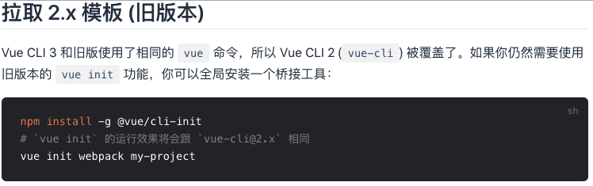
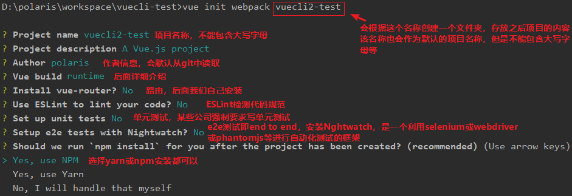
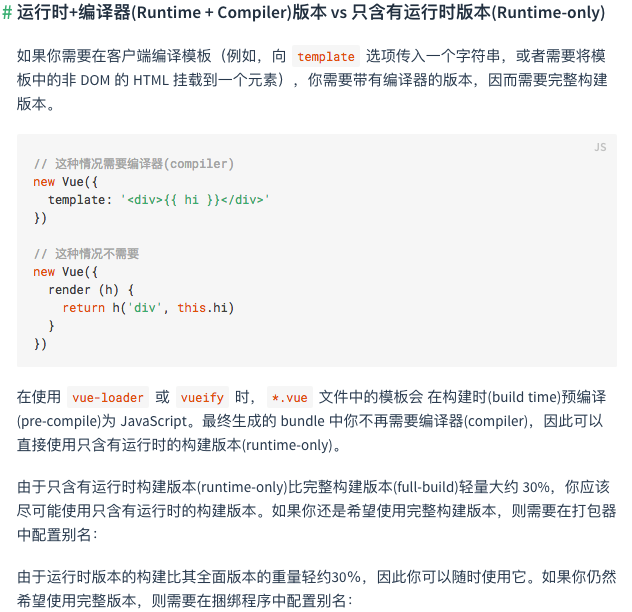
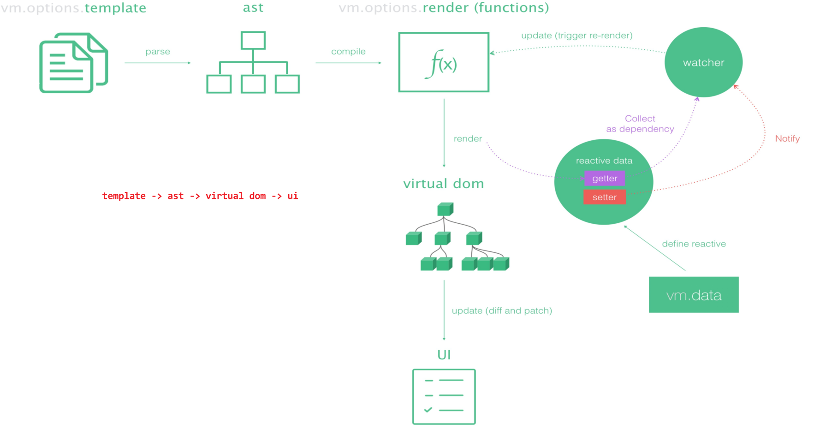
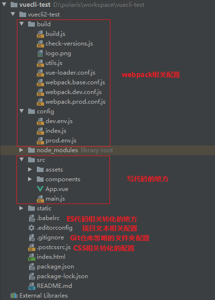
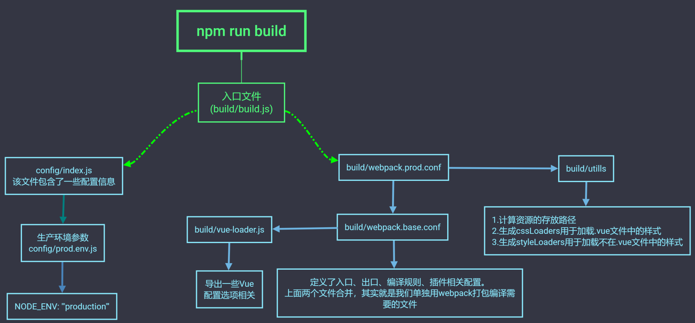
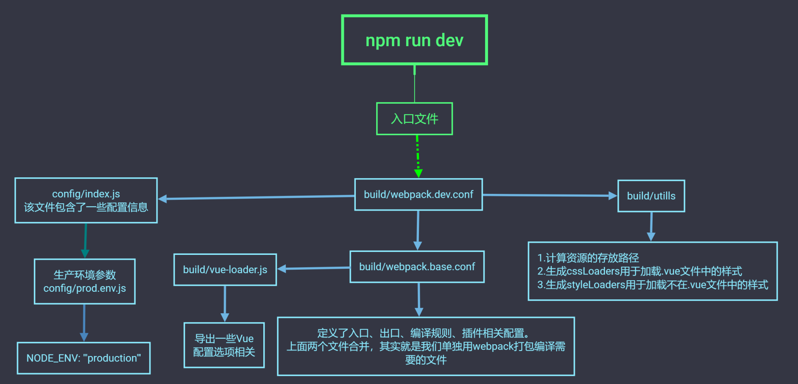
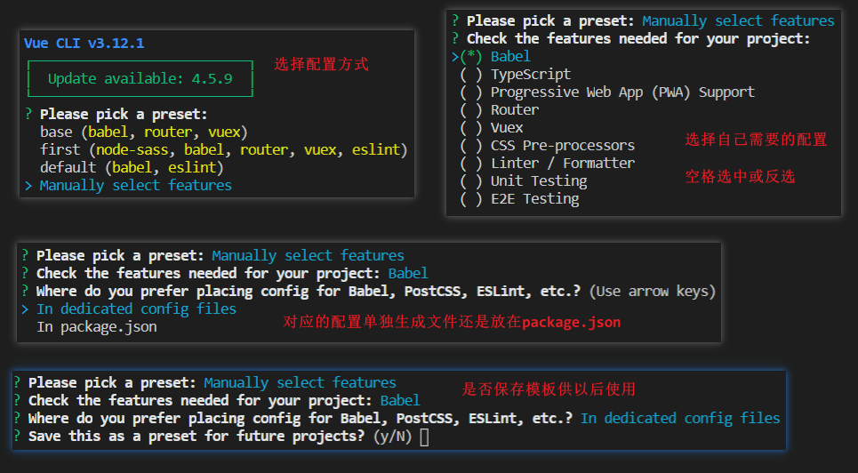
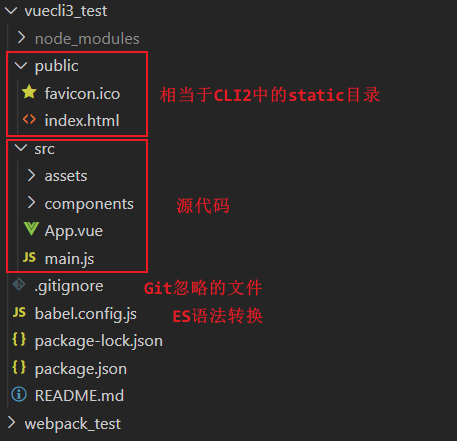
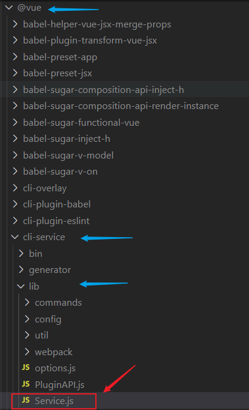

# Vue Cli

## Vue CLI理解

### 什么是Vue CLI

如果你只是简单写几个Vue的Demo程序, 那么你不需要`Vue CLI`，如果你在开发大型项目那么你需要它, 并且必然需要使用`Vue CLI`。

使用Vue.js开发大型应用时我们需要考虑代码目录结构、项目结构和部署、热加载、代码单元测试等事情。如果每个项目都要手动完成这些工作那无以效率比较低效，所以通常我们会使用一些脚手架工具来帮助完成这些事情。

CLI是什么意思？`Command-Line Interface`，翻译为命令行界面，但是俗称脚手架。`Vue CLI`是一个官方发布 Vue.js 项目脚手架，使用它可以快速搭建Vue开发环境以及对应的webpack配置。

### Vue CLI使用前提 - Node & Webpack

安装Node.js：可以直接在[官方网站](http://nodejs.cn/download/)中下载安装，Node环境要求8.9以上或者更高版本

NPM：NPM的全称是`Node Package Manager`，是一个NodeJS包管理和分发工具，已经成为了非官方的发布Node模块（包）的标准。后续我们会经常使用NPM来安装一些开发过程中依赖包。

CNPM安装：由于国内直接使用 npm 的官方镜像是非常慢的，这里推荐使用淘宝 NPM 镜像。你可以使用淘宝定制的 cnpm (gzip 压缩支持) 命令行工具代替默认的 npm:

```
npm install cnpm -g --registry=https://registry.npm.taobao.org
```

这样就可以使用 cnpm 命令来安装模块了

```
cnpm install [name]
```

Webpack：Vue.js官方脚手架工具就使用了webpack模板。webpack对所有的资源会压缩等优化操作，它在开发过程中提供了一套完整的功能，能够使得我们开发过程中变得高效。

Webpack的全局安装

```
npm install webpack -g
```

### 安装Vue脚手架

```
//Vue CLI2
npm install -g vue-cli
//Vue ClI3
npm install -g @vue/cli
```

### 初始化项目

```
//Vue CLI2
vue init webpack my-project
//Vue CLI3
vue create my-project
```

> 注：当我们安装了`Vue CLI3`的版本，如果需要想按照`Vue CLI2`的方式初始化项目时不可以的。可以使用如下方式在安装`Vue CLI3`的基础上拉取2.x的模板。



## Vue CLI2详解

### 初始化设置



### Runtime-Compiler和Runtime-only的区别

简单总结：如果在之后的开发中你依然使用template，就需要选择`Runtime-Compiler`。如果你之后的开发中使用的是.vue文件夹开发，那么可以选择`Runtime-only`



render和template

- 使用`Runtime-Compiler`模式时

```javascript
new Vue({
	el: '#app',
	components: { App },
	template: '<App/>'
})
```

- 使用`Runtime-only`模式时

```javascript
new Vue({
	el: '#app',
	render: h => h(App)
})
```

为什么会出现这样的差异呢？我们需要先理解Vue应用程序是如何运行起来的，Vue中的模板如何最终渲染成真实DOM。我们来看下面的一幅图。



render函数的使用：

```javascript
//组件对象
const cpn = {
    template: '<div>{{message}},我是cpn组件</div>',
    data() {
        return {
			message:'hello'
        }
    }
}

//这里传来的实参名字叫createElement，而模板生成使用形参h去接收，为什么要取名h？
new Vue({
    el: '#app',
    render: (createElement) => {
        //1.使用方式一:我们这里创建出来的element就会替换#app元素 
//      return createElement('标签','相关数据对象（可以不传），即标签的属性',['内容数组']);
        
        //1.1 render函数基本使用
//      return createElement('div',{class: 'box'},['polaris']);
        
        //1.2 嵌套render函数
//      return createElement('div',{class: 'box'},[
//          'polaris',createElement('h2',['我是标题啊'])
//      ]);
        
        //1.3 传入一个组件对象,注意这里的cpn组件需要template编译器
        return createElement(cpn);
    }
})
```

> 注意：`vue-template-compiler`会把.vue文件中的template转化成render函数，不需要使用template编译器了。(`vue-template-compiler`是什么请回看 [Webpack详解](https://www.cnblogs.com/mpolaris/p/14071235.html))

### 目录结构



### npm run build流程



### npm run dev流程



### 修改配置：webpack.base.conf.js起别名

```javascript
resolve: {
	extensions: ['.js','.vue','.json'],
	alias: {
		'@': resolve('src'),
		'pages': resolve('src/pages'),
		'common': resolve('src/common'),
		'components': resolve('src/components'),
		'network': resolve('src/network'),
	}
}
```

## Vue CLI3详解

vue-cli 3 与 2 版本有很大区别

- vue-cli 3 是基于 webpack 4 打造，vue-cli 2 还是 webapck 3
- vue-cli 3 的设计原则是“ 0配置”，移除了配置文件根目录下的build和config等目录
- vue-cli 3 提供了 vue ui 命令，提供了可视化配置，更加人性化
- 移除了static文件夹，新增了public文件夹，并且index.html移动到public中

初始化



目录结构



vue-cli 3的配置文件放哪里去了？



> 注：在vue-cli3如果我们要修改配置，有三种方式
>
> ① 启动配置服务器:  vue ui命令
>
> ② 在项目根目录下创建一个 `vue.config.js`文件，写的配置会和默认配置合并作为webpack配置。
>
> ③ 隐藏起来的配置：`node_nodules/@vue/cli-service/lib/webpack.config.js`

main.js理解

```javascript
import Vue from 'vue'
import App from './App.vue'

//生产阶段打印的一些提示信息，在开发阶段一般不需要即设为false
Vue.config.productionTip = false

//两种不同的写法异同 ↓
new Vue({
    //el与下面的.$mount('#app')没有区别
    //vue底层只是多了一行代码，即如果配置了el则获取el的值去执行.$mount('得到的值')
    //即不管有没有el，最终都会执行.$mount('xx')
    el: '#app'
    render: function(h) {
        return h(App)
    }
})

new Vue({
  render: h => h(App),
}).$mount('#app')
```
