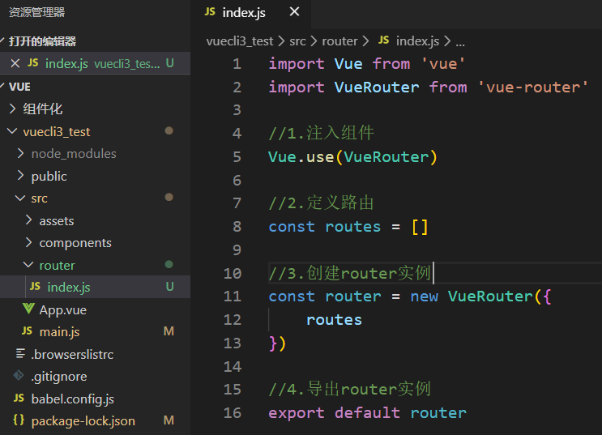
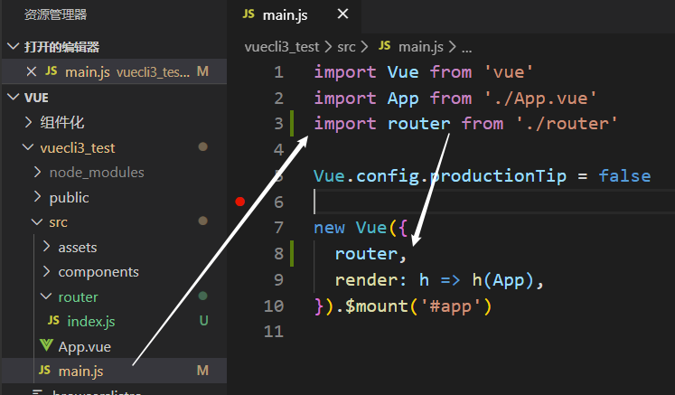
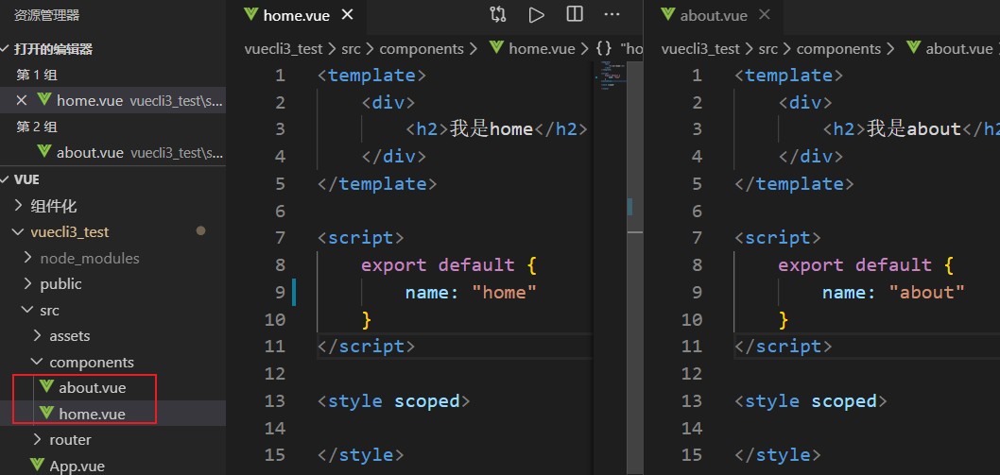
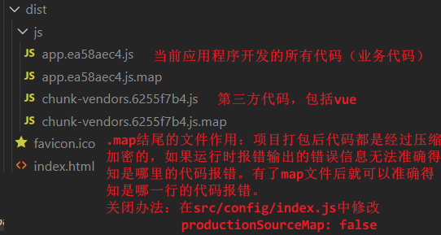
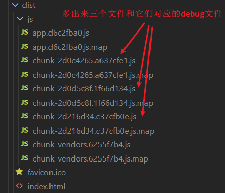
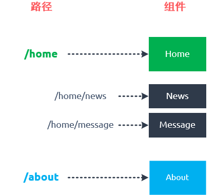
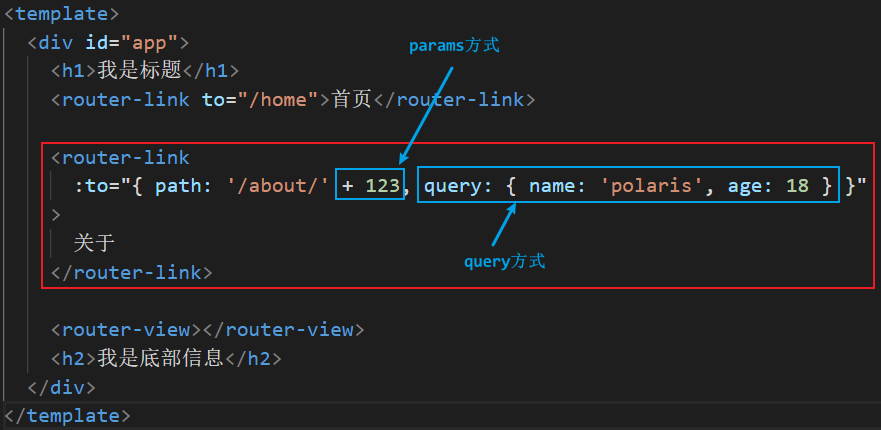
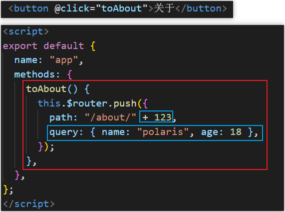
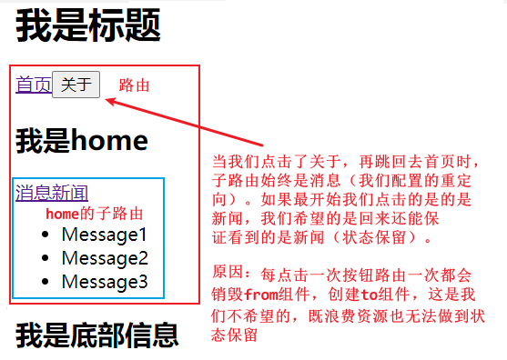
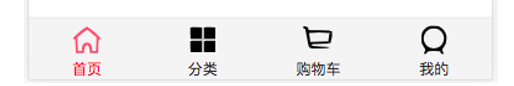

# Vue Router详解

## 认识路由

### 路由概念

路由是什么？路由是一个网络工程里面的术语。路由（routing）就是通过互联的网络把信息从源地址传输到目的地址的活动 --- 维基百科

路由器提供了两种机制：路由和转送

- 路由是决定数据包从来源到目的地的路径

- 转送将输入端的数据转移到合适的输出端

路由中一个非常重要的概念：路由表。路由表本质上就是一个映射表，决定了数据包的指向

### 后端路由阶段

早期的网站开发整个HTML页面是由服务器来渲染的，服务器直接生产渲染好对应的HTML页面返回给客户端进行展示。

但是一个网站这么多页面服务器如何处理呢？一个页面有自己对应的网址也就是URL。URL会发送到服务器，服务器会通过正则对该URL进行匹配，并且最后交给一个Controller进行处理。Controller进行各种处理,最终生成HTML或者数据返回给前端，这就完成了一个IO操作。

上面的这种操作就是后端路由，当我们页面中需要请求不同的路径内容时交给服务器来进行处理，服务器渲染好整个页面并且将页面返回给客户端。这种情况下渲染好的页面不需要单独加载任何的js和css，可以直接交给浏览器展示，这样也有利于SEO的优化。

后端路由也有缺点，一种情况是整个页面的模块由后端人员来编写和维护的，另一种情况是前端开发人员如果要开发页面，需要通过PHP和Java等语言来编写页面代码。而且通常情况下HTML代码和数据以及对应的逻辑会混在一起编写和维护都是非常糟糕的事情。

### 前端路由阶段

前后端分离阶段：随着Ajax的出现有了前后端分离的开发模式，后端只提供API来返回数据，前端通过Ajax获取数据并且可以通过JavaScript将数据渲染到页面中。这样做最大的优点就是前后端责任的清晰，后端专注于数据上前端专注于交互和可视化上。并且当移动端(iOS/Android)出现后，后端不需要进行任何处理依然使用之前的一套API即可，目前很多的网站依然采用这种模式开发。

单页面富应用阶段：其实SPA最主要的特点就是在前后端分离的基础上加了一层前端路由，也就是前端来维护一套路由规则。前端路由的核心是什么呢？即<span style="color:skyblue">改变URL但是页面不进行整体的刷新</span>。如何实现呢？

### 前端路由的规则

URL的hash：URL的hash也就是锚点`#`，本质上是改变`window.location`的 href 属性。我们可以通过直接赋值`location.hash`来改变 href但是页面不发生刷新。

```javascript
location.href
"http://localhost:8080/#/"
location.hash='/'
"/"
location.href
"http://localhost:8080/#/"
location.hash='/foo'
"/foo"
location.href
"http://localhost:8080/#/foo"
```

HTML5的history模式：history接口是HTML5新增的，它有五种模式改变URL而不刷新页面。

- `history.pushState()`           push进栈，可以返回

```javascript
location.href
"http://localhost:8080/#/foo"
history.pushState({},'','/foo')
undefined
location.href
"http://localhost:8080/foo"
history.pushState({},'','/')
undefined
location.href
"http://localhost:8080/"
```

- `history.replaceState()`       直接替换，不可以返回

```javascript
location.href
"http://localhost:8080/"
history.replaceState({},'','/foo')
undefined
location.href
"http://localhost:8080/foo"
history.replaceState({},'','/foo/bar')
undefined
location.href
"http://localhost:8080/foo/bar"
```

- `history.go()`    可以前进后退，即直接出栈入栈几个历史

```javascript
location.href
"http://localhost:8080/#/"
location.hash='/home'
"/home"
location.hash='/about'
"/about"
history.go(-1)
undefined
location.href
"http://localhost:8080/#/home"
history.go(-1)
undefined
location.href
"http://localhost:8080/#/"
history.go(1)
undefined
location.href
"http://localhost:8080/#/home"
```

> 补充：上面只演示了三个方法，还有两个方法如下：
>
> `history.back()  `等价于  `history.go(-1)`
> `history.forward() ` 等价于 `history.go(1)`
>
> 这三个接口等同于浏览器界面的前进后退。

## vue-router基本使用

### 认识vue-router

目前前端流行的三大框架，都有自己的路由实现

- Angular的ngRouter

- React的ReactRouter

- Vue的vue-router

vue-router是Vue.js官方的路由插件，它和vue.js是深度集成的，适合用于构建单页面应用。我们可以访问其[官方网站](https://router.vuejs.org/zh/)对其进行学习

vue-router是基于路由和组件的，路由用于设定访问路径，将路径和组件映射起来。在vue-router的单页面应用中, 页面的路径的改变就是组件的切换。

### 安装和使用vue-router

安装vue-router

```
npm install vue-router --save
```

创建router实例



挂载到Vue实例中



创建路由组件



配置组件和路径的映射关系

```javascript
//...
import Home from '../components/home.vue'
import About from '../components/about.vue'
//...
const routes = [
    {
        path: '/home',
        component: Home
    },
    {
        path: '/about',
        component: About
    },
]
//...
```

使用路由

- `<router-link>`：该标签是一个vue-router中已经内置的组件, 它会被渲染成一个`<a>`标签。

- `<router-view>`：该标签会根据当前的路径动态渲染出不同的组件。

网页的其他内容比如顶部的标题/导航或者底部的一些版权信息等，会和`<router-view>`处于同一个等级。

在路由切换时切换的是`<router-view>`挂载的组件其他内容不会发生改变。

```html
<!-- App.vue -->
<template>
  <div id="app">
      <h1>我是标题</h1>
      <router-link to="/home">首页</router-link>
      <router-link to="/about">关于</router-link>

      <router-view></router-view>
      <h2>我是底部信息</h2>
  </div>
</template>

<script>
export default {
  name: 'app',
  components: {

  }
}
</script>

<style>
</style>
```

### vue-router使用细节

路由的默认路径：我们这里还有一个不太好的实现，默认情况下进入网站的首页我们希望`<router-view>`渲染首页的内容，但是我们的实现中默认没有显示首页组件必须让用户点击才可以。

如何可以让路径默认跳到到首页, 并且`<router-view>`渲染首页组件呢？非常简单，我们只需要配置多配置一个映射就可以了。

```javascript
const routes = [
    {
        path: '/',
        redirect: '/home'
    },
    {
        path: '/home',
        component: Home
    },
    {
        path: '/about',
        component: About
    },
]
```

配置解析：我们在routes中又配置了一个映射，path配置的是根路径`/`，redirect是重定向，也就是我们将根路径重定向到`/home`的路径下，这样就可以得到我们想要的结果了。

HTML5的History模式：我们前面说过改变路径的方式有两种：URL的hash，HTML5的history。默认情况下路径的改变使用的URL的hash，如果希望使用HTML5的history模式进行如下配置即可。

```javascript
//3.创建router实例
const router = new VueRouter({
    routes,
    mode: 'history'
})
```

router-link补充：在前面的`<router-link>`中，我们只是使用了一个属性`to`用于指定跳转的路径，`<router-link>`还有一些其他属性:

- `tag`：tag可以指定`<router-link>`之后渲染成什么组件，比如下面的代码会被渲染成一个`<li>`元素而不是`<a>`。

```html
<router-link to="/home" tag="li"></router-link>
```

- `replace`：replace不会留下history记录，所以指定replace的情况下，后退键返回不能返回到上一个页面中。
- `active-class`：当`<router-link>`对应的路由匹配成功时自动给当前元素设置一个`router-link-active`的class，设置active-class可以修改默认的名称。在进行高亮显示的导航菜单或者底部tabbar时会使用到该类，但是通常不会修改类的属性，直接使用默认的router-link-active即可。

```html
<router-link to="/home" active-class="active"></router-link>
<router-link to="/about" active-class="active"></router-link>
```

```css
.router-link-active {
	color:red;
}
```

```javascript
// 注意：如果在router-link标签中修改active-class的话，当router-link很多时一 // 个一个修改很麻烦。
// => 我们可以在创建路由实例的时候修改active-class的值

const router = new VueRouter({
    routes,
    mode: 'history',
    linkActiveClass:'active'
})
```

路由代码跳转：有时候页面的跳转可能需要执行对应的JavaScript代码, 这个时候就可以使用第二种跳转方式了。

```html
<template>
  <div id="app">
      <h1>我是标题</h1>
      <button @click="linkToHome">首页</button>
      <button @click="linkToAbout">关于</button>

      <router-view></router-view>
      <h2>我是底部信息</h2>
  </div>
</template>

<script>
export default {
  name: 'app',
  methods: {
    linkToHome() {
      this.$router.push('/home');
      //this.$router.replace('/home');
    },
    linkToAbout() {
      this.$router.push('/about');
      //this.$router.replace('/about');
    }
  }
}
</script>

<style>
</style>
```

动态路由：在某些情况下一个页面的path路径可能是不确定的，比如我们进入用户界面时希望是如下的路径：/user/aaaa或/user/bbbb，除了有前面的/user之外后面还跟上了用户的ID
，这种path和Component的匹配关系我们称之为动态路由（也是路由传递数据的一种方式）。

```javascript
<!-- router/index.js -->
const routes = [
    {
        path: '/home',
        component: Home
    },
    {
        path: '/about',
        component: About
    },
    {
        path: '/user/:user_id',
        component: User
    },
]
```

```html
<!-- User.vue -->
<template>
    <div>
        <h2>我是用户界面</h2>
        <p>我是用户 {{userId}} 的相关信息！</p>
    </div>
</template>

<script>
    export default {
        name: "User",
        computed: {
            userId() {
                //$router是总的vue-router对象
                //$route是当前处于活跃状态的那个路由对象
                return this.$route.params.user_id
            }
        }
    }
</script>

<style scoped>
</style>
```

```html
<!-- App.vue -->
<template>
  <div id="app">
      <h1>我是标题</h1>
      <router-link to="/home">首页</router-link>
      <router-link to="/about">关于</router-link>
      <router-link :to="'/user/' + user_id">用户</router-link>

      <router-view></router-view>
      <h2>我是底部信息</h2>
  </div>
</template>

<script>
export default {
  name: 'app',
  data() {
    return {
      user_id: '123'
    }
  }
}
</script>

<style>
</style>
```

### 路由的懒加载

理解：

- 官方给出的解释：当打包构建应用时Javascript 包会变得非常大影响页面加载。如果我们能把不同路由对应的组件分割成不同的代码块，然后当路由被访问的时候才加载对应组件这样就更加高效了。

- 官方在说什么呢？首先我们知道路由中通常会定义很多不同的页面，这个页面最后被打包在哪里呢？一般情况下是放在一个js文件中。但是页面这么多放在一个js文件中必然会造成这个页面非常的大，如果我们一次性从服务器请求下来这个页面可能需要花费一定的时间，甚至用户的电脑上还出现了短暂空白的情况。如何避免这种情况呢? 使用路由懒加载就可以了。

- 路由懒加载做了什么？路由懒加载的主要作用就是将路由对应的组件打包成一个个的js代码块，只有在这个路由被访问到的时候才加载对应的组件。

懒加载的方式

- 方式一：结合Vue的异步组件和Webpack的代码分析

```javascript
const Home = resolve => { 
    require.ensure(['../components/Home.vue'], () => { 			 
        resolve(require('../components/Home.vue')) 
    })
};
```

- 方式二：AMD写法

```javascript
const About = resolve => require(['../components/About.vue'], resolve);
```

- 方式三：在ES6中我们可以有更加简单的写法来组织Vue异步组件和Webpack的代码分割

```javascript
const Home = () => import('../components/Home.vue')
```

路由懒加载效果

- 未使用路由懒加载



- 使用路由懒加载后，一个使用了懒加载的路由打包一个js文件

```javascript
const routes = [
    {
        path: '/home',
        component: () => import('../components/home.vue')
    },
    {
        path: '/about',
        component: () => import('../components/about.vue')
    },
    {
        path: '/user/:user_id',
        component: () => import('../components/User.vue')
    },
]
```



## vue-router嵌套路由

### 理解

嵌套路由是一个很常见的功能，比如在home页面中,我们希望通过`/home/news`和`/home/message`访问一些内容。一个路径映射一个组件, 访问这两个路径也会分别渲染两个组件。路径和组件的关系如下



实现嵌套路由有两个步骤:

- 创建对应的子组件，并且在路由映射中配置对应的子路由
- 在组件内部使用`<router-view>`标签

### 嵌套路由实现

在components中定义两个组件

```html
<!-- Message.vue       News.vue也一样 --> 
<template>
    <div>
        <ul>
            <li>Message1</li>
            <li>Message2</li>
            <li>Message3</li>
        </ul>
    </div>
</template>

<script>
    export default {
        name: "Message",
    }
</script>

<style scoped>
</style>
```

在router路由表中配置home的子路由映射关系

```javascript
//注意：子路由的path前面不能加 "/",如果要加的话就必须写全如：/home/news
{
    path: '/home',
    component: () => import('../components/home.vue'),
    children: [
        {
            path: 'news',
            component: () => import('../components/News.vue'),
        },
        {
            path: 'message',
            component: () => import('../components/Message.vue'),
        },
    ]
},
```

在home组件中使用

```html
<template>
    <div>
        <h2>我是home</h2>
        <router-link to="/home/message">消息</router-link>
        <router-link to="/home/news">新闻</router-link>
        <router-view></router-view>
    </div>
</template>

<script>
    export default {
        name: "home"
    }
</script>

<style scoped>
</style>
```

> 注意：嵌套路由也是可以配置默认路径的, 配置方式如下

```javascript
{
    path: '/home',
    component: () => import('../components/home.vue'),
    children: [
        {
            path: '',
            redirect: 'message'
        },
        {
            path: 'news',
            component: () => import('../components/News.vue'),
        },
        {
            path: 'message',
            component: () => import('../components/Message.vue'),
        },
    ]
},
```

## vue-router参数传递

### 参数传递的方式

传递参数主要有两种类型：`params`和`query`

params的类型

- 配置路由格式：` /router/:id`
- 传递的方式：在path后面跟上对应的值
- 传递后形成的路径：`/router/123`，`/router/abc`

query的类型

- 配置路由格式：`/router` （也就是普通配置）

- 传递的方式：对象中使用`query`的 key 作为传递方式

- 传递后形成的路径: `/router?id=123`，`/router?id=abc`

如何使用它们呢? 也有两种方式

- 先设置好路由映射关系

```javascript
{
    path: '/about/:num',
    component: () => import('../components/about.vue')
},
```

- `<router-link>`方式



- JavaScript代码的方式



### 获取参数

获取参数通过 `$route`对象获取的。在使用了 vue-router 的应用中路由对象会被注入每个组件中，赋值为 `this.$route` ，并且当路由切换时路由对象会被更新。

通过$route获取传递的信息如下:

```html
<!-- about.vue -->
<template>
    <div>
        <h2>我是about</h2>
        <p>params: {{$route.params}}</p>
        <p>query: {{$route.query}}</p>
    </div>
</template>

<script>
    export default {
        name: "about"
    }
</script>

<style scoped>
</style>
```

$route和$router的区别

- $router为 <span style="color:red">VueRouter实例</span> ，想要导航到不同URL则使用`$router.push`方法
- $route为 <span style="color:red">当前router跳转对象</span> ，里面可以获取name，path，query，params等 

## 导航守卫

### 为什么使用导航守卫?

我们来考虑一个需求：在一个SPA应用中如何改变网页的标题呢？网页标题是通过`<title>`来显示的，但是SPA只有一个固定的HTML, 切换不同的页面时, 标题并不会改变。但是我们可以通过JavaScript来修改`<title>`的内容：`window.document.title = '新的标题'`

那么Vue项目中在哪里修改？什么时候修改比较合适呢？

普通的修改方式：我们比较容易想到的修改标题的位置是每一个路由对应的组件.vue文件中，通过mounted声明周期函数执行对应的代码进行修改即可。但是当页面比较多时, 这种方式不容易维护（因为需要在多个页面执行类似的代码）。有没有更好的办法呢? 使用导航守卫即可.

什么是导航守卫?

 <span style="color:red">vue-router提供的导航守卫主要用来监听监听路由的进入和离开的。</span>vue-router提供了`beforeEach`和`afterEach`的钩子函数, 它们会在路由即将改变前和改变后触发。

### 导航守卫使用

我们可以利用beforeEach来完成标题的修改，首先我们可以在钩子当中定义一些标题，可以利用meta来定义，其次利用导航守卫修改我们的标题。

```javascript
//router/
//...
const routes = [
    {
        path: '/',
        redirect: 'home',
    },
    {
        path: '/home',
        component: () => import('../components/home.vue'),
        meta: {
            title: '首页'
        },
        children: [
            {
                path: 'message',
                component: () => import('../components/Message.vue'),
                meta: {
                    title: '消息'
                },
            },

        ]
    },
    {
        path: '/about/:message',
        component: () => import('../components/about.vue'),
        meta: {
            title: '关于'
        }
    },
]
//...
router.beforeEach((to, from, next) => {
    router.beforeEach((to, from, next) => {
    window.document.title = to.meta.title
    next()
})

})
//...
```

导航钩子的三个参数解析

- to：即将要进入的目标的路由对象

> to.matched的用法：to.matched是一个数组，能够拿到所有父级的组件的路由对象。如果你直接访问一个子路由，那么有可能子路由上不会定义是否需要登陆，直接在父路由上定义就好了。这样当你访问的是子路由，通过matched就可以拿到父级上是否需要登陆才能访问

- from：当前导航即将要离开的路由对象nikeyi
- next：调用该方法后才能进入下一个钩子
  - `next(false)`：中断当前的导航，实例：如果浏览器的URL改变了（可能是用户手动或者浏览器后退按钮），那么URL地址会重复到 from 路由对应的地址
  - `next('/xx')` 或 `next({path: '/xx'})`：跳转到一个不同的地址。当前的导航被中断，然后进行一次新的导航。
  - `next(error)`：如果传入 next 的参数是一个Error实例，则导航会被终止且该错误会被传递给 `router.onError()` 注册过的回调。

> 注意：后置钩子没有next参数

注意：如果是后置钩子也就是afterEach，不需要主动调用next()函数。上面我们使用的导航守卫被称之为全局守卫，此外还有其他类型的守卫

- 路由独享的守卫
  - beforeEnter

```javascript
const router = new VueRouter({
  routes: [
    {
      path: '/foo',
      component: Foo,
      beforeEnter: (to, from, next) => {
        // ...
      }
    }
  ]
})
```

- 组件内的守卫

```javascript
const Foo = {
  template: `...`,
  beforeRouteEnter (to, from, next) {
    // 在渲染该组件的对应路由被 confirm 前调用
    // 注意：不能获取组件实例 `this`，因为当守卫执行前组件实例还没被创建
  },
  beforeRouteUpdate (to, from, next) {
    // 在当前路由改变，但是该组件被复用时调用
    // 举例来说，对于一个带有动态参数的路径 /foo/:id，在 /foo/1 和 /foo/2 之间跳转的时候，
    // 由于会渲染同样的 Foo 组件，因此组件实例会被复用。而这个钩子就会在这个情况下被调用。
    // 可以访问组件实例 `this`
  },
  beforeRouteLeave (to, from, next) {
    // 导航离开该组件的对应路由时调用
    // 可以访问组件例 `this`
  }
}
```

  - `beforeRouteEnter`

```javascript
//beforeRouteEnter 守卫不能访问 this,不过你可以通过传一个回调给 next来访问组件实例。在导航
//被确认的时候执行回调，并且把组件实例作为回调方法的参数。
beforeRouteEnter (to, from, next) {
  next(vm => {
    // 通过 `vm` 访问组件实例
  })
}
```

  - `beforeRouteUpdate` (2.2 新增)

```javascript
//注意 beforeRouteEnter 是支持给 next 传递回调的唯一守卫。对于 beforeRouteUpdate 和 
//beforeRouteLeave 来说，this 已经可用了，所以不支持传递回调，因为没有必要了。
beforeRouteUpdate (to, from, next) {
  // just use `this`
  this.name = to.params.name
  next()
}
```

  - `beforeRouteLeave`

```javascript
//这个离开守卫通常用来禁止用户在还未保存修改前突然离开。该导航可以通过 next(false) 来取消。
beforeRouteLeave (to, from, next) {
  const answer = window.confirm('你还没有保存，确定离开？')
  if (answer) {
    next()
  } else {
    next(false)
  }
}
```

更多内容可以查看[官网](https://router.vuejs.org/zh/guide/advanced/navigation-guards.html#%E8%B7%AF%E7%94%B1%E7%8B%AC%E4%BA%AB%E7%9A%84%E5%AE%88%E5%8D%AB)进行学习

## keep-alive

### keep-alive理解

发现问题



keep-alive简介

keep-alive 是 Vue 内置的一个组件，可以使被包含的组件 <span style="color:red">保留状态</span> 或 <span style="color:red">避免重新渲染</span>。

它有两个非常重要的属性

- include - 字符串或正则表达，只有匹配的组件会被缓存
- exclude - 字符串或正则表达式，任何匹配的组件都不会被缓存

router-view 也是一个组件（VueRouter内置），如果直接被包在 keep-alive 里面，所有路径匹配到的视图组件都会被缓存

### 使用keep-alive的案例

下面我们来解决我们刚才发现的问题

```html
<!-- App.vue -->
<template>
  <div id="app">
    <h1>我是标题</h1>
    <router-link to="/home">首页</router-link>

    <button @click="toAbout">关于</button>

    <!-- 我们可以排除about组件，则每次跳转路由时about还是会被销毁创建 --> 
    <!-- 注意：
		1.如果想排除多个直接在后面加逗号继续写 
		2.如果要使用正则，则exclude必须v-bind
	--> 
    <keep-alive  exclude="about">
    	<!-- 所有匹配到的组件都会被缓存 -->
   		<router-view></router-view>
	</keep-alive>
    
    <h2>我是底部信息</h2>
  </div>
</template>
//...
```

```html
<!-- home -->
<template>
  <div>
    <h2>我是home</h2>
    <router-link to="/home/message">消息</router-link>
    <router-link to="/home/news">新闻</router-link>

    <router-view></router-view>
  </div>
</template>

<script>
export default {
  name: "home",
  data() {
    return {
      //不在路由表中配置子路由的重定向，而是来到这里动态决定
      path: "/home/message"
    };
  },
  //activated,deactivated两个函数，只有在该组件被保持了状
  //态（即使用了keep-alive缓存时）才是有效的
  activated() {
    console.log("activated");

    //重新为path赋值
    if(this.$route.path != this.path){
        this.$router.push(this.path);
    }
  },
  deactivated() {
      console.log("deactivated");
  },
  //组件内导航守卫，导航离开该组件的对应路由时调用
  //记录当前的path 
  beforeRouteLeave(to, from, next) {
    this.path = this.$route.path;
    next();
  },
};
</script>

<style scoped></style>
```

## 案例 - TabBar实现



如果在一个app应用下方有一个单独的TabBar组件，你如何封装？

封装的组件：

```html
<!-- component/TabBar.vue -->
<template>
  <div id="tab-bar">
    <slot></slot>
  </div>
</template>

<script>
export default {
  name: "TabBar",
};
</script>

<style scoped>
<!-- 简单的去掉margin的样式-->
@import "../../assets/css/base.css";

#tab-bar {
  display: flex;
  background-color: #f6f6f6;

  position: fixed;
  left: 0;
  right: 0;
  bottom: 0;

  box-shadow: 0 -3px 1px rgba(100, 100, 100, 0.1);
}
</style>
```

```html
<!-- component/TabBarItem.vue -->
<template>
  <div class="tab-bar-item" :style="activeStyle" @click="handleClick">
    <slot name="item-icon"></slot>
    <slot name="item-text"></slot>
  </div>
</template>

<script>
export default {
  name: "TabBarItem",
  props: {
      path: {
          type: String,
          default: () => ''
      },
      activeColor: {
        type: String,
        default: () => 'sandybrown'
      }
  },
  data(){
    return {
      // isActive: false
    }
  },
  computed: {
    isActive() {
      return this.$route.path == this.path
    },
    activeStyle() {
      return this.isActive ? {color: this.activeColor} : {}
    }
  },
  methods: {
      handleClick() {
        this.isActive = true
        if(this.$route.path != this.path) {
          this.$router.push(this.path)
        }
      }
  }
};
</script>

<style scoped>
.tab-bar-item {
  flex: 1;
  text-align: center;
  height: 49px;
  border-right: 1px solid rgba(100, 100, 100, 0.1);
}
.item-text {
  margin-top: 0;
  font-size: 14px;
}
</style>
```

使用封装的组件：创建三个简单的页面home/message/profile，并配置路由

```javascript
const routes = [
    {
        path:'/',
        redirect:'home'
    },
    {
        path: '/home',
        component: () => import('@/views/Home')
    },
    {
        path: '/message',
        component: () => import('@/views/Message')
    },
    {
        path: '/profile',
        component: () => import('@/views/Profile')
    }
]
```

App.vue中使用

```html
<template>
  <div id="app">
    <router-view></router-view>
    <tab-bar>
      <tab-bar-item
        v-for="(item, index) in tabBar"
        :key="item.text"
        :path="item.path"
        :activeColor="'red'"
      >
        <i :class="item.icon" slot="item-icon"></i>
        <div class="item-text" slot="item-text">{{ item.text }}</div>
      </tab-bar-item>
    </tab-bar>
  </div>
</template>

<script>
import TabBar from "./components/tab_bar/TabBar";
import TabBarItem from "./components/tab_bar/TabBarItem";

export default {
  name: "app",
  components: {
    TabBar,
    TabBarItem,
  },
  data() {
    return {
      tabBar: [
        { icon: "el-icon-star-on", text: "主页", path: "/home" },
        { icon: "el-icon-phone", text: "消息", path: "/message" },
        { icon: "el-icon-user-solid", text: "我的", path: "/profile" },
      ],
    };
  },
  methods: {},
};
</script>

<style scoped></style>
```
