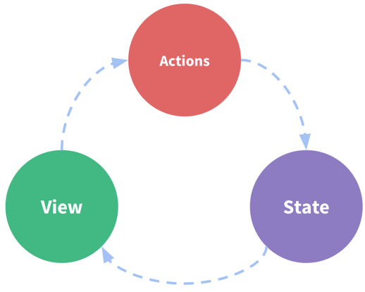
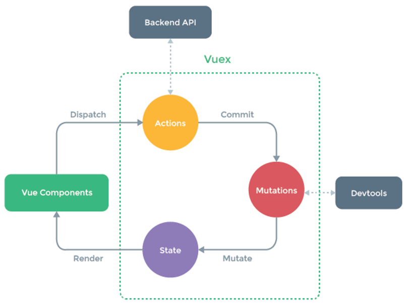
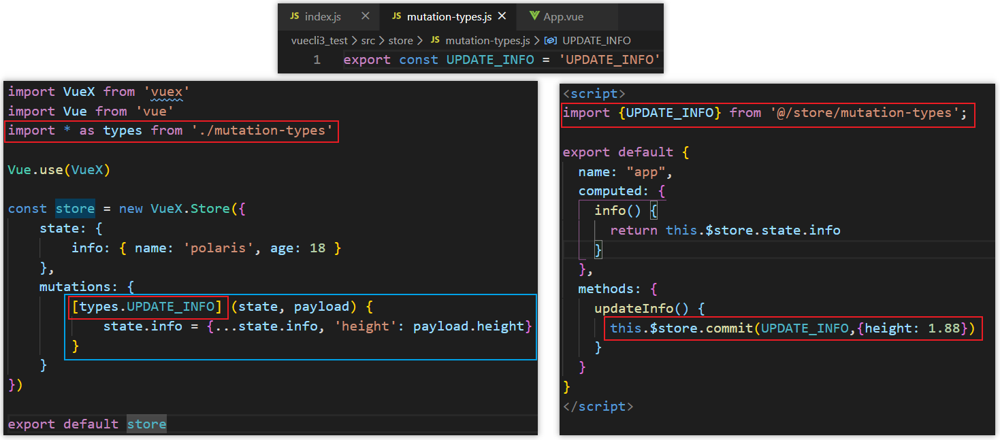
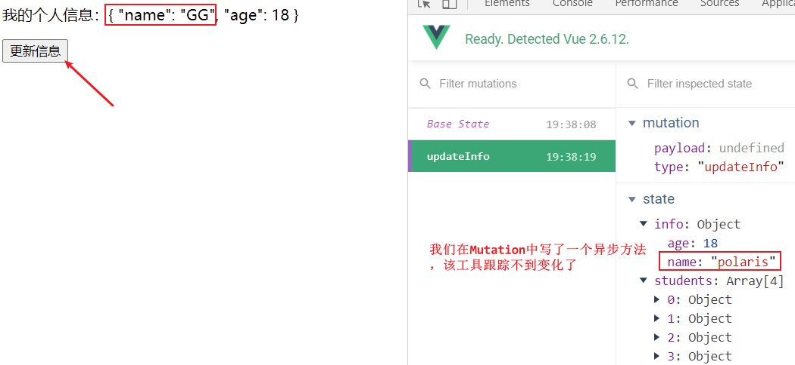
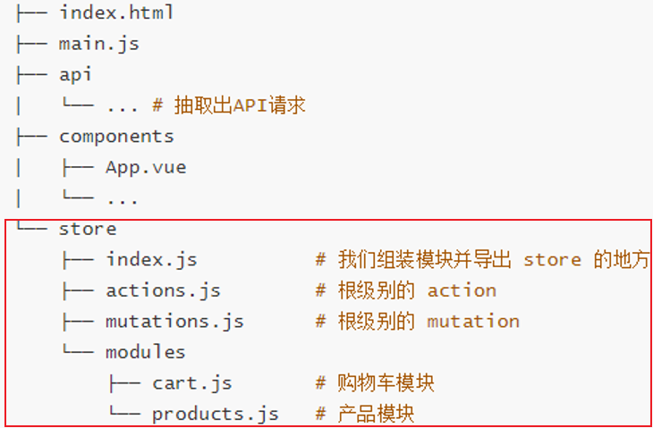

# Vuex详解

## 理解Vuex

### Vuex功能

**官方解释**

Vuex 是一个专为 Vue.js 应用程序开发的状态管理模式。它采用 <span style="color:red">集中式存储</span> 管理应用的所有组件的状态，并以相应的规则保证状态以一种可预测的方式发生变化。Vuex 也集成到 Vue 的官方调试工具 `devtools extension`，提供了诸如零配置的 `time-travel` 调试、状态快照导入导出等高级调试功能。

**状态管理到底是什么？**

状态管理模式、集中式存储管理这些名词听起来就非常高大上，让人捉摸不透。其实你可以简单的将其看成把需要多个组件共享的变量全部存储在一个对象里面。然后将这个对象放在顶层的Vue实例中让其他组件可以使用。那么多个组件是不是就可以共享这个对象中的所有变量属性了呢？是的

如果是这样的话为什么官方还要专门出一个插件Vuex呢？难道我们不能自己封装一个对象来管理吗？当然可以，只是我们要先想想VueJS带给我们最大的便利是什么呢？没错，就是响应式。如果你自己封装实现一个对象能不能保证它里面所有的属性做到响应式呢？当然也可以，只是自己封装可能稍微麻烦一些。不用怀疑，Vuex就是为了提供这样一个在多个组件间共享状态的插件，用它就可以了。

**管理什么状态？**

但是有什么状态是需要我们在多个组件间共享的呢？如果你做过大型开放一定遇到过多个状态在多个界面间的共享问题。比如用户的登录状态、用户名称、头像、地理位置信息等。比如商品的收藏、购物车中的物品等。这些状态信息都可以放在统一的地方对它进行保存和管理，而且它们还是响应式的。

OK，从理论上理解了状态管理之后，让我们从实际的代码再来看看状态管理。

### 单界面的状态管理

**理解**

我们知道，要在单个组件中进行状态管理是一件非常简单的事情。

什么意思呢？我们来看下面的图片。这图片中的三种东西，怎么理解呢？

- State：不用多说，就是我们的状态。（你姑且可以当做就是data中的属性）

- View：视图层，可以针对State的变化，显示不同的信息。（这个好理解）

- Actions：这里的Actions主要是用户的各种操作：点击、输入等会导致状态的改变。



**实现**

在下面案例中，我们有木有状态需要管理呢？没错就是counter。counter需要某种方式被记录下来，也就是我们的State。counter目前的值需要被显示在界面中，也就是我们的View部分。
界面发生某些操作时（我们这里是用户的点击，也可以是用户的input），需要去更新状态，也就是我们的Actions，这不就是上面的流程图了吗？

```html
<template>
  <div id="app">
      <div>当前计数：{{ counter }}</div>
      <button @click="counter+=1">+1</button>
      <button @click="counter-=1">-1</button>
  </div>
</template>

<script>
export default {
  name: "app",
  data() {
    return {
      counter: 0
    }
  }
}
</script>

<style scoped></style>
```

### 多界面状态管理

Vue已经帮我们做好了单个界面的状态管理，但是如果是多个界面呢？

- 多个视图都依赖同一个状态（一个状态改了，多个界面需要进行更新）
- 不同界面的Actions都想修改同一个状态（Home.vue需要修改，Profile.vue也需要修改这个状态）

也就是说对于某些状态(状态1/状态2/状态3)来说只属于我们某一个试图，但是也有一些状态(状态a/状态b/状态c)属于多个试图共同想要维护的。

- 状态1/状态2/状态3你放在自己的房间中，你自己管理自己用没问题。
- 但是状态a/状态b/状态c我们希望交给一个大管家来统一帮助我们管理！
- 没错，Vuex就是为我们提供这个大管家的工具。

全局单例模式（大管家）

- 我们现在要做的就是将共享的状态抽取出来，交给我们的大管家统一进行管理。
- 之后每个试图按照大管家规定好的规定，进行访问和修改等操作。这就是Vuex背后的基本思想。

### Vuex状态管理图例



## Vuex基本使用

### 安装Vuex

```javascript
npm install vuex --save
```

### 简单的案例

使用Vuex实现一下之前的计数器案例

**store/index.js**

```javascript
import VueX from 'vuex'
import Vue from 'vue'

Vue.use(VueX)

const store = new VueX.Store({
    state: {
        count: 0
    },
    mutations: {
        increment(state) {
            state.count++;
        },
        decrement(state) {
            state.count--;
        }
    }
})

export default store
```

**将store挂载到Vue实例中**

我们让所有的Vue组件都可以使用这个store对象，来到main.js文件导入store对象，并且放在new Vue中。这样在其他Vue组件中，我们就可以通过this.$store的方式获取到这个store对象了。

```javascript
//...
import store from '@/store'
//...
new Vue({
  store,
  render: h => h(App),
}).$mount('#app')
```

**组件中使用Vuex的count**

```html
<template>
  <div id="app">
      <div>当前计数：{{ count }}</div>
      <button @click="increment">+1</button>
      <button @click="decrement">-1</button>
  </div>
</template>

<script>
export default {
  name: "app",
  computed: {
    count() {
      return this.$store.state.count
    }
  },
  methods: {
    increment() {
      this.$store.commit('increment')
    },
    decrement() {
      this.$store.commit('decrement')
    }
  }
}
</script>

<style scoped></style>
```

好的，上面就是使用Vuex最简单的方式了。

我们来对使用步骤，做一个简单的总结：

- 提取出一个公共的store对象，用于保存在多个组件中共享的状态。
- 将store对象放置在`new Vue`对象中，这样可以保证在所有的组件中都可以使用到。
- 在其他组件中使用store对象中保存的状态即可
  - 通过`this.$store.state`属性的方式来访问状态
  - 通过`this.$store.commit('mutation中的方法')`来修改状态

>注意：
>① 我们通过提交mutation的方式，而非直接改变store.state.count
>② 这是因为Vuex可以更明确的追踪状态的变化，所以不要直接改变store.state.count的值。

### Vux的几个核心概念

我们来对这几个概念一一理解

- State
- Getters
- Mutation
- Action
- Module

## State

**State单一状态树**

Vuex提出使用单一状态树， 什么是单一状态树呢？英文名称是Single Source of Truth，也可以翻译成单一数据源。

但是它是什么呢？我们来看一个生活中的例子。我们知道在国内我们有很多的信息需要被记录，比如上学时的个人档案，工作后的社保记录，公积金记录，结婚后的婚姻信息，以及其他相关的户口、医疗、文凭、房产记录等等（还有很多信息）。这些信息被分散在很多地方进行管理，有一天你需要办某个业务时(比如入户某个城市)，你会发现你需要到各个对应的工作地点去打印、盖章各种资料信息，最后到一个地方提交证明你的信息无误。这种保存信息的方案不仅仅低效而且不方便管理，以及日后的维护也是一个庞大的工作(需要大量的各个部门的人力来维护，当然国家目前已经在完善我们的这个系统了)。

这个和我们在应用开发中比较类似：如果你的状态信息是保存到多个Store对象中的，那么之后的管理和维护等等都会变得特别困难。所以Vuex也使用了单一状态树来管理应用层级的全部状态。单一状态树能够让我们最直接的方式找到某个状态的片段，而且在之后的维护和调试过程中也可以非常方便的管理和维护。

## Getters

> 类似于组件中的计算属性computed

有时候我们需要从store中获取一些state变化后的状态，比如下面的Store中获取学生年龄大于20的学生个数。

```javascript
state: {
  students: [
       {id: 110, name: 'polaris',age: 18},
       {id: 111, name: 'rose',age: 22},
       {id: 112, name: 'jack',age: 34},
       {id: 113, name: 'tom',age: 11},
   ]
},
```

我们可以在Store中定义getters

```javascript
getters: {
   greateAgesCount: state => {
       return state.students.filter(s => s.age >= 20).length;
   }
}
//如果我们已经有了一个获取所有年龄大于20岁学生列表的getters, 那么代码也可以这样来写
getters: {
   greateAgesStudents: state => {
       return state.students.filter(s => s.age >= 20);
   },
   greateAgesCount: (state, getters) => {
       return getters.greateAgesStudents.length;
   }   
}
```

```javascript
//组件中获取getters计算后的值
computed: {
  greateAgesCount() {
     return this.$store.getters.greateAgesCount
  }
},
```

getters默认是不能传递参数的，如果希望传递参数，那么只能让getters本身返回另一个函数。比如上面的案例中我们希望根据ID获取用户的信息。

```javascript
getters: {
   studentById: state => {
       return id => {
           return state.students.find(s => s.id === id)
       }
   }  
}
```

```javascript
computed: {
  studentById() {
    return this.$store.getters.studentById(112)
  }
}
```

##  Mutation

### 状态更新

Vuex的store状态的更新唯一方式：**提交Mutation**

Mutation主要包括两部分：

- 字符串的 **事件类型**`type`

- 一个 **回调函数** `handler`，该回调函数的第一个参数就是state。


mutation的定义方式：

```javascript
//如下：increment就是事件类型，(state) {state.count++;}是回调函数
mutations: {
    increment(state) {
        state.count++;
    },
    decrement(state) {
        state.count--;
    }
}
```

在某个组件中通过mutation更新state值

```javascript
increment: function() {
    this.$store.commit('increment');
}
```

### 传递参数

在通过mutation更新数据的时候，有可能我们希望携带一些 **额外的参数**，参数被称为是mutation的`载荷(Payload)`

Mutation中的代码:

```javascript
mutations: {
    increment(state,n) {
        state.count += n;
    },
    decrement(state,n) {
        state.count -= n;
    }
}
```

在某个组件中通过mutation更新state值

```javascript
methods: {
    increment() {
      this.$store.commit('increment',2)
    },
    decrement() {
      this.$store.commit('decrement',2)
    }
}
```

但是如果参数不是一个呢？比如我们有很多参数需要传递，这个时候我们通常会以对象的形式传递，也就是payload是一个对象。

```javascript
changeCount(state,payload) {
    state.count = payload.count
}
```

```javascript
changeCount() {
   this.$store.commit('changeCount',{count: 5})
}
```

### 提交风格

上面的通过commit进行提交是一种普通的方式

Vue还提供了另外一种风格, 它是一个包含type属性的对象

```javascript
changeCount() {
   this.$store.commit({
      type: 'changeCount',
      count: 100
   })
}
```

Mutation中的处理方式是将整个commit的对象作为payload使用， 所以代码没有改变依然如下:

```javascript
changeCount(state,payload) {
     state.count = payload.count
}
```

### 响应规则

Vuex的store中的state是响应式的，当state中的数据发生改变时Vue组件会自动更新。

这就要求我们必须遵守一些Vuex对应的规则

- <span style="color:skyblue">提前在store中初始化好所需的属性</span>

- 当给state中的对象添加新属性时,，使用下面的方式

  - 方式一：使用`Vue.set(obj, 'newProp', 123)`
- 方式二：用新对象给旧对象重新赋值

**state中的对象添加新属性的案例**


我们来看一个例子：当我们点击更新信息时界面并没有发生对应改变，如何才能让它改变呢?

```javascript
import VueX from 'vuex'
import Vue from 'vue'

Vue.use(VueX)

const store = new VueX.Store({
    state: {
        info: { name: 'polaris', age: 18 }
    },
    mutations: {
        updateInfo(state,payload) {
            state.info['height'] = payload.height
        }
    }
})

export default store
```

```html
<template>
  <div id="app">
      <p>我的个人信息：{{info}}</p>
      <button @click="updateInfo">更新信息</button>
  </div>
</template>

<script>
export default {
  name: "app",
  computed: {
    info() {
      return this.$store.state.info
    }
  },
  methods: {
    updateInfo() {
      this.$store.commit('updateInfo',{height: 1.88})
    }
  }
}
</script>

<style scoped></style>
```

下面代码的方式一和方式二，都可以让state中的属性是响应式的

```javascript
mutations: {
    // updateInfo(state,payload) {
    //     state.info['height'] = payload.height
    // }
    updateInfo(state, payload) {
        //方式一
//      Vue.set(state.info,'height',payload.height)
        //方式二
         state.info = {...state.info, 'height': payload.height}
    }
}
```

> 我们也可以响应式的删除某个对象的属性如：`Vue.delete(state.info,'height')`

### 常量类型

**概念**

我们来考虑一个问题，在mutation中我们定义了很多事件类型（也就是其中的方法名称）。当我们的项目增大时Vuex管理的状态越来越多，需要更新状态的情况越来越多，那么意味着Mutation中的方法越来越多。方法过多使用者需要花费大量的经历去记住这些方法甚至是多个文件间来回切换查看方法名称，甚至如果不是复制可能还会出现写错的情况。

如何避免上述的问题呢？在各种Flux实现中，一种很常见的方案就是<span style="color:red"> 使用常量替代Mutation事件的类型 </span>。我们可以将这些常量放在一个单独的文件中方便管理以及让整个app所有的事件类型一目了然。

具体怎么做呢？我们可以创建一个文件 `mutation-types.js`， 并且在其中定义我们的常量。
定义常量时我们可以使用ES2015中的风格，使用一个常量来作为函数的名称。

**代码**



### 同步函数

通常情况下Vuex要求我们Mutation中的方法必须是同步方法。

主要的原因是当我们使用devtools时，利用devtools帮助我们捕捉mutation的快照，但是如果是异步操作那么devtools将不能很好的追踪这个操作什么时候会被完成。即如果Vuex中的代码我们使用了异步函数，你会发现state中的info数据一直没有被改变因为它无法追踪到。所以通常情况下不要在mutation中进行异步的操作。

```javascript
mutations: {
   updateInfo(state) {
       setTimeout(() => {
           state.info.name = "GG";
       },1000)
   }
},
```



## Action

### 基本定义

前面我们强调不要再Mutation中进行异步操作，但是某些情况我们确实希望在Vuex中进行一些异步操作，比如网络请求必然是异步的，这个时候怎么处理呢?

Action类似于Mutation，但是是用来代替Mutation进行异步操作的。

Action的基本使用代码如下

```javascript
mutations: {
   updateInfo(state) {
       // setTimeout(() => {
       //     state.info.name = "GG";
       // },1000)
       state.info.name = "GG";
   }
},
actions: {
    actUpdateInfo(context) {
       setTimeout(() => {
           context.commit('updateInfo');
       },1000)
    }
}
```

context是什么？context是和store对象具有相同方法和属性的对象，也就是说我们可以通过context去进行commit相关的操作，也可以获取context.state等。但是注意这里它们并不是同一个对象，为什么呢? 我们后面学习Modules的时候再具体说。

这样的代码是否多此一举呢？我们定义了actions，然后又在actions中去进行commit，这不是脱裤放屁吗？事实上并不是这样，如果在Vuex中有异步操作那么我们就可以在actions中完成了。

### 分发

在Vue组件中, 如果我们调用action中的方法，那么就需要使用dispatch，同样的dispatch也是支持传递payload

```javascript
methods: {
  updateInfo() {
     // this.$store.commit('updateInfo');
     this.$store.dispatch('actUpdateInfo');
  }
}
```

### 对象的解构写法

```javascript
const obj = {
	name: 'why',
	age: 18,
	height: 1.88
};
//顺序可变
const {age, name, height} = obj;
console.log(name);
```

**在Actions中使用对象的解构写法** 

> getters  和 mutations 当然也可以使用对象的解构写法

```javascript
actions: {
    actUpdateInfo({commit}) {
       setTimeout(() => {
           commit('updateInfo');
       },1000)
    }
}
```

### Action返回的Promise

> 不清楚promise的用法请回看第八章

**引入**

当我们的store中异步操作执行结束后，是否能够提醒一下调用者已经成功执行了呢？

我们可以这样实现：

```javascript
actions: {
   actUpdateInfo(context,success) {
       setTimeout(() => {
           context.commit('updateInfo');
           success();
       },1000)
   }
},
```

```javascript
methods: {
  updateInfo() {
    this.$store.dispatch('actUpdateInfo',() => {
      console.log('执行成功！'); 
    });
  }
}
```

但是这样就不能传入其他参数了，那我们再换种写法！

```javascript
actions: {
   actUpdateInfo(context,payload) {
       setTimeout(() => {
           context.commit('updateInfo',payload.message);
           console.log(payload.message);
           payload.success();
       },1000)
   }
},
```

```javascript
methods: {
  updateInfo() {
    this.$store.dispatch('actUpdateInfo', {
        message: '我是携带的参数',
        success: () => {
        	console.log('执行成功！');
      	}
    });
  }
}
```

虽然可以实现，但是回调的信息和携带的参数写到一起去了，这种做法是不够优雅的，下面我们通过Promise实现！

**使用Promise**

前面我们学习ES6语法的时候说过Promise经常用于异步操作。在Action中我们可以将异步操作放在一个Promise中，并且在成功或者失败后调用对应的resolve或reject。

```javascript
actions: {
  actUpdateInfo(context, payload) {
    return new Promise((resolve, reject) => {
       setTimeout(() => {
           context.commit('updateInfo');
           console.log(payload);
           resolve('执行成功！');
       }, 1000)
    })
  }
},
```

```javascript
methods: {
  updateInfo() {
    this.$store.dispatch("actUpdateInfo", '我是携带的信息').then(res => {
      console.log(res);
    });
  },
},
```

## Module

### 理解

Module是模块的意思，为什么在Vuex中我们要使用模块呢？

Vue使用单一状态树，那么也意味着很多状态都会交给Vuex来管理。当应用变得非常复杂时store对象就有可能变得相当臃肿。为了解决这个问题Vuex允许我们将store分割成模块（Module），而每个模块拥有自己的state，mutations，actions，getters等。

我们按照什么样的方式来组织模块呢？看下面代码

```javascript
//注意：模块中mutation和getters接收的第一个参数state，context是局部状态对象。
const moduleA = {
    state: {
        name: 'polaris'
    },
    mutations: {
        updateName(state) {
            state.name = 'GG';
		}
    },
    actions: {
        actUpdateName(context) {
            setTimeout(() => {
                context.commit('updateName')
            },1000)
        }
    },
    getters: {
        fullName(state) {
            return state.name + "hahaha";
        }
    }
}
              
const moduleB = {
    state: {
       name: 'rose'       
    },
    mutations: {},
    actions: {},
    getters: {}
}
              
const store = new Vuex.store({
     modules: {
        a: moduleA,
        b: moduleB
     }         
})              
```

```javascript
//state,调用时必须加上模块名，不同模块间可以有相同的值
this.$store.state.a.name  //获取moduleA的状态中的值
this.$store.state.b.name  //获取moduleB的状态中的值
//mutations,不同模块间可以有相同的值但是不要这么写，因为外部会同时调用不同模块的mutations方法
updateName() {
    this.$store.commit('updateName'); //依次去模块中找
}
//getters,不同模块间不能有相同的值，会报错
this.$store.getters.fullName //依次去模块中找
//actions,不同模块有相同的mutations方法时，会同时调用不同模块的mutations方法
actUpdateName() {
   this.$store.dispatch('actUpdateName')
}

//=> 总结：除了state，各个模块中的其他内容不要重名！
```

### store推荐的项目结构


