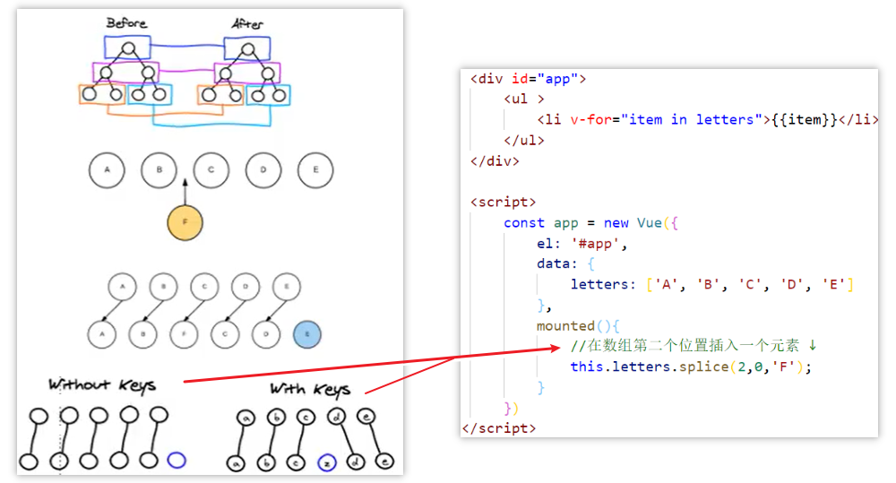
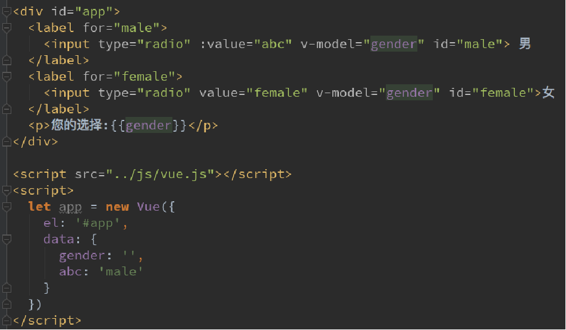
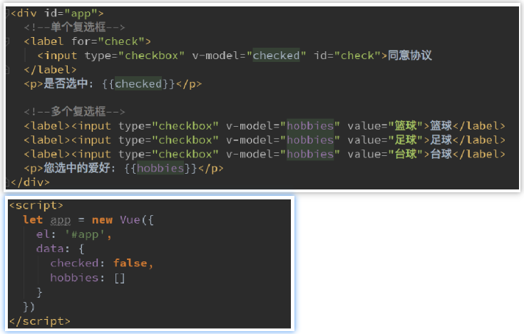
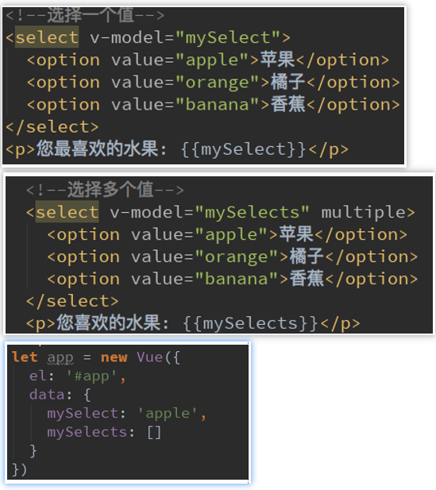
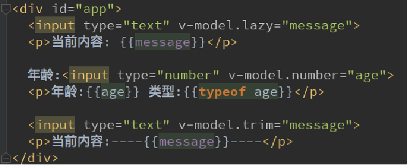
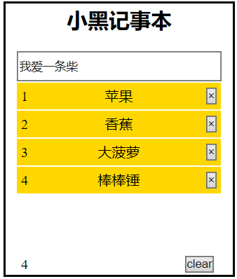

# Vue指令

> Vue指令指的是以 `v-` 开头的一组特殊语法

## 内容绑定

### v-text指令 与 {{}} 插值表达式

> 注：{{}} 插值表达式也被称作 `Mustache`语法

作用：设置标签的文本值

> 注：
>
> ① `v-text` 会替换全部内容,使用差值表达式 `{{}}` 可以替换指定内容 
>
> ② 两种方式都支持写表达式

v-text 与 {{}} 区别：

- 使用 `v-text` 取值会将标签中原有的数据覆盖，而插值表达式不会

- 使用 `v-text` 可以避免在网络环境差的情况下出现插值闪烁（先出现 `{{xx}}`）

```html
<div id="app">
    <h2 v-text="message"></h2>
    <!-- 另一种写法：插值表达式 -->
    <h2>瞅啥！{{message}}</h2> 
    <!-- 支持写表达式如字符串的拼接 -->
    <h2 v-text="message + '_' + person.name"></h2>
    <h2>瞅啥！{{message + "GG" + person.name}}</h2> 
</div>
```

### v-html指令

作用：设置元素的`innerHTML`

使用场景：内容中有html结构会被解析为标签，而v-text指令无论内容是什么只会解析为文本。解析文本使用 `v-text`，需要解析html结构使用v-html

```html
<div id="app">
    <p v-html="message"></p>
    <p v-html="content"></p>
</div>
<script>
    var app = new Vue({
        el: '#app',
        data: {
            message: 'Hello Vue!',
            content:"<a href='#'>Hello Vue!</a>",
        },       
    })
</script>
```

### v-once指令

加上 `v-once`，当前元素和组件只渲染一次，不会随着vue实例中data数据的改变而改变

```html
<div id="app">
    <h2>{{message}}</h2>
    <h2 v-once>{{message}}</h2>
</div>
<script>
    const app = new Vue({
        el: '#app',
        data: {
            message: '你好啊'
        }
    })
</script>
```

### v-pre指令

用于跳过这个元素和它子元素的编译过程，用于显示原本的 `Mustache`语法

```html
<div id="app">
    <h2>{{message}}</h2>
    <h2 v-pre>{{message}}</h2>
</div>
<script>
    const app = new Vue({
        el: '#app',
        data: {
            message: '你好啊'
        }
    })
</script>
```

### v-cloak指令

可以解决插值闪烁的问题

```html
<!--  当有v-cloak属性时就执行该样式 --> 
<style>
    [v-cloak] {
        display:none;
    }
</style>
<div id="app" v-cloak>
    <h2>{{message}}</h2>
    <h2 v-pre>{{message}}</h2>
</div>
<script>
    //在vue解析之前，div中有一个属性v-cloak
    //在vue解析之后，div中的该v-cloak属性会被删除
    const app = new Vue({
        el: '#app',
        data: {
            message: '你好啊'
        }
    })
</script>
```

## 事件绑定

### v-on指令

作用：为元素绑定事件

用法：

- 事件名不需要写on

- `v-on:` 指令可以简写为 `@`

- 绑定的方法定义在methods属性中

- 方法内部通过this关键字可以访问定义在data中数据

```html
<!DOCTYPE html>
<html lang="en">
<head>
    <meta charset="UTF-8">
    <meta name="viewport" content="width=device-width, initial-scale=1.0">
    <title>HelloVue</title>
    <!-- 开发环境版本，包含了有帮助的命令行警告 -->
    <script src="https://cdn.jsdelivr.net/npm/vue/dist/vue.js"></script>
    <script>
        window.onload = function(){
            var app = new Vue({
                el: '#app',
                data: {
                    food:"西红柿操蛋"
                }, 
                methods:{
                    doIt:function(){
                        alert("我被点击了！！");
                    },
                    //changeFood:function(){
                    //        this.food += "还行吧！";
                    //}
                    //注意：函数也可以写简化形式
                    changeFood(){
                        this.food += "还行吧！";
                    }
                }      
            })
        }
    </script>
</head>
<body>
    <div id="app">
        <!-- <button v-on:click="doIt">点击事件</button> -->
        <button @click="doIt">点击事件</button>
        <button @dblclick="doIt">双击事件</button>
        <h2 @click="changeFood">{{ food }}</h2>
    </div>
</body>
</html>
```

### 事件参数

事件绑定的方法写成函数调用的形式，可以传入自定义参数。定义方法时需要定义形参来接收传入的实参。

如果该方法不需要额外参数，那么方法后的()可以不添加。

> 注意：
>
> ① 如果方法本身有一个参数且我们没有添加()，那么会默认将原生事件event参数传递进去
>
> ② 如果方法本身有一个参数且我们添加了()但没有传入实参，那么该参数为undefined

如果在传入某个自定义参数的时候同时需要传入 `event` 时，可以通过 `$event` 作为实参传入事件。


```html
<!DOCTYPE html>
<html lang="en">
<head>
    <meta charset="UTF-8">
    <meta name="viewport" content="width=device-width, initial-scale=1.0">
    <title>HelloVue</title>
    <!-- 开发环境版本，包含了有帮助的命令行警告 -->
    <script src="https://cdn.jsdelivr.net/npm/vue/dist/vue.js"></script>
    <script>
        window.onload = function(){
            var app = new Vue({
                el: '#app',
                data: {
                    
                }, 
                methods:{
                    //添加自定义参数
                    doIt:function(p1,p2){
                        alert(p2 + "双击" + p1);
                    },
                    sayHi:function(){
                        alert("Hello!")
                    }
                }      
            })
        }
    </script>   
</head>
<body>
    <div id="app" >
        <button @click="doIt(666,'老铁')">点击</button>
        <!-- 事件修饰符：如点击enter键才触发-->
        <input type="text" @keyup.enter="sayHi">
    </div>
</body>
</html>
```

### 事件修饰符

事件的后面跟上 ` .事件修饰符` 可以对事件进行限制

事件修饰符有多种...

- `.stop`		  阻止事件冒泡

```html
<div id="app" >
   <div class="box" @click="divClick">
       <!-- 阻止事件冒泡-->
       <input type="button" value="按钮" @click.stop="btnClick">
   </div>
</div>
```

- `.prevent `     阻止标签的默认行为

```html
<div id="app" >
    <!-- 阻止事件的默认行为,如此例点击后不会跳转到百度-->
    <a href="http://www.baidu.com" @click.prevent="aClick">百度</a>
     <!-- 注意：事件修饰符是可以连点的-->
     <a href="http://www.baidu.com" @click.prevent.stop="aClick">百度</a>
</div>
```

- `.capture `
- `.self `           针对于当前标签的事件触发，即只触发自己标签上特定动作的事件

```html
<div id="app" >
    <!-- self:只触发自己标签上特定动作的事件，如此例忽略子元素的事件冒泡-->
    <div @click.self="divClick">
        <input type="button" value="按钮" @click="btnClick">
        <input type="button" value="按钮1" @click="btnClick1">
        <input type="button" value="按钮2" @click="btnClick2">
    </div>
</div>
```

- `.once`    让指定的事件只触发一次
- `.passive`

### 按键修饰符

事件的后面跟上 `.按键修饰符` 可以对事件进行限制
按键修饰符有多种...

  - `.enter`

  - `.tab`

  - `.delete`

  - `.esc`

  - `.space`

    ...

### 案例：计数器

```html
<!DOCTYPE html>
<html lang="en">
<head>
    <meta charset="UTF-8">
    <meta name="viewport" content="width=device-width, initial-scale=1.0">
    <title>HelloVue</title>
    <!-- 开发环境版本，包含了有帮助的命令行警告 -->
    <script src="https://cdn.jsdelivr.net/npm/vue/dist/vue.js"></script>
    <script>
        window.onload = function(){
            var app = new Vue({
                el: '#app',
                data: {
                    num:1
                }, 
                methods:{
                    //递增
                    add:function(){
                        if(this.num >= 10) {
                            alert("数量不能大于10");
                        } else{
                            this.num++;
                        }
                    },
                    //递减
                    sub:function(){
                        if(this.num <= 0) {
                            alert("数量不能小于0");
                        } else {
                            this.num--;
                        }
                    }
                }      
            })
        }
    </script>
</head>
<body>
    <div id="app" >
        <div class="input-num">
            <button @click="sub">-</button>
            <span>{{num}}</span>
            <button @click="add">+</button>
        </div>
    </div>
</body>
</html>
```

##  显示切换

### v-show指令

作用：切换元素的显示状态

原理：

- 修改元素的`display` 属性，实现显示隐藏

- 指令后面的内容最终都会解析为布尔值，值为true元素显示，值为false元素隐藏

- 数据改变之后，对应元素的显示状态会同步更新

```html
<!DOCTYPE html>
<html lang="en">
<head>
    <meta charset="UTF-8">
    <meta name="viewport" content="width=device-width, initial-scale=1.0">
    <title>HelloVue</title>
    <!-- 开发环境版本，包含了有帮助的命令行警告 -->
    <script src="https://cdn.jsdelivr.net/npm/vue/dist/vue.js"></script>
    <script>
        window.onload = function(){
            var app = new Vue({
                el: '#app',
                data: {
                    isShow:false
                }, 
                methods:{
                   changeIsShow:function(){
                       this.isShow = !this.isShow;
                   }
                }      
            })
        }
    </script>
</head>
<body>
    <div id="app" >
        <button  @click="changeIsShow">切换</button>
          
</script>
```

### 案例 - 点击切换

> 引入vue中key属性的使用

实现点击按钮切换input框的效果

```html
<div id="app">
    <span v-if="isUser">
        用户账号: <input type="text" placeholder="用户账号">
    </span>
    <span v-else>
        用户邮箱: <input type="text" placeholder="用户密码">
    </span>
    <button @click="isUser = !isUser">切换类型</button>
</div>

<script>
    const app = new Vue({
        el: '#app',
        data: {
            isUser: true
        }
    })  
</script>
```

发现问题：如果我们有输入内容的情况下切换了类型，我们会发现文字依然显示之前输入的内容。但是按道理讲我们应该切换到另一个input元素中了，而在另一个input元素中我们并没有输入内容，为什么会出现这个问题呢？

解答：这是因为Vue在进行DOM渲染时出于性能考虑，会尽可能的复用已经存在的元素，而不是重新创建新的元素。在上面的案例中，Vue内部发现原来的input元素不再使用就直接用来作为else中的input来使用了。

如果我们不希望如此呢？=> 我们可以给对应的input添加key属性且保证key属性的不同，则不同key属性值的两个元素是不会复用的。

## 属性绑定

### v-bind指令

作用：为元素绑定属性

使用：

- 完整写法是 `v-bind:属性名`

- 简写的话可以直接省略 `v-bind`，只保留 `:属性名`

- 需要动态的增删 `class选择器` 建议使用对象的方式

```html
<!DOCTYPE html>
<html lang="en">
<head>
    <meta charset="UTF-8">
    <meta name="viewport" content="width=device-width, initial-scale=1.0">
    <title>HelloVue</title>
    <!-- 开发环境版本，包含了有帮助的命令行警告 -->
    <script src="https://cdn.jsdelivr.net/npm/vue/dist/vue.js"></script>
    <script>
        window.onload = function(){
            var app = new Vue({
                el: '#app',
                data: {
                    imgSrc:"image/冷饮.jpg",
                    imgTitle:"冷饮",
                    isActive:false
                }, 
                methods:{
                   toggleActive:function(){
                       this.isActive = !this.isActive;
                   }
                }      
            })
        }
    </script>
    <style>
        .active{
            border:2px solid red;
        }
    </style>
</head>
<body>
    <div id="app" >
        <!--  -->
        
            
        <!-- :class中使用对象的形式:active这个类名是否生效取决于isActive的值-->
        
            
         <!-- 和普通的类选择器同时存在并不冲突。
             可以传入多个值，可以同时生效 -->
          
            
        <!-- 可以放数组的形式 -->
         
         
       
        <!-- 如果过于复杂，可以放在一个methods或computed中 -->
        
        
        <!-- 注意：50px必须加单引号，否则会被当成对象，之后解析后会去掉的
                   font-size和fontSize都可以被识别 -->
        <h2 :style="{fontSize: '50px'}">{{message}}</h2>
    </div>
</body>
</html>
```

### 案例：图片切换

- 列表数据使用数组保存

- `v-bind` 指令可以设置元素属性，比如src

- `v-show` 和 `v-if` 都可以切换元素的显示状态，频繁切换用 `v-show`

```html
<!DOCTYPE html>
<html lang="en">
<head>
    <meta charset="UTF-8">
    <meta name="viewport" content="width=device-width, initial-scale=1.0">
    <title>HelloVue</title>
    <!-- 开发环境版本，包含了有帮助的命令行警告 -->
    <script src="https://cdn.jsdelivr.net/npm/vue/dist/vue.js"></script>
    <script>
        window.onload = function(){
            var app = new Vue({
                el: '#app',
                data: {
                    imgArr:["image/bar1.jpg","image/bar2.jpg",
                            "image/bar3.jpg","image/bar4.jpg"],
                    index:0
                }, 
                methods:{
                    prev:function(){
                        this.index--;
                    },
                    next:function(){
                        this.index++;
                    }
                }      
            })
        }
    </script>
    <style>
        .bar{
            margin-top: 80px;
            margin-left: 150px;
            position: relative;
            width: 1200px;
            height: 600px;
            border:4px solid gray;
        }
        a{
            cursor: pointer;
            position:absolute;  
            top:270px;
            display: block;
            width:65px;
            height: 40px;
            line-height: 30px;
            border: 1px solid white;
            text-align: center;
            font-size: 30px;
            
        }
        .leftA{left: 0px;}
        .rightA{right: 0px;}
        img{
            width: 1200px;
            height: 600px;
        }
    </style>
</head>
<body>
    <div id="app" >
        <div class="bar">
            <a class="leftA" @click="prev" v-show="index!=0">👈</a>
            
            <a class="rightA" @click="next" v-show="index<imgArr.length-1">👉</a>
        </div>
    </div>
</body>
</html>
```

## 列表循环 

### v-for指令

理解：根据数据生成列表结构，数组经常和v-for结合使用

语法：

- `(item,index) in 数据`

- `item` 和 `index` 可以结合其他指令一起使用

### 维护状态

官方推荐我们在使用v-for时，给对应的元素或组件添加上一个 `:key属性`

为什么？=> 这其实和 Vue 的虚拟Dom 的 `Diff算法` 有关系。当某一层有很多相同的节点时（也就是列表节点），我们希望插入一个新的节点。如下，我们希望可以在B和C中加一个F。Diff算法默认执行是这样的 => 把C更新成F，D更新成C，E更新成D，最后再插入E，这样的效率很低

解决：我们需要使用key来给每个节点做一个唯一标识，Diff算法就可正确的识别此节点，然后找到正确的位置区插入新的节点



注意：我们不推荐使用 index 作为 key，例如当我们在第一个位置插入新元素的时候 新元素的key值理所应当变成了`index == 1`，key值也就变成了1。而原本 `index == 1` 的 li 元素的 index 就变成了2，原本 `index == 2` 的元素key值就变成了3 。 这样就导致虚拟dom的 diff算法 在做比较的时候发现，key值为1，2，3的元素和原来的key值为1，2，3的元素对比的时候发现二者不一样，diff算法就会重新渲染这三个元素，原本key值为1，2的元素内容没有发生变化，但是因为key值使用的是index所以还需要重新渲染，这就失去了虚拟dom在性能上的优势，所有我们要使用唯一键值来做标记，例如id。

总结：<span style="color:skyblue;">key的作用主要是为了高效的更新虚拟DOM</span>

### 遍历数组

数组长度的更新会同步到页面上,是响应式的

```html
<!DOCTYPE html>
<html lang="en">
<head>
    <meta charset="UTF-8">
    <meta name="viewport" content="width=device-width, initial-scale=1.0">
    <title>HelloVue</title>
    <!-- 开发环境版本，包含了有帮助的命令行警告 -->
    <script src="https://cdn.jsdelivr.net/npm/vue/dist/vue.js"></script>
    <script>
        window.onload = function(){
            var app = new Vue({
                el: '#app',
                data: {
                    arr:["西红柿","番茄","黄瓜","茄子"],
                    persons:[
                        {name:"张三",gender:"男"},
                        {name:"李四",gender:"女"},
                        {name:"jack",gender:"男"}
                    ]
                }, 
                methods:{
                    add:function(){
                        //push方法：往数组末尾添加一个元素
                        this.persons.push({
                            name:"rose",gender:"女"
                        })
                    },
                    remove:function(){
                        //shift方法：移除数组第一个元素
                        this.persons.shift();
                    }
                }      
            })
        }
    </script>   
</head>
<body>
    <div id="app" >
        <ul>
            <!-- <li v-for="item in arr">蔬菜：{{item}}</li> -->
            <li v-for="(item,index) in arr">
                {{"第" + (index+1) + "种"}}蔬菜：{{item}}
            </li>
        </ul>
        <h2 v-for="item in persons" :title="item.name">
            {{item.name + ":" + item.gender}}
        </h2>
        <button @click="add">添加数据</button>
        <button @click="remove">移除数据</button>
    </div>
</body>
</html>
```

### 遍历对象

```html
<div id="app">
    <ul >
        <li v-for="(arg1,arg2) in Person">
            {{arg2 + ': ' + arg1}}
        </li>
    </ul>
</div>

<script>
    const app = new Vue({
        el: '#app',
        data: {
            isUser: true,
            Person: {
                name: 'rose',
                age: 18,
                height: 1.88
            }
        }
    })  
</script>
```

### 检测数组更新

因为Vue是响应式的，所以当数据发生变化时Vue会自动检测数据变化，视图会发生对应的更新。

Vue中包含了一组观察数组编译的方法，使用它们改变数组也会触发视图的更新。

- `push() `         在数组最后面添加元素，可一次加多个
- `pop()`            删除数组中的最后一个元素
- `shift()`        删除数组中的第一个元素
- `unshift()`	在数组最前面添加元素，可一次加多个
- `splice()`      删除元素 / 插入元素 / 替换元素
- `soft()`          排序
- `reverse()`    翻转

> 注意：通过索引值直接修改数组中的元素是不被vue监听的如 `this.letters[0] = 'bbbbb'`
>
> ① 可以通过替换的方式实现：`this.letters.splice(0,1,'bbbbbb')`
>
> ② 也可以用过vue的方法进行修改：`Vue.set(要修改的对象，索引值，修改后的值)`

## 表单元素绑定

### v-model指令

> 需要和表单元素配合使用

作用：便捷的设置和获取表单元素的值（双向数据绑定）

双向绑定：

- 绑定的数据会和表单元素值相关联

- 绑定的数据 ←→ 表单元素的值

- 前端MVVM架构：双向绑定

  - `Model`：数据，Vue实例中绑定数据
  - `ViewModel`：监听器
  - `View`：页面，页面展示的数据

原理：	`v-model` 其实是一个语法糖，它的背后本质上是包含两个操作：

- `v-bind` 绑定一个value属性
- `v-on` 指令给当前元素绑定input事件

```html
<input type="text" v-model="message">
<!-- 等同于 -->
<input type="text" :value="message" @input="message = $event.target.value">
```

### v-model：radio

当存在多个单选框时



### v-model：checkbox

> 复选框分为两种情况：单个勾选框和多个勾选框。

单个勾选框：`v-model`即为布尔值，此时input的value并不影响 `v-model` 的值。

多个复选框：当是多个复选框时，因为可以选中多个，所以对应的data中属性是一个数组，当选中某一个时，就会将input的value添加到数组中。



### v-model：select		

> select也分单选和多选两种情况

单选：只能选中一个值。`v-model` 绑定的是一个值。当我们选中option中的一个时，会将它对应的value赋值到mySelect中。

多选：可以选中多个值。`v-model` 绑定的是一个数组。当选中多个值时，就会将选中的option对应的value添加到数组mySelects中。



### input中的值绑定

初看Vue官方值绑定的时候，我很疑惑：what the hell is that？

但是仔细阅读之后，发现很简单，就是动态的给value赋值而已：我们前面的value中的值，都是在定义input的时候直接给定的。但是真实开发中，这些input的值可能是从网络获取或定义在data中的。所以我们可以通过 `v-bind:value` 动态的给value绑定值。这不就是v-bind嘛

### v-model的修饰符

lazy修饰符：默认情况下，v-model默认是在input事件中同步输入框的数据的。也就是说，一旦有数据发生改变对应的data中的数据就会自动发生改变。lazy修饰符可以让数据在失去焦点或者回车时才会更新。

number 修饰符：默认情况下，在输入框中无论我们输入的是字母还是数字，都会被当做字符串类型进行处理。但是如果我们希望处理的是数字类型，那么最好直接将内容当做数字处理。number修饰符可以让在输入框中输入的内容自动转成数字类型。

trim 修饰符：如果输入的内容首尾有很多空格，通常我们希望将其去除。trim修饰符可以过滤内容左右两边的空格。



实例：

```html
<!DOCTYPE html>
<html lang="en">
<head>
    <meta charset="UTF-8">
    <meta name="viewport" content="width=device-width, initial-scale=1.0">
    <title>HelloVue</title>
    <!-- 开发环境版本，包含了有帮助的命令行警告 -->
    <script src="https://cdn.jsdelivr.net/npm/vue/dist/vue.js"></script>
    <script>
        window.onload = function(){
            var app = new Vue({
                el: '#app',
                data: {
                    message:"老铁双击666"
                }, 
                methods:{
                    getM:function(){
                        alert(this.message);
                    },
                    setM:function(){
                        this.message = "算了吧！"
                    }
                }      
            })
        }
    </script>   
</head>
<body>
    <div id="app" >
        <button @click="setM">修改message</button>
        <!-- 双向数据绑定-->
        <input type="text" v-model="message" @keyup.enter="getM">
        <h2>{{message}}</h2>
    </div>
</body>
</html>
```

## 案例：记事本		

> 基于数据的开发方式

**新增**

生成列表结构（`v-for`  /  `数组`）

获取用户输入（`v-model双向数据绑定`）

回车，新增数据（`v-on.enter`）

**删除**

点击删除指定内容（`v-on`）

**统计**

统计信息个数（`v-text 即插值表达式`）

**清空**

点击清除所有信息（`v-on`）

**隐藏**

没有数据时，隐藏元素（`v-show` / `v-if`）



```html
<!DOCTYPE html>
<html lang="en">
<head>
    <meta charset="UTF-8">
    <meta name="viewport" content="width=device-width, initial-scale=1.0">
    <title>HelloVue</title>
    <!-- 开发环境版本，包含了有帮助的命令行警告 -->
    <script src="https://cdn.jsdelivr.net/npm/vue/dist/vue.js"></script>
    <script>
        window.onload = function(){
            var boss = new Vue({
                el: '#boss',
                data: {
                    list:["苹果","香蕉","大菠萝","棒棒锤"],
                    inputValue:"我爱一条柴"
                }, 
                methods:{
                   add:function(){
                       this.list.push(this.inputValue);
                   },
                   remove:function(i){
                        this.list.splice(i,1);
                   },
                   clear:function(){
                        this.list = [];
                   }
                }      
            })
        }
    </script>   
    <style>
        *{margin: 0;padding: 0;}
        #boss{margin-top:100px;margin-left:200px;width:250px;height: 300px;
                text-align: center;border:2px solid black;padding: 5px;
                line-height: 30px;position: relative;}
        input{width:230px;height: 30px;margin-top: 20px;}
        li{list-style-type: none;margin-top: 2px;background-color: gold;
            width:233px;height: 30px;margin-left: 8px;position: relative;}
        span{position: absolute; left: 5px;}
        button{position: absolute; right: 5px;margin-top: 5px;}
        .foot{width:230px;height: 25px;margin-left: 8px;position:absolute; 
             bottom: 2px;}
    </style>
</head>
<body>
    <div id="boss">
        <h2>小黑记事本</h2>
        <input type="text" v-model="inputValue" @keyup.enter="add">
        <ul>
            <li v-for="(item,index) in list">
                <span>{{index + 1}}</span>
                <label>{{item}}</label>
                <button @click="remove(index)">×</button>
            </li>
        </ul>
        <div class="foot">
            <span class="total" v-if="list.length != 0">{{list.length}}</span>
            <button @click="clear" v-show="list.length != 0">clear</button>
        </div>
    </div>
</body>
</html>
```