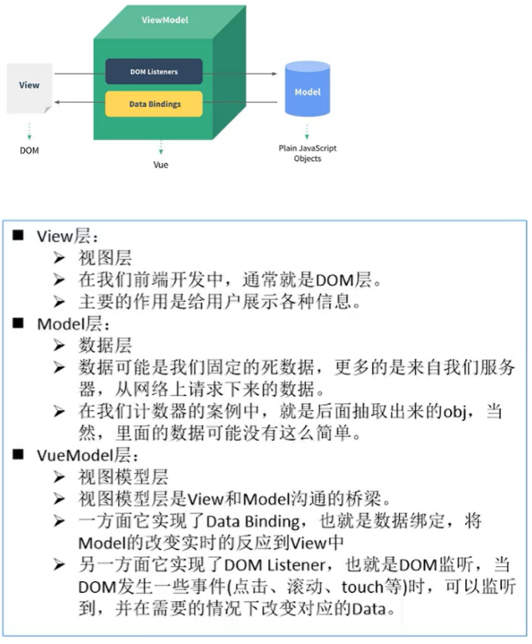
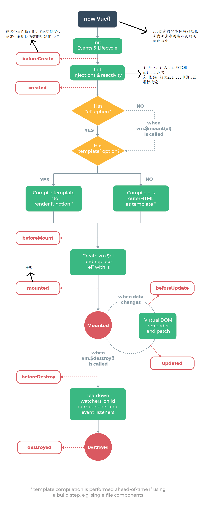

# Vue简介

## 特点

`JavaScript` 框架

简化Dom操作（使用Vue提供的特殊语法，Vue会自动的去操纵使用特殊语法的DOM元素）

响应式数据驱动 （页面是由数据生成的）

渐进式的框架，你可以将Vue作为你应用的一部分嵌入其中

## 高级功能

解耦视图和数据

可复用的组件

前端路由技术

状态管理

虚拟DOM

## 第一个Vue程序

### 步骤

- 导入开发版本的Vue.js

- 创建Vue实例对象, 设置el属性和data属性 

- 使用简洁的模板语法把数据渲染到页面上

```html
<!DOCTYPE html>
<html lang="en">
<head>
    <meta charset="UTF-8">
    <meta name="viewport" content="width=device-width, initial-scale=1.0">
    <title>HelloVue</title>
    <!-- 开发环境版本，包含了有帮助的命令行警告 -->
    <script src="https://cdn.jsdelivr.net/npm/vue/dist/vue.js"></script>
    <script>
        window.onload = function(){
            const app = new Vue({
                <!-- el类型：String或HTMLElement -->
                el: '#app',
                <!-- data类型：Object或function -->
                <!-- 注意：组件当中data必须是一个函数 -->
                data: {
                    message: 'Hello Vue!'
                }
            })
        }
    </script>
</head>
<body>
    <div id="app">
        {{ message }}
    </div>
</body>
</html>
```

### el:挂载点

el是用来设置Vue实例挂载（管理）的元素

作用范围：Vue会管理el选项命中的元素及其内部的后代元素

可以使用其他的选择器,但是建议使用ID选择器

可以使用其他的双标签,不能使用HTML和BODY

### data:数据对象

Vue中用到的数据定义在data中

data中可以写复杂类型的数据

渲染复杂类型数据时，遵守js的语法即可

```html
<body>
    <div id="app">
        {{ message }}
        <h2>{{ person }}</h2>
        <h2>{{ person.name }}</h2>
        <h3>{{ words}}</h3>
        <h3>{{ words[2] }}</h3>
    </div>
    <script>
        const app = new Vue({
                el: '#app',
                data: {
                    message: 'Hello Vue!',
                    person:{
                        name:"lak",
                        gender:"女"
                    },
                    words:["GG","TT","YY","MM"]
                }
            })
	</script>
</body>
```

## Vue中的MVVM



## Vue生命周期

### 理解

Vue生命周期也称为生命周期钩子，即生命周期函数

生命周期图示



### 总结

初始化阶段

- `beforeCrete`函数
- `created`函数
- `beforeMount`函数
- `mounted`函数

运行状态阶段

- `beforeUpdade`函数
- `updateed`函数

销毁阶段

- `beforeDestory`函数
- `destoryed`函数

```html
<!DOCTYPE html>
<html lang="en">
<head>
    <meta charset="UTF-8">
    <meta name="viewport" content="width=device-width, initial-scale=1.0">
    <title>HelloVue</title>
    <!-- 开发环境版本，包含了有帮助的命令行警告 -->
    <script src="https://cdn.jsdelivr.net/npm/vue/dist/vue.js"></script>
    <!-- 官网提供的 axios 在线地址 -->
    <script src="https://unpkg.com/axios/dist/axios.min.js"></script>
   <script>
        window.onload = function(){
            const app = new Vue({
                el:"#app",
                data:{
                    msg:"GG"
                },
                method:{},
                //1.生命周期中的第一个函数，该函数在执行时Vue实例仅仅完成了
                //  自身事件的绑定和生命周期函数的初始化工作，Vue实例中还没
                //  有Data，el，methods相关属性
                beforeCreate(){
                    console.log("beforeCreate:" + this.msg);//拿不到该属性
                },
                //2.生命周期中的第二个函数，该函数在执行时Vue实例已经初始化
                //  化了data属性和methods中相关方法
                created(){
                    console.log("create:" + this.msg);
                },
                //3.生命周期的第三个函数，该函数在执行时Vue将el中指定作用范围
                //  作为模板编译
                beforeMount(){
                    console.log("beforeMount:" + 
                        document.getElementById("sp").innerText);
                    //beforeMount:{{msg}}
                },
                //4.生命周期的第四个函数，该函数在执行过程中，已经将数据渲染到
                //  界面中并且已经更新页面
                mounted(){
                    console.log("beforeMount:" + 
                        document.getElementById("sp").innerText);
                    //beforeMount:GG
                },
                //5.生命周期的第五个函数，该函数是data中数据发生变化时执行的，
                //  此事件执行时仅仅时Vue实例中的data数据变化，而页面中显示的还是
                //  原始数据
                beforeUpdate(){},
                //6.生命周期的第六个函数，此事件执行时Vue实例中的data数据
                //变化，页面中的数据也相应发生了变化
                update(){},
                //7
                beforeDestory(){},
                //8
                destoryed(){},
            })
            
        }
    </script>
</head>
<body>
    <div id="app" >
        <span id="sp">{{msg}}</span>
    </div>
</body>
</html>
```