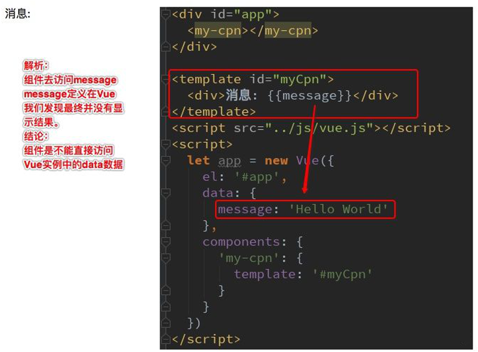
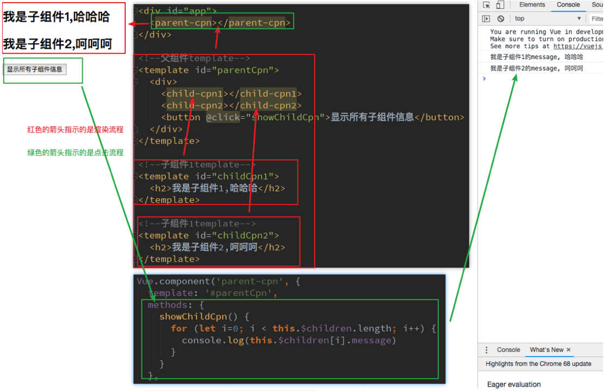
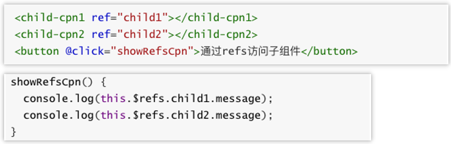
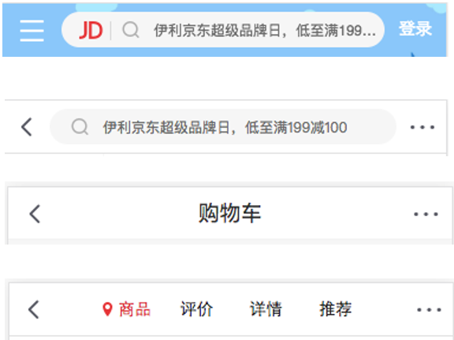

# Vue组件化

## 组件化理解

### 什么是组件化？

人面对复杂问题的处理方式：任何一个人处理信息的逻辑能力都是有限的，所以当面对一个非常复杂的问题时我们不太可能一次性搞定一大堆的内容。但是我们人有一种天生的能力就是将问题进行拆解。如果将一个复杂的问题拆分成很多个可以处理的小问题再将其放在整体当中，你会发现大的问题也会迎刃而解。

组件化也是类似的思想：如果我们将一个页面中所有的处理逻辑全部放在一起，处理起来就会变得非常复杂，而且不利于后续的管理以及扩展。但如果我们将一个页面拆分成一个个小的功能块，每个功能块完成属于自己这部分独立的功能，那么之后整个页面的管理和维护就变得非常容易了。


### Vue组件化思想

组件化是Vue.js中的重要思想：它提供了一种抽象，让我们可以开发出一个个独立可复用的小组件来构造我们的应用，任何的应用都会被抽象成一颗组件树


组件化思想的应用：有了组件化的思想，我们在之后的开发中就要充分的利用它。尽可能的将页面拆分成一个个小的、可复用的组件。这样让我们的代码更加方便组织和管理，并且扩展性也更强。

## 注册组件

### 注册组件的基本步骤

组件的使用分成三个步骤：

- 创建组件构造器

- 注册组件

- 使用组件


三个步骤的含义：

- Vue.extend()
  - 调用 `Vue.extend()` 创建的是一个组件构造器 
  - 通常在创建组件构造器时，传入template代表我们自定义组件的模板
  - 该模板就是在使用到组件的地方要显示的HTML代码
  - 事实上，这种写法在 `Vue2.x` 的文档中几乎已经看不到了，它会直接使用下面如 2.4 形式的语法糖，但是在很多资料还是会提到这种方式，而且这种方式是学习后面方式的基础

- Vue.component()
  - 调用 `Vue.component()` 是将刚才的组件构造器注册为一个组件并且给它起一个组件的标签名称
  - 所以需要传递两个参数：① 注册组件的标签名 ② 组件构造器

- 在Vue实例的作用范围内使用组件
  - 组件必须挂载在某个Vue实例下，否则它不会生效
  - 下面我使用了三次`<my-cpn></my-cpn>` ，而第三次其实并没有生效


### 组件的作用域

全局组件：当我们通过调用 `Vue.component()` 注册组件时，组件的注册是全局的这意味着该组件可以在任意Vue示例下使用

局部组件：如果我们注册的组件是挂载在某个实例中, 那么就是一个局部组件


### 父子组件

在前面我们看到了组件树：

- 组件和组件之间存在层级关系

- 而其中一种非常重要的关系就是父子组件的关系

我们来看通过代码如何组成的这种层级关系


父子组件错误用法：以子标签的形式在Vue实例中使用。因为当子组件注册到父组件的components时，Vue会编译好父组件的模块。该模板的内容已经决定了父组件将要渲染的HTML（相当于父组件中已经有了子组件中的内容了)。`<child-cpn></child-cpn>` 是只能在父组件中被识别的，如果想要在Vue实例中使用`<child-cpn></child-cpn>`，则必须在Vue实例中注册child-cpn组件。

### 注册组件语法糖

在上面注册组件的方式，可能会有些繁琐，Vue为了简化这个过程，提供了注册的语法糖。主要是省去了调用 `Vue.extend()` 的步骤，而是可以直接使用一个对象来代替

<span style="color:skyblue">语法糖注册全局组件和局部组件如下：</span>


## 组件其他补充

### 模板的分离写法

刚才我们通过语法糖简化了Vue组件的注册过程，另外还有一个地方的写法比较麻烦，就是template模块写法。如果我们能将其中的HTML分离出来写，然后挂载到对应的组件上，必然结构会变得非常清晰

Vue提供了两种方案来定义HTML模块内容：

- 使用 `<script>` 标签
- 使用 `<template>` 标签


### 组件可以访问Vue的实例数据吗？

组件是一个单独功能模块的封装。这个模块有属于自己的HTML模板，也应该有属性自己的数据data，组件中的数据是保存在哪里呢？顶层的Vue实例中吗？

- 如下测试发现不能并不能访问，而且即使可以访问，如果将所有的数据都放在Vue实例中Vue实例就会变的非常臃肿
- 结论：<span style="color:red">组件并不能直接访问Vue实例中的data</span>，Vue组件应该有自己保存数据的地方



### 组件数据的存放

组件自己的数据存放在哪里呢?组件对象也有一个data属性(当然也可以有methods等属性，下面我们有用到)，只是这个data属性必须是一个函数，而且这个函数返回一个对象，对象内部保存着数据


为什么data在组件中必须是一个函数呢？首先，如果不是一个函数Vue直接就会报错。其次，原因是在于Vue让每个组件对象都返回一个新的对象。因为如果是同一个对象的，组件在多次使用后会相互影响


## 父子组件通信

### 父子组件通信理解

之前我们提到了子组件是不能引用父组件或者Vue实例的数据的。但是，在开发中往往一些数据确实需要从上层传递到下层：

- 比如在一个页面中我们从服务器请求到了很多的数据

- 其中一部分数据并非是我们整个页面的大组件来展示的，而是需要下面的子组件进行展示

- 这个时候并不会让子组件再次发送一个网络请求，而是直接让 `大组件(父组件)` 将数据传递给 `小组件(子组件)`

如何进行父子组件间的通信呢？Vue官方提到

  - 通过 `props` 向子组件传递数据
  - 通过 `事件` 向父组件发送消息


在下面的代码中，我直接将Vue实例当做父组件并且其中包含子组件来简化代码。真实的开发中，<span style="color:skyblue">Vue实例和子组件的通信和父组件和子组件的通信过程是一样的</span>

### 父组件向子组件传递数据 - <span style="color:red">props</span>

基本用法：在组件中，使用选项props来声明需要从父级接收到的数据

props的值有两种方式：

- 字符串数组，数组中的字符串就是传递时的名称
- 对象，对象可以设置传递时的类型，也可以设置默认值等

我们先来看一个最简单的props传递：


props数据验证：在前面我们的props选项是使用一个数组，除了数组之外我们也可以使用对象，当需要对props进行类型等验证时就需要对象写法了

验证支持如下数据类型：

- String
- Number
- Boolean
- Array
- Object
- Date
- Function
- Symbol


当我们有自定义构造函数时，验证也支持自定义的类型


### 子组件向父组件传递数据或事件 - <span style="color:red">$emit()</span>

自定义事件：props用于父组件向子组件传递数据，还有一种比较常见的是子组件传递数据或事件到父组件中我们应该如何处理呢？这个时候我们需要使用`自定义事件`来完成

什么时候需要自定义事件？=> 当子组件需要向父组件传递数据时，就要用到自定义事件了。我们之前学习的v-on不仅仅可以用于监听DOM事件，也可以用于组件间的自定义事件

自定义事件的流程：

- 在子组件中，通过`$emit()`来触发事件

- 在父组件中，通过`v-on`来监听子组件事件

我们来看一个简单的例子：

- 我们之前做过一个两个按钮 `+1` 和 `-1` ，点击后修改 `counter`
- 我们整个操作的过程还是在子组件中完成，但是之后的展示交给父组件
- 这样我们就需要将子组件中的 `counter`，传给父组件的某个属性比如 `total`


### 父子传参与双向绑定结合的案例

```html
<!DOCTYPE html>
<html lang="en">

<head>
    <meta charset="UTF-8">
    <meta name="viewport" content="width=device-width, initial-scale=1.0">
    <title>Document</title>
    <script src="https://cdn.jsdelivr.net/npm/vue/dist/vue.js"></script>
</head>

<body>
    <div id="app">
        <cpn 
        :snum1="num1" 
        :snum2="num2" 
        @num1-exchange="setNum1" 
        @num2-exchange="setNum2"
        ></cpn>
    </div>

    <template id="temp1">
        <!-- 1.下面的写法是有问题的，我们应该避免在子组件中直接修改props中的值
            <div>
                <span>props: {{snum1}}</span>
                <input type="text" v-model="sNum1">
                <hr>
                <span>props: {{snum2}}</span>
                <input type="text" v-model="sNum2">
            </div> 
         -->
       
        <!-- 2.这种方式双向绑定是可行的，但是我们想在input变化时同时父组件的num值也发生变化，怎么实现呢？
            <div>
                <span>props: {{snum1}}</span>
                <span>data: {{number1}}</span>
                <input type="text" v-model="number1">
                <hr>
                <span>props: {{snum2}}</span>
                <span>data: {{number2}}</span>
                <input type="text" v-model="number2">
            </div> 
        -->

        <!-- 
            3. v-model包含两个操作即:value与@input,
               我们可以通过分解v-model来绑定事件，从而实现双向绑定子传父的功能
        -->
        <div>
            <span>props: {{snum1}}</span>
            <span>data: {{number1}}</span>
            <input type="text" :value="number1" @input="number1Input">
            <hr>
            <span>props: {{snum2}}</span>
            <span>data: {{number2}}</span>
            <input type="text" :value="number2" @input="number2Input">
        </div> 

        <!-- 
            4. 我们也可以通过watch属性来实现，后面会讲watch
        -->
    </template>

    <script>
        const vue = new Vue({
            el: '#app',
            data() {
                return {
                    num1: '',
                    num2: ''
                }
            },
            methods: {
                setNum1(val) {
                    this.num1 = val;
                    console.log(this.num1);
                },
                setNum2(val) {
                    this.num2 = val;
                }
            },
            components: {
                cpn: {
                    template: temp1,
                    props: {
                        snum1: {
                            type: String,
                            default: () => { return '' }
                        },
                        snum2: {
                            type: String,
                            default: () => { return '' }
                        }
                    },
                    data(){
                        return {
                            number1: this.sNum1,
                            number2: this.sNum2
                        }
                    },
                    methods: {
                        number1Input(event){
                            this.number1 = event.target.value;
                            this.$emit('num1-exchange',this.number1);
                        },
                        number2Input(event){
                            this.number2 = event.target.value;
                            this.$emit('num2-exchange',this.number2);
                        }
                    }
                }
            }
        })
    </script>
</body>

</html>
```

### 父子组件的直接访问方式 - <span style="color:red">$children或$refs  /  $parent</span>

理解：有时候我们需要父组件直接访问子组件，子组件直接访问父组件，或者是子组件访问根组件

- 父组件访问子组件：使用`$children`或`$refs`

- 子组件访问父组件：使用`$parent`

$children：

- this.$children是一个数组类型，它包含所有子组件对象

- 我们这里通过一个遍历，取出所有子组件的message状态



$refs：

- $children的缺陷：通过 `$children` 访问子组件时，是一个数组类型，访问其中的子组件必须通过索引值。但是当子组件过多，我们需要拿到其中一个时往往不能确定它的索引值，甚至还可能会发生变化

- 有时候我们想明确获取其中一个特定的组件，这个时候就可以使用`$refs`

$refs的使用：

- `$refs` 和 `ref指令` 通常是一起使用的

- 首先我们通过 ref 给某一个子组件绑定一个特定的ID

- 其次通过 `this.$refs.ID` 就可以访问到该组件了



$parent：

- 如果我们想在子组件中直接访问父组件，可以通过`$parent`

注意：尽管在Vue开发中，我们允许通过$parent来访问父组件，但是在真实开发中尽量不要这样做。子组件应该尽量避免直接访问父组件的数据，因为这样耦合度太高了。如果我们将子组件放在另外一个组件之内，很可能该父组件没有对应的属性，往往会引起问题。另外更不好做的是通过$parent直接修改父组件的状态，那么父组件中的状态将变得飘忽不定，很不利于我的调试和维护


## 非父子组件通信

### 理解

刚才我们讨论的都是父子组件间的通信，那如果是非父子关系呢?非父子组件关系包括多个层级的组件，也包括兄弟组件的关系。在 `Vue1.x`的时候，可以通过 `$dispatch` 和 `$broadcast`完成，但是在 `Vue2.x`都被取消了

- `$dispatch`用于向上级派发事件

- `$broadcast`用于向下级广播事件

在 `Vue2.x` 中，有一种方案是通过中央事件总线，也就是一个中介来完成

- 但是这种方案和直接使用 `Vuex` 的状态管理方案还是逊色很多
- 并且 `Vuex` 提供了更多好用的功能，所以这里我们暂且不讨论这种方案，后续我们专门学习 `Vuex` 的状态管理

### 中央事件总线

### Vuex状态管理（后面专门讲）

## 插槽slot

编译作用域：在真正学习插槽之前我们需要先理解一个概念：`编译作用域`。官方对于编译的作用域解析比较简单，我们自己来通过一个例子来理解这个概念。我们来考虑下面的代码是否最终是可以渲染出来的：

- `<my-cpn v-show="isShow"></my-cpn>`中，我们使用了 `isShow`属性

- isShow属性包含在组件中，也包含在Vue实例中

答案：最终可以渲染出来，也就是使用的是Vue实例的属性。为什么呢？

- 官方给出了一条准则：<span style="color:skyblue">父组件模板的所有东西都会在父级作用域内编译；子组件模板的所有东西都会在子级作用域内编译</span>
- 而我们在使用 `<my-cpn v-show="isShow"></my-cpn>` 的时候，整个组件的使用过程是相当于在父组件中出现的
- 那么他的作用域就是父组件，使用的属性也是属于父组件的属性
- 因此 isShow使用的是Vue实例中的属性，而不是子组件的属性


### 为什么使用slot

slot翻译为插槽：在生活中很多地方都有插槽，电脑的USB插槽，插板当中的电源插槽。插槽的目的是让我们原来的设备具备更多的扩展性。比如电脑的USB我们可以插入U盘、硬盘、手机、音响、键盘、鼠标等

组件的插槽：组件的插槽也是为了让我们封装的组件更加具有扩展性。让使用者可以决定组件内部的一些内容到底展示什么

例子：移动网站中的导航栏

- 移动开发中，几乎每个页面都有导航栏
- 导航栏我们必然会封装成一个插件，比如nav-bar组件
- 一旦有了这个组件，我们就可以在多个页面中复用了

- 但是，每个页面的导航是一样的吗？No，我以京东M站为例



### 如何在封装组件时正确使用slot

如何去封装京东M站导航栏这类的组件呢？它们也很多区别，但是也有很多共性，如果我们每一个单独去封装一个组件显然不合适：比如每个页面都返回，这部分内容我们就要重复去封装。但是如果我们封装成一个好像也不合理：有些左侧是菜单，有些是返回，有些中间是搜索，有些是文字等

如何封装合适呢？抽取共性，保留不同：

- 最好的封装方式就是将共性抽取到组件中，将不同暴露为插槽
- 一旦我们预留了插槽，就可以让使用者根据自己的需求，决定插槽中插入什么内容
- 是搜索框，还是文字，还是菜单。由调用者自己来决定

- 这就是为什么我们要学习组件中的插槽slot的原因

### slot基本使用

了解了为什么用slot，我们再来谈谈如何使用slot？

- 在子组件中，使用特殊的元素 `<slot>` 就可以为子组件开启一个插槽。

- 该插槽插入什么内容取决于父组件如何使用。

我们通过一个简单的例子，来给子组件定义一个插槽

- `<slot>` 中的内容表示，如果没有在该组件中插入任何其他内容，就默认显示该内容
- 有了这个插槽后，父组件如何使用呢？


### 具名插槽slot

当子组件的功能复杂时，子组件的插槽可能并非是一个。比如我们封装一个导航栏的子组件，可能就需要三个插槽，分别代表左边、中间、右边。

那么，外面在给插槽插入内容时，如何区分插入的是哪一个呢？这个时候，我们就需要给插槽起一个名字


如何使用具名插槽呢？非常简单，只要给slot元素一个name属性即可

`<slot name='myslot'></slot>`

我们来给出一个案例：这里我们先不对导航组件做非常复杂的封装，先了解具名插槽的用法。


### 作用域插槽

作用域插槽是slot一个比较难理解的点，而且官方文档说的又有点不清晰。这里，我们用一句话对其做一个总结，然后我们在后续的案例中来体会：<span style="color:skyblue">父组件替换插槽的标签，但是内容由子组件来提供。</span>

我们先提一个需求：子组件中包括一组数据，比如：pLanguages: ['JavaScript', 'Python', 'Swift', 'Go', 'C++']。需要在多个界面进行展示：

- 某些界面是以水平方向一一展示的，
- 某些界面是以列表形式展示的，
- 某些界面直接展示一个数组

内容在子组件，希望父组件告诉我们如何展示，怎么办呢

- 利用slot作用域插槽就可以了

我们来看看子组件的定义：


在父组件使用我们的子组件时，从子组件中拿到数据。我们通过 `<template slot-scope="slotProps">` 获取到 `slotProps` 属性

> 注：
> ① 在 `vue2.5.x` 以下必须使用template标签，之后的版本也可以使用其他任意标签了
> ① 这里的 `:data`并不是定义死的，也可以使用其他任意名字 `:xx`

再通过 `slotProps.data` 就可以获取到刚才我们传入的data了


