# Webpack

## 什么是Webpack

### 引入

什么是webpack？这个webpack还真不是一两句话可以说清楚的。我们先看看官方的解释：<span style="color:skyblue;">At its core, webpack is a static module bundler for modern JavaScript applications. </span>

从本质上来讲webpack是一个现代的JavaScript应用的静态<span style="color:skyblue;">模块打包</span>工具。但是它是什么呢？用概念解释概念还是不清晰。

我们从两个点来解释上面这句话：<span style="color:red;">模块</span> 和 <span style="color:red;">打包</span>。

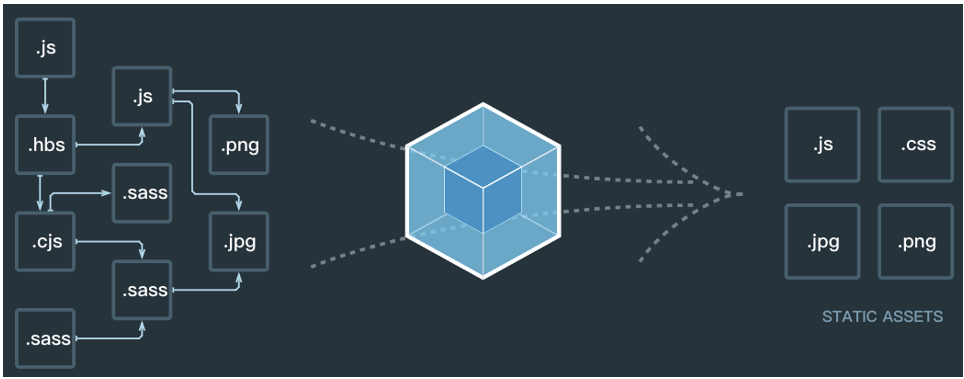

### 模块化

在前面我已经用了大量的篇幅解释了为什么前端需要模块化。而且我也提到了目前使用前端模块化的一些方案：`AMD`、`CMD`、`CommonJS`、`ES6`。

在ES6之前我们要想进行模块化开发，就必须借助于其他的工具让我们可以进行模块化开发。并且在通过模块化开发完成了项目后还需要处理模块间的各种依赖并且将其进行整合打包。而webpack其中一个核心就是让我们可以使用各种规范进行模块化开发，并且会帮助我们处理模块间的依赖关系。

而且不仅仅是`JavaScript`文件，我们的CSS、图片、json文件等等在webpack中都可以被当做模块来使用（在后续我们会看到）。这就是webpack中模块化的概念。

### 打包

理解了webpack可以帮助我们进行模块化并且处理模块间的各种复杂关系后，打包的概念就非常好理解了。打包就是将webpack中的各种资源模块进行打包合并成一个或多个包(Bundle)。并且在打包的过程中还可以对资源进行处理，比如压缩图片，将scss转成css，将ES6语法转成ES5语法，将`TypeScript`转成`JavaScript`等等操作。但是打包的操作似乎 `grunt/gulp` 也可以帮助我们完成，它们有什么不同呢？

### Webpack和grunt/gulp对比

grunt/gulp的核心是Task：

- 我们可以配置一系列的task，并且定义task要处理的事务（例如ES6、ts转化，图片压缩，scss转成css）

- 之后让 `grunt/gulp`来依次执行这些task，而且让整个流程自动化。

- 所以 `grunt/gulp` 也被称为前端自动化任务管理工具。

我们来看一个gulp的task，下面的task就是将src下面的所有js文件转成ES5的语法。并且最终输出到dist文件夹中。

```javascript
const gulp = require('gulp');
const babel = require('gulp-babel');

gulp.task('js', () =>
    gulp.src('src/*.js')
        .pipe(babel)({
            presets: ['es 2015']
        })
        .pipe(gulp.dest('dist'))
);
```

什么时候用grunt/gulp呢？如果你的工程模块依赖非常简单，甚至是没有用到模块化的概念。只需要进行简单的合并、压缩，就使用 `grunt/gulp` 即可。但是如果整个项目使用了模块化管理而且相互依赖非常强，我们就可以使用更加强大的webpack了。

所以grunt/gulp和webpack有什么不同呢？`grunt/gulp` 更加强调的是前端流程的自动化，模块化不是它的核心。webpack更加强调模块化开发管理，而文件压缩合并、预处理等功能，是他附带的功能。

## Webpack安装

安装webpack首先需要安装Node.js，Node.js自带了软件包管理工具npm

查看自己的node版本：

```javascript
node -v
```

全局安装webpack(这里我先指定版本号3.6.0，因为vue cli2依赖该版本)

>vue cli2 中才能看到webpack的所有配置，vue cli3把webpack配置隐藏起来了不好查看

```javascript
npm install webpack@3.6.0 -g
```

局部安装webpack（后续才需要）

> --save-dev ：指定该依赖为开发时依赖，项目打包后不需要继续使用的。webpack只是一个模块打包工具，项目打包后就不再需要它了

```
cd 对应目录
npm install webpack@3.6.0 --save-dev
```

为什么全局安装后，还需要局部安装呢？

- 在终端直接执行 `webpack命令`，使用的`全局安装的webpack `
- 当在 `package.json` 中定义了scripts时，其中包含了`webpack命令`，那么使用的是`局部webpack`

## 使用Webpack

### 准备环境

我们创建如下文件和文件夹

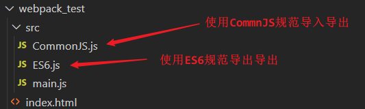

文件和文件夹解析：

- `dist`文件夹：用于存放之后打包的文件

- `src`文件夹：用于存放我们写的源文件

  - `main.js`：项目的入口文件

- `index.html`：浏览器打开展示的首页html

- `package.json`：通过`npm init`生成，npm包管理的文件（暂时没有用上，后面才会用上）

> 注：
>
> ① 任何项目想单独依赖于一些node的环境，一般都会有一个`package.json`文件
>
> ② 如果package.json中配置了一些依赖，我们就可以通过`npm install`去安装这些依赖

写一些测试数

- CommonJS.js

```javascript
function add(num1, num2) {
    return num1 + num2;
}

function mul(num1, num2) {
    return num1 * num2;
}

module.exports = {
    add,
    mul
}
```

- ES6.js

```javascript
//ES6的模块化规范
export let name = 'rose';
export let age = 18;
export let gender = '男';
```

- main.js

```javascript
//CommonJS的模块化规范
const math = require('./CommonJS');
//ES6的模块化规范
import * as person from './ES6';

console.log('Hello Webpack');
console.log(math.add(10,20));
console.log(math.mul(10,20));

console.log(person.name);
console.log(person.age);
console.log(person.gender);
```

js文件的打包：

- 现在的js文件中使用了模块化的方式进行开发，他们可以直接使用吗？=> 不可以。

  - 因为如果直接在`index.html`引入这两个js文件，浏览器并不识别其中的模块化代码。

  - 另外，在真实项目中当有许多这样的js文件时，我们一个个引用非常麻烦，并且后期非常不方便对它们进行管理。

- 我们应该怎么做呢？=>  使用webpack工具对多个js文件进行打包。

  - 我们知道，webpack就是一个模块化的打包工具，所以它支持我们代码中写模块化，可以对模块化的代码进行处理。（如何处理的待会儿在原理中，我会讲解）
  - 另外，如果在处理完所有模块之间的关系后，将多个js打包到一个js文件中，引入时就变得非常方便了。OK，如何打包呢？使用webpack的指令即可

```
webpack ./src/main.js ./dist/bundle.js
```

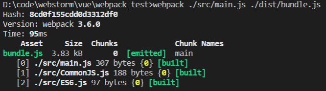

使用打包后的文件：打包后会在dist文件下生成一个`bundle.js`文件

- 文件内容有些复杂，这里暂时先不看，后续再进行分析。
- `bundle.js`文件是webpack处理了项目直接文件依赖后生成的一个js文件，我们只需要将这个js文件在`index.html`中引入即可。

```html
<script src="./dist/bundle.js"></script>
```

### Webpack配置

入口和出口：我们考虑一下，如果每次使用webpack的命令都需要写上入口和出口作为参数就非常麻烦 - `webpack ./src/main.js ./dist/bundle.js`，有没有一种方法可以将这两个参数写到配置中，在运行时直接读取呢？

webpack.config.js：当然可以，我们可以在项目根路径下创建一个`webpack.config.js`文件，该名字是固定的（我们可以修改这个默认名字）。然后写如下配置即可

```javascript
//node的语法：导入path包，该path不用我们自己写而是去node的包里找的（在这之前注意使用npm init命令初始化生成package.json文件）
const path = require('path');

module.exports = {
    //入口：可以是字符串/数组/对象，这里我们入口只有一个所以写一个字符串即可
    entry: 'src/main.js',
    //出口：通常是一个对象，里面至少包含两个重要属性，path 和 filename
    output: {
    	//注意：path要写绝对路径（为了防止结构改变，且要动态的获取绝对路径）
        //path.resolve()函数：对两个参数进行拼接
        //__dirname：node上下文中的全局变量，保存的就是当前文件所在的绝对路径
    	path: path.resolve(__dirname, 'dist'),
        //打包之后生成文件的名字
        filename: 'bundle.js' 
	}
}
```

然后直接在当前项目命令行输入`webpack`即可进行打包

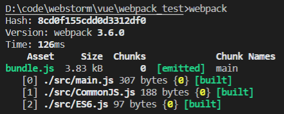

局部安装webpack：目前，我们使用的webpack是全局的webpack，如果我们想使用局部来打包呢？因为一个项目往往依赖特定的webpack版本，全局的版本可能和这个项目的webpack版本不一致导致打包出现问题。所以通常一个项目，都有自己局部的webpack。

- 第一步，项目中需要安装自己局部的webpack。这里我们让局部安装 `webpack3.6.0`，`Vue CLI3`中已经升级到 `webpack4`，但是它将配置文件隐藏了起来，所以查看起来不是很方便。

```
npm install webpack@3.6.0 --save-dev
```

- 第二步，通过`node_modules\.bin\webpack`启动webpack打包

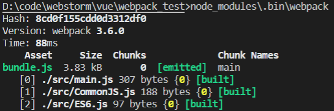

### package.json中定义启动    <span style="color:skyblue">配置webpack与npm之间的映射</span>

但是，每次执行都敲这么一长串命令有没有觉得不方便呢？OK，我们可以在`package.json`的 `scripts` 中定义自己的执行脚本。`package.json`中的`scripts`的脚本在执行时，会<span style="color:skyblue">按照一定的顺序</span>寻找命令对应的位置

- 首先，会寻找本地的node_modules/.bin路径中对应的位置
- 如果没有找到，会去全局的环境变量中寻找
- 如何执行我们的build指令呢？ => `npm run build`

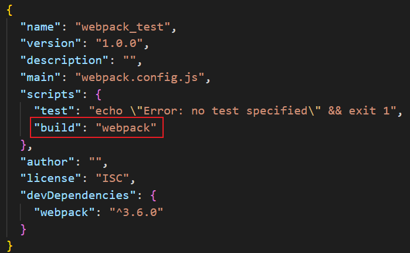

### CSS文件处理

什么是loader：loader是webpack中一个非常核心的概念

webpack用来做什么呢？

- 在我们之前的实例中，我们主要是用webpack来处理我们写的js代码，并且webpack会自动处理js之间相关的依赖。
- 但是在开发中我们不仅仅有基本的js代码处理，我们也需要加载css、图片，也包括一些高级的将ES6转成ES5代码，将TypeScript转成JavaScript代码，将scss、less转成css，将.jsx、.vue文件转成js文件等。
- 对于webpack本身的能力来说这些转化是不支持的那怎么办呢？给webpack扩展对应的loader就可以啦。

loader使用过程：

- 步骤一：通过npm安装需要使用的loader

- 步骤二：在`webpack.config.js`中的modules关键字下进行配置

大部分loader我们都可以在webpack的官网中找到，并且学习对应的用法。

准备环境：项目开发过程中我们必然需要添加很多的样式，而样式我们往往写到一个单独的文件中。

- 在src目录中创建一个css文件，其中创建一个`normal.css`文件。
- 我们也可以重新组织文件的目录结构，将零散的js文件放在一个js文件夹中。

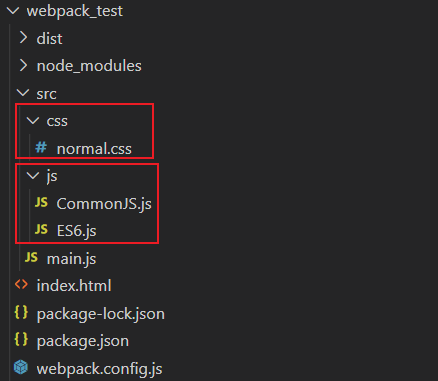

`normal.css`中的代码非常简单，就是将body设置为skyblue。但是这个时候`normal.css`中的样式会生效吗？=> 当然不会，因为我们压根就没有引用它，webpack也不可能找到它，因为我们只有一个入口，webpack会从入口开始查找其他依赖的文件。

在入口文件中引用：

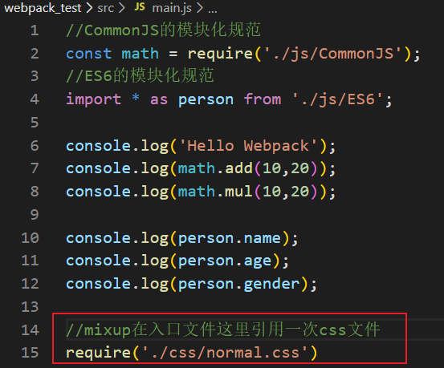

打包报错信息：重新打包，会出现如下错误：这个错误告诉我们加载`normal.css`文件必须有对应的loader。

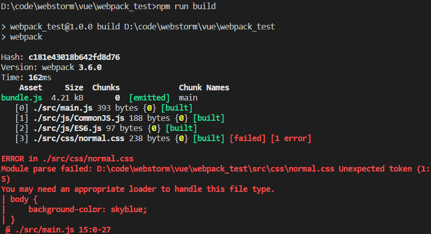

<span style="color:red">css-loader</span>：在webpack的[官方网站](https://www.webpackjs.com/)中，我们可以找到如下关于样式的loader使用方法

> 注：
>
> 直接下载css-loader是最新版的，可能会与当前vue版本不匹配。我们可以指定下载的版本：如 `npm install --save-dev css-loader@3.3.0`

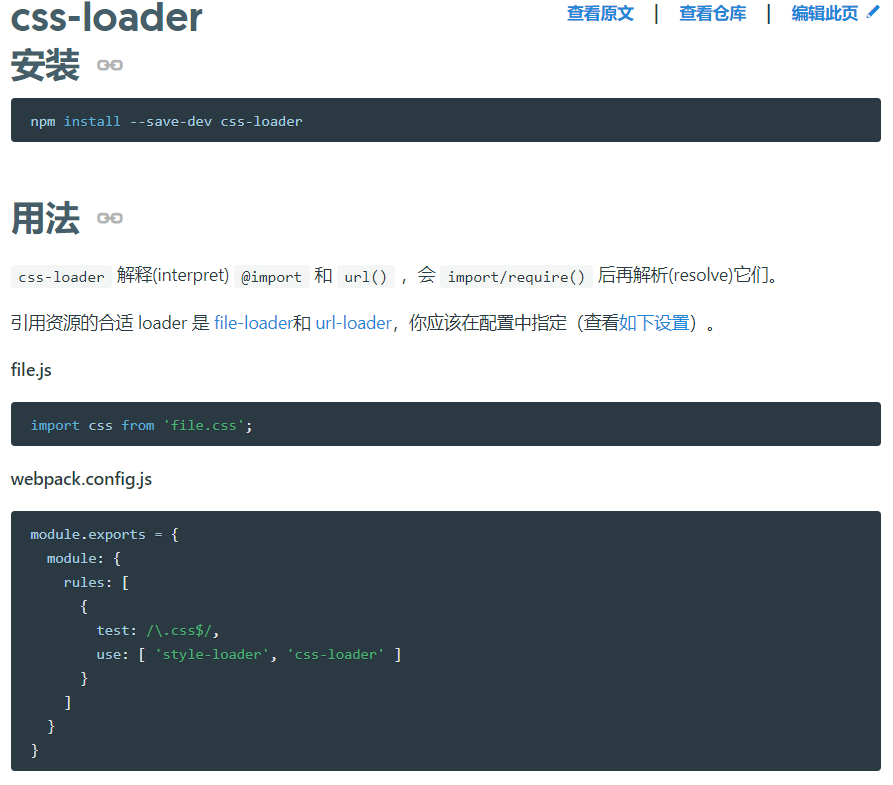

按照官方配置`webpack.config.js`文件

> 注意：配置中有一个`style-loader`，我们并不知道它是什么，所以可以暂时不进行配置。

重新打包项目并运行index.html会发现已经不再报错，但是样式并没有生效。原因是`css-loader`只负责加载css文件，但是并不负责将css具体样式嵌入到文档中。这个时候我们还需要一个`style-loader`帮助我们处理。

<span style="color:red">style-loader</span>：我们来安装`style-loader`，并在`webpack.config.js`进行配置

> 注意：`style-loader`需要放在`css-loader`的前面。

```javascript
module: {
    rules: [
        {
            // 匹配.css结尾的
            test: /\.css$/,
            //css-loader只负责将css文件进行加载
            //style-loader负责将样式添加到DOM中
            use: [ 'style-loader', 'css-loader' ]
        }
    ]
}
```

疑惑：不对吧？按照我们的逻辑，在处理css文件过程中应该是`css-loader`先加载css文件，再由`style-loader`来进行进一步的处理，为什么会将`style-loader`放在前面呢？

答案：这是因为webpack在读取使用的loader的过程中，是按照从右向左的顺序读取的。

### Less文件处理

如果我们希望在项目中使用less、scss、stylus来写样式，webpack是否可以帮助我们处理呢？

这里以Less为例，其他也是一样的。先创建一个less文件，依然放在css文件夹中。并在main.js中进行引入

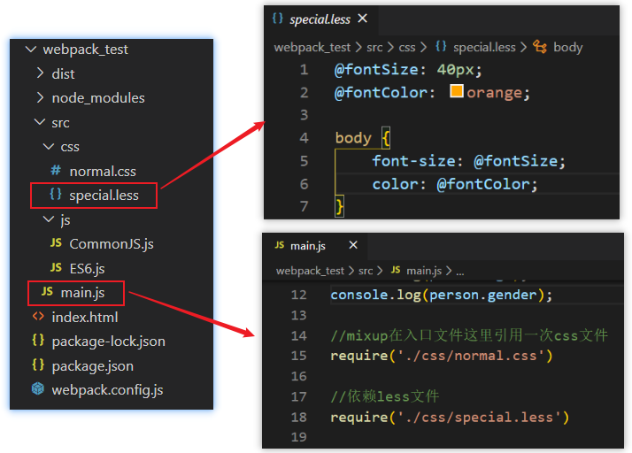

继续在官方中查找，我们会找到`less-loader`相关的使用说明。

- 首先还是需要安装对应的loader

> 注意：我们这里还安装了less，因为webpack会使用less对less文件进行编译

```
//注意，可能会出现less-loader版本过高的情况，请适当降低版本
npm install --save-dev less-loader@5.0.0 less
```

- 其次修改对应的配置文件。添加一个rules选项，用于处理`.less`文件

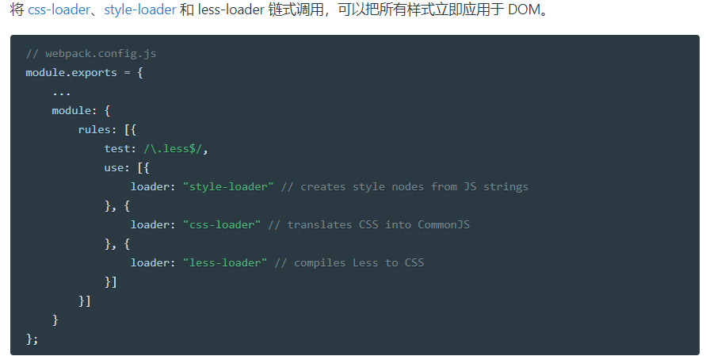

### 图片文件处理

<span style="color:red">url-loader</span>: 首先，我们在项目中加入两张图片：一张较小的图片test01.png(小于8kb)，一张较大的图片test02.png(大于8kb) 。待会儿我们会针对这两张图片进行不同的处理。我们先考虑在css样式中引用图片的情况，所以我更改了`normal.css`中的样式：

```css
body {
    background-color: skyblue;
    background: url(../imgs/test01.png);
}
```

如果我们现在直接打包，会出现如下问题

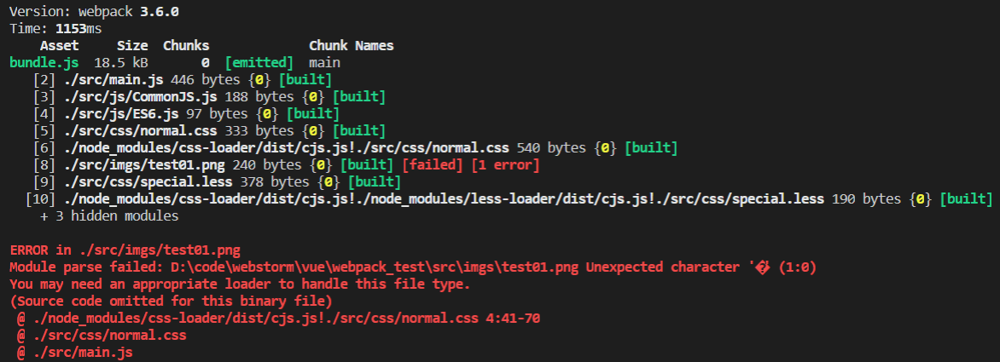

图片处理，我们使用`url-loader`来处理，依然先安装`url-loader`

```
npm install --save-dev url-loader
```

修改`webpack.config.js`配置文件：

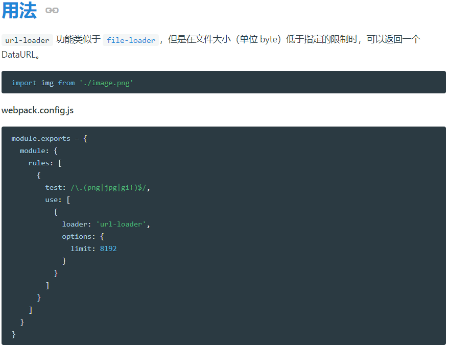

再次打包，运行index.html，就会发现我们的背景图片显示了出来。而仔细观察会发现背景图是通过base64显示出来的。其实这也是limit属性的作用，当图片小于8kb时会对图片进行base64编码

<span style="color:red">file-loader</span>：那么问题来了，如果大于8kb呢？我们将background的图片改成test02.png。这次因为大于8kb的图片会通过`file-loader`进行处理（如果），但是我们的项目中并没有`file-loader`

所以，我们需要安装`file-loader`（如果已经在`webpack.config.js`中配置了`url-loader`，这里就不需要再配置`file-loader了`）

```
//注意：版本过高会报错
npm install --save-dev file-loader@5.5.0
```

再次打包，就会发现dist文件夹下多了一个图片文件

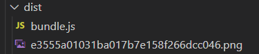

<span style="color:red">修改文件名称</span>：我们发现webpack自动帮助我们生成一个非常长的名字。这是一个32位hash值，目的是防止名字重复。但是真实开发中我们可能对打包的图片名字有一定的要求。比如将所有的图片放在一个文件夹中，跟上图片原来的名称，同时也要防止重复。所以我们可以在options中添加上如下选项：

- img：文件要打包到的文件夹
- name：获取图片原来的名字，放在该位置
- hash:8：为了防止图片名称冲突，依然使用hash，但是我们只保留8位
- ext：使用图片原来的扩展名

```javascript
{
    test: /\.(png|jpg|gif)$/,
        use: [
            {
                loader: 'url-loader',
                options: {
                    limit: 8192,
                    //[]里写变量，ext代表扩展名
                    name: 'image/[name]_[hash:8].[ext]'
                }
            }
        ]
},
```

但是我们发现图片并没有显示出来，这是因为图片使用的路径不正确。默认情况下webpack会将生成的路径直接返回给使用者。但是我们整个程序是打包在dist文件夹下的，所以这里我们需要在路径下再添加一个dist/

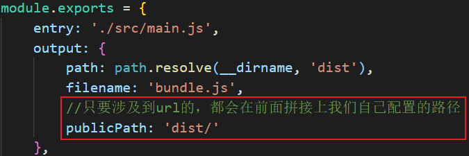

### ES6语法处理

如果你仔细阅读webpack打包的js文件会发现写的ES6语法并没有转成ES5，那么就意味着可能一些对ES6还不支持的浏览器没有办法很好的运行我们的代码。

在前面我们说过如果希望将ES6的语法转成ES5就需要使用`babel`这个工具。而在webpack中我们直接使用`babel`对应的loader就可以了。

安装 babel-loader

```
//1. 我们安装了 7版本的babel-loader, babel-core，babel-preset-es2015
//2.官网是babel-preset-env而不是babel-preset-es2015，如果是babel-preset-env的话我们还需要对它进
//  行配置。这里我们只使用了ES6的语法就先简单用一下babel-preset-es2015即可，后面再了解babel-preset-
//  env的配置
npm install babel-loader@7.0.0 babel-core babel-preset-es2015
```

配置`webpack.config.js`文件

```javascript
{
      test: /\.js$/,
      //排除node_modules这个文件
      exclude: /(node_modules|bower_components)/,
      use: {
        loader: 'babel-loader',
        options: {
          presets: ['es2015']
        }
      }
}
```

重新打包并查看bundle.js文件，发现其中的内容变成了ES5的语法

## Webpack配置Vue

### 引入vue.js

后续项目中我们会使用Vuejs进行开发，而且会以特殊的文件来组织vue的组件。所以下面我们来学习一下如何在我们的webpack环境中集成Vuejs

现在我们希望在项目中使用Vuejs那么必然需要对其有依赖，所以需要先进行安装

> 注：因为我们后续是在实际项目中也会使用vue的，所以并不是开发时依赖

```
npm install vue@2.6.0 --save
```

那么，接下来就可以按照我们之前学习的方式来使用Vue了

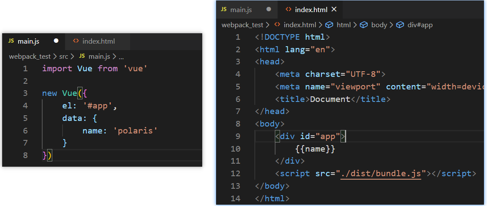

修改完成后重新打包运行程序。打包过程没有任何错误(因为只是多打包了一个vue的js文件而已)。但是运行程序没有出现想要的效果，而且浏览器中有报错。

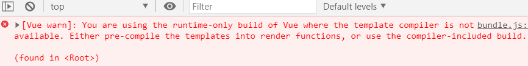

这个错误说的是我们使用的是`runtime-only`版本的Vue，这个版本的Vue不允许我们的代码中有任何的template（它不能对template进行编译），而我们通过el挂载的#app元素就是一个template。此外，`runtime-compiler`版本的Vue实例中可以允许有template，因为有compiler可以用于编译template。

这里我只说解决方案，后续我具体讲解`runtime-only`和`runtime-compiler`的区别。

我们修改webpack的配置，添加如下内容即可

```javascript
resolve: {
    //alias: 别名
	alias: {
        //当我们通过 import Vue from vue 导入vue时，会去找我们配置的指定vue版本
        //默认找的是vue.runtime.js
		'vue$': 'vue/dist/vue.esm.js'
	}
}
```

### el和template的区别

正常运行之后，我们来考虑另外一个问题：如果我们希望将data中的数据显示在界面中就必须是修改`index.html`。如果我们后面自定义了组件也必须修改`index.html`来使用组件。但是html模板在之后的开发中，我并不希望手动的来频繁修改，是否可以做到呢？

定义template属性：在前面的Vue实例中我们定义了el属性，用于和`index.html`中的`#app`进行绑定，让Vue实例之后可以管理它其中的内容。这里我们可以将div元素中的`{{message}}`内容删掉只保留一个基本的id为`app`的div元素。但是如果我依然希望在其中显示`{{message}}`的内容，应该怎么处理呢？我们可以在Vue实例中再定义一个template属性，代码如下：

```javascript
import Vue from 'vue';

new Vue({
    el: '#app',
    template: `
		<div id="app">
    		<h2>{{name}}</h2>
		</div>`,
    data: {
        name: 'polaris'
    }
})
```

重新打包运行程序显示的还是一样的结果和HTML代码结构！那么el和template模板的关系是什么呢？

我们知道el用于指定Vue要管理的DOM，可以帮助解析其中的指令、事件监听等。而如果Vue实例中同时指定了template，那么template模板的内容会替换掉挂载的对应el的模板。

这样做有什么好处呢？这样做之后我们就不需要在以后的开发中再次操作`index.html`，只需要在template中写入对应的标签即可。但是书写template模块非常麻烦怎么办呢？没有关系，稍后我们会将template模板中的内容进行抽离。分成三部分书写：`template`、`script`、`style`，结构变得非常清晰。

### Vue组件化开发引入

在学习组件化开发的时候，我说过以后的Vue开发过程中我们都会采用组件化开发的思想。

那么在当前项目中如果我也想采用组件化的形式进行开发应该怎么做呢？

看下面的代码！

```javascript
import Vue from 'vue';

const App = {
    template: '<h2>{{name}}</h2>',
    data(){
        return {
            name: 'polaris'
        }
    }
}

new Vue({
    el: '#app',
    template: 
        `<div id="app">
            <App/>
        </div>`,
    components: {
        App
    }
})
```

当然我们也可以将上面的代码抽取到一个js文件中并且导出。

```javascript
export default {
    template: '<h2>{{name}}</h2>',
    data(){
        return {
            name: 'polaris'
        }
    }
}
```

```javascript
import Vue from 'vue';
import App from './vue/app.js';

new Vue({
    el: '#app',
    template: 
        `<div id="app">
            <App/>
        </div>`,
    components: {
        App
    }
})
```

### vue文件封装处理

但是一个组件以一个js对象的形式进行组织和使用的时候是非常不方便的。一方面编写template模块非常的麻烦，另外一方面如果有样式的话我们写在哪里比较合适呢？

现在我们以一种全新的方式来组织一个vue的组件，但是这个时候这个文件可以被正确的加载吗？

```vue
<template>
    <div>
        <h2>{{name}}</h2>
    </div>
</template>

<script>
    export default {
        data(){
            return {
                name: 'polaris'
            }
        }
    }
</script>

<style scoped>
 h2 {
     color: blueviolet;
 }
</style>
```

```javascript
import Vue from 'vue';
// import App from './vue/app.js';
import App from './vue/App.vue';

new Vue({
    el: '#app',
    template: 
        `<div id="app">
            <App/>
        </div>`,
    components: {
        App
    }
})
```

必然不可以，这种特殊的文件以及特殊的格式必须有人帮助我们处理。谁来处理呢？`vue-loader`以及`vue-template-compiler`。

安装`vue-loader`和`vue-template-compiler`

```
//vue-loader的版本在14+之后还需要配置一个插件
//vue-template-compiler的版本与vue版本对应即可

npm install vue-loader@13.0.0 vue-template-compiler@2.6.0 --save-dev
```

修改`webpack.config.js`的配置文件：

```javascript
//注意：如果写了css，less等，记得还要加上对应的loader
{
	test: /\.vue$/,
	use: ['vue-loader']
}
```

### 实现导入.vue文件时不加后缀

我们只需要在webpack配置文件中加如下配置即可

```javascript
//webpack中resolve主要是解决一些路径相关的问题
resolve: {
	extensions:['.js','.css','.vue']
}
```

## plugin的使用

### 认识plugin

plugin是什么？plugin是插件的意思，通常是用于对某个现有的架构进行扩展。webpack中的插件就是对webpack现有功能的各种扩展，比如打包优化，文件压缩等。

loader和plugin区别：

- loader主要用于转换某些类型的模块，它是一个转换器。

- plugin是插件，它是对webpack本身的扩展，是一个扩展器。

plugin的使用过程：

- 步骤一：通过npm安装需要使用的plugins(某些webpack已经内置的插件不需要安装)。

- 步骤二：在`webpack.config.js`中的plugins中配置插件。

下面我们就来看看可以通过哪些插件对现有的webpack打包过程进行扩容，让我们的webpack变得更加好用。

### 添加版权的Plugin

我们先来使用一个最简单的插件，为打包的文件添加版权声明。该插件名字叫`BannerPlugin`，属于webpack自带的插件。

按照下面的方式来修改`webpack.config.js`的文件：

```javascript
const webpack = require('webpack');

module.exprots = {
    ...
    plugins: [
        new webpack.BannerPlugin('最终版权归polaris所有')
    ]
}
```

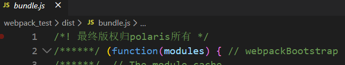

### <span style="color:red">打包html的Plugin</span>

目前我们的index.html文件是存放在项目的根目录下的。我们知道在真实发布项目时，发布的是dist文件夹中的内容，但是dist文件夹中如果没有index.html文件，那么打包的js等文件也就没有意义了。所以我们需要index.html文件打包到dist文件夹中，这个时候就可以使用`HtmlWebpackPlugin`插件。

HtmlWebpackPlugin插件的功能

- 自动生成一个index.html文件(可以指定模板来生成)

- 将打包的js文件，自动通过script标签插入到body中

安装HtmlWebpackPlugin插件：

```
//报错就换一下版本
npm install html-webpack-plugin@3.2.0 --save-dev
```

使用插件：修改`webpack.config.js`文件中plugins部分的内容如下：

```javascript
const htmlWebpackPlugin = require('html-webpack-plugin');

plugins: [
	new htmlWebpackPlugin({
        //template表示根据什么模板来生成index.html
        //如下配置会在当前webpack配置文件所在目录下找index.html作为模板
		template: 'index.html'
	}),
]
```

注意：我们需要删除之前在webpack配置文件的output中添加的`publicPath`属性，否则插入的script标签中的src可能会有问题

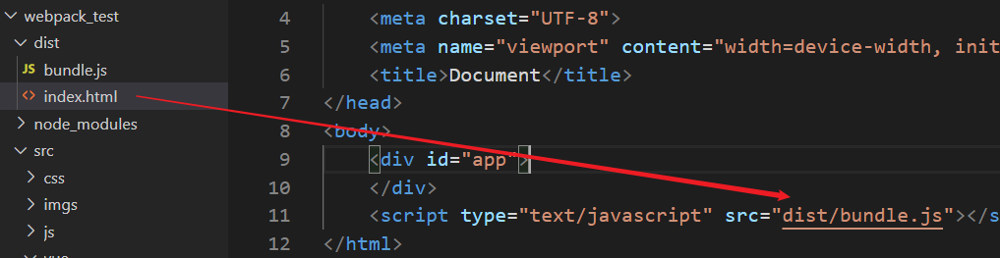

### js压缩的Plugin

在项目发布之前我们必然需要对js等文件进行压缩处理，这里我们就对打包的js文件进行压缩

> webpack自带的也有一个类似功能的插件

我们使用一个第三方的插件`uglifyjs-webpack-plugin`，并且版本号指定1.1.1，和CLI2保持一致

```
npm install uglifyjs-webpack-plugin@1.1.1 --save-dev
```

修改webpack.config.js文件，使用插件：

```javascript
const uglifyJsPlugin = require('uglifyjs-webpack-plugin');

module.exprots = {
    ...
    plugins: [
        new uglifyJsPlugin()
    ]
}
```


查看打包后的`bunlde.js`文件，是已经被压缩过了。

## 本地服务器

### 搭建本地服务器

webpack提供了一个可选的本地开发服务器，这个本地服务器基于`node.js`搭建，内部使用`express`框架，可以实现我们想要的让浏览器自动刷新显示我们修改后的结果。

> `express`的原理是服务于某一个文件夹，根据配置文件决定可能会生成的东西并暂时放入内存中，我们做测试时浏览器所展示的东西是基于内存的。最后当我们执行了`npm run build`，才会将之输入到磁盘中。

不过它是一个单独的模块，在webpack中使用之前需要先安装它

```
//vue cli2 => webpack@3.6.0 => webpack-dev-server@2.9.1

npm install webpack-dev-server@2.9.1 --save-dev
```

`devserver`也是作为webpack中的一个选项，选项本身可以设置如下属性：

- `contentBase`：为哪一个文件夹提供本地服务，默认是根文件夹，我们这里要填写`./dist`
- `port`：端口号，默认8080
- `inline`：页面实时刷新
- `historyApiFallback`：在SPA页面中，依赖HTML5的history模式

`webpack.config.js`文件配置修改如下：

```javascript
devServer: {
	contentBase: './dist',
	inline: true
}
```

我们可以再配置另外一个scripts：` --open`参数表示直接打开浏览器

```javascript
"dev":"webpack-dev-server --open"
```

### webpack配置文件的分离

先将之前的webpack.config.js配置文件进行分离

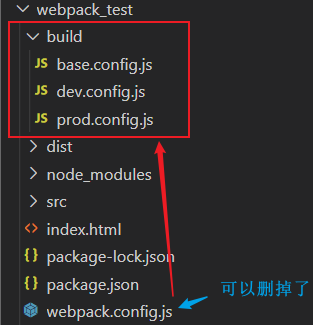

`base.config.js`

```javascript
/* base.config.js 只放公共的配置，即开发和部署后都需要的配置 */

const path = require('path');
const webpack = require('webpack');
const htmlWebpackPlugin = require('html-webpack-plugin');

module.exports = {
    entry: './src/main.js',
    output: {
        //注意：这里不要直接拼接'dist'了,因为当前文件base.config.js在build文件夹下
        path: path.resolve(__dirname, '../dist'),
        filename: 'bundle.js',
    },
    module: {
        rules: [
            {
                test: /\.css$/,
                use: [ 'style-loader', 'css-loader' ]
            },
            {
                test: /\.vue$/,
                use: ['vue-loader']
            }
        ]
    },
    resolve: {
        alias: {
            'vue$': 'vue/dist/vue.esm.js'
        }
    },
    plugins: [
        new webpack.BannerPlugin('最终版权归polaris所有'),
        new htmlWebpackPlugin({
            template: 'index.html'
        }),
        // new uglifyJsPlugin()
    ],
    // devServer: {
    //     contentBase: './dist',
    //     inline: true,
    //     port:3300
    // }
} 
```

`dev.config.js`

```javascript
//开发需要而部署后不需要的配置
module.exports = {
    devServer: {
        contentBase: '../dist',
        inline: true,
        port:3300
    }
} 
```

`prod.config.js`

```javascript
//部署后需要的配置，但是开发时不推荐使用的配置
const uglifyJsPlugin = require('uglifyjs-webpack-plugin');

module.exports = {
    plugins: [
        new uglifyJsPlugin()
    ],
} 
```

使用`webpack-merge`对配置文件进行合并

- 安装`webpack-merge`

```
npm install webpack-merge --save-dev
```

- 修改`dev.config.js`和`prod.config.js`

```javascript
const webpackMerge = require('webpack-merge');
const baseConfig = require('./base.config.js');

module.exports = webpackMerge.merge(baseConfig, {
    devServer: {
        contentBase: './dist',
        inline: true,
        port:3300
    }
})
```

```javascript
const uglifyJsPlugin = require('uglifyjs-webpack-plugin');
const webpackMerge = require('webpack-merge');
const baseConfig = require('./base.config.js');

module.exports = webpackMerge.merge(baseConfig, {
    plugins: [
        new uglifyJsPlugin()
    ],
})
```

- 在package.json的script脚本动态指定build和dev的环境

```javascript
"build": "webpack --config ./build/dev.config.js",
"dev": "webpack-dev-server --open --config ./build/dev.config.js"
```
