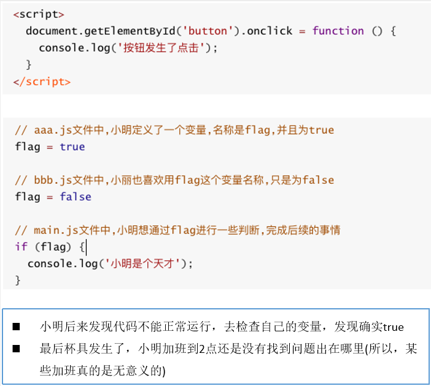

# 前端模块化

## 为什么需要模块化

### JavaScript原始功能

在网页开发的早期js制作作为一种脚本语言，做一些简单的表单验证或动画实现等，那个时候代码还是很少的。那个时候的代码是怎么写的呢？直接将代码写在 `<script>` 标签中即可。

随着ajax异步请求的出现慢慢形成了前后端的分离，客户端需要完成的事情越来越多代码量也是与日俱增。为了应对代码量的剧增，我们通常会将代码组织在多个js文件中进行维护。

但是这种维护方式依然不能避免一些灾难性的问题，比如全局变量同名问题如下面的案例。另外这种代码的编写方式对js文件的依赖顺序几乎是强制性的，当js文件过多比如有几十个的时候弄清楚它们的顺序是一件比较同时的事情，而且即使你弄清楚顺序了也不能避免下面案例出现的这种尴尬问题的发生。



### 匿名函数的解决方案

我们可以使用匿名函数来解决方面的重名问题，在aaa.js文件中我们使用匿名函数。

```
(function(){
	let flag = true
})()
```

但是如果我们希望在main.js文件中用到flag应该如何处理呢？显然另外一个文件中不容易使用，因为flag是一个局部变量。这样又有了代码不可复用的问题。

### 使用模块作为出口

我们可以使用将需要暴露到外面的变量，使用一个模块作为出口

来看下对应的代码：我们做了什么事情呢？

- 非常简单，在匿名函数内部定义一个对象。
- 给对象添加各种需要暴露到外面的属性和方法(不需要暴露的直接定义即可)。
- 最后将这个对象返回，并且在外面使用了一个MoudleA接受。

```javascript
var ModuleA = (function() {
	//1.定义一个对象
	var obj = {};
	//2.在对象内部添加变量和方法
	obj.flag = true;
	obj.myFunc = function(info) {
		console.log(info);
	}
	//3.将对象返回
	return obj;
})
```

接下来我们在man.js中怎么使用呢？我们只需要使用属于自己模块的属性和方法即可

```javascript
if(ModuleA.flag) {
	console.log('小明是个天才！');
}
ModuleA.myFunc('小明长的真帅！');
console.log(ModuleA);
```

这就是模块最基础的封装，事实上模块的封装还有很多高级的话题。但是我们这里就是要认识一下为什么需要模块以及模块的原始雏形。

幸运的是，前端模块化开发已经有了很多既有的规范以及对应的实现方案。常见的模块化规范：`CommonJS`、`AMD`、`CMD`，也有 ES6 的 `Modules`。

## 模块化开发相关规范

> 模块化有两个核心：导出和导入

### CommonJs规范

> 注：CommonJs规范依赖于node环境（node底层会解析CommonJs规范的导入和导出）

CommonJS的导出

```javascript
module.exports = {
    flag: true,
    test(a,b) {
        return a + b;
    },
    demo(a,b) {
        return a * b;
    }
}
```

CommonJS的导入

```javascript
//CommonJS模块
let {test, demo, flag} = require('moduleA');

//等同于
let _mA = require('moduleA');
let test = _mA.test;
let demo = _mA.demo;
let flag = _mA.flag;
```

### ES6的export命令

解决命名冲突问题：在通过script标签引入js文件时添加一个 `type=module`，表示使用这个文件是一个单独的模块。而单独的模块有自己的作用域，此时里面的内容必须通过ES6的导出命令才对外部可见（可以通过ES6的导入命令使用）。

```javascript
<script src="a.js" type="module"></script>
<script src="b.js" type="module"></script>
```

export指令用于导出变量：

```javascript
//info.js
export let name = 'why';
export let age = 18;
export let height = 1.88;

//还有另一种写法

//info.js
let name = 'why';
let age = 18;
let height = 1.88;

export {name, age, height};
```

导出函数或类：上面我们主要是输出变量，也可以输出函数或者输出类

```javascript
export function test(content) {
	console.log(content);
}

export class Person {
	constructor(name, age) {
		this.name = name;
		this.age = age;
	}
	
	run() {
		console.log(this.name + '在奔跑')
	}
}
```

```javascript
function test(content) {
	console.log(content);
}

class Person {
	constructor(name, age) {
		this.name = name;
		this.age = age;
	}
	
	run() {
		console.log(this.name + '在奔跑')
	}
}

export {test, Person}
```

export default：某些情况下一个模块中包含某个功能，我们并不希望给这个功能命名，而是让导入者可以自己来命名。这个时候就可以使用 `export default`。

```javascript
//info.js
export default function () {
	console.log('default function');
}
```

我们来到main.js中这样使用就可以了。这里的myFunc是我自己命名的，你可以根据需要命名它对应的名字

```javascript
import myFunc from './info.js'

myFunc();
```

> 注意：`export default`在同一个模块中不允许同时存在多个。

### ES6的import命令

我们使用export指令导出了模块对外提供的接口，下面我们就可以通过 `import` 命令来加载对应的这个模块了。首先我们需要在HTML代码中引入两个js文件，并且类型需要设置为module

```html
<script src="info.js" type="module"></script>
<script src="main.js" type="module"></script>
```

import指令用于导入模块中的内容，比如main.js的代码

```javascript
import {name, age, height} from './info.js'

console.log(name, age, height);
```

如果我们希望某个模块中所有的信息都导入，一个个导入显然有些麻烦。通过 `*` 可以导入模块中所有的export变量。但是通常情况下我们需要给 `*` 起一个别名方便后续的使用

```javascript
import * as info from './info.js'

console.log(info.name, info.age, info.height, info.friends);
```
